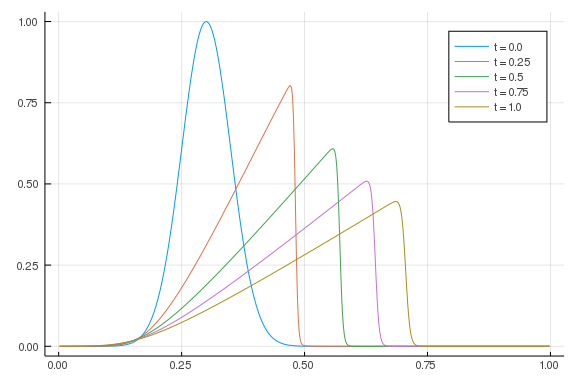
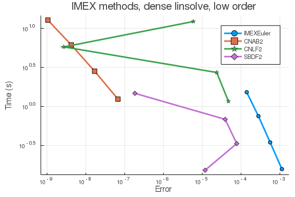
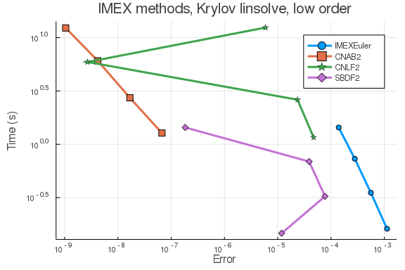
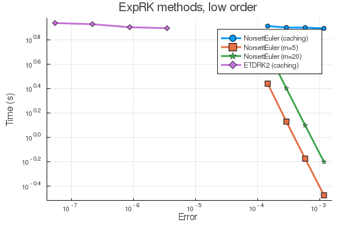
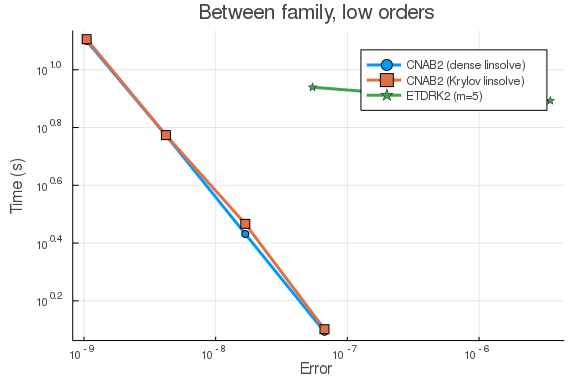
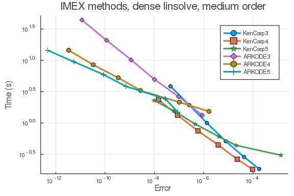
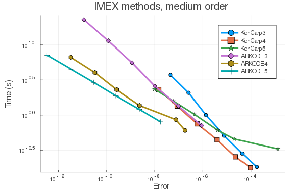
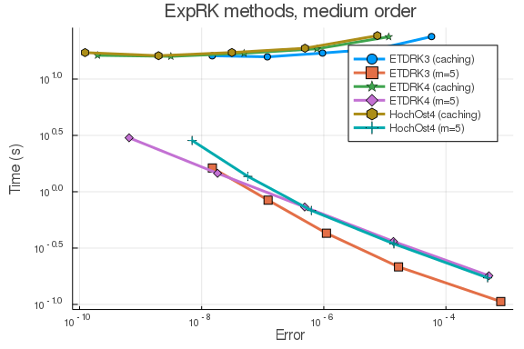
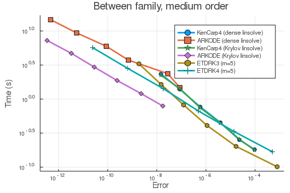

````julia
using ApproxFun, OrdinaryDiffEq, Sundials
using DiffEqDevTools
using LinearAlgebra
using Plots; gr()
````


Here is the Burgers equation using FDM.

````julia
function lin_term(N, ϵ)
    dx = 1/(N + 1)
    d = -2 * ones(N) # main diagonal
    du = ones(N - 1) # off diagonal
    DiffEqArrayOperator((ϵ/dx^2) * diagm(-1 => du, 0 => d, 1 => du))
end

function nl_term(N)
    dx = 1/(N + 1)
    du = ones(N - 1) # super diagonal
    dl = -ones(N - 1) # lower diagonal
    D = (-1/(4*dx)) * diagm(-1 => dl, 1 => du)

    tmp = zeros(N)
    function (du,u,p,t)
        @. tmp = u^2
        mul!(du, D, tmp)
    end
end

# Construct the problem
function burgers(N, ϵ)
    f1 = lin_term(N, ϵ)
    f2 = nl_term(N)
    dx = 1 / (N + 1)
    xs = (1:N) * dx

    μ0 = 0.3; σ0 = 0.05
    f0 = x -> exp(-(x - μ0)^2 / (2 * σ0^2))
    u0 = f0.(xs)
    prob = SplitODEProblem(f1, f2, u0, (0.0, 1.0))
    xs, prob
end;
````


Reference solution using Vern9 is below:

````julia
xs, prob = burgers(512, 1e-3)
sol = solve(prob, Vern9(); abstol=1e-14, reltol=1e-14)
test_sol = TestSolution(sol);

tslices = [0.0 0.25 0.50 0.75 1.00]
ys = hcat((sol(t) for t in tslices)...)
labels = ["t = $t" for t in tslices]
plot(xs, ys, label=labels)
````





## High tolerances

## In-family comparisons

1.IMEX methods (dense linear solver)

````julia
abstols = 0.1 .^ (5:8) # all fixed dt methods so these don't matter much
reltols = 0.1 .^ (1:4)
multipliers = 0.5 .^ (0:3)
setups = [Dict(:alg => IMEXEuler(), :dts => 1e-3 * multipliers),
          Dict(:alg => CNAB2(), :dts => 1e-4 * multipliers),
          Dict(:alg => CNLF2(), :dts => 1e-4 * multipliers),
          Dict(:alg => SBDF2(), :dts => 1e-3 * multipliers)]
labels = ["IMEXEuler" "CNAB2" "CNLF2" "SBDF2"]
@time wp = WorkPrecisionSet(prob,abstols,reltols,setups;
                            print_names=true, names=labels,
                            numruns=5, error_estimate=:l2,
                            save_everystep=false, appxsol=test_sol, maxiters=Int(1e5));
````


````
IMEXEuler
CNAB2
CNLF2
SBDF2
187.112729 seconds (85.69 M allocations: 3.809 GiB, 0.26% gc time)
````


````julia

plot(wp, label=labels, markershape=:auto, title="IMEX methods, dense linsolve, low order")
````





1.IMEX methods (Krylov linear solver)

````julia
abstols = 0.1 .^ (5:8) # all fixed dt methods so these don't matter much
reltols = 0.1 .^ (1:4)
multipliers = 0.5 .^ (0:3)
setups = [Dict(:alg => IMEXEuler(linsolve=LinSolveGMRES()), :dts => 1e-3 * multipliers),
          Dict(:alg => CNAB2(linsolve=LinSolveGMRES()), :dts => 1e-4 * multipliers),
          Dict(:alg => CNLF2(linsolve=LinSolveGMRES()), :dts => 1e-4 * multipliers),
          Dict(:alg => SBDF2(linsolve=LinSolveGMRES()), :dts => 1e-3 * multipliers)]
labels = ["IMEXEuler" "CNAB2" "CNLF2" "SBDF2"]
@time wp = WorkPrecisionSet(prob,abstols,reltols,setups;
                            print_names=true, names=labels,
                            numruns=5, error_estimate=:l2,
                            save_everystep=false, appxsol=test_sol, maxiters=Int(1e5));
````


````
IMEXEuler
CNAB2
CNLF2
SBDF2
184.851228 seconds (74.83 M allocations: 3.259 GiB, 0.22% gc time)
````


````julia

plot(wp, label=labels, markershape=:auto, title="IMEX methods, Krylov linsolve, low order")
````





2. ExpRK methods

````julia
abstols = 0.1 .^ (5:8) # all fixed dt methods so these don't matter much
reltols = 0.1 .^ (1:4)
multipliers = 0.5 .^ (0:3)
setups = [Dict(:alg => NorsettEuler(), :dts => 1e-3 * multipliers),
          Dict(:alg => NorsettEuler(krylov=true, m=5), :dts => 1e-3 * multipliers),
          Dict(:alg => NorsettEuler(krylov=true, m=20), :dts => 1e-3 * multipliers),
          Dict(:alg => ETDRK2(), :dts => 1e-3 * multipliers)]
          #Dict(:alg => ETDRK2(krylov=true, m=20), :dts => 1e-2 * multipliers)) matrix contains Inf or NaN
          #Dict(:alg => ETDRK2(krylov=true, m=20), :dts => 1e-2 * multipliers) matrix contains Inf or NaN
labels = hcat("NorsettEuler (caching)", "NorsettEuler (m=5)", "NorsettEuler (m=20)",
              "ETDRK2 (caching)")#, "ETDRK2 (m=5)"), "ETDRK2 (m=20)")
@time wp = WorkPrecisionSet(prob,abstols,reltols,setups;
                            print_names=true, names=labels,
                            numruns=5, error_estimate=:l2,
                            save_everystep=false, appxsol=test_sol, maxiters=Int(1e5));
````


````
NorsettEuler (caching)
NorsettEuler (m=5)
NorsettEuler (m=20)
ETDRK2 (caching)
260.373463 seconds (22.10 M allocations: 124.338 GiB, 0.77% gc time)
````


````julia

plot(wp, label=labels, markershape=:auto, title="ExpRK methods, low order")
````





## Between family comparisons

````julia
abstols = 0.1 .^ (5:8) # all fixed dt methods so these don't matter much
reltols = 0.1 .^ (1:4)
multipliers = 0.5 .^ (0:3)
setups = [Dict(:alg => CNAB2(), :dts => 1e-4 * multipliers),
          Dict(:alg => CNAB2(linsolve=LinSolveGMRES()), :dts => 1e-4 * multipliers),
          Dict(:alg => ETDRK2(), :dts => 1e-3 * multipliers)]
labels = ["CNAB2 (dense linsolve)" "CNAB2 (Krylov linsolve)" "ETDRK2 (m=5)"]
@time wp = WorkPrecisionSet(prob,abstols,reltols,setups;
                            print_names=true, names=labels,
                            numruns=5, error_estimate=:l2,
                            save_everystep=false, appxsol=test_sol, maxiters=Int(1e5));
````


````
CNAB2 (dense linsolve)
CNAB2 (Krylov linsolve)
ETDRK2 (m=5)
245.817487 seconds (47.32 M allocations: 62.629 GiB, 0.57% gc time)
````


````julia

plot(wp, label=labels, markershape=:auto, title="Between family, low orders")
````





## Low tolerances

## In-family comparisons

1.IMEX methods (dense linear solver)

````julia
abstols = 0.1 .^ (8:13)
reltols = 0.1 .^ (5:10)
setups = [Dict(:alg => KenCarp3()),
          Dict(:alg => KenCarp4()),
          Dict(:alg => KenCarp5()),
          Dict(:alg => ARKODE(Sundials.Implicit(), order=3, linear_solver=:Dense)),
          Dict(:alg => ARKODE(Sundials.Implicit(), order=4, linear_solver=:Dense)),
          Dict(:alg => ARKODE(Sundials.Implicit(), order=5, linear_solver=:Dense))]
labels = hcat("KenCarp3", "KenCarp4", "KenCarp5", "ARKODE3", "ARKODE4", "ARKODE5")
@time wp = WorkPrecisionSet(prob,abstols,reltols,setups;
                            print_names=true, names=labels,
                            numruns=5, error_estimate=:l2,
                            save_everystep=false, appxsol=test_sol, maxiters=Int(1e5));
````


````
KenCarp3
KenCarp4
KenCarp5
ARKODE3
ARKODE4
ARKODE5
602.228248 seconds (105.00 M allocations: 5.298 GiB, 0.12% gc time)
````


````julia

plot(wp, label=labels, markershape=:auto, title="IMEX methods, dense linsolve, medium order")
````





1.IMEX methods (Krylov linear solver)

````julia
abstols = 0.1 .^ (8:13)
reltols = 0.1 .^ (5:10)
setups = [Dict(:alg => KenCarp3(linsolve=LinSolveGMRES())),
          Dict(:alg => KenCarp4(linsolve=LinSolveGMRES())),
          Dict(:alg => KenCarp5(linsolve=LinSolveGMRES())),
          Dict(:alg => ARKODE(Sundials.Implicit(), order=3, linear_solver=:GMRES)),
          Dict(:alg => ARKODE(Sundials.Implicit(), order=4, linear_solver=:GMRES)),
          Dict(:alg => ARKODE(Sundials.Implicit(), order=5, linear_solver=:GMRES))]
labels = ["KenCarp3" "KenCarp4" "KenCarp5" "ARKODE3" "ARKODE4" "ARKODE5"]
@time wp = WorkPrecisionSet(prob,abstols,reltols,setups;
                            print_names=true, names=labels,
                            numruns=5, error_estimate=:l2,
                            save_everystep=false, appxsol=test_sol, maxiters=Int(1e5));
````


````
KenCarp3
KenCarp4
KenCarp5
ARKODE3
ARKODE4
ARKODE5
375.726479 seconds (103.47 M allocations: 5.394 GiB, 0.20% gc time)
````


````julia

plot(wp, label=labels, markershape=:auto, title="IMEX methods, medium order")
````





2.ExpRK methods

````julia
abstols = 0.1 .^ (7:11) # all fixed dt methods so these don't matter much
reltols = 0.1 .^ (4:8)
multipliers = 0.5 .^ (0:4)
setups = [Dict(:alg => ETDRK3(), :dts => 1e-2 * multipliers),
          Dict(:alg => ETDRK3(krylov=true, m=5), :dts => 1e-2 * multipliers),
          Dict(:alg => ETDRK4(), :dts => 1e-2 * multipliers),
          Dict(:alg => ETDRK4(krylov=true, m=5), :dts => 1e-2 * multipliers),
          Dict(:alg => HochOst4(), :dts => 1e-2 * multipliers),
          Dict(:alg => HochOst4(krylov=true, m=5), :dts => 1e-2 * multipliers)]
labels = hcat("ETDRK3 (caching)", "ETDRK3 (m=5)", "ETDRK4 (caching)",
              "ETDRK4 (m=5)", "HochOst4 (caching)", "HochOst4 (m=5)")
@time wp = WorkPrecisionSet(prob,abstols,reltols,setups;
                            print_names=true, names=labels,
                            numruns=5, error_estimate=:l2,
                            save_everystep=false, appxsol=test_sol, maxiters=Int(1e5));
````


````
ETDRK3 (caching)
ETDRK3 (m=5)
ETDRK4 (caching)
ETDRK4 (m=5)
HochOst4 (caching)
HochOst4 (m=5)
912.287417 seconds (45.03 M allocations: 460.660 GiB, 0.73% gc time)
````


````julia

plot(wp, label=labels, markershape=:auto, title="ExpRK methods, medium order")
````





## Between family comparisons


````julia
abstols = 0.1 .^ (8:13)
reltols = 0.1 .^ (5:10)
multipliers = 0.5 .^ (0:5)
setups = [Dict(:alg => KenCarp4()),
          Dict(:alg => ARKODE(Sundials.Implicit(), order=5, linear_solver=:Dense)),
          Dict(:alg => KenCarp4(linsolve=LinSolveGMRES())),
          Dict(:alg => ARKODE(Sundials.Implicit(), order=5, linear_solver=:GMRES)),
          Dict(:alg => ETDRK3(krylov=true, m=5), :dts => 1e-2 * multipliers),
          Dict(:alg => ETDRK4(krylov=true, m=5), :dts => 1e-2 * multipliers)]
labels = hcat("KenCarp4 (dense linsolve)", "ARKODE (dense linsolve)", "KenCarp4 (Krylov linsolve)",
              "ARKODE (Krylov linsolve)", "ETDRK3 (m=5)", "ETDRK4 (m=5)")
@time wp = WorkPrecisionSet(prob,abstols,reltols,setups;
                            print_names=true, names=labels,
                            numruns=5, error_estimate=:l2,
                            save_everystep=false, appxsol=test_sol, maxiters=Int(1e5));#162s
````


````
KenCarp4 (dense linsolve)
ARKODE (dense linsolve)
KenCarp4 (Krylov linsolve)
ARKODE (Krylov linsolve)
ETDRK3 (m=5)
ETDRK4 (m=5)
327.132159 seconds (60.57 M allocations: 4.423 GiB, 0.18% gc time)
````


````julia

plot(wp, label=labels, markershape=:auto, title="Between family, medium order")
````




````julia
using DiffEqBenchmarks
DiffEqBenchmarks.bench_footer(WEAVE_ARGS[:folder],WEAVE_ARGS[:file])
````


## Appendix

These benchmarks are a part of the DiffEqBenchmarks.jl repository, found at: [https://github.com/JuliaDiffEq/DiffEqBenchmarks.jl](https://github.com/JuliaDiffEq/DiffEqBenchmarks.jl)

To locally run this tutorial, do the following commands:

```
using DiffEqBenchmarks
DiffEqBenchmarks.weave_file("MOLPDE","burgers_fdm_wpd.jmd")
```

Computer Information:

```
Julia Version 1.3.0
Commit 46ce4d7933 (2019-11-26 06:09 UTC)
Platform Info:
  OS: Linux (x86_64-pc-linux-gnu)
  CPU: Intel(R) Core(TM) i7-9700K CPU @ 3.60GHz
  WORD_SIZE: 64
  LIBM: libopenlibm
  LLVM: libLLVM-6.0.1 (ORCJIT, skylake)
Environment:
  JULIA_NUM_THREADS = 8

```

Package Information:

```
Status: `/home/chrisrackauckas/.julia/dev/DiffEqBenchmarks/Project.toml`
[28f2ccd6-bb30-5033-b560-165f7b14dc2f] ApproxFun 0.11.8
[a134a8b2-14d6-55f6-9291-3336d3ab0209] BlackBoxOptim 0.5.0
[a93c6f00-e57d-5684-b7b6-d8193f3e46c0] DataFrames 0.20.0
[2b5f629d-d688-5b77-993f-72d75c75574e] DiffEqBase 6.10.0
[eb300fae-53e8-50a0-950c-e21f52c2b7e0] DiffEqBiological 4.1.0
[f3b72e0c-5b89-59e1-b016-84e28bfd966d] DiffEqDevTools 2.16.1
[c894b116-72e5-5b58-be3c-e6d8d4ac2b12] DiffEqJump 6.4.0
[1130ab10-4a5a-5621-a13d-e4788d82bd4c] DiffEqParamEstim 1.10.0
[a077e3f3-b75c-5d7f-a0c6-6bc4c8ec64a9] DiffEqProblemLibrary 4.6.4
[ef61062a-5684-51dc-bb67-a0fcdec5c97d] DiffEqUncertainty 1.4.0
[0c46a032-eb83-5123-abaf-570d42b7fbaa] DifferentialEquations 6.9.0
[7073ff75-c697-5162-941a-fcdaad2a7d2a] IJulia 1.20.2
[7f56f5a3-f504-529b-bc02-0b1fe5e64312] LSODA 0.6.1
[76087f3c-5699-56af-9a33-bf431cd00edd] NLopt 0.5.1
[c030b06c-0b6d-57c2-b091-7029874bd033] ODE 2.6.0
[54ca160b-1b9f-5127-a996-1867f4bc2a2c] ODEInterface 0.4.6
[09606e27-ecf5-54fc-bb29-004bd9f985bf] ODEInterfaceDiffEq 3.5.0
[1dea7af3-3e70-54e6-95c3-0bf5283fa5ed] OrdinaryDiffEq 5.26.7
[2dcacdae-9679-587a-88bb-8b444fb7085b] ParallelDataTransfer 0.5.0
[65888b18-ceab-5e60-b2b9-181511a3b968] ParameterizedFunctions 4.2.1
[91a5bcdd-55d7-5caf-9e0b-520d859cae80] Plots 0.28.4
[b4db0fb7-de2a-5028-82bf-5021f5cfa881] ReactionNetworkImporters 0.1.5
[f2c3362d-daeb-58d1-803e-2bc74f2840b4] RecursiveFactorization 0.1.0
[9672c7b4-1e72-59bd-8a11-6ac3964bc41f] SteadyStateDiffEq 1.5.0
[c3572dad-4567-51f8-b174-8c6c989267f4] Sundials 3.8.1
[a759f4b9-e2f1-59dc-863e-4aeb61b1ea8f] TimerOutputs 0.5.3
[44d3d7a6-8a23-5bf8-98c5-b353f8df5ec9] Weave 0.9.1
[b77e0a4c-d291-57a0-90e8-8db25a27a240] InteractiveUtils 
[d6f4376e-aef5-505a-96c1-9c027394607a] Markdown 
[44cfe95a-1eb2-52ea-b672-e2afdf69b78f] Pkg 
[9a3f8284-a2c9-5f02-9a11-845980a1fd5c] Random 
```

