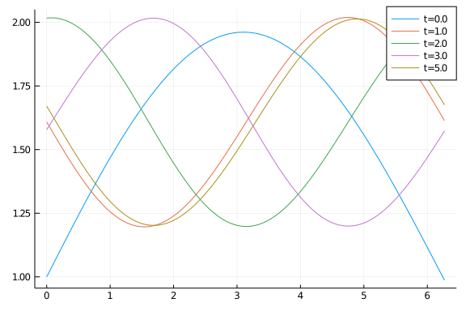
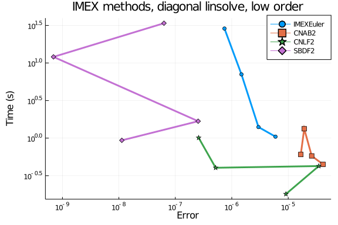
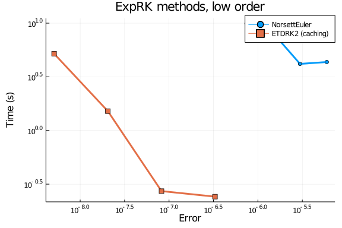
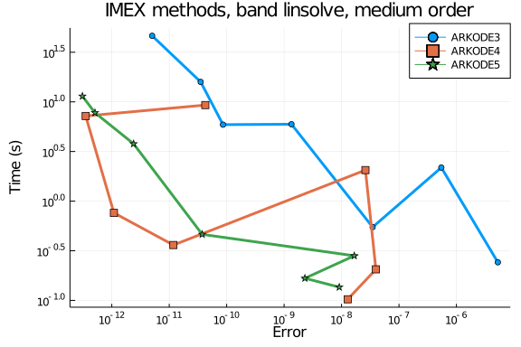
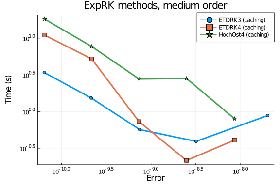

+++
author = "HAO HAO"
title = "KS Pseudospectral Methods Work-Precision Diagrams"
+++
````julia
using ApproxFun, OrdinaryDiffEq, Sundials
using DiffEqDevTools
using LinearAlgebra
using Plots; gr()
````


````
Plots.GRBackend()
````


Here is the kuramoto_sivashinsky equation using Fourier spectral methods.

````julia
S = Fourier()
n = 512
x = points(S, n)
D2 = Derivative(S,2)[1:n,1:n]
D  = (Derivative(S) → S)[1:n,1:n]
T = ApproxFun.plan_transform(S, n)
Ti = ApproxFun.plan_itransform(S, n)

D4 = Derivative(S,4)[1:n,1:n]
û₀ = T*(cos.(x./16).*(1 .+ sin.(x./2.04)))
tmp=similar(û₀)
q = (D,T,Ti,tmp,similar(tmp),similar(tmp))
function kuramoto_sivashinsky(dû,û,q,t)
    D,T,Ti,tmp,u,uc = q
    mul!(u, D, û)
    mul!(tmp, Ti, u)
    mul!(u, Ti, û)
    @. tmp=tmp*u
    mul!(u,T, tmp)
    #mul!(uc, D2, û)
    @. dû = - u
end
````


````
kuramoto_sivashinsky (generic function with 1 method)
````


Reference solution using Rodas5 is below:

````julia
prob = SplitODEProblem(DiffEqArrayOperator(-Diagonal(D4+D2)), kuramoto_sivashinsky, û₀, (0.0,5.0), q)
sol  = solve(prob,RadauIIA5(autodiff=false); reltol=1e-14,abstol=1e-14)
test_sol = TestSolution(sol)

tslices=[0.0 1.0 2.0 3.0 5.0]
ys=hcat((Ti*sol(t) for t in tslices)...)
labels=["t=$t" for t in tslices]
plot(x,ys,label=labels)
````





## High tolerances

````julia
diag_linsolve=LinSolveFactorize(W->let tmp = tmp
    for i in 1:size(W, 1)
        tmp[i] = W[i, i]
    end
    Diagonal(tmp)
end)
````


````
DiffEqBase.LinSolveFactorize{Main.##WeaveSandBox#323.var"#5#6"}(Main.##Weav
eSandBox#323.var"#5#6"(), nothing)
````


## In-family comparisons

1.IMEX methods (diagonal linear solver)

````julia
abstols = 0.1 .^ (5:8)
reltols = 0.1 .^ (1:4)
multipliers =  0.5 .^ (0:3)
setups = [Dict(:alg => IMEXEuler(linsolve=diag_linsolve), :dts => 1e-3 * multipliers),
          Dict(:alg => CNAB2(linsolve=diag_linsolve), :dts => 5e-3 * multipliers),
          Dict(:alg => CNLF2(linsolve=diag_linsolve), :dts => 5e-3 * multipliers),
          Dict(:alg => SBDF2(linsolve=diag_linsolve), :dts => 1e-3 * multipliers)]
labels = ["IMEXEuler" "CNAB2" "CNLF2" "SBDF2"]
@time wp1 = WorkPrecisionSet(prob,abstols,reltols,setups;
                            print_names=true,names=labels,
                            numruns=5,seconds=5,
                            save_everystop=false,appxsol=test_sol,maxiters=Int(1e5));
````


````
IMEXEuler
CNAB2
CNLF2
SBDF2
465.001624 seconds (465.29 M allocations: 21.750 GiB, 1.14% gc time)
````


````julia

plot(wp1,label=labels,markershape=:auto,title="IMEX methods, diagonal linsolve, low order")
````





2. ExpRK methods

````julia
abstols = 0.1 .^ (5:8) # all fixed dt methods so these don't matter much
reltols = 0.1 .^ (1:4)
multipliers = 0.5 .^ (0:3)
setups = [Dict(:alg => NorsettEuler(), :dts => 1e-3 * multipliers),
          Dict(:alg => ETDRK2(), :dts => 1e-2 * multipliers)]
labels = hcat("NorsettEuler",
              "ETDRK2 (caching)")
@time wp2 = WorkPrecisionSet(prob,abstols,reltols,setups;
                            print_names=true, names=labels,
                            numruns=5,
                            save_everystep=false, appxsol=test_sol, maxiters=Int(1e5));
````


````
NorsettEuler
ETDRK2 (caching)
137.932613 seconds (50.32 M allocations: 4.258 GiB, 0.68% gc time)
````


````julia

plot(wp2, label=labels, markershape=:auto, title="ExpRK methods, low order")
````





## Between family comparisons

````julia
abstols = 0.1 .^ (5:8) # all fixed dt methods so these don't matter much
reltols = 0.1 .^ (1:4)
multipliers = 0.5 .^ (0:3)
setups = [Dict(:alg => CNAB2(linsolve=diag_linsolve), :dts => 5e-3 * multipliers)
          Dict(:alg => ETDRK2(), :dts => 1e-2 * multipliers)]
labels = ["CNAB2 (diagonal linsolve)" "ETDRK2"]
@time wp3 = WorkPrecisionSet(prob,abstols,reltols,setups;
                            print_names=true, names=labels,
                            numruns=5, error_estimate=:l2,
                            save_everystep=false, appxsol=test_sol, maxiters=Int(1e5));
````


````
CNAB2 (diagonal linsolve)
ETDRK2
 63.483573 seconds (25.09 M allocations: 1.267 GiB, 0.49% gc time)
````


````julia

plot(wp3, label=labels, markershape=:auto, title="Between family, low orders")
````


## Low tolerances

## In-family comparisons

1.IMEX methods (band linear solver)

````julia
abstols = 0.1 .^ (7:13)
reltols = 0.1 .^ (4:10)
setups = [Dict(:alg => ARKODE(Sundials.Implicit(), order=3, linear_solver=:Band, jac_upper=1, jac_lower=1)),
          Dict(:alg => ARKODE(Sundials.Implicit(), order=4, linear_solver=:Band, jac_upper=1, jac_lower=1)),
          Dict(:alg => ARKODE(Sundials.Implicit(), order=5, linear_solver=:Band, jac_upper=1, jac_lower=1))]
labels = hcat("ARKODE3", "ARKODE4", "ARKODE5")
@time wp4 = WorkPrecisionSet(prob,abstols,reltols,setups;
                            print_names=true, names=labels,
                            numruns=5, error_estimate=:l2,
                            save_everystep=false, appxsol=test_sol, maxiters=Int(1e5));
````


````
ARKODE3
ARKODE4
ARKODE5
439.661142 seconds (113.87 M allocations: 10.880 GiB, 0.63% gc time)
````


````julia

plot(wp4, label=labels, markershape=:auto, title="IMEX methods, band linsolve, medium order")
````





2.ExpRK methods

````julia
abstols = 0.1 .^ (7:11) # all fixed dt methods so these don't matter much
reltols = 0.1 .^ (4:8)
multipliers = 0.5 .^ (0:4)
setups = [Dict(:alg => ETDRK3(), :dts => 1e-2 * multipliers),
          Dict(:alg => ETDRK4(), :dts => 1e-2 * multipliers),
          Dict(:alg => HochOst4(), :dts => 1e-2 * multipliers)]
labels = hcat("ETDRK3 (caching)", "ETDRK4 (caching)",
              "HochOst4 (caching)")
@time wp5 = WorkPrecisionSet(prob,abstols,reltols,setups;
                            print_names=true, names=labels,
                            numruns=5, error_estimate=:l2,
                            save_everystep=false, appxsol=test_sol, maxiters=Int(1e5));
````


````
ETDRK3 (caching)
ETDRK4 (caching)
HochOst4 (caching)
285.786627 seconds (96.94 M allocations: 8.495 GiB, 0.68% gc time)
````


````julia

plot(wp5, label=labels, markershape=:auto, title="ExpRK methods, medium order")
````





## Between family comparisons

````julia
abstols = 0.1 .^ (7:11)
reltols = 0.1 .^ (4:8)
multipliers = 0.5 .^ (0:4)
setups = [Dict(:alg => ARKODE(Sundials.Implicit(), order=5, linear_solver=:Band, jac_upper=1, jac_lower=1)),
          Dict(:alg => ETDRK3(), :dts => 1e-2 * multipliers),
          Dict(:alg => ETDRK4(), :dts => 1e-2 * multipliers)]
labels = hcat("ARKODE (nondiagonal linsolve)", "ETDRK3 ()", "ETDRK4 ()")
@time wp6 = WorkPrecisionSet(prob,abstols,reltols,setups;
                            print_names=true, names=labels,
                            numruns=5, error_estimate=:l2,
                            save_everystep=false, appxsol=test_sol, maxiters=Int(1e5));
````


````
ARKODE (nondiagonal linsolve)
ETDRK3 ()
ETDRK4 ()
147.315267 seconds (43.76 M allocations: 4.373 GiB, 0.83% gc time)
````


````julia

plot(wp6, label=labels, markershape=:auto, title="Between family, medium order")
````


````julia
using SciMLBenchmarks
SciMLBenchmarks.bench_footer(WEAVE_ARGS[:folder],WEAVE_ARGS[:file])
````


## Appendix

These benchmarks are a part of the SciMLBenchmarks.jl repository, found at: [https://github.com/SciML/SciMLBenchmarks.jl](https://github.com/SciML/SciMLBenchmarks.jl). For more information on high-performance scientific machine learning, check out the SciML Open Source Software Organization [https://sciml.ai](https://sciml.ai).

To locally run this benchmark, do the following commands:

```
using SciMLBenchmarks
SciMLBenchmarks.weave_file("MOLPDE","ks_spectral_wpd.jmd")
```

Computer Information:

```
Julia Version 1.4.2
Commit 44fa15b150* (2020-05-23 18:35 UTC)
Platform Info:
  OS: Linux (x86_64-pc-linux-gnu)
  CPU: Intel(R) Core(TM) i7-9700K CPU @ 3.60GHz
  WORD_SIZE: 64
  LIBM: libopenlibm
  LLVM: libLLVM-8.0.1 (ORCJIT, skylake)
Environment:
  JULIA_LOAD_PATH = /builds/JuliaGPU/DiffEqBenchmarks.jl:
  JULIA_DEPOT_PATH = /builds/JuliaGPU/DiffEqBenchmarks.jl/.julia
  JULIA_CUDA_MEMORY_LIMIT = 2147483648
  JULIA_NUM_THREADS = 8

```

Package Information:

```
Status: `/builds/JuliaGPU/DiffEqBenchmarks.jl/benchmarks/MOLPDE/Project.toml`
[28f2ccd6-bb30-5033-b560-165f7b14dc2f] ApproxFun 0.11.14
[f3b72e0c-5b89-59e1-b016-84e28bfd966d] DiffEqDevTools 2.24.0
[7f56f5a3-f504-529b-bc02-0b1fe5e64312] LSODA 0.6.1
[09606e27-ecf5-54fc-bb29-004bd9f985bf] ODEInterfaceDiffEq 3.7.0
[1dea7af3-3e70-54e6-95c3-0bf5283fa5ed] OrdinaryDiffEq 5.41.0
[91a5bcdd-55d7-5caf-9e0b-520d859cae80] Plots 1.5.5
[c3572dad-4567-51f8-b174-8c6c989267f4] Sundials 4.2.5
[37e2e46d-f89d-539d-b4ee-838fcccc9c8e] LinearAlgebra 
```

