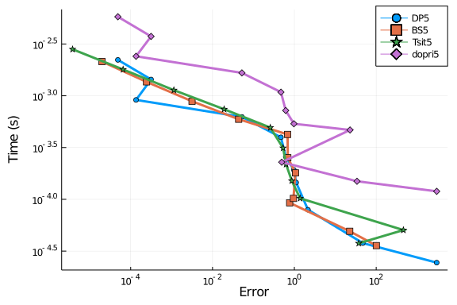
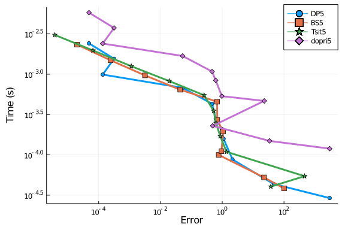
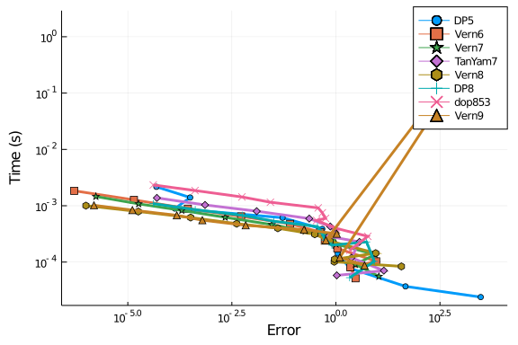
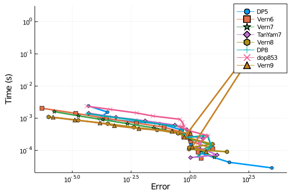
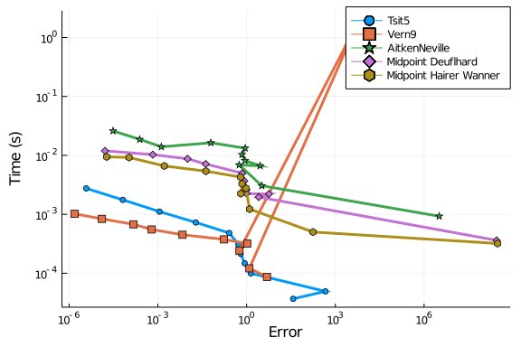
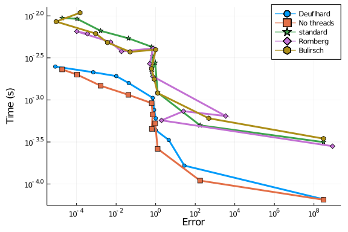
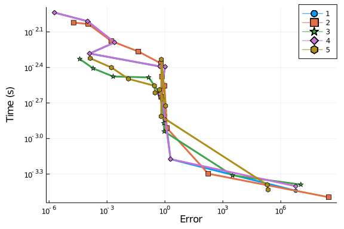

+++
author = "Chris Rackauckas"
title = "Three Body Work-Precision Diagrams"
+++
```julia
using OrdinaryDiffEq, ODE, ODEInterfaceDiffEq, LSODA, Sundials, DiffEqDevTools, Plots; gr()

## Define the ThreeBody Problem
const threebody_μ = parse(Float64,"0.012277471")
const threebody_μ′ = 1 - threebody_μ

f = (du,u,p,t) -> begin
  @inbounds begin
  # 1 = y₁
  # 2 = y₂
  # 3 = y₁'
  # 4 = y₂'
  D₁ = ((u[1]+threebody_μ)^2 + u[2]^2)^(3/2)
  D₂ = ((u[1]-threebody_μ′)^2 + u[2]^2)^(3/2)
  du[1] = u[3]
  du[2] = u[4]
  du[3] = u[1] + 2u[4] - threebody_μ′*(u[1]+threebody_μ)/D₁ - threebody_μ*(u[1]-threebody_μ′)/D₂
  du[4] = u[2] - 2u[3] - threebody_μ′*u[2]/D₁ - threebody_μ*u[2]/D₂
  end
end

t₀ = 0.0; T = parse(Float64,"17.0652165601579625588917206249")
tspan = (t₀,2T)

prob = ODEProblem(f,[0.994, 0.0, 0.0, parse(Float64,"-2.00158510637908252240537862224")],tspan)

test_sol = TestSolution(T,[prob.u0])
abstols = 1.0 ./ 10.0 .^ (3:13); reltols = 1.0 ./ 10.0 .^ (0:10);
```


See that it's periodic in the chosen timespan:

```julia
sol = solve(prob,Vern9(),abstol=1e-14,reltol=1e-14)
@show sol[1] - sol[end]
@show sol[end] - prob.u0;
```

```
sol[1] - sol[end] = [-1.063673593648673e-10, -3.162927231499068e-10, -5.160
479797103475e-8, -1.6555705695253664e-8]
sol[end] - prob.u0 = [1.063673593648673e-10, 3.162927231499068e-10, 5.16047
9797103475e-8, 1.6555705695253664e-8]
```


```julia
apr = appxtrue(sol,test_sol)
@show sol[end]
@show apr.u[end]
@show apr.errors
```

```
sol[end] = [0.9940000001063674, 3.162927231499068e-10, 5.160479797103475e-8
, -2.0015850898233767]
apr.u[end] = [0.9940000001063674, 3.162927231499068e-10, 5.160479797103475e
-8, -2.0015850898233767]
apr.errors = Dict(:final => 1.7145790937200795e-8)
Dict{Symbol, Float64} with 1 entry:
  :final => 1.71458e-8
```


This three-body problem is known to be a tough problem. Let's see how the algorithms fair at standard tolerances.

### 5th Order Runge-Kutta Methods


```julia
setups = [Dict(:alg=>DP5())
          #Dict(:alg=>ode45()) #fails
          Dict(:alg=>BS5())
          Dict(:alg=>Tsit5())
          Dict(:alg=>dopri5())];
wp = WorkPrecisionSet(prob,abstols,reltols,setups;appxsol=test_sol,save_everystep=false,numruns=100)
plot(wp)
```


#### Full save, but no dense

```julia
setups = [Dict(:alg=>DP5(),:dense=>false)
          #Dict(:alg=>ode45()) # Fails
          Dict(:alg=>BS5(),:dense=>false)
          Dict(:alg=>Tsit5(),:dense=>false)
          Dict(:alg=>dopri5())];
wp = WorkPrecisionSet(prob,abstols,reltols,setups;appxsol=test_sol,numruns=100)
plot(wp)
```




#### Dense

```julia
setups = [Dict(:alg=>DP5())
          #Dict(:alg=>ode45()) #fails
          Dict(:alg=>BS5())
          Dict(:alg=>Tsit5())
          Dict(:alg=>dopri5())];
wp = WorkPrecisionSet(prob,abstols,reltols,setups;appxsol=test_sol,numruns=100)
plot(wp)
```




In these tests we see that most of the algorithms are close,with `BS5` and `DP5` showing much better than `Tsit5`. `ode45` errors.

### Higher Order Algorithms

```julia
setups = [Dict(:alg=>DP5())
          Dict(:alg=>Vern6())
          Dict(:alg=>Vern7())
          Dict(:alg=>TanYam7())
          Dict(:alg=>Vern8())
          Dict(:alg=>DP8())
          Dict(:alg=>dop853())
          Dict(:alg=>Vern9())];
wp = WorkPrecisionSet(prob,abstols,reltols,setups;appxsol=test_sol,save_everystep=false,numruns=100)
plot(wp)
```



```julia
setups = [Dict(:alg=>DP5())
          Dict(:alg=>Vern6())
          Dict(:alg=>Vern7())
          Dict(:alg=>TanYam7())
          Dict(:alg=>Vern8())
          Dict(:alg=>DP8())
          Dict(:alg=>dop853())
          Dict(:alg=>Vern9())];
wp = WorkPrecisionSet(prob,abstols,reltols,setups;appxsol=test_sol,dense=false,numruns=100,verbose=false)
plot(wp)
```


```julia
setups = [Dict(:alg=>DP5())
          Dict(:alg=>Vern6())
          Dict(:alg=>Vern7())
          Dict(:alg=>TanYam7())
          Dict(:alg=>Vern8())
          Dict(:alg=>DP8())
          Dict(:alg=>dop853())
          Dict(:alg=>Vern9())];
wp = WorkPrecisionSet(prob,abstols,reltols,setups;appxsol=test_sol,numruns=100)
plot(wp)
```




In this test we see `Vern7` and `Vern8` shine.

### Other Algorithms

Once again we separate ODE.jl because it fails. We also separate Sundials' `CVODE_Adams` since it fails at high tolerances.

```julia
#setups = [Dict(:alg=>ode78())
#          Dict(:alg=>VCABM())
#          Dict(:alg=>CVODE_Adams())];
#wp = WorkPrecisionSet(prob,abstols,reltols,setups;appxsol=test_sol,dense=false,numruns=100)
```


```julia
setups = [Dict(:alg=>DP5())
          Dict(:alg=>lsoda())
          Dict(:alg=>Vern8())
          Dict(:alg=>ddeabm())
          Dict(:alg=>odex())
          Dict(:alg=>ARKODE(Sundials.Explicit(),order=6))
    ];
wp = WorkPrecisionSet(prob,abstols,reltols,setups;appxsol=test_sol,save_everystep=false,numruns=100)
plot(wp)
```


Again, on cheap function calculations the Adams methods are shown to not be efficient once the error is sufficiently small. Also, as seen in other places, the extrapolation methods do not fare as well as the Runge-Kutta methods.

## Comparison with Non-RK methods

Now let's test Tsit5 and Vern9 against parallel extrapolation methods and an
Adams-Bashforth-Moulton:

```julia
abstols = 1.0 ./ 10.0 .^ (3:13); reltols = 1.0 ./ 10.0 .^ (0:10);
setups = [Dict(:alg=>Tsit5())
          Dict(:alg=>Vern9())
          Dict(:alg=>AitkenNeville(min_order=1, max_order=9, init_order=4, threading=true))
          Dict(:alg=>ExtrapolationMidpointDeuflhard(min_order=1, max_order=9, init_order=4, threading=true))
          Dict(:alg=>ExtrapolationMidpointHairerWanner(min_order=2, max_order=11, init_order=4, threading=true))]
solnames = ["Tsit5","Vern9","AitkenNeville","Midpoint Deuflhard","Midpoint Hairer Wanner"]
wp = WorkPrecisionSet(prob,abstols,reltols,setups;appxsol=test_sol,names=solnames,
                      save_everystep=false,verbose=false,numruns=100)
plot(wp)
```



```julia
setups = [Dict(:alg=>ExtrapolationMidpointDeuflhard(min_order=1, max_order=9, init_order=9, threading=false))
          Dict(:alg=>ExtrapolationMidpointHairerWanner(min_order=2, max_order=11, init_order=4, threading=false))
          Dict(:alg=>ExtrapolationMidpointHairerWanner(min_order=2, max_order=11, init_order=4, threading=true))
          Dict(:alg=>ExtrapolationMidpointHairerWanner(min_order=2, max_order=11, init_order=4, sequence = :romberg, threading=true))
          Dict(:alg=>ExtrapolationMidpointHairerWanner(min_order=2, max_order=11, init_order=4, sequence = :bulirsch, threading=true))]
solnames = ["Deuflhard","No threads","standard","Romberg","Bulirsch"]
wp = WorkPrecisionSet(prob,abstols,reltols,setups;appxsol=test_sol,names=solnames,
                      save_everystep=false,verbose=false,numruns=100)
plot(wp)
```



```julia
setups = [Dict(:alg=>ExtrapolationMidpointHairerWanner(min_order=2, max_order=11, init_order=10, threading=true))
          Dict(:alg=>ExtrapolationMidpointHairerWanner(min_order=2, max_order=11, init_order=4, threading=true))
          Dict(:alg=>ExtrapolationMidpointHairerWanner(min_order=5, max_order=11, init_order=10, threading=true))
          Dict(:alg=>ExtrapolationMidpointHairerWanner(min_order=2, max_order=15, init_order=10, threading=true))
          Dict(:alg=>ExtrapolationMidpointHairerWanner(min_order=5, max_order=7, init_order=6, threading=true))]
solnames = ["1","2","3","4","5"]
wp = WorkPrecisionSet(prob,abstols,reltols,setups;appxsol=test_sol,names=solnames,
                      save_everystep=false,verbose=false,numruns=100)
plot(wp)
```




### Conclusion

As in the other tests, the OrdinaryDiffEq.jl algorithms with the Verner Efficient methods are the most efficient solvers at stringent tolerances for most of the tests, while the order 5 methods do well at cruder tolerances. ODE.jl fails to run the test problems without erroring.


## Appendix

These benchmarks are a part of the SciMLBenchmarks.jl repository, found at: [https://github.com/SciML/SciMLBenchmarks.jl](https://github.com/SciML/SciMLBenchmarks.jl). For more information on high-performance scientific machine learning, check out the SciML Open Source Software Organization [https://sciml.ai](https://sciml.ai).

To locally run this benchmark, do the following commands:

```
using SciMLBenchmarks
SciMLBenchmarks.weave_file("benchmarks/NonStiffODE","ThreeBody_wpd.jmd")
```

Computer Information:

```
Julia Version 1.6.1
Commit 6aaedecc44 (2021-04-23 05:59 UTC)
Platform Info:
  OS: Linux (x86_64-pc-linux-gnu)
  CPU: Intel(R) Core(TM) i7-9700K CPU @ 3.60GHz
  WORD_SIZE: 64
  LIBM: libopenlibm
  LLVM: libLLVM-11.0.1 (ORCJIT, skylake)
Environment:
  JULIA_DEPOT_PATH = /root/.cache/julia-buildkite-plugin/depots/5b300254-1738-4989-ae0a-f4d2d937f953
  JULIA_NUM_THREADS = 3

```

Package Information:

```
      Status `/var/lib/buildkite-agent/builds/rtx2070-gpuci1-julia-csail-mit-edu/julialang/scimlbenchmarks-dot-jl/benchmarks/NonStiffODE/Project.toml`
  [f3b72e0c] DiffEqDevTools v2.27.2
  [7f56f5a3] LSODA v0.7.0
  [c030b06c] ODE v2.13.0
  [54ca160b] ODEInterface v0.5.0
  [09606e27] ODEInterfaceDiffEq v3.10.0
  [1dea7af3] OrdinaryDiffEq v5.53.0
  [65888b18] ParameterizedFunctions v5.10.0
  [91a5bcdd] Plots v1.13.2
  [31c91b34] SciMLBenchmarks v0.1.0 `../..`
  [c3572dad] Sundials v4.4.3
  [9a3f8284] Random
```

And the full manifest:

```
      Status `/var/lib/buildkite-agent/builds/rtx2070-gpuci1-julia-csail-mit-edu/julialang/scimlbenchmarks-dot-jl/benchmarks/NonStiffODE/Manifest.toml`
  [c3fe647b] AbstractAlgebra v0.16.0
  [1520ce14] AbstractTrees v0.3.4
  [79e6a3ab] Adapt v3.3.0
  [ec485272] ArnoldiMethod v0.1.0
  [4fba245c] ArrayInterface v3.1.11
  [9e28174c] BinDeps v1.0.2
  [fa961155] CEnum v0.4.1
  [d360d2e6] ChainRulesCore v0.9.41
  [b630d9fa] CheapThreads v0.2.3
  [35d6a980] ColorSchemes v3.12.1
  [3da002f7] ColorTypes v0.11.0
  [5ae59095] Colors v0.12.8
  [861a8166] Combinatorics v1.0.2
  [38540f10] CommonSolve v0.2.0
  [bbf7d656] CommonSubexpressions v0.3.0
  [34da2185] Compat v3.28.0
  [8f4d0f93] Conda v1.5.2
  [187b0558] ConstructionBase v1.2.1
  [d38c429a] Contour v0.5.7
  [9a962f9c] DataAPI v1.6.0
  [864edb3b] DataStructures v0.18.9
  [e2d170a0] DataValueInterfaces v1.0.0
  [2b5f629d] DiffEqBase v6.61.0
  [f3b72e0c] DiffEqDevTools v2.27.2
  [c894b116] DiffEqJump v6.14.1
  [77a26b50] DiffEqNoiseProcess v5.7.2
  [163ba53b] DiffResults v1.0.3
  [b552c78f] DiffRules v1.0.2
  [b4f34e82] Distances v0.10.3
  [31c24e10] Distributions v0.24.18
  [ffbed154] DocStringExtensions v0.8.4
  [d4d017d3] ExponentialUtilities v1.8.4
  [e2ba6199] ExprTools v0.1.3
  [8f5d6c58] EzXML v1.1.0
  [c87230d0] FFMPEG v0.4.0
  [7034ab61] FastBroadcast v0.1.4
  [9aa1b823] FastClosures v0.3.2
  [1a297f60] FillArrays v0.11.7
  [6a86dc24] FiniteDiff v2.8.0
  [53c48c17] FixedPointNumbers v0.8.4
  [59287772] Formatting v0.4.2
  [f6369f11] ForwardDiff v0.10.18
  [069b7b12] FunctionWrappers v1.1.2
  [28b8d3ca] GR v0.57.4
  [5c1252a2] GeometryBasics v0.3.12
  [d7ba0133] Git v1.2.1
  [42e2da0e] Grisu v1.0.2
  [cd3eb016] HTTP v0.9.8
  [eafb193a] Highlights v0.4.5
  [0e44f5e4] Hwloc v2.0.0
  [7073ff75] IJulia v1.23.2
  [615f187c] IfElse v0.1.0
  [d25df0c9] Inflate v0.1.2
  [83e8ac13] IniFile v0.5.0
  [d8418881] Intervals v1.5.0
  [c8e1da08] IterTools v1.3.0
  [42fd0dbc] IterativeSolvers v0.9.0
  [82899510] IteratorInterfaceExtensions v1.0.0
  [692b3bcd] JLLWrappers v1.3.0
  [682c06a0] JSON v0.21.1
  [7f56f5a3] LSODA v0.7.0
  [b964fa9f] LaTeXStrings v1.2.1
  [2ee39098] LabelledArrays v1.6.0
  [23fbe1c1] Latexify v0.15.5
  [093fc24a] LightGraphs v1.3.5
  [d3d80556] LineSearches v7.1.1
  [2ab3a3ac] LogExpFunctions v0.2.3
  [bdcacae8] LoopVectorization v0.12.18
  [1914dd2f] MacroTools v0.5.6
  [739be429] MbedTLS v1.0.3
  [442fdcdd] Measures v0.3.1
  [e1d29d7a] Missings v1.0.0
  [78c3b35d] Mocking v0.7.1
  [961ee093] ModelingToolkit v5.16.0
  [46d2c3a1] MuladdMacro v0.2.2
  [ffc61752] Mustache v1.0.10
  [d8a4904e] MutableArithmetics v0.2.19
  [d41bc354] NLSolversBase v7.8.0
  [2774e3e8] NLsolve v4.5.1
  [77ba4419] NaNMath v0.3.5
  [8913a72c] NonlinearSolve v0.3.8
  [c030b06c] ODE v2.13.0
  [54ca160b] ODEInterface v0.5.0
  [09606e27] ODEInterfaceDiffEq v3.10.0
  [6fe1bfb0] OffsetArrays v1.7.0
  [429524aa] Optim v1.3.0
  [bac558e1] OrderedCollections v1.4.0
  [1dea7af3] OrdinaryDiffEq v5.53.0
  [90014a1f] PDMats v0.11.0
  [65888b18] ParameterizedFunctions v5.10.0
  [d96e819e] Parameters v0.12.2
  [69de0a69] Parsers v1.1.0
  [ccf2f8ad] PlotThemes v2.0.1
  [995b91a9] PlotUtils v1.0.10
  [91a5bcdd] Plots v1.13.2
  [e409e4f3] PoissonRandom v0.4.0
  [f27b6e38] Polynomials v2.0.10
  [85a6dd25] PositiveFactorizations v0.2.4
  [21216c6a] Preferences v1.2.1
  [1fd47b50] QuadGK v2.4.1
  [74087812] Random123 v1.3.1
  [fb686558] RandomExtensions v0.4.3
  [e6cf234a] RandomNumbers v1.4.0
  [3cdcf5f2] RecipesBase v1.1.1
  [01d81517] RecipesPipeline v0.3.2
  [731186ca] RecursiveArrayTools v2.11.3
  [f2c3362d] RecursiveFactorization v0.1.12
  [189a3867] Reexport v1.0.0
  [ae029012] Requires v1.1.3
  [ae5879a3] ResettableStacks v1.1.0
  [79098fc4] Rmath v0.7.0
  [47965b36] RootedTrees v1.0.0
  [7e49a35a] RuntimeGeneratedFunctions v0.5.2
  [476501e8] SLEEFPirates v0.6.17
  [1bc83da4] SafeTestsets v0.0.1
  [0bca4576] SciMLBase v1.13.2
  [31c91b34] SciMLBenchmarks v0.1.0 `../..`
  [6c6a2e73] Scratch v1.0.3
  [efcf1570] Setfield v0.7.0
  [992d4aef] Showoff v1.0.3
  [699a6c99] SimpleTraits v0.9.3
  [b85f4697] SoftGlobalScope v1.1.0
  [a2af1166] SortingAlgorithms v1.0.0
  [47a9eef4] SparseDiffTools v1.13.2
  [276daf66] SpecialFunctions v1.3.0
  [aedffcd0] Static v0.2.4
  [90137ffa] StaticArrays v1.1.3
  [82ae8749] StatsAPI v1.0.0
  [2913bbd2] StatsBase v0.33.8
  [4c63d2b9] StatsFuns v0.9.8
  [7792a7ef] StrideArraysCore v0.1.7
  [09ab397b] StructArrays v0.5.1
  [c3572dad] Sundials v4.4.3
  [d1185830] SymbolicUtils v0.11.2
  [0c5d862f] Symbolics v0.1.25
  [3783bdb8] TableTraits v1.0.1
  [bd369af6] Tables v1.4.2
  [8290d209] ThreadingUtilities v0.4.1
  [f269a46b] TimeZones v1.5.4
  [a759f4b9] TimerOutputs v0.5.8
  [a2a6695c] TreeViews v0.3.0
  [30578b45] URIParser v0.4.1
  [5c2747f8] URIs v1.3.0
  [3a884ed6] UnPack v1.0.2
  [1986cc42] Unitful v1.7.0
  [3d5dd08c] VectorizationBase v0.19.37
  [81def892] VersionParsing v1.2.0
  [19fa3120] VertexSafeGraphs v0.1.2
  [44d3d7a6] Weave v0.10.8
  [ddb6d928] YAML v0.4.6
  [c2297ded] ZMQ v1.2.1
  [700de1a5] ZygoteRules v0.2.1
  [6e34b625] Bzip2_jll v1.0.6+5
  [83423d85] Cairo_jll v1.16.0+6
  [5ae413db] EarCut_jll v2.1.5+1
  [2e619515] Expat_jll v2.2.7+6
  [b22a6f82] FFMPEG_jll v4.3.1+4
  [a3f928ae] Fontconfig_jll v2.13.1+14
  [d7e528f0] FreeType2_jll v2.10.1+5
  [559328eb] FriBidi_jll v1.0.5+6
  [0656b61e] GLFW_jll v3.3.4+0
  [d2c73de3] GR_jll v0.57.2+0
  [78b55507] Gettext_jll v0.20.1+7
  [f8c6e375] Git_jll v2.31.0+0
  [7746bdde] Glib_jll v2.59.0+4
  [e33a78d0] Hwloc_jll v2.4.1+0
  [aacddb02] JpegTurbo_jll v2.0.1+3
  [c1c5ebd0] LAME_jll v3.100.0+3
  [aae0fff6] LSODA_jll v0.1.1+0
  [dd4b983a] LZO_jll v2.10.0+3
  [dd192d2f] LibVPX_jll v1.9.0+1
  [e9f186c6] Libffi_jll v3.2.1+4
  [d4300ac3] Libgcrypt_jll v1.8.5+4
  [7e76a0d4] Libglvnd_jll v1.3.0+3
  [7add5ba3] Libgpg_error_jll v1.36.0+3
  [94ce4f54] Libiconv_jll v1.16.0+7
  [4b2f31a3] Libmount_jll v2.34.0+3
  [89763e89] Libtiff_jll v4.1.0+2
  [38a345b3] Libuuid_jll v2.34.0+7
  [c771fb93] ODEInterface_jll v0.0.1+0
  [e7412a2a] Ogg_jll v1.3.4+2
  [458c3c95] OpenSSL_jll v1.1.1+6
  [efe28fd5] OpenSpecFun_jll v0.5.4+0
  [91d4177d] Opus_jll v1.3.1+3
  [2f80f16e] PCRE_jll v8.42.0+4
  [30392449] Pixman_jll v0.40.0+0
  [ea2cea3b] Qt5Base_jll v5.15.2+0
  [f50d1b31] Rmath_jll v0.3.0+0
  [fb77eaff] Sundials_jll v5.2.0+1
  [a2964d1f] Wayland_jll v1.17.0+4
  [2381bf8a] Wayland_protocols_jll v1.18.0+4
  [02c8fc9c] XML2_jll v2.9.11+0
  [aed1982a] XSLT_jll v1.1.33+4
  [4f6342f7] Xorg_libX11_jll v1.6.9+4
  [0c0b7dd1] Xorg_libXau_jll v1.0.9+4
  [935fb764] Xorg_libXcursor_jll v1.2.0+4
  [a3789734] Xorg_libXdmcp_jll v1.1.3+4
  [1082639a] Xorg_libXext_jll v1.3.4+4
  [d091e8ba] Xorg_libXfixes_jll v5.0.3+4
  [a51aa0fd] Xorg_libXi_jll v1.7.10+4
  [d1454406] Xorg_libXinerama_jll v1.1.4+4
  [ec84b674] Xorg_libXrandr_jll v1.5.2+4
  [ea2f1a96] Xorg_libXrender_jll v0.9.10+4
  [14d82f49] Xorg_libpthread_stubs_jll v0.1.0+3
  [c7cfdc94] Xorg_libxcb_jll v1.13.0+3
  [cc61e674] Xorg_libxkbfile_jll v1.1.0+4
  [12413925] Xorg_xcb_util_image_jll v0.4.0+1
  [2def613f] Xorg_xcb_util_jll v0.4.0+1
  [975044d2] Xorg_xcb_util_keysyms_jll v0.4.0+1
  [0d47668e] Xorg_xcb_util_renderutil_jll v0.3.9+1
  [c22f9ab0] Xorg_xcb_util_wm_jll v0.4.1+1
  [35661453] Xorg_xkbcomp_jll v1.4.2+4
  [33bec58e] Xorg_xkeyboard_config_jll v2.27.0+4
  [c5fb5394] Xorg_xtrans_jll v1.4.0+3
  [8f1865be] ZeroMQ_jll v4.3.2+6
  [3161d3a3] Zstd_jll v1.4.8+0
  [0ac62f75] libass_jll v0.14.0+4
  [f638f0a6] libfdk_aac_jll v0.1.6+4
  [b53b4c65] libpng_jll v1.6.37+6
  [a9144af2] libsodium_jll v1.0.20+0
  [f27f6e37] libvorbis_jll v1.3.6+6
  [1270edf5] x264_jll v2020.7.14+2
  [dfaa095f] x265_jll v3.0.0+3
  [d8fb68d0] xkbcommon_jll v0.9.1+5
  [0dad84c5] ArgTools
  [56f22d72] Artifacts
  [2a0f44e3] Base64
  [ade2ca70] Dates
  [8bb1440f] DelimitedFiles
  [8ba89e20] Distributed
  [f43a241f] Downloads
  [7b1f6079] FileWatching
  [9fa8497b] Future
  [b77e0a4c] InteractiveUtils
  [b27032c2] LibCURL
  [76f85450] LibGit2
  [8f399da3] Libdl
  [37e2e46d] LinearAlgebra
  [56ddb016] Logging
  [d6f4376e] Markdown
  [a63ad114] Mmap
  [ca575930] NetworkOptions
  [44cfe95a] Pkg
  [de0858da] Printf
  [3fa0cd96] REPL
  [9a3f8284] Random
  [ea8e919c] SHA
  [9e88b42a] Serialization
  [1a1011a3] SharedArrays
  [6462fe0b] Sockets
  [2f01184e] SparseArrays
  [10745b16] Statistics
  [4607b0f0] SuiteSparse
  [fa267f1f] TOML
  [a4e569a6] Tar
  [8dfed614] Test
  [cf7118a7] UUIDs
  [4ec0a83e] Unicode
  [e66e0078] CompilerSupportLibraries_jll
  [deac9b47] LibCURL_jll
  [29816b5a] LibSSH2_jll
  [c8ffd9c3] MbedTLS_jll
  [14a3606d] MozillaCACerts_jll
  [4536629a] OpenBLAS_jll
  [efcefdf7] PCRE2_jll
  [bea87d4a] SuiteSparse_jll
  [83775a58] Zlib_jll
  [8e850ede] nghttp2_jll
  [3f19e933] p7zip_jll
```

