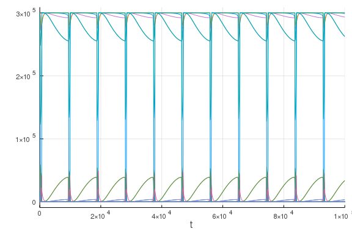
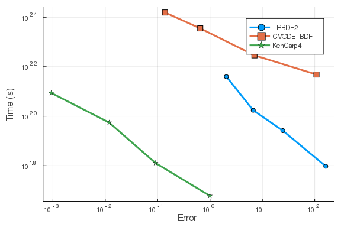
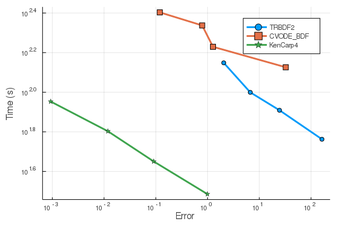
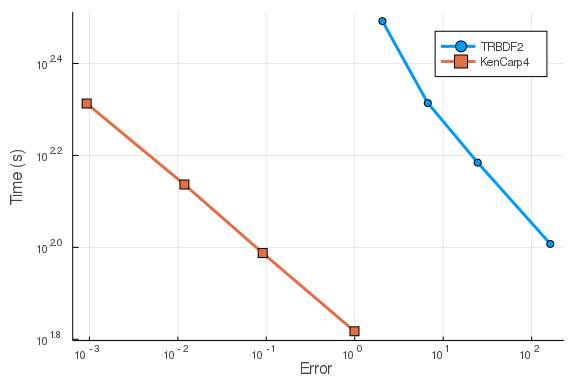

The following benchmark is of a 1122 ODEs with 24388 terms that describe a
stiff chemical reaction network.

````julia
using ReactionNetworkImporters, OrdinaryDiffEq, DiffEqBiological,
      Sundials, Plots, DiffEqDevTools, ODEInterface, ODEInterfaceDiffEq,
      LSODA, TimerOutputs

gr()
prnbng = loadrxnetwork(BNGNetwork(), "BNGRepressilator",
                       joinpath(dirname(pathof(ReactionNetworkImporters)),"..","data","bcr","bcr.net"))
````


````
Parsing parameters...done
Adding parameters...done
Parsing species...done
Adding species...done
Parsing and adding reactions...done
Parsing groups...done
````


````julia
rn = deepcopy(prnbng.rn)
addodes!(rn; build_jac=false, build_symfuncs=false, build_paramjac=false)
tf = 100000.0
oprob = ODEProblem(rn, prnbng.u₀, (0.,tf), prnbng.p);

densejac_rn = deepcopy(prnbng.rn)
# zeroout_jac=true is needed to keep the generated expressions from being too big for the compiler
addodes!(densejac_rn; build_jac=true, zeroout_jac = true, sparse_jac = false, build_symfuncs=false, build_paramjac=false)
densejacprob = ODEProblem(densejac_rn, prnbng.u₀, (0.,tf), prnbng.p);

sparsejac_rn = deepcopy(prnbng.rn)
addodes!(sparsejac_rn; build_jac=true, sparse_jac = true, build_symfuncs=false, build_paramjac=false)
sparsejacprob = ODEProblem(sparsejac_rn, prnbng.u₀, (0.,tf), prnbng.p);
````


````julia
@show numspecies(rn) # Number of ODEs
````


````
numspecies(rn) = 1122
````


````julia
@show numreactions(rn) # Apprx. number of terms in the ODE
````


````
numreactions(rn) = 24388
````


````julia
@show numparams(rn) # Number of Parameters
````


````
numparams(rn) = 128
128
````


## Time ODE derivative function compilation
As compiling the ODE derivative functions has in the past taken longer than
running a simulation, we first force compilation by evaluating these functions
one time.
````julia
const to = TimerOutput()
u₀ = prnbng.u₀
u = copy(u₀);
du = similar(u);
p = prnbng.p
@timeit to "ODERHS Eval1" rn.f(du,u,p,0.)
@timeit to "ODERHS Eval2" rn.f(du,u,p,0.)
sparsejac_rn.f(du,u,p,0.)

J = zeros(length(u),length(u))
@timeit to "DenseJac Eval1" densejac_rn.jac(J,u,p,0.)
@timeit to "DenseJac Eval2" densejac_rn.jac(J,u,p,0.)

Js = similar(sparsejac_rn.odefun.jac_prototype)
@timeit to "SparseJac Eval1" sparsejac_rn.jac(Js,u,p,0.)
@timeit to "SparseJac Eval2" sparsejac_rn.jac(Js,u,p,0.)
show(to)
````


````
──────────────────────────────────────────────────────────────────────────
                                   Time                   Allocations      
                           ──────────────────────   ───────────────────────
     Tot / % measured:           184s / 83.6%           17.1GiB / 80.6%    

 Section           ncalls     time   %tot     avg     alloc   %tot      avg
 ──────────────────────────────────────────────────────────────────────────
 DenseJac Eval1         1    71.7s  46.6%   71.7s   5.27GiB  38.3%  5.27GiB
 SparseJac Eval1        1    53.4s  34.7%   53.4s   5.21GiB  37.8%  5.21GiB
 ODERHS Eval1           1    28.7s  18.7%   28.7s   3.30GiB  23.9%  3.30GiB
 DenseJac Eval2         1    585μs  0.00%   585μs     32.0B  0.00%    32.0B
 SparseJac Eval2        1   50.5μs  0.00%  50.5μs     32.0B  0.00%    32.0B
 ODERHS Eval2           1   38.7μs  0.00%  38.7μs     32.0B  0.00%    32.0B
 ──────────────────────────────────────────────────────────────────────────
````


## Picture of the solution

````julia
sol = solve(oprob, CVODE_BDF(), saveat=tf/1000., reltol=1e-5, abstol=1e-5)
plot(sol,legend=false, fmt=:png)
````





For these benchmarks we will be using the timeseries error with these saving
points since the final time point is not well-indicative of the solution
behavior (capturing the oscillation is the key!).

## Generate Test Solution

````julia
@time sol = solve(oprob,CVODE_BDF(),abstol=1/10^12,reltol=1/10^12)
````


````
599.426939 seconds (5.55 M allocations: 2.225 GiB, 1.39% gc time)
````


````julia
test_sol = TestSolution(sol)
````


````
retcode: Success
Interpolation: 3rd order Hermite
t: nothing
u: nothing
````


## Setups

````julia
abstols = 1.0 ./ 10.0 .^ (5:8)
reltols = 1.0 ./ 10.0 .^ (5:8);
setups = [
          #Dict(:alg=>Rosenbrock23(autodiff=false)),
          Dict(:alg=>TRBDF2(autodiff=false)),
          Dict(:alg=>CVODE_BDF()),
          #Dict(:alg=>rodas()),
          #Dict(:alg=>radau()),
          #Dict(:alg=>Rodas4(autodiff=false)),
          #Dict(:alg=>Rodas5(autodiff=false)),
          Dict(:alg=>KenCarp4(autodiff=false)),
          #Dict(:alg=>RadauIIA5(autodiff=false)),
          #Dict(:alg=>lsoda()),
          ]
````


````
3-element Array{Dict{Symbol,V} where V,1}:
 Dict(:alg => OrdinaryDiffEq.TRBDF2{0,false,DiffEqBase.DefaultLinSolve,Diff
EqBase.NLNewton{Rational{Int64},Rational{Int64},Rational{Int64}},DataType}(
DiffEqBase.DefaultLinSolve(nothing, nothing), DiffEqBase.NLNewton{Rational{
Int64},Rational{Int64},Rational{Int64}}(1//100, 10, 1//5, 1//5), Val{:forwa
rd}, true, :linear, :PI))  
 Dict(:alg => Sundials.CVODE_BDF{:Newton,:Dense,Nothing,Nothing}(0, 0, 0, 0
, false, 10, 5, 7, 3, 10, nothing, nothing, 0))                            
                                                                           
                                                                           
                           
 Dict(:alg => OrdinaryDiffEq.KenCarp4{0,false,DiffEqBase.DefaultLinSolve,Di
ffEqBase.NLNewton{Rational{Int64},Rational{Int64},Rational{Int64}},DataType
}(DiffEqBase.DefaultLinSolve(nothing, nothing), DiffEqBase.NLNewton{Rationa
l{Int64},Rational{Int64},Rational{Int64}}(1//100, 10, 1//5, 1//5), Val{:for
ward}, true, :linear, :PI))
````


## Automatic Jacobian Solves

Due to the computational cost of the problem, we are only going to focus on the
methods which demonstrated computational efficiency on the smaller biochemical
benchmark problems. This excludes the exponential integrator, stabilized explicit,
and extrapolation classes of methods.

First we test using auto-generated Jacobians (finite difference)
````julia
wp = WorkPrecisionSet(oprob,abstols,reltols,setups;error_estimate=:l2,
                      saveat=tf/10000.,appxsol=test_sol,maxiters=Int(1e5),numruns=1)
plot(wp)
````





## Analytical Jacobian
Now we test using the generated analytic Jacobian function.
````julia
wp = WorkPrecisionSet(densejacprob,abstols,reltols,setups;error_estimate=:l2,
                      saveat=tf/10000.,appxsol=test_sol,maxiters=Int(1e5),numruns=1)
plot(wp)
````





## Sparse Jacobian
Finally we test using the generated sparse analytic Jacobian function.
````julia
setups = [
          #Dict(:alg=>Rosenbrock23(autodiff=false)),
          Dict(:alg=>TRBDF2(autodiff=false)),
          #Dict(:alg=>CVODE_BDF()),
          #Dict(:alg=>rodas()),
          #Dict(:alg=>radau()),
          #Dict(:alg=>Rodas4(autodiff=false)),
          #Dict(:alg=>Rodas5(autodiff=false)),
          Dict(:alg=>KenCarp4(autodiff=false)),
          #Dict(:alg=>RadauIIA5(autodiff=false)),
          #Dict(:alg=>lsoda()),
          ]
wp = WorkPrecisionSet(sparsejacprob,abstols,reltols,setups;error_estimate=:l2,
                      saveat=tf/10000.,appxsol=test_sol,maxiters=Int(1e5),numruns=1)
plot(wp)
````



