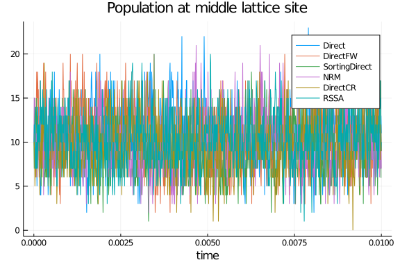
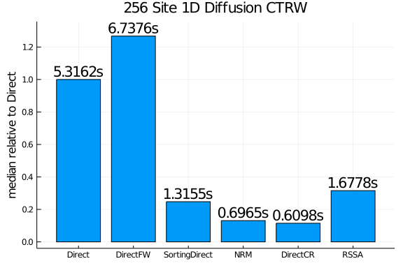

````julia
using DiffEqBase, DiffEqBiological, DiffEqJump, Plots, Statistics, DataFrames
gr()
fmt = :png
````


````
:png
````


# Model and example solutions
Here we implement a 1D continuous time random walk approximation of diffusion for $N$ lattice sites on $\left[0,1\right]$, with reflecting boundary conditions at $x=0$ and $x=1$.

````julia
N = 256
h = 1 / N
rn = @empty_reaction_network
function getDiffNetwork!(rn,N)    
    for i = 1:N
        addspecies!(rn, Symbol(:u, i))
    end
    addparam!(rn, :β)
    for i = 1:N
        (i < N) && addreaction!(rn, :β, (Symbol(:u,i)=>1,), (Symbol(:u,i+1)=>1,))
        (i > 1) && addreaction!(rn, :β, (Symbol(:u,i)=>1,), (Symbol(:u,i-1)=>1,))
    end
    rn
end
getDiffNetwork!(rn,N)
addjumps!(rn, build_regular_jumps=false, minimal_jumps=true)
rnpar = [1/(h*h)]
u0 = 10*ones(Int64, N)
tf = .01
````


````
0.01
````


````julia
methods = (Direct(),DirectFW(),SortingDirect(),NRM(),DirectCR(),RSSA())
shortlabels = [string(leg)[12:end-2] for leg in methods]
prob    = prob = DiscreteProblem(u0, (0.0, tf), rnpar)
ploth   = plot(reuse=false)
for (i,method) in enumerate(methods)
    println("Benchmarking method: ", method)
    jump_prob = JumpProblem(prob, method, rn, save_positions=(false,false))
    sol = solve(jump_prob, SSAStepper(), saveat=tf/1000.)
    plot!(ploth,sol.t,sol[Int(N//2),:],label=shortlabels[i], format=fmt)
end
````


````
Benchmarking method: DiffEqJump.Direct()
Benchmarking method: DiffEqJump.DirectFW()
Benchmarking method: DiffEqJump.SortingDirect()
Benchmarking method: DiffEqJump.NRM()
Benchmarking method: DiffEqJump.DirectCR()
Benchmarking method: DiffEqJump.RSSA()
````


````julia
plot!(ploth, title="Population at middle lattice site", xlabel="time",format=fmt)
````





# Benchmarking performance of the methods

````julia
function run_benchmark!(t, jump_prob, stepper)
    sol = solve(jump_prob, stepper)
    @inbounds for i in 1:length(t)
        t[i] = @elapsed (sol = solve(jump_prob, stepper))
    end
end
````


````
run_benchmark! (generic function with 1 method)
````


````julia
nsims = 50
benchmarks = Vector{Vector{Float64}}()
for method in methods
    jump_prob = JumpProblem(prob, method, rn, save_positions=(false,false))
    stepper = SSAStepper()
    t = Vector{Float64}(undef,nsims)
    run_benchmark!(t, jump_prob, stepper)
    push!(benchmarks, t)
end
````


````julia
medtimes = Vector{Float64}(undef,length(methods))
stdtimes = Vector{Float64}(undef,length(methods))
avgtimes = Vector{Float64}(undef,length(methods))
for i in 1:length(methods)
    medtimes[i] = median(benchmarks[i])
    avgtimes[i] = mean(benchmarks[i])
    stdtimes[i] = std(benchmarks[i])
end

df = DataFrame(names=shortlabels,medtimes=medtimes,relmedtimes=(medtimes/medtimes[1]),
                avgtimes=avgtimes, std=stdtimes, cv=stdtimes./avgtimes)
````


````
6×6 DataFrame. Omitted printing of 1 columns
│ Row │ names         │ medtimes │ relmedtimes │ avgtimes │ std        │
│     │ String        │ Float64  │ Float64     │ Float64  │ Float64    │
├─────┼───────────────┼──────────┼─────────────┼──────────┼────────────┤
│ 1   │ Direct        │ 5.31618  │ 1.0         │ 5.31724  │ 0.0103623  │
│ 2   │ DirectFW      │ 6.73762  │ 1.26738     │ 6.7715   │ 0.0615216  │
│ 3   │ SortingDirect │ 1.31545  │ 0.247443    │ 1.31591  │ 0.00360131 │
│ 4   │ NRM           │ 0.696517 │ 0.131018    │ 0.698003 │ 0.00658974 │
│ 5   │ DirectCR      │ 0.609754 │ 0.114698    │ 0.610891 │ 0.00953982 │
│ 6   │ RSSA          │ 1.67785  │ 0.315611    │ 1.6782   │ 0.00379645 │
````


# Plotting
````julia
sa = [string(round(mt,digits=4),"s") for mt in df.medtimes]
bar(df.names,df.relmedtimes,legend=:false, fmt=fmt)
scatter!(df.names, .05 .+ df.relmedtimes, markeralpha=0, series_annotations=sa, fmt=fmt)
ylabel!("median relative to Direct")
title!("256 Site 1D Diffusion CTRW")
````




````julia
using DiffEqBenchmarks
DiffEqBenchmarks.bench_footer(WEAVE_ARGS[:folder],WEAVE_ARGS[:file])
````


## Appendix

These benchmarks are a part of the DiffEqBenchmarks.jl repository, found at: [https://github.com/JuliaDiffEq/DiffEqBenchmarks.jl](https://github.com/JuliaDiffEq/DiffEqBenchmarks.jl)

To locally run this tutorial, do the following commands:

```
using DiffEqBenchmarks
DiffEqBenchmarks.weave_file("Jumps","Diffusion_CTRW.jmd")
```

Computer Information:

```
Julia Version 1.4.2
Commit 44fa15b150* (2020-05-23 18:35 UTC)
Platform Info:
  OS: Linux (x86_64-pc-linux-gnu)
  CPU: Intel(R) Core(TM) i7-9700K CPU @ 3.60GHz
  WORD_SIZE: 64
  LIBM: libopenlibm
  LLVM: libLLVM-8.0.1 (ORCJIT, skylake)
Environment:
  JULIA_DEPOT_PATH = /builds/JuliaGPU/DiffEqBenchmarks.jl/.julia
  JULIA_CUDA_MEMORY_LIMIT = 2147483648
  JULIA_PROJECT = @.
  JULIA_NUM_THREADS = 8

```

Package Information:

```
Status: `/builds/JuliaGPU/DiffEqBenchmarks.jl/benchmarks/Jumps/Project.toml`
[a93c6f00-e57d-5684-b7b6-d8193f3e46c0] DataFrames 0.21.4
[2b5f629d-d688-5b77-993f-72d75c75574e] DiffEqBase 6.40.4
[eb300fae-53e8-50a0-950c-e21f52c2b7e0] DiffEqBiological 4.3.0
[c894b116-72e5-5b58-be3c-e6d8d4ac2b12] DiffEqJump 6.9.3
[a077e3f3-b75c-5d7f-a0c6-6bc4c8ec64a9] DiffEqProblemLibrary 4.8.0
[1dea7af3-3e70-54e6-95c3-0bf5283fa5ed] OrdinaryDiffEq 5.41.0
[91a5bcdd-55d7-5caf-9e0b-520d859cae80] Plots 1.5.3
[10745b16-79ce-11e8-11f9-7d13ad32a3b2] Statistics 
```

