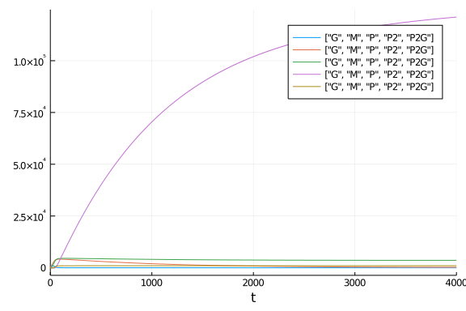
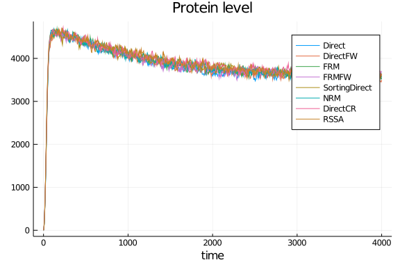
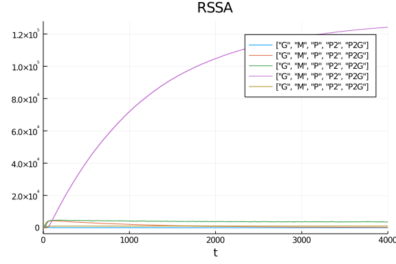

````julia
using DiffEqBase, OrdinaryDiffEq, DiffEqBiological, DiffEqJump, DiffEqProblemLibrary.JumpProblemLibrary, Plots, Statistics
gr()
fmt = :png
JumpProblemLibrary.importjumpproblems()
````


# Model and example solutions
Here we implement the gene expression model from appendix A.6 of Marchetti, Priami and Thanh, *Simulation Algorithms for Comptuational Systems Biology*, Springer (2017).

````julia
jprob = prob_jump_dnadimer_repressor
rn = jprob.network
rnpar = jprob.rates
varlabels = jprob.prob_data["specs_names"]
u0 = jprob.u0
tf = jprob.tstop
````


````
4000.0
````


````julia
u0f = [1000., 0., 0., 0.,0.]
odeprob = ODEProblem(rn, u0f, (0.,tf),rnpar)
sol = solve(odeprob,Tsit5())
plot(sol, format=:png, label=varlabels)
````




````julia
tf      = 4000.
methods = (Direct(),DirectFW(),FRM(),FRMFW(),SortingDirect(),NRM(),DirectCR(),RSSA())
shortlabels = [string(leg)[12:end-2] for leg in methods]
prob    = prob = DiscreteProblem(u0, (0.0, tf), rnpar)
ploth   = plot(reuse=false)
p = []
for (i,method) in enumerate(methods)
    jump_prob = JumpProblem(prob, method, rn, save_positions=(false,false))
    sol = solve(jump_prob, SSAStepper(), saveat=tf/1000.)
    plot!(ploth,sol.t,sol[3,:],label=shortlabels[i], format=fmt)
    push!(p, plot(sol,title=shortlabels[i],leg=false,format=fmt))
end
plot(ploth, title="Protein level", xlabel="time",format=fmt)
````




````julia
plot(p[end],format=fmt,legend=true,labels=varlabels)
````





# Benchmarking performance of the methods

````julia
function run_benchmark!(t, jump_prob, stepper)
    sol = solve(jump_prob, stepper)
    @inbounds for i in 1:length(t)
        t[i] = @elapsed (sol = solve(jump_prob, stepper))
    end
end
````


````
run_benchmark! (generic function with 1 method)
````


````julia
nsims = 50
benchmarks = Vector{Vector{Float64}}()
for method in methods
    jump_prob = JumpProblem(prob, method, rn, save_positions=(false,false))
    stepper = SSAStepper()
    t = Vector{Float64}(undef, nsims)
    run_benchmark!(t, jump_prob, stepper)
    push!(benchmarks, t)
end
````


````julia
medtimes = Vector{Float64}(undef,length(methods))
stdtimes = Vector{Float64}(undef,length(methods))
avgtimes = Vector{Float64}(undef,length(methods))
for i in 1:length(methods)
    medtimes[i] = median(benchmarks[i])
    avgtimes[i] = mean(benchmarks[i])
    stdtimes[i] = std(benchmarks[i])
end

using DataFrames
df = DataFrame(names=shortlabels,medtimes=medtimes,relmedtimes=(medtimes/medtimes[1]),avgtimes=avgtimes, std=stdtimes, cv=stdtimes./avgtimes)
sa = [text(string(round(mt,digits=3),"s"),:center,12) for mt in df.medtimes]
bar(df.names,df.relmedtimes,legend=:false, fmt=fmt)
scatter!(df.names, .05 .+ df.relmedtimes, markeralpha=0, series_annotations=sa, fmt=fmt)
ylabel!("median relative to Direct")
title!("Marchetti Gene Expression Model")
````


````julia
using DiffEqBenchmarks
DiffEqBenchmarks.bench_footer(WEAVE_ARGS[:folder],WEAVE_ARGS[:file])
````


## Appendix

These benchmarks are a part of the DiffEqBenchmarks.jl repository, found at: [https://github.com/JuliaDiffEq/DiffEqBenchmarks.jl](https://github.com/JuliaDiffEq/DiffEqBenchmarks.jl)

To locally run this tutorial, do the following commands:

```
using DiffEqBenchmarks
DiffEqBenchmarks.weave_file("Jumps","NegFeedback_GeneExpr_Marchetti.jmd")
```

Computer Information:

```
Julia Version 1.4.2
Commit 44fa15b150* (2020-05-23 18:35 UTC)
Platform Info:
  OS: Linux (x86_64-pc-linux-gnu)
  CPU: Intel(R) Core(TM) i7-9700K CPU @ 3.60GHz
  WORD_SIZE: 64
  LIBM: libopenlibm
  LLVM: libLLVM-8.0.1 (ORCJIT, skylake)
Environment:
  JULIA_DEPOT_PATH = /builds/JuliaGPU/DiffEqBenchmarks.jl/.julia
  JULIA_CUDA_MEMORY_LIMIT = 2147483648
  JULIA_PROJECT = @.
  JULIA_NUM_THREADS = 8

```

Package Information:

```
Status: `/builds/JuliaGPU/DiffEqBenchmarks.jl/benchmarks/Jumps/Project.toml`
[a93c6f00-e57d-5684-b7b6-d8193f3e46c0] DataFrames 0.21.4
[2b5f629d-d688-5b77-993f-72d75c75574e] DiffEqBase 6.40.4
[eb300fae-53e8-50a0-950c-e21f52c2b7e0] DiffEqBiological 4.3.0
[c894b116-72e5-5b58-be3c-e6d8d4ac2b12] DiffEqJump 6.9.3
[a077e3f3-b75c-5d7f-a0c6-6bc4c8ec64a9] DiffEqProblemLibrary 4.8.0
[1dea7af3-3e70-54e6-95c3-0bf5283fa5ed] OrdinaryDiffEq 5.41.0
[91a5bcdd-55d7-5caf-9e0b-520d859cae80] Plots 1.5.3
[10745b16-79ce-11e8-11f9-7d13ad32a3b2] Statistics 
```

