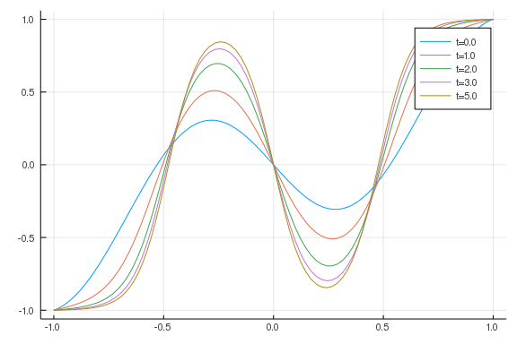
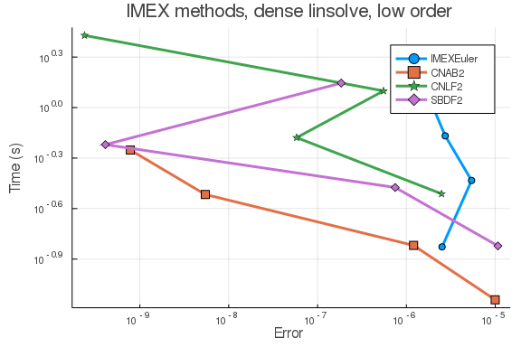
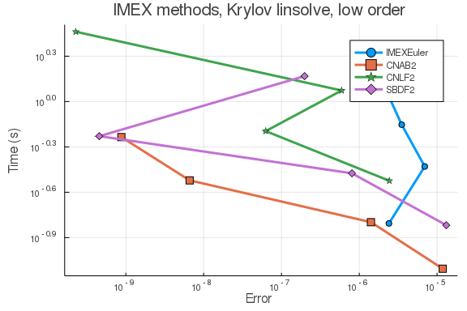
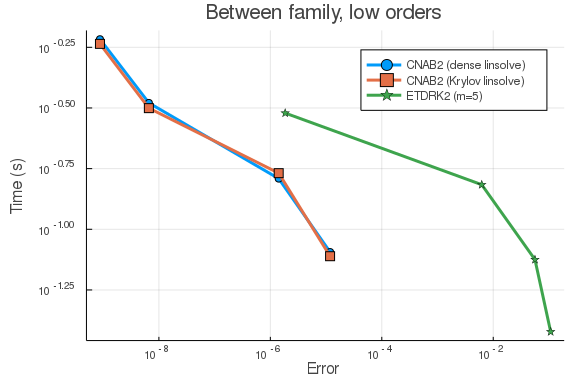
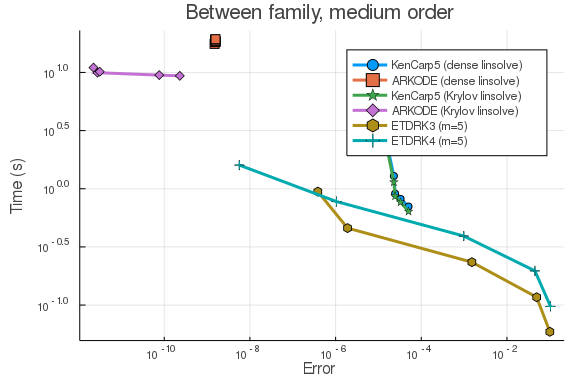

````julia
using ApproxFun, OrdinaryDiffEq, Sundials
using DiffEqDevTools
using LinearAlgebra
using Plots; gr()
````


Here is the Allen-Cahn equation using Chebyshev spectral methods.

````julia
function cheb(N)
    N==0 && return (0,1)
    x = cos.(pi*(0:N)/N)
    c = [2; ones(N-1,1); 2].*(-1).^(0:N)
    X = hcat([x for i in 1:N+1]...)
    dX = X-X'
    D  = (c*(1 ./c)')./(dX+I)      # off-diagonal entries
    D  = D .- Diagonal(vec(sum(D,dims=2)))                 # diagonal entries
    D,x
end
N = 128
ChebD2,x = cheb(N)
xx = x
x = x[2:N]
w = .53*x + .47*sin.(-1.5*pi*x) - x # use w = u-x to make BCs homogeneous
u = [1;w+x;-1]

ϵ=0.01
D2=ϵ*(ChebD2^2)[2:N, 2:N]
function allen_cahn(du,u,x,t)
    @. du = (u + x) - (u + x)^3
end
````


````
allen_cahn (generic function with 1 method)
````


Reference solution using RadauIIA5 is below:

````julia
prob = SplitODEProblem(DiffEqArrayOperator(D2), allen_cahn, w, (0.0,5.0), x)
sol  = solve(prob, RadauIIA5(autodiff=false); reltol=1e-14,abstol=1e-14)
test_sol = TestSolution(sol)

tslices=[0.0 1.0 2.0 3.0 5.0]
ys=hcat(([1;x.+sol(t);-1] for t in tslices)...)
labels=["t=$t" for t in tslices]
plot(xx,ys,label=labels)
````





## High tolerances

## In-family comparisons

1.IMEX methods (dense linear solver)

````julia
abstols = 0.1 .^ (5:8)
reltols = 0.1 .^ (1:4)
multipliers =  0.5 .^ (0:3)
setups = [Dict(:alg => IMEXEuler(), :dts => 1e-3 * multipliers),
          Dict(:alg => CNAB2(), :dts => 5e-3 * multipliers),
          Dict(:alg => CNLF2(), :dts => 5e-4 * multipliers),
          Dict(:alg => SBDF2(), :dts => 1e-3 * multipliers)]
labels = ["IMEXEuler" "CNAB2" "CNLF2" "SBDF2"]
@time wp1 = WorkPrecisionSet(prob,abstols,reltols,setups;
                            print_names=true,names=labels,
                            numruns=5,seconds=5,
                            save_everystop=false,appxsol=test_sol,maxiters=Int(1e5));
````


````
IMEXEuler
CNAB2
CNLF2
SBDF2
 90.900492 seconds (190.73 M allocations: 10.711 GiB, 1.90% gc time)
````


````julia

plot(wp1,label=labels,markershape=:auto,title="IMEX methods, dense linsolve, low order")
````





1.IMEX methods (Krylov linear solver)

````julia
abstols = 0.1 .^ (5:8) # all fixed dt methods so these don't matter much
reltols = 0.1 .^ (1:4)
multipliers = 0.5 .^ (0:3)
setups = [Dict(:alg => IMEXEuler(linsolve=LinSolveGMRES()), :dts => 1e-3 * multipliers),
          Dict(:alg => CNAB2(linsolve=LinSolveGMRES()), :dts => 5e-3 * multipliers),
          Dict(:alg => CNLF2(linsolve=LinSolveGMRES()), :dts => 5e-4 * multipliers),
          Dict(:alg => SBDF2(linsolve=LinSolveGMRES()), :dts => 1e-3 * multipliers)]
labels = ["IMEXEuler" "CNAB2" "CNLF2" "SBDF2"]
@time wp1 = WorkPrecisionSet(prob,abstols,reltols,setups;
                            print_names=true, names=labels,
                            numruns=5, error_estimate=:l2,
                            save_everystep=false, appxsol=test_sol, maxiters=Int(1e5));
````


````
IMEXEuler
CNAB2
CNLF2
SBDF2
 74.675937 seconds (142.92 M allocations: 6.127 GiB, 1.23% gc time)
````


````julia

plot(wp1, label=labels, markershape=:auto, title="IMEX methods, Krylov linsolve, low order")
````





2. ExpRK methods

````julia
abstols = 0.1 .^ (5:8) # all fixed dt methods so these don't matter much
reltols = 0.1 .^ (1:4)
multipliers = 0.5 .^ (0:3)
setups = [Dict(:alg => NorsettEuler(), :dts => 1e-3 * multipliers),
          Dict(:alg => NorsettEuler(krylov=true, m=5), :dts => 1e-3 * multipliers),
          Dict(:alg => NorsettEuler(krylov=true, m=20), :dts => 1e-3 * multipliers),
          Dict(:alg => ETDRK2(), :dts => 1e-2 * multipliers),
          Dict(:alg => ETDRK2(krylov=true, m=5), :dts => 1e-2 * multipliers),
          Dict(:alg => ETDRK2(krylov=true, m=20), :dts => 1e-2 * multipliers)]
labels = hcat("NorsettEuler (caching)", "NorsettEuler (m=5)", "NorsettEuler (m=20)",
                            "ETDRK2 (caching)", "ETDRK2 (m=5)", "ETDRK2 (m=20)")
@time wp2 = WorkPrecisionSet(prob,abstols,reltols,setups;
                            print_names=true, names=labels,
                            numruns=5,
                            save_everystep=false, appxsol=test_sol, maxiters=Int(1e5));
````


````
NorsettEuler (caching)
NorsettEuler (m=5)
NorsettEuler (m=20)
ETDRK2 (caching)
ETDRK2 (m=5)
ETDRK2 (m=20)
103.844082 seconds (250.77 M allocations: 31.564 GiB, 2.45% gc time)
````


````julia

plot(wp2, label=labels, markershape=:auto, title="ExpRK methods, low order")
````


## Between family comparisons

````julia
abstols = 0.1 .^ (5:8) # all fixed dt methods so these don't matter much
reltols = 0.1 .^ (1:4)
multipliers = 0.5 .^ (0:3)
setups = [Dict(:alg => CNAB2(), :dts => 5e-3 * multipliers),
          Dict(:alg => CNAB2(linsolve=LinSolveGMRES()), :dts => 5e-3 * multipliers),
          Dict(:alg => ETDRK2(krylov=true, m=5), :dts => 1e-2 * multipliers)]
labels = ["CNAB2 (dense linsolve)" "CNAB2 (Krylov linsolve)" "ETDRK2 (m=5)"]
@time wp3 = WorkPrecisionSet(prob,abstols,reltols,setups;
                            print_names=true, names=labels,
                            numruns=5, error_estimate=:l2,
                            save_everystep=false, appxsol=test_sol, maxiters=Int(1e5));
````


````
CNAB2 (dense linsolve)
CNAB2 (Krylov linsolve)
ETDRK2 (m=5)
 21.669937 seconds (42.01 M allocations: 2.240 GiB, 1.59% gc time)
````


````julia

plot(wp3, label=labels, markershape=:auto, title="Between family, low orders")
````





## Low tolerances
## In-family comparisons

1.IMEX methods (dense/band linear solver)

````julia
abstols = 0.1 .^ (7:13)
reltols = 0.1 .^ (4:10)
setups = [Dict(:alg => KenCarp3()),
          Dict(:alg => KenCarp4()),
          Dict(:alg => KenCarp5()),
          Dict(:alg => ARKODE(Sundials.Implicit(), order=3, linear_solver=:Band, jac_upper=1, jac_lower=1)),
          Dict(:alg => ARKODE(Sundials.Implicit(), order=4, linear_solver=:Band, jac_upper=1, jac_lower=1)),
          Dict(:alg => ARKODE(Sundials.Implicit(), order=5, linear_solver=:Band, jac_upper=1, jac_lower=1))]
labels = hcat("KenCarp3", "KenCarp4", "KenCarp5",
              "ARKODE3", "ARKODE4", "ARKODE5")
@time wp4 = WorkPrecisionSet(prob,abstols,reltols,setups;
                            print_names=true, names=labels,
                            numruns=5, error_estimate=:l2,
                            save_everystep=false, appxsol=test_sol, maxiters=Int(1e5));
````


````
KenCarp3
KenCarp4
KenCarp5
ARKODE3
ARKODE4
ARKODE5
690.062484 seconds (869.61 M allocations: 50.634 GiB, 1.15% gc time)
````


````julia

plot(wp4, label=labels, markershape=:auto, title="IMEX methods, dense/band linsolve, medium order")
````


1.IMEX methods (krylov linear solver)

````julia
abstols = 0.1 .^ (7:13)
reltols = 0.1 .^ (4:10)
setups = [Dict(:alg => KenCarp3(linsolve=LinSolveGMRES())),
          Dict(:alg => KenCarp4(linsolve=LinSolveGMRES())),
          Dict(:alg => KenCarp5(linsolve=LinSolveGMRES())),
          Dict(:alg => ARKODE(Sundials.Implicit(), order=3, linear_solver=:GMRES)),
          Dict(:alg => ARKODE(Sundials.Implicit(), order=4, linear_solver=:GMRES)),
          Dict(:alg => ARKODE(Sundials.Implicit(), order=5, linear_solver=:GMRES))]
labels = ["KenCarp3" "KenCarp4" "KenCarp5" "ARKODE3" "ARKODE4" "ARKODE5"]
@time wp4 = WorkPrecisionSet(prob,abstols,reltols,setups;
                            print_names=true, names=labels,
                            numruns=5, error_estimate=:l2,
                            save_everystep=false, appxsol=test_sol, maxiters=Int(1e5));
````


````
KenCarp3
KenCarp4
KenCarp5
ARKODE3
ARKODE4
ARKODE5
731.802899 seconds (1.07 G allocations: 66.227 GiB, 1.44% gc time)
````


````julia

plot(wp4, label=labels, markershape=:auto, title="IMEX methods, Krylov linsolve, medium order")
````


2.ExpRK methods

````julia
abstols = 0.1 .^ (7:11) # all fixed dt methods so these don't matter much
reltols = 0.1 .^ (4:8)
multipliers = 0.5 .^ (0:4)
setups = [Dict(:alg => ETDRK3(), :dts => 1e-2 * multipliers),
          Dict(:alg => ETDRK3(krylov=true, m=5), :dts => 1e-2 * multipliers),
          Dict(:alg => ETDRK4(), :dts => 1e-2 * multipliers),
          Dict(:alg => ETDRK4(krylov=true, m=5), :dts => 1e-2 * multipliers),
          Dict(:alg => HochOst4(), :dts => 1e-2 * multipliers),
          Dict(:alg => HochOst4(krylov=true, m=5), :dts => 1e-2 * multipliers)]
labels = hcat("ETDRK3 (caching)", "ETDRK3 (m=5)", "ETDRK4 (caching)",
              "ETDRK4 (m=5)", "HochOst4 (caching)", "HochOst4 (m=5)")
@time wp5 = WorkPrecisionSet(prob,abstols,reltols,setups;
                            print_names=true, names=labels,
                            numruns=5, error_estimate=:l2,
                            save_everystep=false, appxsol=test_sol, maxiters=Int(1e5));
````


````
ETDRK3 (caching)
ETDRK3 (m=5)
ETDRK4 (caching)
ETDRK4 (m=5)
HochOst4 (caching)
HochOst4 (m=5)
126.782314 seconds (163.56 M allocations: 34.587 GiB, 2.41% gc time)
````


````julia

plot(wp5, label=labels, markershape=:auto, title="ExpRK methods, medium order")
````


## Between family comparisons

````julia
abstols = 0.1 .^ (7:11)
reltols = 0.1 .^ (4:8)
multipliers = 0.5 .^ (0:4)
setups = [Dict(:alg => KenCarp5()),
          Dict(:alg => ARKODE(Sundials.Implicit(), order=5, linear_solver=:Dense)),
          Dict(:alg => KenCarp5(linsolve=LinSolveGMRES())),
          Dict(:alg => ARKODE(Sundials.Implicit(), order=5, linear_solver=:GMRES)),
          Dict(:alg => ETDRK3(krylov=true, m=5), :dts => 1e-2 * multipliers),
          Dict(:alg => ETDRK4(krylov=true, m=5), :dts => 1e-2 * multipliers)]
labels = hcat("KenCarp5 (dense linsolve)", "ARKODE (dense linsolve)", "KenCarp5 (Krylov linsolve)",
              "ARKODE (Krylov linsolve)", "ETDRK3 (m=5)", "ETDRK4 (m=5)")
@time wp6 = WorkPrecisionSet(prob,abstols,reltols,setups;
                            print_names=true, names=labels,
                            numruns=5, error_estimate=:l2,
                            save_everystep=false, appxsol=test_sol, maxiters=Int(1e5));
````


````
KenCarp5 (dense linsolve)
ARKODE (dense linsolve)
KenCarp5 (Krylov linsolve)
ARKODE (Krylov linsolve)
ETDRK3 (m=5)
ETDRK4 (m=5)
532.322138 seconds (537.45 M allocations: 37.447 GiB, 1.10% gc time)
````


````julia

plot(wp6, label=labels, markershape=:auto, title="Between family, medium order")
````




````julia
using DiffEqBenchmarks
DiffEqBenchmarks.bench_footer(WEAVE_ARGS[:folder],WEAVE_ARGS[:file])
````


## Appendix

These benchmarks are a part of the DiffEqBenchmarks.jl repository, found at: [https://github.com/JuliaDiffEq/DiffEqBenchmarks.jl](https://github.com/JuliaDiffEq/DiffEqBenchmarks.jl)

To locally run this tutorial, do the following commands:

```
using DiffEqBenchmarks
DiffEqBenchmarks.weave_file("MOLPDE","allen_cahn_spectral_wpd.jmd")
```

Computer Information:

```
Julia Version 1.3.0
Commit 46ce4d7933 (2019-11-26 06:09 UTC)
Platform Info:
  OS: Linux (x86_64-pc-linux-gnu)
  CPU: Intel(R) Core(TM) i7-9700K CPU @ 3.60GHz
  WORD_SIZE: 64
  LIBM: libopenlibm
  LLVM: libLLVM-6.0.1 (ORCJIT, skylake)
Environment:
  JULIA_NUM_THREADS = 8

```

Package Information:

```
Status: `/home/chrisrackauckas/.julia/dev/DiffEqBenchmarks/Project.toml`

```

