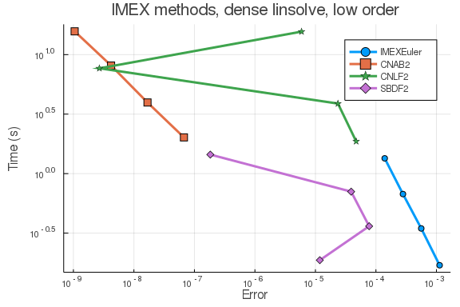
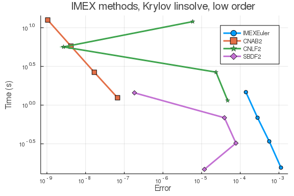
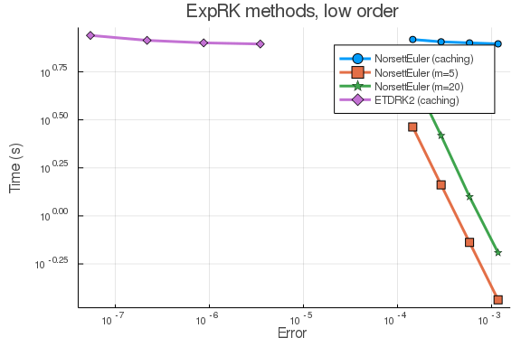
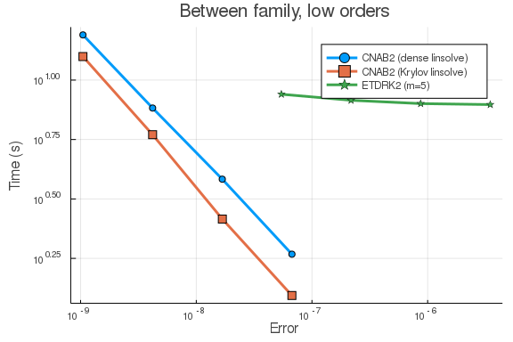
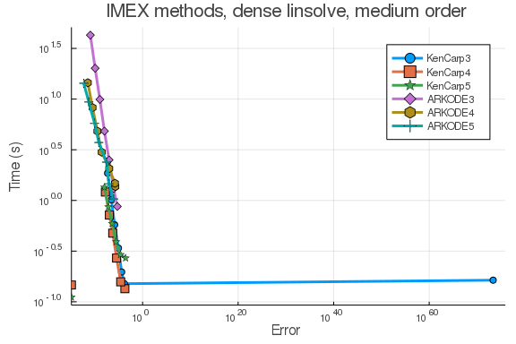
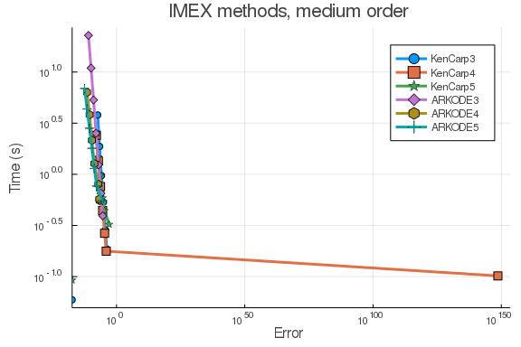
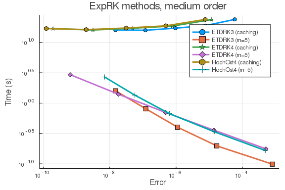

````julia
using ApproxFun, OrdinaryDiffEq, Sundials
using DiffEqDevTools
using LinearAlgebra
using Plots; gr()
````


Here is the Burgers equation using FDM.

````julia
function lin_term(N, ϵ)
    dx = 1/(N + 1)
    d = -2 * ones(N) # main diagonal
    du = ones(N - 1) # off diagonal
    DiffEqArrayOperator((ϵ/dx^2) * diagm(-1 => du, 0 => d, 1 => du))
end

function nl_term(N)
    dx = 1/(N + 1)
    du = ones(N - 1) # super diagonal
    dl = -ones(N - 1) # lower diagonal
    D = (-1/(4*dx)) * diagm(-1 => dl, 1 => du)

    tmp = zeros(N)
    function (du,u,p,t)
        @. tmp = u^2
        mul!(du, D, tmp)
    end
end

# Construct the problem
function burgers(N, ϵ)
    f1 = lin_term(N, ϵ)
    f2 = nl_term(N)
    dx = 1 / (N + 1)
    xs = (1:N) * dx

    μ0 = 0.3; σ0 = 0.05
    f0 = x -> exp(-(x - μ0)^2 / (2 * σ0^2))
    u0 = f0.(xs)
    prob = SplitODEProblem(f1, f2, u0, (0.0, 1.0))
    xs, prob
end;
````


Reference solution using Vern9 is below:

````julia
xs, prob = burgers(512, 1e-3)
sol = solve(prob, Vern9(); abstol=1e-14, reltol=1e-14)
test_sol = TestSolution(sol);

tslices = [0.0 0.25 0.50 0.75 1.00]
ys = hcat((sol(t) for t in tslices)...)
labels = ["t = $t" for t in tslices]
plot(xs, ys, label=labels)
````


Linear solvers

````julia
const LS_Dense = LinSolveFactorize(lu)
````


````
DiffEqBase.LinSolveFactorize{typeof(LinearAlgebra.lu)}(LinearAlgebra.lu, no
thing)
````


## High tolerances

## In-family comparisons

1.IMEX methods (dense linear solver)

````julia
abstols = 0.1 .^ (5:8) # all fixed dt methods so these don't matter much
reltols = 0.1 .^ (1:4)
multipliers = 0.5 .^ (0:3)
setups = [Dict(:alg => IMEXEuler(linsolve=LS_Dense), :dts => 1e-3 * multipliers),
          Dict(:alg => CNAB2(linsolve=LS_Dense), :dts => 1e-4 * multipliers),
          Dict(:alg => CNLF2(linsolve=LS_Dense), :dts => 1e-4 * multipliers),
          Dict(:alg => SBDF2(linsolve=LS_Dense), :dts => 1e-3 * multipliers)]
labels = ["IMEXEuler" "CNAB2" "CNLF2" "SBDF2"]
@time wp = WorkPrecisionSet(prob,abstols,reltols,setups;
                            print_names=true, names=labels,
                            numruns=5, error_estimate=:l2,
                            save_everystep=false, appxsol=test_sol, maxiters=Int(1e5));
````


````
IMEXEuler
CNAB2
CNLF2
SBDF2
224.733457 seconds (33.57 M allocations: 2.069 GiB, 0.10% gc time)
````


````julia

plot(wp, label=labels, markershape=:auto, title="IMEX methods, dense linsolve, low order")
````





1.IMEX methods (Krylov linear solver)

````julia
abstols = 0.1 .^ (5:8) # all fixed dt methods so these don't matter much
reltols = 0.1 .^ (1:4)
multipliers = 0.5 .^ (0:3)
setups = [Dict(:alg => IMEXEuler(linsolve=LinSolveGMRES()), :dts => 1e-3 * multipliers),
          Dict(:alg => CNAB2(linsolve=LinSolveGMRES()), :dts => 1e-4 * multipliers),
          Dict(:alg => CNLF2(linsolve=LinSolveGMRES()), :dts => 1e-4 * multipliers),
          Dict(:alg => SBDF2(linsolve=LinSolveGMRES()), :dts => 1e-3 * multipliers)]
labels = ["IMEXEuler" "CNAB2" "CNLF2" "SBDF2"]
@time wp = WorkPrecisionSet(prob,abstols,reltols,setups;
                            print_names=true, names=labels,
                            numruns=5, error_estimate=:l2,
                            save_everystep=false, appxsol=test_sol, maxiters=Int(1e5));
````


````
IMEXEuler
CNAB2
CNLF2
SBDF2
181.560483 seconds (74.84 M allocations: 3.260 GiB, 0.23% gc time)
````


````julia

plot(wp, label=labels, markershape=:auto, title="IMEX methods, Krylov linsolve, low order")
````





2. ExpRK methods

````julia
abstols = 0.1 .^ (5:8) # all fixed dt methods so these don't matter much
reltols = 0.1 .^ (1:4)
multipliers = 0.5 .^ (0:3)
setups = [Dict(:alg => NorsettEuler(), :dts => 1e-3 * multipliers),
          Dict(:alg => NorsettEuler(krylov=true, m=5), :dts => 1e-3 * multipliers),
          Dict(:alg => NorsettEuler(krylov=true, m=20), :dts => 1e-3 * multipliers),
          Dict(:alg => ETDRK2(), :dts => 1e-3 * multipliers)]
          #Dict(:alg => ETDRK2(krylov=true, m=20), :dts => 1e-2 * multipliers)) matrix contains Inf or NaN
          #Dict(:alg => ETDRK2(krylov=true, m=20), :dts => 1e-2 * multipliers) matrix contains Inf or NaN
labels = hcat("NorsettEuler (caching)", "NorsettEuler (m=5)", "NorsettEuler (m=20)",
              "ETDRK2 (caching)")#, "ETDRK2 (m=5)"), "ETDRK2 (m=20)")
@time wp = WorkPrecisionSet(prob,abstols,reltols,setups;
                            print_names=true, names=labels,
                            numruns=5, error_estimate=:l2,
                            save_everystep=false, appxsol=test_sol, maxiters=Int(1e5));
````


````
NorsettEuler (caching)
NorsettEuler (m=5)
NorsettEuler (m=20)
ETDRK2 (caching)
261.600967 seconds (22.10 M allocations: 124.338 GiB, 0.84% gc time)
````


````julia

plot(wp, label=labels, markershape=:auto, title="ExpRK methods, low order")
````





## Between family comparisons

````julia
abstols = 0.1 .^ (5:8) # all fixed dt methods so these don't matter much
reltols = 0.1 .^ (1:4)
multipliers = 0.5 .^ (0:3)
setups = [Dict(:alg => CNAB2(linsolve=LS_Dense), :dts => 1e-4 * multipliers),
          Dict(:alg => CNAB2(linsolve=LinSolveGMRES()), :dts => 1e-4 * multipliers),
          Dict(:alg => ETDRK2(), :dts => 1e-3 * multipliers)]
labels = ["CNAB2 (dense linsolve)" "CNAB2 (Krylov linsolve)" "ETDRK2 (m=5)"]
@time wp = WorkPrecisionSet(prob,abstols,reltols,setups;
                            print_names=true, names=labels,
                            numruns=5, error_estimate=:l2,
                            save_everystep=false, appxsol=test_sol, maxiters=Int(1e5));
````


````
CNAB2 (dense linsolve)
CNAB2 (Krylov linsolve)
ETDRK2 (m=5)
265.000770 seconds (30.04 M allocations: 61.977 GiB, 0.50% gc time)
````


````julia

plot(wp, label=labels, markershape=:auto, title="Between family, low orders")
````





## Low tolerances

## In-family comparisons

1.IMEX methods (dense linear solver)

````julia
abstols = 0.1 .^ (7:13)
reltols = 0.1 .^ (4:10)
setups = [Dict(:alg => KenCarp3(linsolve=LS_Dense)),
          Dict(:alg => KenCarp4(linsolve=LS_Dense)),
          Dict(:alg => KenCarp5(linsolve=LS_Dense)),
          Dict(:alg => ARKODE(Sundials.Implicit(), order=3, linear_solver=:Dense)),
          Dict(:alg => ARKODE(Sundials.Implicit(), order=4, linear_solver=:Dense)),
          Dict(:alg => ARKODE(Sundials.Implicit(), order=5, linear_solver=:Dense))]
labels = hcat("KenCarp3", "KenCarp4", "KenCarp5", "ARKODE3", "ARKODE4", "ARKODE5")
@time wp = WorkPrecisionSet(prob,abstols,reltols,setups;
                            print_names=true, names=labels,
                            numruns=5, error_estimate=:l2,
                            save_everystep=false, appxsol=test_sol, maxiters=Int(1e5));
````


````
KenCarp3
KenCarp4
KenCarp5
ARKODE3
ARKODE4
ARKODE5
586.010751 seconds (50.17 M allocations: 8.149 GiB, 0.09% gc time)
````


````julia

plot(wp, label=labels, markershape=:auto, title="IMEX methods, dense linsolve, medium order")
````





1.IMEX methods (Krylov linear solver)

````julia
abstols = 0.1 .^ (7:13)
reltols = 0.1 .^ (4:10)
setups = [Dict(:alg => KenCarp3(linsolve=LinSolveGMRES())),
          Dict(:alg => KenCarp4(linsolve=LinSolveGMRES())),
          Dict(:alg => KenCarp5(linsolve=LinSolveGMRES())),
          Dict(:alg => ARKODE(Sundials.Implicit(), order=3, linear_solver=:GMRES)),
          Dict(:alg => ARKODE(Sundials.Implicit(), order=4, linear_solver=:GMRES)),
          Dict(:alg => ARKODE(Sundials.Implicit(), order=5, linear_solver=:GMRES))]
labels = ["KenCarp3" "KenCarp4" "KenCarp5" "ARKODE3" "ARKODE4" "ARKODE5"]
@time wp = WorkPrecisionSet(prob,abstols,reltols,setups;
                            print_names=true, names=labels,
                            numruns=5, error_estimate=:l2,
                            save_everystep=false, appxsol=test_sol, maxiters=Int(1e5));
````


````
KenCarp3
KenCarp4
KenCarp5
ARKODE3
ARKODE4
ARKODE5
383.726984 seconds (110.05 M allocations: 5.723 GiB, 0.22% gc time)
````


````julia

plot(wp, label=labels, markershape=:auto, title="IMEX methods, medium order")
````





2.ExpRK methods

````julia
abstols = 0.1 .^ (7:11) # all fixed dt methods so these don't matter much
reltols = 0.1 .^ (4:8)
multipliers = 0.5 .^ (0:4)
setups = [Dict(:alg => ETDRK3(), :dts => 1e-2 * multipliers),
          Dict(:alg => ETDRK3(krylov=true, m=5), :dts => 1e-2 * multipliers),
          Dict(:alg => ETDRK4(), :dts => 1e-2 * multipliers),
          Dict(:alg => ETDRK4(krylov=true, m=5), :dts => 1e-2 * multipliers),
          Dict(:alg => HochOst4(), :dts => 1e-2 * multipliers),
          Dict(:alg => HochOst4(krylov=true, m=5), :dts => 1e-2 * multipliers)]
labels = hcat("ETDRK3 (caching)", "ETDRK3 (m=5)", "ETDRK4 (caching)",
              "ETDRK4 (m=5)", "HochOst4 (caching)", "HochOst4 (m=5)")
@time wp = WorkPrecisionSet(prob,abstols,reltols,setups;
                            print_names=true, names=labels,
                            numruns=5, error_estimate=:l2,
                            save_everystep=false, appxsol=test_sol, maxiters=Int(1e5));
````


````
ETDRK3 (caching)
ETDRK3 (m=5)
ETDRK4 (caching)
ETDRK4 (m=5)
HochOst4 (caching)
HochOst4 (m=5)
914.036378 seconds (45.04 M allocations: 460.660 GiB, 0.84% gc time)
````


````julia

plot(wp, label=labels, markershape=:auto, title="ExpRK methods, medium order")
````





## Between family comparisons


````julia
abstols = 0.1 .^ (7:11)
reltols = 0.1 .^ (4:8)
multipliers = 0.5 .^ (0:4)
setups = [Dict(:alg => KenCarp5(linsolve=LS_Dense)),
          Dict(:alg => ARKODE(Sundials.Implicit(), order=5, linear_solver=:Dense)),
          Dict(:alg => KenCarp5(linsolve=LinSolveGMRES())),
          Dict(:alg => ARKODE(Sundials.Implicit(), order=5, linear_solver=:GMRES)),
          Dict(:alg => ETDRK3(krylov=true, m=5), :dts => 1e-2 * multipliers),
          Dict(:alg => ETDRK4(krylov=true, m=5), :dts => 1e-2 * multipliers)]
labels = hcat("KenCarp5 (dense linsolve)", "ARKODE (dense linsolve)", "KenCarp5 (Krylov linsolve)",
              "ARKODE (Krylov linsolve)", "ETDRK3 (m=5)", "ETDRK4 (m=5)")
@time wp = WorkPrecisionSet(prob,abstols,reltols,setups;
                            print_names=true, names=labels,
                            numruns=5, error_estimate=:l2,
                            save_everystep=false, appxsol=test_sol, maxiters=Int(1e5));#162s
````


````
KenCarp5 (dense linsolve)
ARKODE (dense linsolve)
KenCarp5 (Krylov linsolve)
ARKODE (Krylov linsolve)
ETDRK3 (m=5)
ETDRK4 (m=5)
172.555697 seconds (26.51 M allocations: 3.328 GiB, 0.18% gc time)
````


````julia

plot(wp, label=labels, markershape=:auto, title="Between family, medium order")
````


````julia
using DiffEqBenchmarks
DiffEqBenchmarks.bench_footer(WEAVE_ARGS[:folder],WEAVE_ARGS[:file])
````


## Appendix

These benchmarks are a part of the DiffEqBenchmarks.jl repository, found at: [https://github.com/JuliaDiffEq/DiffEqBenchmarks.jl](https://github.com/JuliaDiffEq/DiffEqBenchmarks.jl)

To locally run this tutorial, do the following commands:

```
using DiffEqBenchmarks
DiffEqBenchmarks.weave_file("MOLPDE","burgers_fdm_wpd.jmd")
```

Computer Information:

```
Julia Version 1.3.0
Commit 46ce4d7933 (2019-11-26 06:09 UTC)
Platform Info:
  OS: Linux (x86_64-pc-linux-gnu)
  CPU: Intel(R) Core(TM) i7-9700K CPU @ 3.60GHz
  WORD_SIZE: 64
  LIBM: libopenlibm
  LLVM: libLLVM-6.0.1 (ORCJIT, skylake)
Environment:
  JULIA_NUM_THREADS = 8

```

Package Information:

```
Status: `/home/chrisrackauckas/.julia/dev/DiffEqBenchmarks/Project.toml`

```

