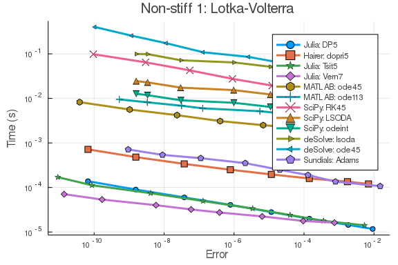
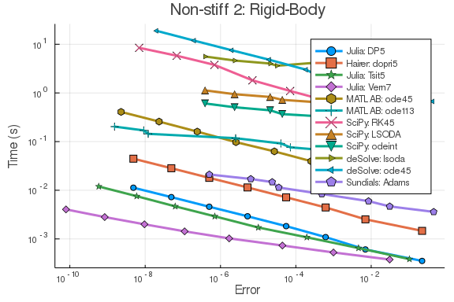
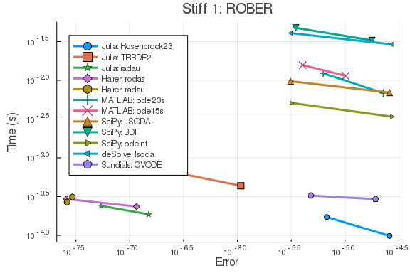
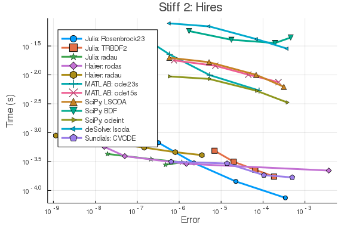

The following benchmarks demonstrate the performance differences due to using
similar algorithms from wrapper packages in the main scripting languages across
a range of stiff and non-stiff ODEs. It takes into account solver time and
error in order to ensure correctness of interpretations. These were ran with
Julia 1.3, MATLAB 2019B, deSolve 1.2.5, and SciPy 1.3.1.

These benchmarks are generated using the following bindings:

- [MATLABDiffEq.jl](https://github.com/JuliaDiffEq/MATLABDiffEq.jl) (MATLAB)
- [SciPyDiffEq.jl](https://github.com/JuliaDiffEq/SciPyDiffEq.jl) (SciPy)
- [deSolveDiffEq.jl](https://github.com/JuliaDiffEq/deSolveDiffEq.jl) (deSolve)
- [OrdinaryDiffEq.jl](https://github.com/JuliaDiffEq/OrdinaryDiffEq.jl) (OrdinaryDiffEq.jl)
- [Sundials.jl](https://github.com/JuliaDiffEq/Sundials.jl) (Sundials)
- [ODEInterfaceDiffEq.jl](https://github.com/JuliaDiffEq/ODEInterfaceDiffEq.jl) (Hairer and Netlib)

The respective repos verify negligible overhead on interop (MATLAB, ODEInterface,
and Sundials overhead are negligable, SciPy is accelerated 3x over SciPy+Numba
setups due to the Julia JIT on the ODE function, deSolve sees a 3x overhead
over the pure-R version). Error and timing is compared together to ensure
the methods are solving to the same accuracy when compared.

More wrappers will continue to be added as necessary.

## Setup

````julia
using ParameterizedFunctions, MATLABDiffEq, OrdinaryDiffEq, ODEInterface,
      ODEInterfaceDiffEq, Plots, Sundials, SciPyDiffEq, deSolveDiffEq
using DiffEqDevTools
using LinearAlgebra
````


#### Non-Stiff Problem 1: Lotka-Volterra

````julia
f = @ode_def_bare LotkaVolterra begin
  dx = a*x - b*x*y
  dy = -c*y + d*x*y
end a b c d
p = [1.5,1,3,1]
tspan = (0.0,10.0)
u0 = [1.0,1.0]
prob = ODEProblem(f,u0,tspan,p)
sol = solve(prob,Vern7(),abstol=1/10^14,reltol=1/10^14)
test_sol = TestSolution(sol)

setups = [Dict(:alg=>DP5())
          Dict(:alg=>dopri5())
          Dict(:alg=>Tsit5())
          Dict(:alg=>Vern7())
          Dict(:alg=>MATLABDiffEq.ode45())
          Dict(:alg=>MATLABDiffEq.ode113())
          Dict(:alg=>SciPyDiffEq.RK45())
          Dict(:alg=>SciPyDiffEq.LSODA())
          Dict(:alg=>SciPyDiffEq.odeint())
          Dict(:alg=>deSolveDiffEq.lsoda())
          Dict(:alg=>deSolveDiffEq.ode45())
          Dict(:alg=>CVODE_Adams())
  ]

names = [
  "Julia: DP5"
  "Hairer: dopri5"
  "Julia: Tsit5"
  "Julia: Vern7"
  "MATLAB: ode45"
  "MATLAB: ode113"
  "SciPy: RK45"
  "SciPy: LSODA"
  "SciPy: odeint"
  "deSolve: lsoda"
  "deSolve: ode45"
  "Sundials: Adams"
  ]

abstols = 1.0 ./ 10.0 .^ (6:13)
reltols = 1.0 ./ 10.0 .^ (3:10)
wp = WorkPrecisionSet(prob,abstols,reltols,setups;
                      names = names,
                      appxsol=test_sol,dense=false,
                      save_everystep=false,numruns=100,maxiters=10000000,
                      timeseries_errors=false,verbose=false)
plot(wp,title="Non-stiff 1: Lotka-Volterra")
````





#### Non-Stiff Problem 2: Rigid Body

````julia
f = @ode_def_bare RigidBodyBench begin
  dy1  = -2*y2*y3
  dy2  = 1.25*y1*y3
  dy3  = -0.5*y1*y2 + 0.25*sin(t)^2
end
prob = ODEProblem(f,[1.0;0.0;0.9],(0.0,100.0))
sol = solve(prob,Vern7(),abstol=1/10^14,reltol=1/10^14)
test_sol = TestSolution(sol)

setups = [Dict(:alg=>DP5())
          Dict(:alg=>dopri5())
          Dict(:alg=>Tsit5())
          Dict(:alg=>Vern7())
          Dict(:alg=>MATLABDiffEq.ode45())
          Dict(:alg=>MATLABDiffEq.ode113())
          Dict(:alg=>SciPyDiffEq.RK45())
          Dict(:alg=>SciPyDiffEq.LSODA())
          Dict(:alg=>SciPyDiffEq.odeint())
          Dict(:alg=>deSolveDiffEq.lsoda())
          Dict(:alg=>deSolveDiffEq.ode45())
          Dict(:alg=>CVODE_Adams())
  ]

names = [
  "Julia: DP5"
  "Hairer: dopri5"
  "Julia: Tsit5"
  "Julia: Vern7"
  "MATLAB: ode45"
  "MATLAB: ode113"
  "SciPy: RK45"
  "SciPy: LSODA"
  "SciPy: odeint"
  "deSolve: lsoda"
  "deSolve: ode45"
  "Sundials: Adams"
  ]

abstols = 1.0 ./ 10.0 .^ (6:13)
reltols = 1.0 ./ 10.0 .^ (3:10)
wp = WorkPrecisionSet(prob,abstols,reltols,setups;
                      names = names,
                      appxsol=test_sol,dense=false,
                      save_everystep=false,numruns=100,maxiters=10000000,
                      timeseries_errors=false,verbose=false)
plot(wp,title="Non-stiff 2: Rigid-Body")
````





#### Stiff Problem 1: ROBER

````julia
rober = @ode_def begin
  dy₁ = -k₁*y₁+k₃*y₂*y₃
  dy₂ =  k₁*y₁-k₂*y₂^2-k₃*y₂*y₃
  dy₃ =  k₂*y₂^2
end k₁ k₂ k₃
prob = ODEProblem(rober,[1.0,0.0,0.0],(0.0,1e5),[0.04,3e7,1e4])
sol = solve(prob,CVODE_BDF(),abstol=1/10^14,reltol=1/10^14)
test_sol = TestSolution(sol)

abstols = 1.0 ./ 10.0 .^ (7:8)
reltols = 1.0 ./ 10.0 .^ (3:4);

setups = [Dict(:alg=>Rosenbrock23())
          Dict(:alg=>TRBDF2())
          Dict(:alg=>RadauIIA5())
          Dict(:alg=>rodas())
          Dict(:alg=>radau())
          Dict(:alg=>MATLABDiffEq.ode23s())
          Dict(:alg=>MATLABDiffEq.ode15s())
          Dict(:alg=>SciPyDiffEq.LSODA())
          Dict(:alg=>SciPyDiffEq.BDF())
          Dict(:alg=>SciPyDiffEq.odeint())
          Dict(:alg=>deSolveDiffEq.lsoda())
          Dict(:alg=>CVODE_BDF())
          ]

names = [
  "Julia: Rosenbrock23"
  "Julia: TRBDF2"
  "Julia: radau"
  "Hairer: rodas"
  "Hairer: radau"
  "MATLAB: ode23s"
  "MATLAB: ode15s"
  "SciPy: LSODA"
  "SciPy: BDF"
  "SciPy: odeint"
  "deSolve: lsoda"
  "Sundials: CVODE"
  ]

wp = WorkPrecisionSet(prob,abstols,reltols,setups;
                      names = names,print_names = true,
                      dense=false,verbose = false,
                      save_everystep=false,appxsol=test_sol,
                      maxiters=Int(1e5))
````


````
Julia: Rosenbrock23
Julia: TRBDF2
Julia: radau
Hairer: rodas
Hairer: radau
MATLAB: ode23s
MATLAB: ode15s
SciPy: LSODA
SciPy: BDF
SciPy: odeint
deSolve: lsoda
Sundials: CVODE
````


````julia
plot(wp,title="Stiff 1: ROBER", legend=:topleft)
````





#### Stiff Problem 2: HIRES

````julia
f = @ode_def Hires begin
  dy1 = -1.71*y1 + 0.43*y2 + 8.32*y3 + 0.0007
  dy2 = 1.71*y1 - 8.75*y2
  dy3 = -10.03*y3 + 0.43*y4 + 0.035*y5
  dy4 = 8.32*y2 + 1.71*y3 - 1.12*y4
  dy5 = -1.745*y5 + 0.43*y6 + 0.43*y7
  dy6 = -280.0*y6*y8 + 0.69*y4 + 1.71*y5 -
           0.43*y6 + 0.69*y7
  dy7 = 280.0*y6*y8 - 1.81*y7
  dy8 = -280.0*y6*y8 + 1.81*y7
end

u0 = zeros(8)
u0[1] = 1
u0[8] = 0.0057
prob = ODEProblem(f,u0,(0.0,321.8122))

sol = solve(prob,Rodas5(),abstol=1/10^14,reltol=1/10^14)
test_sol = TestSolution(sol)

abstols = 1.0 ./ 10.0 .^ (5:8)
reltols = 1.0 ./ 10.0 .^ (1:4);

setups = [Dict(:alg=>Rosenbrock23())
          Dict(:alg=>TRBDF2())
          Dict(:alg=>RadauIIA5())
          Dict(:alg=>rodas())
          Dict(:alg=>radau())
          Dict(:alg=>MATLABDiffEq.ode23s())
          Dict(:alg=>MATLABDiffEq.ode15s())
          Dict(:alg=>SciPyDiffEq.LSODA())
          Dict(:alg=>SciPyDiffEq.BDF())
          Dict(:alg=>SciPyDiffEq.odeint())
          Dict(:alg=>deSolveDiffEq.lsoda())
          Dict(:alg=>CVODE_BDF())
          ]

names = [
  "Julia: Rosenbrock23"
  "Julia: TRBDF2"
  "Julia: radau"
  "Hairer: rodas"
  "Hairer: radau"
  "MATLAB: ode23s"
  "MATLAB: ode15s"
  "SciPy: LSODA"
  "SciPy: BDF"
  "SciPy: odeint"
  "deSolve: lsoda"
  "Sundials: CVODE"
  ]

wp = WorkPrecisionSet(prob,abstols,reltols,setups;
                      names = names,print_names = true,
                      save_everystep=false,appxsol=test_sol,
                      maxiters=Int(1e5),numruns=100)
````


````
Julia: Rosenbrock23
Julia: TRBDF2
Julia: radau
Hairer: rodas
Hairer: radau
MATLAB: ode23s
MATLAB: ode15s
SciPy: LSODA
SciPy: BDF
SciPy: odeint
deSolve: lsoda
Sundials: CVODE
````


````julia
plot(wp,title="Stiff 2: Hires",legend=:topleft)
````



