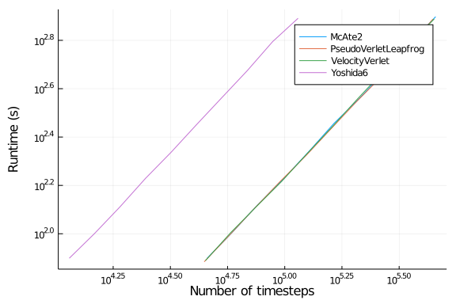
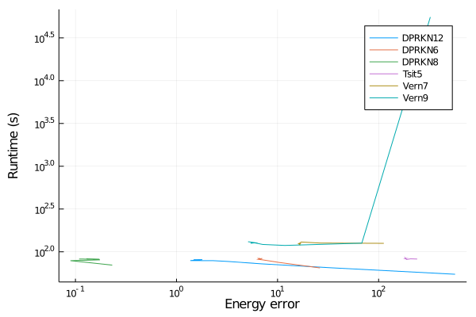
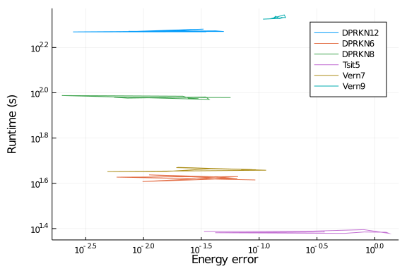
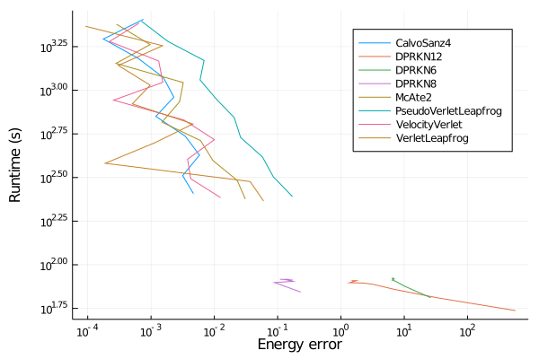

The purpose of these benchmarks is to compare several integrators for use in
molecular dynamics simulation. We will use a simulation of liquid argon form the
examples of NBodySimulator as test case.

````julia
using ProgressLogging
using NBodySimulator, OrdinaryDiffEq, StaticArrays
using Plots, DataFrames, StatsPlots

function setup(t)
    T = 120.0 # K
    kb = 1.38e-23 # J/K
    ϵ = T * kb # J
    σ = 3.4e-10 # m
    ρ = 1374 # kg/m^3
    m = 39.95 * 1.6747 * 1e-27 # kg
    N = 350
    L = (m*N/ρ)^(1/3)
    R = 3.5σ
    v_dev = sqrt(kb * T / m) # m/s

    _L = L / σ
    _σ = 1.0
    _ϵ = 1.0
    _m = 1.0
    _v = v_dev / sqrt(ϵ / m)
    _R = R / σ

    bodies = generate_bodies_in_cell_nodes(N, _m, _v, _L)
    lj_parameters = LennardJonesParameters(_ϵ, _σ, _R)
    pbc = CubicPeriodicBoundaryConditions(_L)
    lj_system = PotentialNBodySystem(bodies, Dict(:lennard_jones => lj_parameters));
    simulation = NBodySimulation(lj_system, (0.0, t), pbc, _ϵ/T)

    return simulation
end
````


````
setup (generic function with 1 method)
````


In order to compare different integrating methods we will consider a fixed simulation
time and change the timestep (or tolerances in the case of adaptive methods).
````julia
function benchmark(energyerr, rts, bytes, allocs, nt, nf, t, configs)
    simulation = setup(t)
    prob = SecondOrderODEProblem(simulation)
    for config in configs
        alg = config.alg
        sol, rt, b, gc, memalloc = @timed solve(prob, alg();
            save_everystep=false, progress=true, progress_name="$alg", config...)
        result = NBodySimulator.SimulationResult(sol, simulation)
        ΔE = total_energy(result, t) - total_energy(result, 0)
        energyerr[alg] = ΔE
        rts[alg] = rt
        bytes[alg] = b
        allocs[alg] = memalloc
        nt[alg] = sol.destats.naccept
        nf[alg] = sol.destats.nf + sol.destats.nf2
    end
end

function run_benchmark!(results, t, integrators, tol...; c=ones(length(integrators)))
    @progress "Benchmark at t=$t" for τ in zip(tol...)
        runtime = Dict()
        ΔE = Dict()
        nt = Dict()
        nf = Dict()
        b = Dict()
        allocs = Dict()
        cfg = config(integrators, c, τ...)

        GC.gc()
        benchmark(ΔE, runtime, b, allocs, nt, nf, t, cfg)
        get_tol(idx) = haskey(cfg[idx], :dt) ? cfg[idx].dt : (cfg[idx].abstol, cfg[idx].rtol)

        for (idx,i) in enumerate(integrators)
            push!(results, [string(i), runtime[i], get_tol(idx)..., abs(ΔE[i]), nt[i], nf[i], c[idx]])
        end
    end
    return results
end
````


````
run_benchmark! (generic function with 1 method)
````


We will consider symplectic integrators first
````julia
symplectic_integrators = [
    VelocityVerlet,
    VerletLeapfrog,
    PseudoVerletLeapfrog,
    McAte2,
    CalvoSanz4,
    McAte5,
    Yoshida6,
    KahanLi8,
    SofSpa10
];
````


Since for each method there is a different cost for a timestep, we need to take that
into account when choosing the tolerances (`dt`s or `abstol`&`reltol`) for the 
solvers. This cost was estimated using the commented code below and the
results were hardcoded in order to prevent fluctuations in the results
between runs due to differences in callibration times.

The calibration is based on running a simulation with equal tolerances for all
solvers and then computing the cost as the runtime / number of timesteps.
The absolute value of the cost is not very relevant, so the cost was normalized
to the cost of one `VelocityVerlet` step.
````julia
config(integrators, c, τ) = [ (alg=a, dt=τ*cₐ) for (a,cₐ) in zip(integrators, c)]

t = 35.0
τs = 1e-3

# warmup
c_symplectic = ones(length(symplectic_integrators))
benchmark(Dict(), Dict(), Dict(), Dict(), Dict(), Dict(), 10.,
    config(symplectic_integrators, c_symplectic, τs))

# results = DataFrame(:integrator=>String[], :runtime=>Float64[], :τ=>Float64[],
#     :EnergyError=>Float64[], :timesteps=>Int[], :f_evals=>Int[], :cost=>Float64[]);
# run_benchmark!(results, t, symplectic_integrators, τs)

# c_symplectic .= results[!, :runtime] ./ results[!, :timesteps]
# c_Verlet = c_symplectic[1]
# c_symplectic /= c_Verlet

c_symplectic = [
    1.00,   # VelocityVerlet
    1.05,   # VerletLeapfrog
    0.98,   # PseudoVerletLeapfrog
    1.02,   # McAte2
    2.38,   # CalvoSanz4
    2.92,   # McAte5
    3.74,   # Yoshida6
    8.44,   # KahanLi8
    15.76   # SofSpa10
]
````


````
9-element Array{Float64,1}:
  1.0
  1.05
  0.98
  1.02
  2.38
  2.92
  3.74
  8.44
 15.76
````


Let us now benchmark the solvers for a fixed simulation time and variable timestep
````julia
t = 40.0
τs = 10 .^range(-4, -3, length=10)

results = DataFrame(:integrator=>String[], :runtime=>Float64[], :τ=>Float64[],
    :EnergyError=>Float64[], :timesteps=>Int[], :f_evals=>Int[], :cost=>Float64[]);
run_benchmark!(results, t, symplectic_integrators, τs, c=c_symplectic)
````


````
90×7 DataFrame. Omitted printing of 2 columns
│ Row │ integrator           │ runtime │ τ        │ EnergyError │ timesteps
 │
│     │ String               │ Float64 │ Float64  │ Float64     │ Int64    
 │
├─────┼──────────────────────┼─────────┼──────────┼─────────────┼──────────
─┤
│ 1   │ VelocityVerlet       │ 2622.12 │ 0.0001   │ 0.000645418 │ 400000   
 │
│ 2   │ VerletLeapfrog       │ 2712.61 │ 0.000105 │ 9.19241e-5  │ 380953   
 │
│ 3   │ PseudoVerletLeapfrog │ 2893.71 │ 9.8e-5   │ 0.000707672 │ 408164   
 │
│ 4   │ McAte2               │ 2787.94 │ 0.000102 │ 0.000284938 │ 392157   
 │
│ 5   │ CalvoSanz4           │ 2968.49 │ 0.000238 │ 0.00075854  │ 168068   
 │
│ 6   │ McAte5               │ 2909.46 │ 0.000292 │ 0.00028132  │ 136987   
 │
│ 7   │ Yoshida6             │ 3033.24 │ 0.000374 │ 0.00351961  │ 106952   
 │
⋮
│ 83  │ VerletLeapfrog       │ 269.556 │ 0.00105  │ 0.0599366   │ 38096    
 │
│ 84  │ PseudoVerletLeapfrog │ 286.269 │ 0.00098  │ 0.171365    │ 40817    
 │
│ 85  │ McAte2               │ 277.655 │ 0.00102  │ 0.0308871   │ 39216    
 │
│ 86  │ CalvoSanz4           │ 298.283 │ 0.00238  │ 0.00468181  │ 16807    
 │
│ 87  │ McAte5               │ 287.913 │ 0.00292  │ 0.00849251  │ 13699    
 │
│ 88  │ Yoshida6             │ 303.586 │ 0.00374  │ 0.0128785   │ 10696    
 │
│ 89  │ KahanLi8             │ 280.787 │ 0.00844  │ 0.0382047   │ 4740     
 │
│ 90  │ SofSpa10             │ 322.134 │ 0.01576  │ 0.27519     │ 2539     
 │
````


The energy error as a function of runtime is given by
````julia
@df results plot(:EnergyError, :runtime, group=:integrator,
    xscale=:log10, yscale=:log10, xlabel="Energy error", ylabel="Runtime (s)")
````


Looking at the runtime as a function of timesteps, we can observe that we have
a linear dependency for each method, and the slope is the previously computed
cost per step.
````julia
@df results plot(:timesteps, :runtime, group=:integrator,
    xscale=:log10, yscale=:log10, xlabel="Number of timesteps", ylabel="Runtime (s)")
````


We can also look at the energy error history
````julia
function benchmark(energyerr, rts, ts, t, configs)
    simulation = setup(t)
    prob = SecondOrderODEProblem(simulation)
    for config in configs
        alg = config.alg
        sol, rt = @timed solve(prob, alg(); progress=true, progress_name="$alg", config...)
        result = NBodySimulator.SimulationResult(sol, simulation)
        ΔE(t) = total_energy(result, t) - total_energy(result, 0)
        energyerr[alg] = [ΔE(t) for t in sol.t[2:10^2:end]]
        rts[alg] = rt
        ts[alg] = sol.t[2:10^2:end]
    end
end

ΔE = Dict()
rt = Dict()
ts = Dict()
configs = config(symplectic_integrators, c_symplectic, 2.3e-4)
benchmark(ΔE, rt, ts, 40., configs)

plt = plot(xlabel="Rescaled Time", ylabel="Energy error", legend=:bottomleft);
for c in configs
    plot!(plt, ts[c.alg], abs.(ΔE[c.alg]), label="$(c.alg), $(rt[c.alg])s")
end
plt
````





Now, let us compare some adaptive methods
````julia
adaptive_integrators=[
    # Non-stiff ODE methods
    Tsit5,
    Vern7,
    Vern9,
    # DPRKN
    DPRKN6,
    DPRKN8,
    DPRKN12,
];
````


Similarly to the case of symplectic methods, we will take into account the average cost per timestep
in order to have a fair comparison between the solvers.
````julia
config(integrators, c, at, rt) = [ (alg=a, abstol=at*2^cₐ, rtol=rt*2^cₐ) for (a,cₐ) in zip(integrators, c)]

t = 35.0
ats = 10 .^range(-14, -4, length=10)
rts = 10 .^range(-14, -4, length=10)

# warmup
c_adaptive = ones(length(adaptive_integrators))
benchmark(Dict(), Dict(), Dict(), Dict(), Dict(), Dict(), 10.,
    config(adaptive_integrators, 1, ats[1], rts[1]))

# results = DataFrame(:integrator=>String[], :runtime=>Float64[], :abstol=>Float64[],
#    :reltol=>Float64[], :EnergyError=>Float64[], :timesteps=>Int[], :f_evals=>Int[], :cost=>Float64[]);
# run_benchmark!(results, t, adaptive_integrators, ats[1], rts[1])

# c_adaptive .= results[!, :runtime] ./ results[!, :timesteps]
# c_adaptive /= c_Verlet

c_adaptive = [
    3.55,   # Tsit5,
    7.84,   # Vern7,
    11.38,  # Vern9
    3.56,   # DPRKN6,
    5.10,   # DPRKN8,
    8.85    # DPRKN12,
]
````


````
6-element Array{Float64,1}:
  3.55
  7.84
 11.38
  3.56
  5.1
  8.85
````


Let us now benchmark the solvers for a fixed simulation time and variable timestep
````julia
t = 40.0

results = DataFrame(:integrator=>String[], :runtime=>Float64[], :abstol=>Float64[],
    :reltol=>Float64[], :EnergyError=>Float64[], :timesteps=>Int[], :f_evals=>Int[], :cost=>Float64[]);
run_benchmark!(results, t, adaptive_integrators, ats, rts, c=c_adaptive)
````


````
60×8 DataFrame. Omitted printing of 3 columns
│ Row │ integrator │ runtime │ abstol      │ reltol      │ EnergyError │
│     │ String     │ Float64 │ Float64     │ Float64     │ Float64     │
├─────┼────────────┼─────────┼─────────────┼─────────────┼─────────────┤
│ 1   │ Tsit5      │ 83.4534 │ 1.17127e-13 │ 1.17127e-13 │ 184.414     │
│ 2   │ Vern7      │ 124.856 │ 2.29126e-12 │ 2.29126e-12 │ 17.0536     │
│ 3   │ Vern9      │ 131.209 │ 2.66515e-11 │ 2.66515e-11 │ 5.10738     │
│ 4   │ DPRKN6     │ 82.9938 │ 1.17942e-13 │ 1.17942e-13 │ 6.45146     │
│ 5   │ DPRKN8     │ 82.39   │ 3.42968e-13 │ 3.42968e-13 │ 0.108784    │
│ 6   │ DPRKN12    │ 80.5247 │ 4.6144e-12  │ 4.6144e-12  │ 1.67223     │
│ 7   │ Tsit5      │ 83.4695 │ 1.51275e-12 │ 1.51275e-12 │ 185.398     │
⋮
│ 53  │ DPRKN8     │ 78.7429 │ 0.000265547 │ 0.000265547 │ 0.0892482   │
│ 54  │ DPRKN12    │ 65.0849 │ 0.00357276  │ 0.00357276  │ 33.5284     │
│ 55  │ Tsit5      │ 82.3122 │ 0.00117127  │ 0.00117127  │ 240.828     │
│ 56  │ Vern7      │ 125.619 │ 0.0229126   │ 0.0229126   │ 112.556     │
│ 57  │ Vern9      │ 55388.9 │ 0.266515    │ 0.266515    │ 324.881     │
│ 58  │ DPRKN6     │ 64.8178 │ 0.00117942  │ 0.00117942  │ 26.2489     │
│ 59  │ DPRKN8     │ 69.8775 │ 0.00342968  │ 0.00342968  │ 0.231174    │
│ 60  │ DPRKN12    │ 54.6507 │ 0.046144    │ 0.046144    │ 571.101     │
````


The energy error as a function of runtime is given by
````julia
@df results plot(:EnergyError, :runtime, group=:integrator,
    xscale=:log10, yscale=:log10, xlabel="Energy error", ylabel="Runtime (s)")
````





If we consider the number of function evaluations instead, we obtain
````julia
@df results plot(:EnergyError, :f_evals, group=:integrator,
    xscale=:log10, yscale=:log10, xlabel="Energy error", ylabel="Number of f evals")
````





We will now compare the best performing solvers
````julia
t = 40.0

symplectic_integrators = [
    VelocityVerlet,
    VerletLeapfrog,
    PseudoVerletLeapfrog,
    McAte2,
    CalvoSanz4
]

c_symplectic = [
    1.00,   # VelocityVerlet
    1.05,   # VerletLeapfrog
    0.98,   # PseudoVerletLeapfrog
    1.02,   # McAte2
    2.38,   # CalvoSanz4
]

results1 = DataFrame(:integrator=>String[], :runtime=>Float64[], :τ=>Float64[],
    :EnergyError=>Float64[], :timesteps=>Int[], :f_evals=>Int[], :cost=>Float64[]);
run_benchmark!(results1, t, symplectic_integrators, τs, c=c_symplectic)

adaptive_integrators=[
    DPRKN6,
    DPRKN8,
    DPRKN12,
]

c_adaptive = [
    3.56,   # DPRKN6,
    5.10,   # DPRKN8,
    8.85    # DPRKN12,
]

results2 = DataFrame(:integrator=>String[], :runtime=>Float64[], :abstol=>Float64[],
    :reltol=>Float64[], :EnergyError=>Float64[], :timesteps=>Int[], :f_evals=>Int[], :cost=>Float64[]);
run_benchmark!(results2, t, adaptive_integrators, ats, rts, c=c_adaptive)

append!(results1, results2, cols=:union)
results1
````


````
80×9 DataFrame. Omitted printing of 4 columns
│ Row │ integrator           │ runtime │ τ           │ EnergyError │ timest
eps │
│     │ String               │ Float64 │ Float64?    │ Float64     │ Int64 
    │
├─────┼──────────────────────┼─────────┼─────────────┼─────────────┼───────
────┤
│ 1   │ VelocityVerlet       │ 2425.8  │ 0.0001      │ 0.000645418 │ 400000
    │
│ 2   │ VerletLeapfrog       │ 2328.32 │ 0.000105    │ 9.19241e-5  │ 380953
    │
│ 3   │ PseudoVerletLeapfrog │ 2485.56 │ 9.8e-5      │ 0.000707672 │ 408164
    │
│ 4   │ McAte2               │ 2389.99 │ 0.000102    │ 0.000284938 │ 392157
    │
│ 5   │ CalvoSanz4           │ 2549.75 │ 0.000238    │ 0.00075854  │ 168068
    │
│ 6   │ VelocityVerlet       │ 1903.63 │ 0.000129155 │ 0.000220459 │ 309706
    │
│ 7   │ VerletLeapfrog       │ 1800.22 │ 0.000135613 │ 0.00151847  │ 294958
    │
⋮
│ 73  │ DPRKN8               │ 80.3047 │ missing     │ 0.17482     │ 2875  
    │
│ 74  │ DPRKN12              │ 72.2393 │ missing     │ 6.97224     │ 1378  
    │
│ 75  │ DPRKN6               │ 75.209  │ missing     │ 10.2122     │ 4087  
    │
│ 76  │ DPRKN8               │ 79.1033 │ missing     │ 0.0892482   │ 2765  
    │
│ 77  │ DPRKN12              │ 64.6068 │ missing     │ 33.5284     │ 1210  
    │
│ 78  │ DPRKN6               │ 64.757  │ missing     │ 26.2489     │ 3523  
    │
│ 79  │ DPRKN8               │ 69.7529 │ missing     │ 0.231174    │ 2408  
    │
│ 80  │ DPRKN12              │ 54.625  │ missing     │ 571.101     │ 998   
    │
````


The energy error as a function of runtime is given by
````julia
@df results1 plot(:EnergyError, :runtime, group=:integrator,
    xscale=:log10, yscale=:log10, xlabel="Energy error", ylabel="Runtime (s)")
````



