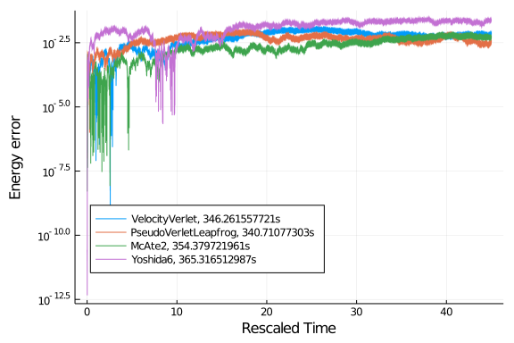
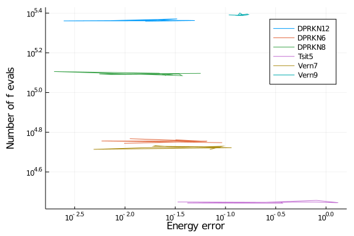

The purpose of these benchmarks is to compare several integrators for use in
molecular dynamics simulation. We will use a simulation of liquid argon form the
examples of NBodySimulator as test case.

````julia
using ProgressLogging
using NBodySimulator, OrdinaryDiffEq, StaticArrays
using Plots, DataFrames, StatsPlots

function setup(t)
    T = 120.0 # K
    kb = 1.38e-23 # J/K
    ϵ = T * kb # J
    σ = 3.4e-10 # m
    ρ = 1374 # kg/m^3
    m = 39.95 * 1.6747 * 1e-27 # kg
    N = 216
    L = (m*N/ρ)^(1/3)
    R = 2.25σ
    v_dev = sqrt(kb * T / m) # m/s

    _L = L / σ
    _σ = 1.0
    _ϵ = 1.0
    _m = 1.0
    _v = v_dev / sqrt(ϵ / m)
    _R = R / σ

    bodies = generate_bodies_in_cell_nodes(N, _m, _v, _L)
    lj_parameters = LennardJonesParameters(_ϵ, _σ, _R)
    pbc = CubicPeriodicBoundaryConditions(_L)
    lj_system = PotentialNBodySystem(bodies, Dict(:lennard_jones => lj_parameters));
    simulation = NBodySimulation(lj_system, (0.0, t), pbc, _ϵ/T)

    return simulation
end
````


````
setup (generic function with 1 method)
````


In order to compare different integrating methods we will consider a fixed simulation
time and change the timestep (or tolerances in the case of adaptive methods).
````julia
function benchmark(energyerr, rts, bytes, allocs, nt, nf, t, configs)
    simulation = setup(t)
    prob = SecondOrderODEProblem(simulation)
    for config in configs
        alg = config.alg
        sol, rt, b, gc, memalloc = @timed solve(prob, alg();
            save_everystep=false, progress=true, progress_name="$alg", config...)
        result = NBodySimulator.SimulationResult(sol, simulation)
        ΔE = total_energy(result, t) - total_energy(result, 0)
        energyerr[alg] = ΔE
        rts[alg] = rt
        bytes[alg] = b
        allocs[alg] = memalloc
        nt[alg] = sol.destats.naccept
        nf[alg] = sol.destats.nf + sol.destats.nf2
    end
end

function run_benchmark!(results, t, integrators, tol...; c=ones(length(integrators)))
    @progress "Benchmark at t=$t" for τ in zip(tol...)
        runtime = Dict()
        ΔE = Dict()
        nt = Dict()
        nf = Dict()
        b = Dict()
        allocs = Dict()
        cfg = config(integrators, c, τ...)

        GC.gc()
        benchmark(ΔE, runtime, b, allocs, nt, nf, t, cfg)
        get_tol(idx) = haskey(cfg[idx], :dt) ? cfg[idx].dt : (cfg[idx].abstol, cfg[idx].rtol)

        for (idx,i) in enumerate(integrators)
            push!(results, [string(i), runtime[i], get_tol(idx)..., abs(ΔE[i]), nt[i], nf[i], c[idx]])
        end
    end
    return results
end
````


````
run_benchmark! (generic function with 1 method)
````


We will consider symplectic integrators first
````julia
symplectic_integrators = [
    VelocityVerlet,
    #VerletLeapfrog,
    PseudoVerletLeapfrog,
    McAte2,
    #CalvoSanz4,
    #McAte5,
    Yoshida6,
    #KahanLi8,
    #SofSpa10
]
````


````
4-element Array{DataType,1}:
 VelocityVerlet
 PseudoVerletLeapfrog
 McAte2
 Yoshida6
````


Let us run a short simulation to see the cost per timestep for each method
````julia
config(integrators, c, τ) = [ (alg=a, dt=τ*cₐ) for (a,cₐ) in zip(integrators, c)]

t = 35.0
τs = 1e-3

# warmup
c_symplectic = ones(length(symplectic_integrators))
benchmark(Dict(), Dict(), Dict(), Dict(), Dict(), Dict(), 10.,
    config(symplectic_integrators, c_symplectic, τs))

results = DataFrame(:integrator=>String[], :runtime=>Float64[], :τ=>Float64[],
    :EnergyError=>Float64[], :timesteps=>Int[], :f_evals=>Int[], :cost=>Float64[]);
run_benchmark!(results, t, symplectic_integrators, τs)
````


````
4×7 DataFrames.DataFrame. Omitted printing of 2 columns
│ Row │ integrator           │ runtime │ τ       │ EnergyError │ timesteps 
│
│     │ String               │ Float64 │ Float64 │ Float64     │ Int64     
│
├─────┼──────────────────────┼─────────┼─────────┼─────────────┼───────────
┤
│ 1   │ VelocityVerlet       │ 58.1512 │ 0.001   │ 0.00366562  │ 35000     
│
│ 2   │ PseudoVerletLeapfrog │ 58.8717 │ 0.001   │ 0.0208884   │ 35000     
│
│ 3   │ McAte2               │ 57.3065 │ 0.001   │ 0.00980374  │ 35000     
│
│ 4   │ Yoshida6             │ 228.918 │ 0.001   │ 0.0219439   │ 35000     
│
````


The cost of a timestep can be computed as follows
````julia
c_symplectic .= results[!, :runtime] ./ results[!, :timesteps]
c_Verlet = c_symplectic[1]
c_symplectic /= c_Verlet
````


````
4-element Array{Float64,1}:
 1.0
 1.012391248919348
 0.9854741975822158
 3.936606069619667
````


were we have normalized the cost to the cost of a VelocityVerlet step.

Let us now benchmark the solvers for a fixed simulation time and variable timestep
````julia
t = 45.0
τs = 10 .^range(-4, -3, length=10)

results = DataFrame(:integrator=>String[], :runtime=>Float64[], :τ=>Float64[],
    :EnergyError=>Float64[], :timesteps=>Int[], :f_evals=>Int[], :cost=>Float64[]);
run_benchmark!(results, t, symplectic_integrators, τs, c=c_symplectic)
````


````
40×7 DataFrames.DataFrame. Omitted printing of 2 columns
│ Row │ integrator           │ runtime │ τ           │ EnergyError │ timest
eps │
│     │ String               │ Float64 │ Float64     │ Float64     │ Int64 
    │
├─────┼──────────────────────┼─────────┼─────────────┼─────────────┼───────
────┤
│ 1   │ VelocityVerlet       │ 773.397 │ 0.0001      │ 0.00205374  │ 450000
    │
│ 2   │ PseudoVerletLeapfrog │ 772.599 │ 0.000101239 │ 0.00266262  │ 444493
    │
│ 3   │ McAte2               │ 790.225 │ 9.85474e-5  │ 0.00328235  │ 456633
    │
│ 4   │ Yoshida6             │ 778.436 │ 0.000393661 │ 0.0136337   │ 114312
    │
│ 5   │ VelocityVerlet       │ 604.369 │ 0.000129155 │ 0.00346887  │ 348419
    │
│ 6   │ PseudoVerletLeapfrog │ 586.506 │ 0.000130755 │ 0.00162399  │ 344155
    │
│ 7   │ McAte2               │ 613.689 │ 0.000127279 │ 0.00302804  │ 353555
    │
⋮
│ 33  │ VelocityVerlet       │ 101.217 │ 0.000774264 │ 0.0220466   │ 58120 
    │
│ 34  │ PseudoVerletLeapfrog │ 98.7997 │ 0.000783858 │ 0.0164391   │ 57409 
    │
│ 35  │ McAte2               │ 101.356 │ 0.000763017 │ 0.000976878 │ 58977 
    │
│ 36  │ Yoshida6             │ 100.372 │ 0.00304797  │ 0.01532     │ 14764 
    │
│ 37  │ VelocityVerlet       │ 77.4316 │ 0.001       │ 0.0128268   │ 45001 
    │
│ 38  │ PseudoVerletLeapfrog │ 76.5698 │ 0.00101239  │ 0.0344694   │ 44450 
    │
│ 39  │ McAte2               │ 78.9868 │ 0.000985474 │ 0.0124466   │ 45664 
    │
│ 40  │ Yoshida6             │ 79.184  │ 0.00393661  │ 0.11556     │ 11432 
    │
````


The energy error as a function of runtime is given by
````julia
@df results plot(:EnergyError, :runtime, group=:integrator,
    xscale=:log10, yscale=:log10, xlabel="Energy error", ylabel="Runtime (s)")
````


Looking at the runtime as a function of timesteps, we can observe that we have
a linear dependency for each method, and the slope is the previously computed
cost per step.
````julia
@df results plot(:timesteps, :runtime, group=:integrator,
    xscale=:log10, yscale=:log10, xlabel="Number of timesteps", ylabel="Runtime (s)")
````


We can also consider a longer simulation time
````julia
t = 100.0

τs = 10 .^range(-4, -3, length=5)

results = DataFrame(:integrator=>String[], :runtime=>Float64[], :τ=>Float64[],
    :EnergyError=>Float64[], :timesteps=>Int[], :f_evals=>Int[], :cost=>Float64[]);
#run_benchmark!(results, t, symplectic_integrators, τs, c=c_symplectic)
````


The energy error as a function of runtime is given by
````julia
#@df results plot(:EnergyError, :runtime, group=:integrator,
#    xscale=:log10, yscale=:log10, xlabel="Energy error", ylabel="Runtime (s)")
````


We can also look at the energy error history
````julia
function benchmark(energyerr, rts, ts, t, configs)
    simulation = setup(t)
    prob = SecondOrderODEProblem(simulation)
    for config in configs
        alg = config.alg
        sol, rt = @timed solve(prob, alg(); progress=true, progress_name="$alg", config...)
        result = NBodySimulator.SimulationResult(sol, simulation)
        ΔE(t) = total_energy(result, t) - total_energy(result, 0)
        energyerr[alg] = [ΔE(t) for t in sol.t[2:end]]
        rts[alg] = rt
        ts[alg] = sol.t[2:end]
    end
end

ΔE = Dict()
rt = Dict()
ts = Dict()
configs = config(symplectic_integrators, c_symplectic, 2.3e-4)
benchmark(ΔE, rt, ts, 45., configs)

plt = plot(xlabel="Rescaled Time", ylabel="Energy error", legend=:bottomleft);
for c in configs
    plot!(plt, ts[c.alg], abs.(ΔE[c.alg]), label="$(c.alg), $(rt[c.alg])s", yscale=:log10)
end
plt
````





Now, let us compare some adaptive methods
````julia
adaptive_integrators=[
    # DPRKN
    DPRKN6,
    DPRKN8,
    DPRKN12,
    # others
    Tsit5,
    Vern7,
    Vern9
]

config(integrators, c, at, rt) = [ (alg=a, abstol=at, rtol=rt) for a in integrators]

t = 45.0
ats = 10 .^range(-20, -14, length=10)
rts = 10 .^range(-20, -14, length=10)

# warmup
benchmark(Dict(), Dict(), Dict(), Dict(), Dict(), Dict(), 10.,
    config(adaptive_integrators, 1, ats[1], rts[1]))

results = DataFrame(:integrator=>String[], :runtime=>Float64[], :abstol=>Float64[],
    :reltol=>Float64[], :EnergyError=>Float64[], :timesteps=>Int[], :f_evals=>Int[], :cost=>Float64[]);
run_benchmark!(results, t, adaptive_integrators, ats, rts)
````


````
60×8 DataFrames.DataFrame. Omitted printing of 3 columns
│ Row │ integrator │ runtime │ abstol      │ reltol      │ EnergyError │
│     │ String     │ Float64 │ Float64     │ Float64     │ Float64     │
├─────┼────────────┼─────────┼─────────────┼─────────────┼─────────────┤
│ 1   │ DPRKN6     │ 42.5139 │ 1.0e-20     │ 1.0e-20     │ 0.0442165   │
│ 2   │ DPRKN8     │ 95.2682 │ 1.0e-20     │ 1.0e-20     │ 0.0566201   │
│ 3   │ DPRKN12    │ 186.978 │ 1.0e-20     │ 1.0e-20     │ 0.00742181  │
│ 4   │ Tsit5      │ 24.3788 │ 1.0e-20     │ 1.0e-20     │ 0.0333757   │
│ 5   │ Vern7      │ 45.8176 │ 1.0e-20     │ 1.0e-20     │ 0.0862839   │
│ 6   │ Vern9      │ 211.552 │ 1.0e-20     │ 1.0e-20     │ 0.107903    │
│ 7   │ DPRKN6     │ 43.3857 │ 4.64159e-20 │ 4.64159e-20 │ 0.0111699   │
⋮
│ 53  │ Vern7      │ 45.7234 │ 2.15443e-15 │ 2.15443e-15 │ 0.0936371   │
│ 54  │ Vern9      │ 215.027 │ 2.15443e-15 │ 2.15443e-15 │ 0.169246    │
│ 55  │ DPRKN6     │ 41.2059 │ 1.0e-14     │ 1.0e-14     │ 0.0926044   │
│ 56  │ DPRKN8     │ 94.1863 │ 1.0e-14     │ 1.0e-14     │ 0.029884    │
│ 57  │ DPRKN12    │ 188.17  │ 1.0e-14     │ 1.0e-14     │ 0.0207755   │
│ 58  │ Tsit5      │ 24.3304 │ 1.0e-14     │ 1.0e-14     │ 0.356908    │
│ 59  │ Vern7      │ 45.5549 │ 1.0e-14     │ 1.0e-14     │ 0.0698518   │
│ 60  │ Vern9      │ 215.125 │ 1.0e-14     │ 1.0e-14     │ 0.153606    │
````


The energy error as a function of runtime is given by
````julia
@df results plot(:EnergyError, :runtime, group=:integrator,
    xscale=:log10, yscale=:log10, xlabel="Energy error", ylabel="Runtime (s)")
````


If we consider the number of function evaluations instead, we obtain
````julia
@df results plot(:EnergyError, :f_evals, group=:integrator,
    xscale=:log10, yscale=:log10, xlabel="Energy error", ylabel="Number of f evals")
````





We can also consider a longer simulation time
````julia
t = 100.0

ats = 10 .^range(-20, -14, length=10)
rts = 10 .^range(-20, -14, length=10)

results = DataFrame(:integrator=>String[], :runtime=>Float64[], :abstol=>Float64[],
    :reltol=>Float64[], :EnergyError=>Float64[], :timesteps=>Int[], :f_evals=>Int[], :cost=>Float64[]);
#run_benchmark!(results, t, integrators, ats, rts)
````


The energy error as a function of runtime is given by
````julia
#@df results plot(:EnergyError, :runtime, group=:integrator,
#    xscale=:log10, yscale=:log10, xlabel="Energy error", ylabel="Runtime (s)")
````


