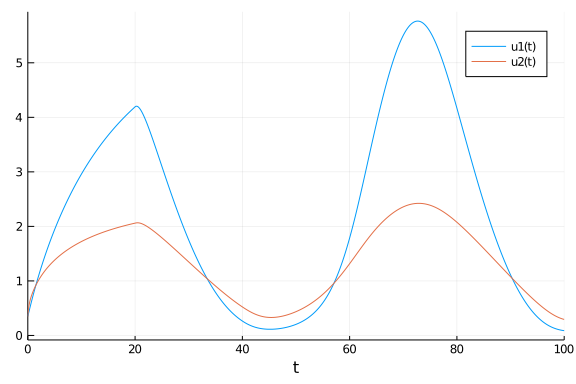
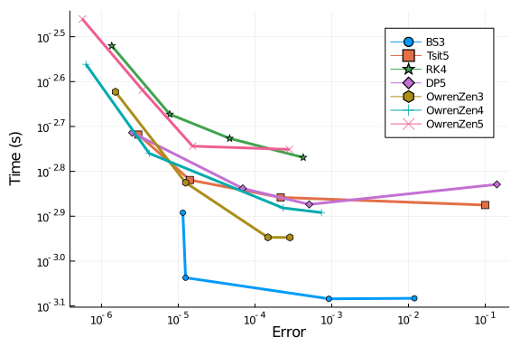
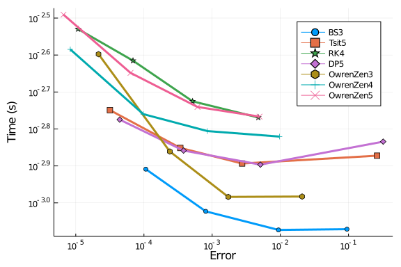
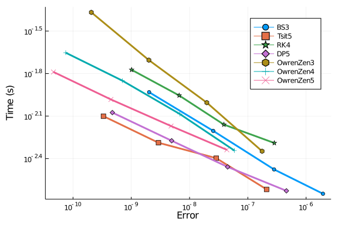
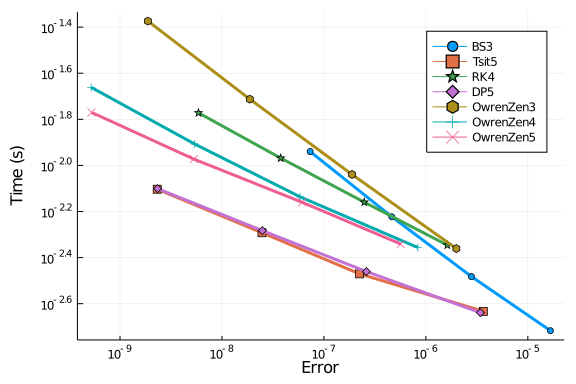
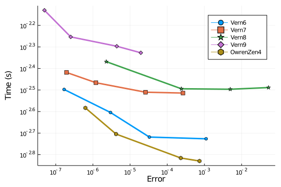
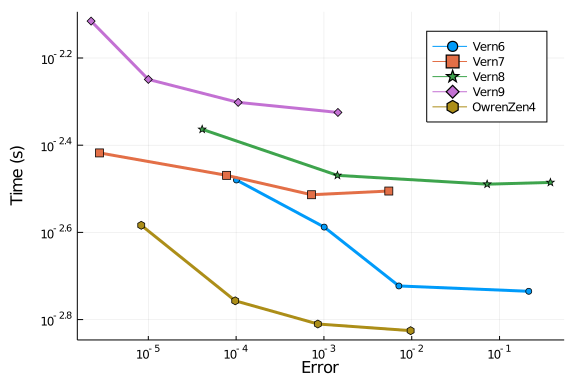
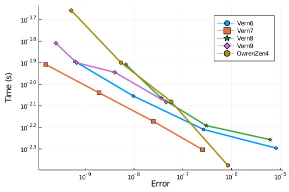

# Wheldon, Kirk, and Finlay

We study algorithms for solving constant delay differential equations with a test problem from W.H. Enright and H. Hayashi, "The evaluation of numerical software for delay differential equations", 1997. It is a model of chronic granulocytic leukemia that was published by T. Wheldon, J. Kirk and H. Finlay in "Cyclical granulopoiesis in chronic granulocytic leukemia: A simulation study", 1974, and is given by
```math
\begin{align}
y_1'(t) &= \frac{1.1}{1 + \sqrt{10}y_1(t-20)^{5/4}} - \frac{10y_1(t)}{1 + 40y_2(t)} \\
y_2'(t) &= \frac{100y_1(t)}{1 + 40y_2(t)} - 2.43y_2(t)
\end{align}
```

````julia
using DelayDiffEq, DiffEqDevTools, DiffEqProblemLibrary, Plots
using DiffEqProblemLibrary.DDEProblemLibrary: importddeproblems; importddeproblems()
import DiffEqProblemLibrary.DDEProblemLibrary: prob_dde_wheldon
gr()

sol = solve(prob_dde_wheldon, MethodOfSteps(Vern9(); fpsolve = NLFunctional(; max_iter = 1000)); reltol=1e-14, abstol=1e-14)
test_sol = TestSolution(sol)
plot(sol)
````





## Low order RK methods

### High tolerances

First we compare final errors of solutions with low order RK methods at high tolerances.

````julia
abstols = 1.0 ./ 10.0 .^ (4:7)
reltols = 1.0 ./ 10.0 .^ (1:4)

setups = [Dict(:alg=>MethodOfSteps(BS3())),
          Dict(:alg=>MethodOfSteps(Tsit5())),
          Dict(:alg=>MethodOfSteps(RK4())),
          Dict(:alg=>MethodOfSteps(DP5())),
          Dict(:alg=>MethodOfSteps(OwrenZen3())),
          Dict(:alg=>MethodOfSteps(OwrenZen4())),
          Dict(:alg=>MethodOfSteps(OwrenZen5()))]
names = ["BS3", "Tsit5", "RK4", "DP5", "OwrenZen3", "OwrenZen4", "OwrenZen5"]
wp = WorkPrecisionSet(prob_dde_wheldon,abstols,reltols,setups;names=names,
                      appxsol=test_sol,maxiters=Int(1e5),error_estimate=:final)
plot(wp)
````





Next we test interpolation errors:

````julia
abstols = 1.0 ./ 10.0 .^ (4:7)
reltols = 1.0 ./ 10.0 .^ (1:4)

setups = [Dict(:alg=>MethodOfSteps(BS3())),
          Dict(:alg=>MethodOfSteps(Tsit5())),
          Dict(:alg=>MethodOfSteps(RK4())),
          Dict(:alg=>MethodOfSteps(DP5())),
          Dict(:alg=>MethodOfSteps(OwrenZen3())),
          Dict(:alg=>MethodOfSteps(OwrenZen4())),
          Dict(:alg=>MethodOfSteps(OwrenZen5()))]
names = ["BS3", "Tsit5", "RK4", "DP5", "OwrenZen3", "OwrenZen4", "OwrenZen5"]
wp = WorkPrecisionSet(prob_dde_wheldon,abstols,reltols,setups;names=names,
                      appxsol=test_sol,maxiters=Int(1e5),error_estimate=:L2)
plot(wp)
````





Both interpolation tests and tests of final error show similar results. `BS3` does quite well but only `OwrenZen4`, `OwrenZen5`, and `RK4` achieve interpolation errors of about 1e-5.

### Low tolerances

We repeat our tests at low tolerances.

````julia
abstols = 1.0 ./ 10.0 .^ (8:11)
reltols = 1.0 ./ 10.0 .^ (5:8)

setups = [Dict(:alg=>MethodOfSteps(BS3())),
          Dict(:alg=>MethodOfSteps(Tsit5())),
          Dict(:alg=>MethodOfSteps(RK4())),
          Dict(:alg=>MethodOfSteps(DP5())),
          Dict(:alg=>MethodOfSteps(OwrenZen3())),
          Dict(:alg=>MethodOfSteps(OwrenZen4())),
          Dict(:alg=>MethodOfSteps(OwrenZen5()))]
names = ["BS3", "Tsit5", "RK4", "DP5", "OwrenZen3", "OwrenZen4", "OwrenZen5"]
wp = WorkPrecisionSet(prob_dde_wheldon,abstols,reltols,setups;names=names,
                      appxsol=test_sol,maxiters=Int(1e5),error_estimate=:final)
plot(wp)
````




````julia
abstols = 1.0 ./ 10.0 .^ (8:11)
reltols = 1.0 ./ 10.0 .^ (5:8)

setups = [Dict(:alg=>MethodOfSteps(BS3())),
          Dict(:alg=>MethodOfSteps(Tsit5())),
          Dict(:alg=>MethodOfSteps(RK4())),
          Dict(:alg=>MethodOfSteps(DP5())),
          Dict(:alg=>MethodOfSteps(OwrenZen3())),
          Dict(:alg=>MethodOfSteps(OwrenZen4())),
          Dict(:alg=>MethodOfSteps(OwrenZen5()))]
names = ["BS3", "Tsit5", "RK4", "DP5", "OwrenZen3", "OwrenZen4", "OwrenZen5"]
wp = WorkPrecisionSet(prob_dde_wheldon,abstols,reltols,setups;names=names,
                      appxsol=test_sol,maxiters=Int(1e5),error_estimate=:L2)
plot(wp)
````





Out of the compared methods, `Tsit5`, `DP5`, and `OwrenZen5` seem to be the best methods for this problem at low tolerances, but also `OwrenZen4` performs similarly well. `OwrenZen5` and `OwrenZen4` can even achieve interpolation errors below 1e-9.

## Lazy interpolants

### High tolerances

We compare the Verner methods, which use lazy interpolants, at high tolerances. As reference we include `OwrenZen4`.

````julia
abstols = 1.0 ./ 10.0 .^ (4:7)
reltols = 1.0 ./ 10.0 .^ (1:4)

setups = [Dict(:alg=>MethodOfSteps(Vern6())),
          Dict(:alg=>MethodOfSteps(Vern7())),
          Dict(:alg=>MethodOfSteps(Vern8())),
          Dict(:alg=>MethodOfSteps(Vern9())),
          Dict(:alg=>MethodOfSteps(OwrenZen4()))]
names = ["Vern6", "Vern7", "Vern8", "Vern9", "OwrenZen4"]
wp = WorkPrecisionSet(prob_dde_wheldon,abstols,reltols,setups;names=names,
                      appxsol=test_sol,maxiters=Int(1e5),error_estimate=:final)
plot(wp)
````




````julia
abstols = 1.0 ./ 10.0 .^ (4:7)
reltols = 1.0 ./ 10.0 .^ (1:4)

setups = [Dict(:alg=>MethodOfSteps(Vern6())),
          Dict(:alg=>MethodOfSteps(Vern7())),
          Dict(:alg=>MethodOfSteps(Vern8())),
          Dict(:alg=>MethodOfSteps(Vern9())),
          Dict(:alg=>MethodOfSteps(OwrenZen4()))]
names = ["Vern6", "Vern7", "Vern8", "Vern9", "OwrenZen4"]
wp = WorkPrecisionSet(prob_dde_wheldon,abstols,reltols,setups;names=names,
                      appxsol=test_sol,maxiters=Int(1e5),error_estimate=:L2)
plot(wp)
````





### Low tolerances

We repeat these tests and compare the Verner methods also at low tolerances.

````julia
abstols = 1.0 ./ 10.0 .^ (8:11)
reltols = 1.0 ./ 10.0 .^ (5:8)

setups = [Dict(:alg=>MethodOfSteps(Vern6())),
          Dict(:alg=>MethodOfSteps(Vern7())),
          Dict(:alg=>MethodOfSteps(Vern8())),
          Dict(:alg=>MethodOfSteps(Vern9())),
          Dict(:alg=>MethodOfSteps(OwrenZen4()))]
names = ["Vern6", "Vern7", "Vern8", "Vern9", "OwrenZen4"]
wp = WorkPrecisionSet(prob_dde_wheldon,abstols,reltols,setups;names=names,
                      appxsol=test_sol,maxiters=Int(1e5),error_estimate=:final)
plot(wp)
````


````julia
abstols = 1.0 ./ 10.0 .^ (8:11)
reltols = 1.0 ./ 10.0 .^ (5:8)

setups = [Dict(:alg=>MethodOfSteps(Vern6())),
          Dict(:alg=>MethodOfSteps(Vern7())),
          Dict(:alg=>MethodOfSteps(Vern8())),
          Dict(:alg=>MethodOfSteps(Vern9())),
          Dict(:alg=>MethodOfSteps(OwrenZen4()))]
names = ["Vern6", "Vern7", "Vern8", "Vern9", "OwrenZen4"]
wp = WorkPrecisionSet(prob_dde_wheldon,abstols,reltols,setups;names=names,
                      appxsol=test_sol,maxiters=Int(1e5),error_estimate=:L2)
plot(wp)
````





It seems `Vern6` and `Vern7` are both well suited for the problem at low tolerances and outperform `OwrenZen4`, whereas at high tolerances `OwrenZen4` is more efficient.

````julia
using DiffEqBenchmarks
DiffEqBenchmarks.bench_footer(WEAVE_ARGS[:folder],WEAVE_ARGS[:file])
````


## Appendix

These benchmarks are a part of the DiffEqBenchmarks.jl repository, found at: [https://github.com/JuliaDiffEq/DiffEqBenchmarks.jl](https://github.com/JuliaDiffEq/DiffEqBenchmarks.jl)

To locally run this tutorial, do the following commands:

```
using DiffEqBenchmarks
DiffEqBenchmarks.weave_file("NonStiffDDE","Wheldon_Kirk_Finlay_wpd.jmd")
```

Computer Information:

```
Julia Version 1.4.2
Commit 44fa15b150* (2020-05-23 18:35 UTC)
Platform Info:
  OS: Linux (x86_64-pc-linux-gnu)
  CPU: Intel(R) Core(TM) i7-9700K CPU @ 3.60GHz
  WORD_SIZE: 64
  LIBM: libopenlibm
  LLVM: libLLVM-8.0.1 (ORCJIT, skylake)
Environment:
  JULIA_DEPOT_PATH = /builds/JuliaGPU/DiffEqBenchmarks.jl/.julia
  JULIA_CUDA_MEMORY_LIMIT = 2147483648
  JULIA_PROJECT = @.
  JULIA_NUM_THREADS = 8

```

Package Information:

```
Status: `/builds/JuliaGPU/DiffEqBenchmarks.jl/benchmarks/NonStiffDDE/Project.toml`
[bcd4f6db-9728-5f36-b5f7-82caef46ccdb] DelayDiffEq 5.24.1
[f3b72e0c-5b89-59e1-b016-84e28bfd966d] DiffEqDevTools 2.22.0
[a077e3f3-b75c-5d7f-a0c6-6bc4c8ec64a9] DiffEqProblemLibrary 4.8.0
[91a5bcdd-55d7-5caf-9e0b-520d859cae80] Plots 1.5.3
```

