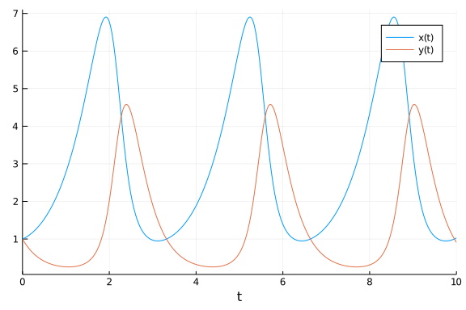
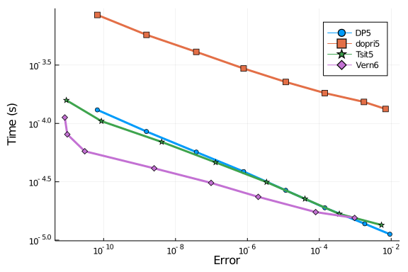
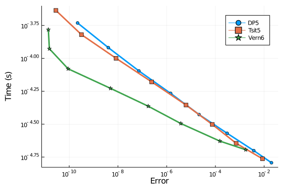
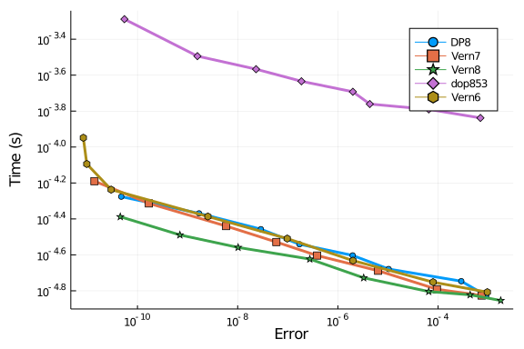
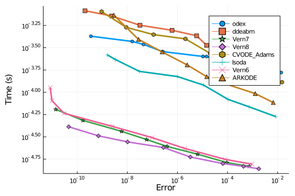
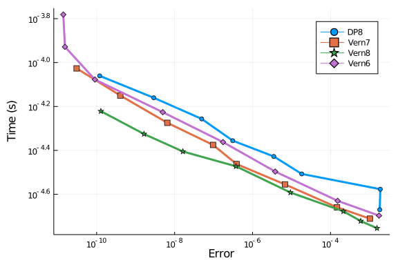
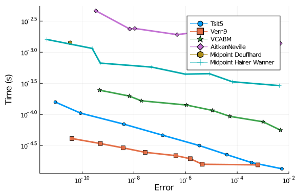
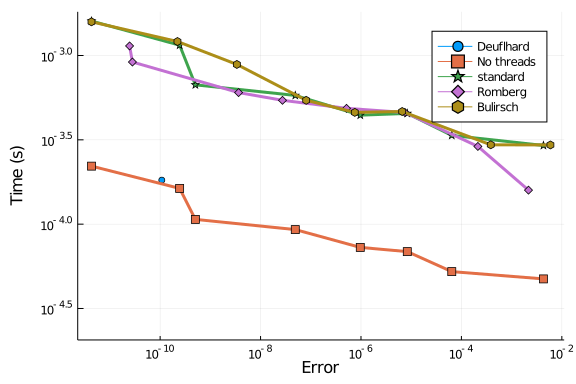
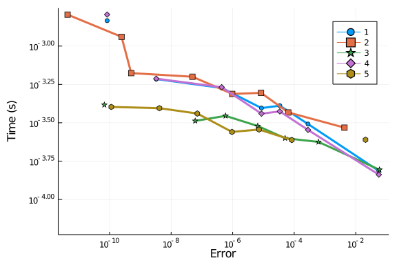

## Lotka-Volterra

The purpose of this problem is to test the performance on easy problems. Since it's periodic, the error is naturally low, and so most of the difference will come down to startup times and, when measuring the interpolations, the algorithm choices.

````julia
using OrdinaryDiffEq, ParameterizedFunctions, ODE, ODEInterfaceDiffEq, LSODA,
      Sundials, DiffEqDevTools

f = @ode_def LotkaVolterra begin
  dx = a*x - b*x*y
  dy = -c*y + d*x*y
end a b c d

p = [1.5,1.0,3.0,1.0]
prob = ODEProblem(f,[1.0;1.0],(0.0,10.0),p)

abstols = 1.0 ./ 10.0 .^ (6:13)
reltols = 1.0 ./ 10.0 .^ (3:10);
sol = solve(prob,Vern7(),abstol=1/10^14,reltol=1/10^14)
test_sol = TestSolution(sol)
using Plots; gr()
````


````
Plots.GRBackend()
````


````julia
plot(sol)
````





### Low Order

````julia
setups = [Dict(:alg=>DP5())
          #Dict(:alg=>ode45()) # fail
          Dict(:alg=>dopri5())
          Dict(:alg=>Tsit5())
          Dict(:alg=>Vern6())
]
wp = WorkPrecisionSet(prob,abstols,reltols,setups;appxsol=test_sol,save_everystep=false,maxiters=10000,numruns=100)
plot(wp)
````





Here we see the OrdinaryDiffEq.jl algorithms once again far in the lead.

### Interpolation Error

Since the problem is periodic, the real measure of error is the error throughout the solution.

````julia
setups = [Dict(:alg=>DP5())
          #Dict(:alg=>ode45())
          Dict(:alg=>Tsit5())
          Dict(:alg=>Vern6())
]
wp = WorkPrecisionSet(prob,abstols,reltols,setups;appxsol=test_sol,maxiters=10000,error_estimate=:L2,dense_errors=true,numruns=100)
plot(wp)
````





Here we see the power of algorithm specific interpolations. The ODE.jl algorithm is only able to reach $10^{-7}$ error even at a tolerance of $10^{-13}$, while the DifferentialEquations.jl algorithms are below $10^{-10}$

## Higher Order

````julia
setups = [Dict(:alg=>DP8())
          #Dict(:alg=>ode78()) # fails
          Dict(:alg=>Vern7())
          Dict(:alg=>Vern8())
          Dict(:alg=>dop853())
          Dict(:alg=>Vern6())
]
wp = WorkPrecisionSet(prob,abstols,reltols,setups;appxsol=test_sol,save_everystep=false,maxiters=1000,numruns=100)
plot(wp)
````




````julia
setups = [Dict(:alg=>odex())
          Dict(:alg=>ddeabm())
          Dict(:alg=>Vern7())
          Dict(:alg=>Vern8())
          Dict(:alg=>CVODE_Adams())
          Dict(:alg=>lsoda())
          Dict(:alg=>Vern6())
          Dict(:alg=>ARKODE(Sundials.Explicit(),order=6))
          ]
wp = WorkPrecisionSet(prob,abstols,reltols,setups;appxsol=test_sol,save_everystep=false,maxiters=1000,numruns=100)
plot(wp)
````





Again we look at interpolations:

````julia
setups = [Dict(:alg=>DP8())
          #Dict(:alg=>ode78())
          Dict(:alg=>Vern7())
          Dict(:alg=>Vern8())
          Dict(:alg=>Vern6())
]
wp = WorkPrecisionSet(prob,abstols,reltols,setups;appxsol=test_sol,dense=true,maxiters=1000,error_estimate=:L2,numruns=100)
plot(wp)
````





Again, the ODE.jl algorithms suffer when measuring the interpolations due to relying on an order 3 Hermite polynomial instead of an algorithm-specific order matching interpolation which uses the timesteps.

## Comparison with Non-RK methods

Now let's test Tsit5 and Vern9 against parallel extrapolation methods and an
Adams-Bashforth-Moulton:

````julia
setups = [Dict(:alg=>Tsit5())
          Dict(:alg=>Vern9())
          Dict(:alg=>VCABM())
          Dict(:alg=>AitkenNeville(min_order=1, max_order=9, init_order=4, threading=true))
          Dict(:alg=>ExtrapolationMidpointDeuflhard(min_order=1, max_order=9, init_order=4, threading=true))
          Dict(:alg=>ExtrapolationMidpointHairerWanner(min_order=2, max_order=11, init_order=4, threading=true))]
solnames = ["Tsit5","Vern9","VCABM","AitkenNeville","Midpoint Deuflhard","Midpoint Hairer Wanner"]
wp = WorkPrecisionSet(prob,abstols,reltols,setups;appxsol=test_sol,names=solnames,
                      save_everystep=false,verbose=false,numruns=100)
plot(wp)
````




````julia
setups = [Dict(:alg=>ExtrapolationMidpointDeuflhard(min_order=1, max_order=9, init_order=9, threading=false))
          Dict(:alg=>ExtrapolationMidpointHairerWanner(min_order=2, max_order=11, init_order=4, threading=false))
          Dict(:alg=>ExtrapolationMidpointHairerWanner(min_order=2, max_order=11, init_order=4, threading=true))
          Dict(:alg=>ExtrapolationMidpointHairerWanner(min_order=2, max_order=11, init_order=4, sequence = :romberg, threading=true))
          Dict(:alg=>ExtrapolationMidpointHairerWanner(min_order=2, max_order=11, init_order=4, sequence = :bulirsch, threading=true))]
solnames = ["Deuflhard","No threads","standard","Romberg","Bulirsch"]
wp = WorkPrecisionSet(prob,abstols,reltols,setups;appxsol=test_sol,names=solnames,
                      save_everystep=false,verbose=false,numruns=100)
plot(wp)
````




````julia
setups = [Dict(:alg=>ExtrapolationMidpointHairerWanner(min_order=2, max_order=11, init_order=10, threading=true))
          Dict(:alg=>ExtrapolationMidpointHairerWanner(min_order=2, max_order=11, init_order=4, threading=true))
          Dict(:alg=>ExtrapolationMidpointHairerWanner(min_order=5, max_order=11, init_order=10, threading=true))
          Dict(:alg=>ExtrapolationMidpointHairerWanner(min_order=2, max_order=15, init_order=10, threading=true))
          Dict(:alg=>ExtrapolationMidpointHairerWanner(min_order=5, max_order=7, init_order=6, threading=true))]
solnames = ["1","2","3","4","5"]
wp = WorkPrecisionSet(prob,abstols,reltols,setups;appxsol=test_sol,names=solnames,
                      save_everystep=false,verbose=false,numruns=100)
plot(wp)
````





## Conclusion

The OrdinaryDiffEq.jl are quicker and still solve to a much higher accuracy, especially when the interpolations are involved. ODE.jl errors a lot.

````julia
using SciMLBenchmarks
SciMLBenchmarks.bench_footer(WEAVE_ARGS[:folder],WEAVE_ARGS[:file])
````


## Appendix

These benchmarks are a part of the SciMLBenchmarks.jl repository, found at: [https://github.com/SciML/SciMLBenchmarks.jl](https://github.com/SciML/SciMLBenchmarks.jl). For more information on high-performance scientific machine learning, check out the SciML Open Source Software Organization [https://sciml.ai](https://sciml.ai).

To locally run this benchmark, do the following commands:

```
using SciMLBenchmarks
SciMLBenchmarks.weave_file("NonStiffODE","LotkaVolterra_wpd.jmd")
```

Computer Information:

```
Julia Version 1.4.2
Commit 44fa15b150* (2020-05-23 18:35 UTC)
Platform Info:
  OS: Linux (x86_64-pc-linux-gnu)
  CPU: Intel(R) Core(TM) i7-9700K CPU @ 3.60GHz
  WORD_SIZE: 64
  LIBM: libopenlibm
  LLVM: libLLVM-8.0.1 (ORCJIT, skylake)
Environment:
  JULIA_LOAD_PATH = /builds/JuliaGPU/DiffEqBenchmarks.jl:
  JULIA_DEPOT_PATH = /builds/JuliaGPU/DiffEqBenchmarks.jl/.julia
  JULIA_CUDA_MEMORY_LIMIT = 2147483648
  JULIA_NUM_THREADS = 8

```

Package Information:

```
Status: `/builds/JuliaGPU/DiffEqBenchmarks.jl/benchmarks/NonStiffODE/Project.toml`
[f3b72e0c-5b89-59e1-b016-84e28bfd966d] DiffEqDevTools 2.25.0
[7f56f5a3-f504-529b-bc02-0b1fe5e64312] LSODA 0.6.2
[c030b06c-0b6d-57c2-b091-7029874bd033] ODE 2.8.0
[54ca160b-1b9f-5127-a996-1867f4bc2a2c] ODEInterface 0.4.7
[09606e27-ecf5-54fc-bb29-004bd9f985bf] ODEInterfaceDiffEq 3.7.0
[1dea7af3-3e70-54e6-95c3-0bf5283fa5ed] OrdinaryDiffEq 5.42.2
[65888b18-ceab-5e60-b2b9-181511a3b968] ParameterizedFunctions 5.4.0
[91a5bcdd-55d7-5caf-9e0b-520d859cae80] Plots 1.5.8
[c3572dad-4567-51f8-b174-8c6c989267f4] Sundials 4.2.5
[9a3f8284-a2c9-5f02-9a11-845980a1fd5c] Random 
```

