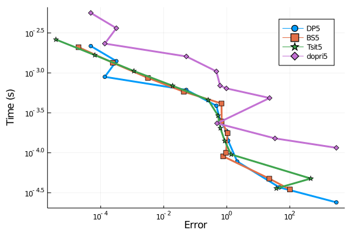
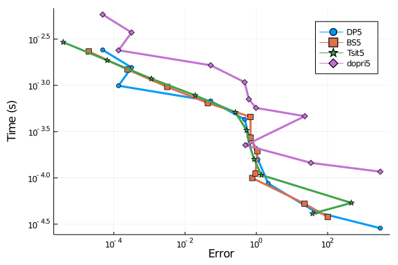
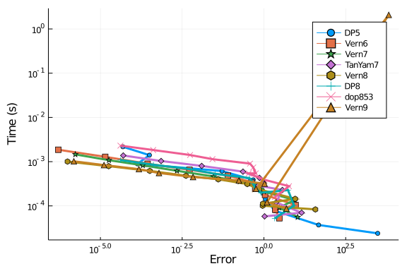
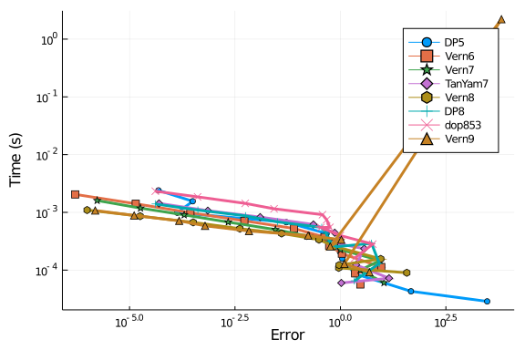
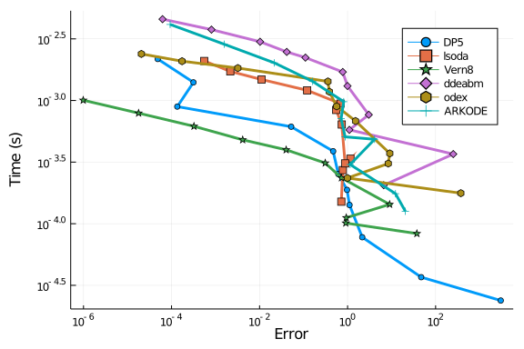
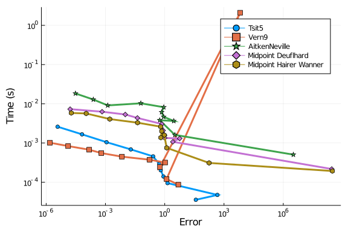
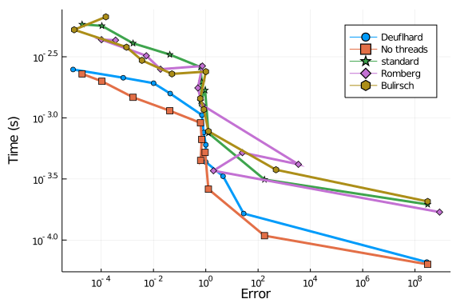
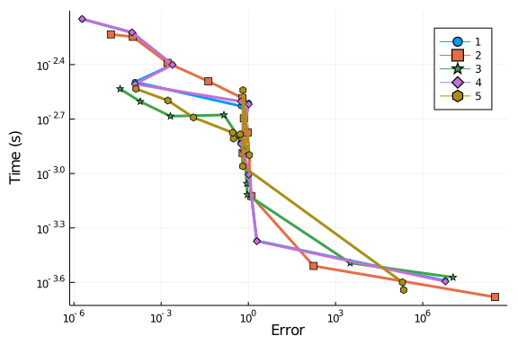

````julia
using OrdinaryDiffEq, ODE, ODEInterfaceDiffEq, LSODA, Sundials, DiffEqDevTools, Plots; gr()

## Define the ThreeBody Problem
const threebody_μ = parse(Float64,"0.012277471")
const threebody_μ′ = 1 - threebody_μ

f = (du,u,p,t) -> begin
  @inbounds begin
  # 1 = y₁
  # 2 = y₂
  # 3 = y₁'
  # 4 = y₂'
  D₁ = ((u[1]+threebody_μ)^2 + u[2]^2)^(3/2)
  D₂ = ((u[1]-threebody_μ′)^2 + u[2]^2)^(3/2)
  du[1] = u[3]
  du[2] = u[4]
  du[3] = u[1] + 2u[4] - threebody_μ′*(u[1]+threebody_μ)/D₁ - threebody_μ*(u[1]-threebody_μ′)/D₂
  du[4] = u[2] - 2u[3] - threebody_μ′*u[2]/D₁ - threebody_μ*u[2]/D₂
  end
end

t₀ = 0.0; T = parse(Float64,"17.0652165601579625588917206249")
tspan = (t₀,2T)

prob = ODEProblem(f,[0.994, 0.0, 0.0, parse(Float64,"-2.00158510637908252240537862224")],tspan)

test_sol = TestSolution(T,[prob.u0])
abstols = 1.0 ./ 10.0 .^ (3:13); reltols = 1.0 ./ 10.0 .^ (0:10);
````


````
11-element Array{Float64,1}:
 1.0
 0.1
 0.01
 0.001
 0.0001
 1.0e-5
 1.0e-6
 1.0e-7
 1.0e-8
 1.0e-9
 1.0e-10
````


See that it's periodic in the chosen timespan:

````julia
sol = solve(prob,Vern9(),abstol=1e-14,reltol=1e-14)
@show sol[1] - sol[end]
````


````
sol[1] - sol[end] = [-1.3717027513848734e-11, -4.051069631179285e-11, -6.61
1027510884044e-9, -2.1350077261672595e-9]
````


````julia
@show sol[end] - prob.u0;
````


````
sol[end] - prob.u0 = [1.3717027513848734e-11, 4.051069631179285e-11, 6.6110
27510884044e-9, 2.1350077261672595e-9]
4-element Array{Float64,1}:
 1.3717027513848734e-11
 4.051069631179285e-11
 6.611027510884044e-9
 2.1350077261672595e-9
````


````julia
apr = appxtrue(sol,test_sol)
@show sol[end]
````


````
sol[end] = [0.994000000013717, 4.051069631179285e-11, 6.611027510884044e-9,
 -2.0015851042440747]
````


````julia
@show apr.u[end]
````


````
apr.u[end] = [0.994000000013717, 4.051069631179285e-11, 6.611027510884044e-
9, -2.0015851042440747]
````


````julia
@show apr.errors
````


````
apr.errors = Dict(:final => 2.2000657402192362e-9)
Dict{Symbol,Float64} with 1 entry:
  :final => 2.20007e-9
````


This three-body problem is known to be a tough problem. Let's see how the algorithms fair at standard tolerances.

### 5th Order Runge-Kutta Methods


````julia
setups = [Dict(:alg=>DP5())
          #Dict(:alg=>ode45()) #fails
          Dict(:alg=>BS5())
          Dict(:alg=>Tsit5())
          Dict(:alg=>dopri5())];
wp = WorkPrecisionSet(prob,abstols,reltols,setups;appxsol=test_sol,save_everystep=false,numruns=100)
plot(wp)
````





#### Full save, but no dense

````julia
setups = [Dict(:alg=>DP5(),:dense=>false)
          #Dict(:alg=>ode45()) # Fails
          Dict(:alg=>BS5(),:dense=>false)
          Dict(:alg=>Tsit5(),:dense=>false)
          Dict(:alg=>dopri5())];
wp = WorkPrecisionSet(prob,abstols,reltols,setups;appxsol=test_sol,numruns=100)
plot(wp)
````


#### Dense

````julia
setups = [Dict(:alg=>DP5())
          #Dict(:alg=>ode45()) #fails
          Dict(:alg=>BS5())
          Dict(:alg=>Tsit5())
          Dict(:alg=>dopri5())];
wp = WorkPrecisionSet(prob,abstols,reltols,setups;appxsol=test_sol,numruns=100)
plot(wp)
````





In these tests we see that most of the algorithms are close,with `BS5` and `DP5` showing much better than `Tsit5`. `ode45` errors.

### Higher Order Algorithms

````julia
setups = [Dict(:alg=>DP5())
          Dict(:alg=>Vern6())
          Dict(:alg=>Vern7())
          Dict(:alg=>TanYam7())
          Dict(:alg=>Vern8())
          Dict(:alg=>DP8())
          Dict(:alg=>dop853())
          Dict(:alg=>Vern9())];
wp = WorkPrecisionSet(prob,abstols,reltols,setups;appxsol=test_sol,save_everystep=false,numruns=100)
plot(wp)
````




````julia
setups = [Dict(:alg=>DP5())
          Dict(:alg=>Vern6())
          Dict(:alg=>Vern7())
          Dict(:alg=>TanYam7())
          Dict(:alg=>Vern8())
          Dict(:alg=>DP8())
          Dict(:alg=>dop853())
          Dict(:alg=>Vern9())];
wp = WorkPrecisionSet(prob,abstols,reltols,setups;appxsol=test_sol,dense=false,numruns=100,verbose=false)
plot(wp)
````


````julia
setups = [Dict(:alg=>DP5())
          Dict(:alg=>Vern6())
          Dict(:alg=>Vern7())
          Dict(:alg=>TanYam7())
          Dict(:alg=>Vern8())
          Dict(:alg=>DP8())
          Dict(:alg=>dop853())
          Dict(:alg=>Vern9())];
wp = WorkPrecisionSet(prob,abstols,reltols,setups;appxsol=test_sol,numruns=100)
plot(wp)
````





In this test we see `Vern7` and `Vern8` shine.

### Other Algorithms

Once again we separate ODE.jl because it fails. We also separate Sundials' `CVODE_Adams` since it fails at high tolerances.

````julia
#setups = [Dict(:alg=>ode78())
#          Dict(:alg=>VCABM())
#          Dict(:alg=>CVODE_Adams())];
#wp = WorkPrecisionSet(prob,abstols,reltols,setups;appxsol=test_sol,dense=false,numruns=100)
````


````julia
setups = [Dict(:alg=>DP5())
          Dict(:alg=>lsoda())
          Dict(:alg=>Vern8())
          Dict(:alg=>ddeabm())
          Dict(:alg=>odex())
          Dict(:alg=>ARKODE(Sundials.Explicit(),order=6))
    ];
wp = WorkPrecisionSet(prob,abstols,reltols,setups;appxsol=test_sol,save_everystep=false,numruns=100)
plot(wp)
````





Again, on cheap function calculations the Adams methods are shown to not be efficient once the error is sufficiently small. Also, as seen in other places, the extrapolation methods do not fare as well as the Runge-Kutta methods.

## Comparison with Non-RK methods

Now let's test Tsit5 and Vern9 against parallel extrapolation methods and an
Adams-Bashforth-Moulton:

````julia
abstols = 1.0 ./ 10.0 .^ (3:13); reltols = 1.0 ./ 10.0 .^ (0:10);
setups = [Dict(:alg=>Tsit5())
          Dict(:alg=>Vern9())
          Dict(:alg=>AitkenNeville(min_order=1, max_order=9, init_order=4, threading=true))
          Dict(:alg=>ExtrapolationMidpointDeuflhard(min_order=1, max_order=9, init_order=4, threading=true))
          Dict(:alg=>ExtrapolationMidpointHairerWanner(min_order=2, max_order=11, init_order=4, threading=true))]
solnames = ["Tsit5","Vern9","AitkenNeville","Midpoint Deuflhard","Midpoint Hairer Wanner"]
wp = WorkPrecisionSet(prob,abstols,reltols,setups;appxsol=test_sol,names=solnames,
                      save_everystep=false,verbose=false,numruns=100)
plot(wp)
````




````julia
setups = [Dict(:alg=>ExtrapolationMidpointDeuflhard(min_order=1, max_order=9, init_order=9, threading=false))
          Dict(:alg=>ExtrapolationMidpointHairerWanner(min_order=2, max_order=11, init_order=4, threading=false))
          Dict(:alg=>ExtrapolationMidpointHairerWanner(min_order=2, max_order=11, init_order=4, threading=true))
          Dict(:alg=>ExtrapolationMidpointHairerWanner(min_order=2, max_order=11, init_order=4, sequence = :romberg, threading=true))
          Dict(:alg=>ExtrapolationMidpointHairerWanner(min_order=2, max_order=11, init_order=4, sequence = :bulirsch, threading=true))]
solnames = ["Deuflhard","No threads","standard","Romberg","Bulirsch"]
wp = WorkPrecisionSet(prob,abstols,reltols,setups;appxsol=test_sol,names=solnames,
                      save_everystep=false,verbose=false,numruns=100)
plot(wp)
````




````julia
setups = [Dict(:alg=>ExtrapolationMidpointHairerWanner(min_order=2, max_order=11, init_order=10, threading=true))
          Dict(:alg=>ExtrapolationMidpointHairerWanner(min_order=2, max_order=11, init_order=4, threading=true))
          Dict(:alg=>ExtrapolationMidpointHairerWanner(min_order=5, max_order=11, init_order=10, threading=true))
          Dict(:alg=>ExtrapolationMidpointHairerWanner(min_order=2, max_order=15, init_order=10, threading=true))
          Dict(:alg=>ExtrapolationMidpointHairerWanner(min_order=5, max_order=7, init_order=6, threading=true))]
solnames = ["1","2","3","4","5"]
wp = WorkPrecisionSet(prob,abstols,reltols,setups;appxsol=test_sol,names=solnames,
                      save_everystep=false,verbose=false,numruns=100)
plot(wp)
````





### Conclusion

As in the other tests, the OrdinaryDiffEq.jl algorithms with the Verner Efficient methods are the most efficient solvers at stringent tolerances for most of the tests, while the order 5 methods do well at cruder tolerances. ODE.jl fails to run the test problems without erroring.

````julia
using DiffEqBenchmarks
DiffEqBenchmarks.bench_footer(WEAVE_ARGS[:folder],WEAVE_ARGS[:file])
````


## Appendix

These benchmarks are a part of the DiffEqBenchmarks.jl repository, found at: [https://github.com/JuliaDiffEq/DiffEqBenchmarks.jl](https://github.com/JuliaDiffEq/DiffEqBenchmarks.jl)

To locally run this tutorial, do the following commands:

```
using DiffEqBenchmarks
DiffEqBenchmarks.weave_file("NonStiffODE","ThreeBody_wpd.jmd")
```

Computer Information:

```
Julia Version 1.4.2
Commit 44fa15b150* (2020-05-23 18:35 UTC)
Platform Info:
  OS: Linux (x86_64-pc-linux-gnu)
  CPU: Intel(R) Core(TM) i7-9700K CPU @ 3.60GHz
  WORD_SIZE: 64
  LIBM: libopenlibm
  LLVM: libLLVM-8.0.1 (ORCJIT, skylake)
Environment:
  JULIA_DEPOT_PATH = /builds/JuliaGPU/DiffEqBenchmarks.jl/.julia
  JULIA_CUDA_MEMORY_LIMIT = 2147483648
  JULIA_PROJECT = @.
  JULIA_NUM_THREADS = 8

```

Package Information:

```
Status: `/builds/JuliaGPU/DiffEqBenchmarks.jl/benchmarks/NonStiffODE/Project.toml`
[f3b72e0c-5b89-59e1-b016-84e28bfd966d] DiffEqDevTools 2.24.0
[7f56f5a3-f504-529b-bc02-0b1fe5e64312] LSODA 0.6.1
[c030b06c-0b6d-57c2-b091-7029874bd033] ODE 2.8.0
[54ca160b-1b9f-5127-a996-1867f4bc2a2c] ODEInterface 0.4.6
[09606e27-ecf5-54fc-bb29-004bd9f985bf] ODEInterfaceDiffEq 3.7.0
[1dea7af3-3e70-54e6-95c3-0bf5283fa5ed] OrdinaryDiffEq 5.41.0
[65888b18-ceab-5e60-b2b9-181511a3b968] ParameterizedFunctions 5.4.0
[91a5bcdd-55d7-5caf-9e0b-520d859cae80] Plots 1.5.5
[c3572dad-4567-51f8-b174-8c6c989267f4] Sundials 4.2.5
[9a3f8284-a2c9-5f02-9a11-845980a1fd5c] Random 
```

