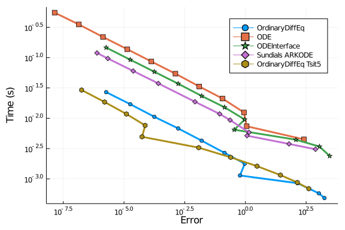
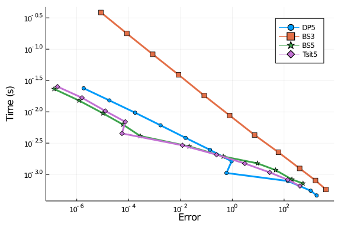
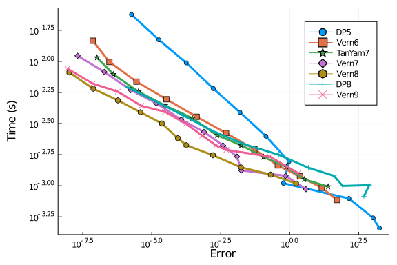
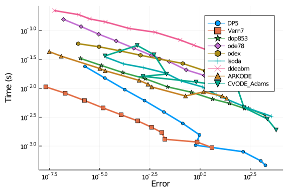
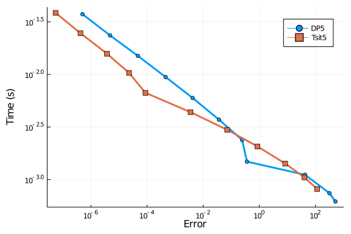
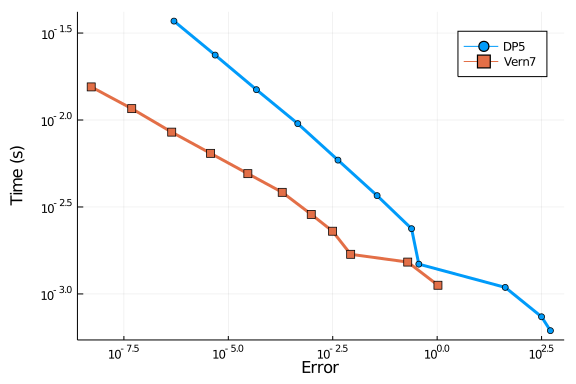
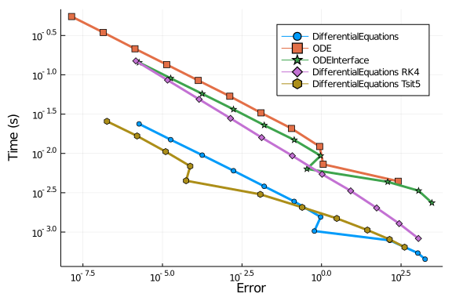
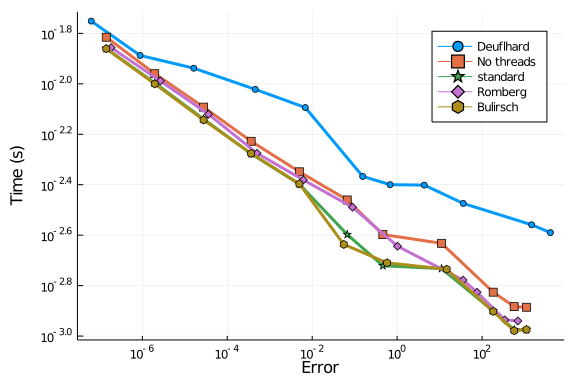
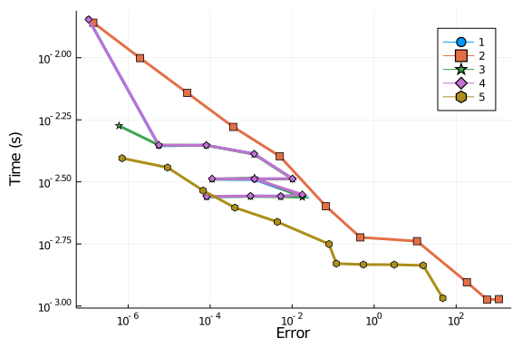

For these tests we will solve a diagonal 100 independent linear differential
equations. This will demonstrate the efficiency of the implementation of the methods
for handling large systems, since the system is both large enough that array
handling matters, but `f` is cheap enough that it is not simply a game of
calculating `f` as few times as possible. We will be mostly looking at the
efficiency of the work-horse Dormand-Prince Order 4/5 Pairs: one from
DifferentialEquations.jl (`DP5`, one from ODE.jl `rk45`, and one from
ODEInterface: Hairer's famous `dopri5`).

Also included is `Tsit5`. While all other ODE programs have gone with the
traditional choice of using the Dormand-Prince 4/5 pair as the default,
DifferentialEquations.jl uses `Tsit5` as one of the default algorithms. It's a
very new (2011) and not widely known, but the theory and the implimentation
shows it's more efficient than DP5. Thus we include it just to show off how
re-designing a library from the ground up in a language for rapid code and
rapid development has its advantages.

## Setup

````julia
using OrdinaryDiffEq, Sundials, DiffEqDevTools, Plots, ODEInterfaceDiffEq, ODE, LSODA
using Random
Random.seed!(123)
gr()
# 2D Linear ODE
function f(du,u,p,t)
  @inbounds for i in eachindex(u)
    du[i] = 1.01*u[i]
  end
end
function f_analytic(u₀,p,t)
  u₀*exp(1.01*t)
end
tspan = (0.0,10.0)
prob = ODEProblem(ODEFunction(f,analytic=f_analytic),rand(100,100),tspan)

abstols = 1.0 ./ 10.0 .^ (3:13)
reltols = 1.0 ./ 10.0 .^ (0:10);
````


````
11-element Array{Float64,1}:
 1.0
 0.1
 0.01
 0.001
 0.0001
 1.0e-5
 1.0e-6
 1.0e-7
 1.0e-8
 1.0e-9
 1.0e-10
````


### Speed Baseline

First a baseline. These are all testing the same Dormand-Prince order 5/4
algorithm of each package. While all the same Runge-Kutta tableau, they exhibit
different behavior due to different choices of adaptive timestepping algorithms
and tuning. First we will test with all extra saving features are turned off to
put DifferentialEquations.jl in "speed mode".

````julia
setups = [Dict(:alg=>DP5())
          Dict(:alg=>ode45())
          Dict(:alg=>dopri5())
          Dict(:alg=>ARKODE(Sundials.Explicit(),etable=Sundials.DORMAND_PRINCE_7_4_5))
          Dict(:alg=>Tsit5())]
solnames = ["OrdinaryDiffEq";"ODE";"ODEInterface";"Sundials ARKODE";"OrdinaryDiffEq Tsit5"]
wp = WorkPrecisionSet(prob,abstols,reltols,setups;names=solnames,save_everystep=false,numruns=100)
plot(wp)
````


OrdinaryDiffEq.jl is clearly far in the lead, being more than an order of
magnitude faster for the same amount of error.

### Full Saving

````julia
setups = [Dict(:alg=>DP5(),:dense=>false)
          Dict(:alg=>ode45(),:dense=>false)
          Dict(:alg=>dopri5()) # dense=false by default: no nonlinear interpolation
          Dict(:alg=>ARKODE(Sundials.Explicit(),etable=Sundials.DORMAND_PRINCE_7_4_5),:dense=>false)
          Dict(:alg=>Tsit5(),:dense=>false)]
solnames = ["OrdinaryDiffEq";"ODE";"ODEInterface";"Sundials ARKODE";"OrdinaryDiffEq Tsit5"]
wp = WorkPrecisionSet(prob,abstols,reltols,setups;names=solnames,numruns=100)
plot(wp)
````





While not as dramatic as before, DifferentialEquations.jl is still far in the
lead. Since the times are log scaled, this comes out to be almost a 5x lead
over ODEInterface, and about a 10x lead over ODE.jl at default tolerances.

### Continuous Output

Now we include continuous output. This has a large overhead because at every
timepoint the matrix of rates `k` has to be deep copied.

````julia
setups = [Dict(:alg=>DP5())
          Dict(:alg=>ode45())
          Dict(:alg=>dopri5())
          Dict(:alg=>ARKODE(Sundials.Explicit(),etable=Sundials.DORMAND_PRINCE_7_4_5))
          Dict(:alg=>Tsit5())]
solnames = ["OrdinaryDiffEq";"ODE";"ODEInterface";"Sundials ARKODE";"OrdinaryDiffEq Tsit5"]
wp = WorkPrecisionSet(prob,abstols,reltols,setups;names=solnames,numruns=100)
plot(wp)
````


As you can see, even with this large overhead, DifferentialEquations.jl
essentially ties with ODEInterface. This shows that the fully featured `DP5`
solver holds its own with even the classic "great" methods.

### Other Runge-Kutta Algorithms

Now let's test it against a smattering of other Runge-Kutta algorithms. First
we will test it with all overheads off. Let's do the Order 5 (and the 2/3 pair)
algorithms:

````julia
setups = [Dict(:alg=>DP5())
          Dict(:alg=>BS3())
          Dict(:alg=>BS5())
          Dict(:alg=>Tsit5())]
wp = WorkPrecisionSet(prob,abstols,reltols,setups;save_everystep=false,numruns=100)
plot(wp)
````





As you can see, the `Tsit5` algorithm is the most efficient, beating `DP5`
which is more efficient than the Bogacki-Shampine algorithms. However, you can
see that when the tolerance is high, `BS3` could be of use since its slope is
so steep.

## Higher Order

Now let's see how OrdinaryDiffEq.jl fairs with some higher order algorithms:

````julia
setups = [Dict(:alg=>DP5())
          Dict(:alg=>Vern6())
          Dict(:alg=>TanYam7())
          Dict(:alg=>Vern7())
          Dict(:alg=>Vern8())
          Dict(:alg=>DP8())
          Dict(:alg=>Vern9())]
wp = WorkPrecisionSet(prob,abstols,reltols,setups;save_everystep=false,numruns=100)
plot(wp)
````





Vern7 looks to be the winner here, with DP5 doing well at higher tolerances but
trailing of when it gets lower as one would expect with lower order algorithms.
Some of the higher order methods, such as `Vern9`, would do better at lower
tolerances than what's tested (outside of floating point range).

## Higher Order With Many Packages

Now we test OrdinaryDiffEq against the high order methods of the other packages:

````julia
setups = [Dict(:alg=>DP5())
          Dict(:alg=>Vern7())
          Dict(:alg=>dop853())
          Dict(:alg=>ode78())
          Dict(:alg=>odex())
          Dict(:alg=>lsoda())
          Dict(:alg=>ddeabm())
          Dict(:alg=>ARKODE(Sundials.Explicit(),order=8))
          Dict(:alg=>CVODE_Adams())]
wp = WorkPrecisionSet(prob,abstols,reltols,setups;save_everystep=false,numruns=100)
plot(wp)
````





Here you can once again see the DifferentialEquations algorithms far in the
lead. It's well known that for cheap function costs Adams methods are
inefficient. ODE.jl one again has a bad showing.

## Interpolation Error

Now we will look at the error using an interpolation measurement instead of at
the timestepping points. Since the DifferentialEquations.jl algorithms have
higher order interpolants than the ODE.jl algorithms, one would expect this
would magnify the difference. First the order 4/5 comparison:

````julia
setups = [Dict(:alg=>DP5())
          #Dict(:alg=>ode45())
          Dict(:alg=>Tsit5())]
wp = WorkPrecisionSet(prob,abstols,reltols,setups;error_estimate=:L2,dense_errors=true,numruns=100)
plot(wp)
````





Note that all of ODE.jl uses a 3rd order Hermite interpolation, while the
DifferentialEquations algorithms interpolations which are specialized to the
algorithm. For example, `DP5` and `Tsit5` both use "free" order 4
interpolations, which are both as fast as the Hermite interpolation while
achieving far less error. At higher order:

````julia
setups = [Dict(:alg=>DP5())
          Dict(:alg=>Vern7())
          #Dict(:alg=>ode78())
          ]
wp = WorkPrecisionSet(prob,abstols,reltols,setups;error_estimate=:L2,dense_errors=true,numruns=100)
plot(wp)
````





## Comparison with Fixed Timestep RK4

Let's run the first benchmark but add some fixed timestep RK4 methods to see
the difference:

````julia
abstols = 1.0 ./ 10.0 .^ (3:13)
reltols = 1.0 ./ 10.0 .^ (0:10);
dts = [1,1/2,1/4,1/10,1/20,1/40,1/60,1/80,1/100,1/140,1/240]
setups = [Dict(:alg=>DP5())
          Dict(:alg=>ode45())
          Dict(:alg=>dopri5())
          Dict(:alg=>RK4(),:dts=>dts)
          Dict(:alg=>Tsit5())]
solnames = ["DifferentialEquations";"ODE";"ODEInterface";"DifferentialEquations RK4";"DifferentialEquations Tsit5"]
wp = WorkPrecisionSet(prob,abstols,reltols,setups;names=solnames,
                      save_everystep=false,verbose=false,numruns=100)
plot(wp)
````





## Comparison with Non-RK methods

Now let's test Tsit5 and Vern9 against parallel extrapolation methods and an
Adams-Bashforth-Moulton:

````julia
setups = [Dict(:alg=>Tsit5())
          Dict(:alg=>Vern9())
          Dict(:alg=>VCABM())
          Dict(:alg=>AitkenNeville(min_order=1, max_order=9, init_order=4, threading=true))
          Dict(:alg=>ExtrapolationMidpointDeuflhard(min_order=1, max_order=9, init_order=4, threading=true))
          Dict(:alg=>ExtrapolationMidpointHairerWanner(min_order=2, max_order=11, init_order=4, threading=true))]
solnames = ["Tsit5","Vern9","VCABM","AitkenNeville","Midpoint Deuflhard","Midpoint Hairer Wanner"]
wp = WorkPrecisionSet(prob,abstols,reltols,setups;names=solnames,
                      save_everystep=false,verbose=false,numruns=100)
plot(wp)
````


````julia
setups = [Dict(:alg=>ExtrapolationMidpointDeuflhard(min_order=1, max_order=9, init_order=9, threading=false))
          Dict(:alg=>ExtrapolationMidpointHairerWanner(min_order=2, max_order=11, init_order=4, threading=false))
          Dict(:alg=>ExtrapolationMidpointHairerWanner(min_order=2, max_order=11, init_order=4, threading=true))
          Dict(:alg=>ExtrapolationMidpointHairerWanner(min_order=2, max_order=11, init_order=4, sequence = :romberg, threading=true))
          Dict(:alg=>ExtrapolationMidpointHairerWanner(min_order=2, max_order=11, init_order=4, sequence = :bulirsch, threading=true))]
solnames = ["Deuflhard","No threads","standard","Romberg","Bulirsch"]
wp = WorkPrecisionSet(prob,abstols,reltols,setups;names=solnames,
                      save_everystep=false,verbose=false,numruns=100)
plot(wp)
````




````julia
setups = [Dict(:alg=>ExtrapolationMidpointHairerWanner(min_order=2, max_order=11, init_order=10, threading=true))
          Dict(:alg=>ExtrapolationMidpointHairerWanner(min_order=2, max_order=11, init_order=4, threading=true))
          Dict(:alg=>ExtrapolationMidpointHairerWanner(min_order=5, max_order=11, init_order=10, threading=true))
          Dict(:alg=>ExtrapolationMidpointHairerWanner(min_order=2, max_order=15, init_order=10, threading=true))
          Dict(:alg=>ExtrapolationMidpointHairerWanner(min_order=5, max_order=7, init_order=6, threading=true))]
solnames = ["1","2","3","4","5"]
wp = WorkPrecisionSet(prob,abstols,reltols,setups;names=solnames,
                      save_everystep=false,verbose=false,numruns=100)
plot(wp)
````





## Conclusion

DifferentialEquations's default choice of `Tsit5` does well for quick and easy
solving at normal tolerances. However, at low tolerances the higher order
algorithms are faster. In every case, the DifferentialEquations algorithms are
far in the lead, many times an order of magnitude faster than the competitors.
`Vern7` with its included 7th order interpolation looks to be a good workhorse
for scientific computing in floating point range. These along with many other
benchmarks are why these algorithms were chosen as part of the defaults.

````julia
using DiffEqBenchmarks
DiffEqBenchmarks.bench_footer(WEAVE_ARGS[:folder],WEAVE_ARGS[:file])
````


## Appendix

These benchmarks are a part of the DiffEqBenchmarks.jl repository, found at: [https://github.com/JuliaDiffEq/DiffEqBenchmarks.jl](https://github.com/JuliaDiffEq/DiffEqBenchmarks.jl)

To locally run this tutorial, do the following commands:

```
using DiffEqBenchmarks
DiffEqBenchmarks.weave_file("NonStiffODE","linear_wpd.jmd")
```

Computer Information:

```
Julia Version 1.4.2
Commit 44fa15b150* (2020-05-23 18:35 UTC)
Platform Info:
  OS: Linux (x86_64-pc-linux-gnu)
  CPU: Intel(R) Core(TM) i7-9700K CPU @ 3.60GHz
  WORD_SIZE: 64
  LIBM: libopenlibm
  LLVM: libLLVM-8.0.1 (ORCJIT, skylake)
Environment:
  JULIA_DEPOT_PATH = /builds/JuliaGPU/DiffEqBenchmarks.jl/.julia
  JULIA_CUDA_MEMORY_LIMIT = 2147483648
  JULIA_PROJECT = @.
  JULIA_NUM_THREADS = 4

```

Package Information:

```
Status: `/builds/JuliaGPU/DiffEqBenchmarks.jl/benchmarks/NonStiffODE/Project.toml`
[f3b72e0c-5b89-59e1-b016-84e28bfd966d] DiffEqDevTools 2.22.0
[7f56f5a3-f504-529b-bc02-0b1fe5e64312] LSODA 0.6.1
[c030b06c-0b6d-57c2-b091-7029874bd033] ODE 2.8.0
[54ca160b-1b9f-5127-a996-1867f4bc2a2c] ODEInterface 0.4.6
[09606e27-ecf5-54fc-bb29-004bd9f985bf] ODEInterfaceDiffEq 3.7.0
[1dea7af3-3e70-54e6-95c3-0bf5283fa5ed] OrdinaryDiffEq 5.41.0
[65888b18-ceab-5e60-b2b9-181511a3b968] ParameterizedFunctions 5.3.0
[91a5bcdd-55d7-5caf-9e0b-520d859cae80] Plots 1.5.2
[c3572dad-4567-51f8-b174-8c6c989267f4] Sundials 4.2.5
[9a3f8284-a2c9-5f02-9a11-845980a1fd5c] Random 
```

