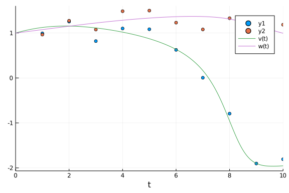

````julia
using DiffEqBayes, BenchmarkTools
````


````julia
using OrdinaryDiffEq, RecursiveArrayTools, Distributions, ParameterizedFunctions, CmdStan, DynamicHMC
using Plots
````


````julia
gr(fmt=:png)
````


````
Plots.GRBackend()
````


### Defining the problem.

The [FitzHugh-Nagumo model](https://en.wikipedia.org/wiki/FitzHugh%E2%80%93Nagumo_model) is a simplified version of [Hodgkin-Huxley model](https://en.wikipedia.org/wiki/Hodgkin%E2%80%93Huxley_model) and is used to describe an excitable system (e.g. neuron).

````julia
fitz = @ode_def FitzhughNagumo begin
  dv = v - v^3/3 -w + l
  dw = τinv*(v +  a - b*w)
end a b τinv l
````


````
(::Main.WeaveSandBox2.FitzhughNagumo{Main.WeaveSandBox2.var"###Parameterize
dDiffEqFunction#560",Main.WeaveSandBox2.var"###ParameterizedTGradFunction#5
61",Main.WeaveSandBox2.var"###ParameterizedJacobianFunction#562",Nothing,No
thing,ModelingToolkit.ODESystem}) (generic function with 1 method)
````


````julia
prob_ode_fitzhughnagumo = ODEProblem(fitz,[1.0,1.0],(0.0,10.0),[0.7,0.8,1/12.5,0.5])
sol = solve(prob_ode_fitzhughnagumo, Tsit5())
````


````
retcode: Success
Interpolation: specialized 4th order "free" interpolation
t: 14-element Array{Float64,1}:
  0.0
  0.15079562872319327
  0.6663735500745417
  1.4549121831880751
  2.6341751496828474
  3.7872864628874394
  5.149282290423124
  6.764810407399299
  7.606020974182365
  8.324334146165869
  9.040772814596577
  9.552575705603262
  9.985208121599765
 10.0
u: 14-element Array{Array{Float64,1},1}:
 [1.0, 1.0]
 [1.0242787914016627, 1.0109527801835287]
 [1.0925382825360388, 1.0495725586393927]
 [1.147894455050522, 1.1102123746508352]
 [1.134543873591793, 1.1975474781177977]
 [1.0432761941043434, 1.2718688798460578]
 [0.8446920007269357, 1.3381007267503957]
 [0.3135440377028956, 1.3689380033842313]
 [-0.4098348685955019, 1.342759540998098]
 [-1.4082544459528368, 1.2706202503513042]
 [-1.909783303000839, 1.1563318788556225]
 [-1.9618464536295719, 1.0688710996087507]
 [-1.9544223037206336, 0.9966722929830949]
 [-1.9538629866249133, 0.9942458205399927]
````


Data is genereated by adding noise to the solution obtained above.

````julia
t = collect(range(1,stop=10,length=10))
sig = 0.20
data = convert(Array, VectorOfArray([(sol(t[i]) + sig*randn(2)) for i in 1:length(t)]))
````


````
2×10 Array{Float64,2}:
 1.05636  1.45166  1.4348  1.0509   …  -0.940141  -2.01342  -1.8911
 1.09891  1.29689  1.3945  1.55263      1.40002    1.35679   0.580668
````


### Plot of the data and the solution.

````julia
scatter(t, data[1,:])
scatter!(t, data[2,:])
plot!(sol)
````





### Priors for the parameters which will be passed for the Bayesian Inference

````julia
priors = [Truncated(Normal(1.0,0.5),0,1.5),Truncated(Normal(1.0,0.5),0,1.5),Truncated(Normal(0.0,0.5),0.0,0.5),Truncated(Normal(0.5,0.5),0,1)]
````


````
4-element Array{Truncated{Normal{Float64},Continuous,Float64},1}:
 Truncated(Normal{Float64}(μ=1.0, σ=0.5), range=(0.0, 1.5))
 Truncated(Normal{Float64}(μ=1.0, σ=0.5), range=(0.0, 1.5))
 Truncated(Normal{Float64}(μ=0.0, σ=0.5), range=(0.0, 0.5))
 Truncated(Normal{Float64}(μ=0.5, σ=0.5), range=(0.0, 1.0))
````


### Benchmarks

#### Stan.jl backend

````julia
@btime bayesian_result_stan = stan_inference(prob_ode_fitzhughnagumo,t,data,priors;num_samples = 10_000,printsummary=false)
````


````
File /Users/vaibhav/DiffEqBenchmarks.jl/tmp/parameter_estimation_model.stan
 will be updated.


File /Users/vaibhav/DiffEqBenchmarks.jl/tmp/parameter_estimation_model.stan
 will be updated.


File /Users/vaibhav/DiffEqBenchmarks.jl/tmp/parameter_estimation_model.stan
 will be updated.


File /Users/vaibhav/DiffEqBenchmarks.jl/tmp/parameter_estimation_model.stan
 will be updated.

  229.837 s (1361525 allocations: 57.17 MiB)
DiffEqBayes.StanModel{Stanmodel,Int64,Array{Float64,3},Array{String,1}}(  n
ame =                    "parameter_estimation_model"
  nchains =                 1
  num_samples =             10000
  num_warmup =                1000
  thin =                    1
  monitors =                String[]
  model_file =              "parameter_estimation_model.stan"
  data_file =               "parameter_estimation_model_1.data.R"
  output =                  Output()
    file =                    "parameter_estimation_model_samples_1.csv"
    diagnostics_file =        ""
    refresh =                 100
  pdir =                   "/Users/vaibhav/DiffEqBenchmarks.jl"
  tmpdir =                 "/Users/vaibhav/DiffEqBenchmarks.jl/tmp"
  output_format =           :array
  method =                  Sample()
    num_samples =             10000
    num_warmup =              1000
    save_warmup =             false
    thin =                    1
    algorithm =               HMC()
      engine =                  NUTS()
        max_depth =               10
      metric =                  CmdStan.diag_e
      stepsize =                1.0
      stepsize_jitter =         1.0
    adapt =                   Adapt()
      gamma =                   0.05
      delta =                   0.8
      kappa =                   0.75
      t0 =                      10.0
      init_buffer =             75
      term_buffer =             50
      window =                  25
, 0, [1.05317 0.999518 … 0.086651 0.545111; 1.6859 0.995547 … 0.205829 0.88
8846; … ; 0.395335 0.991611 … 0.130002 0.506693; -0.284945 0.910905 … 0.084
5292 0.713666], ["lp__", "accept_stat__", "stepsize__", "treedepth__", "n_l
eapfrog__", "divergent__", "energy__", "sigma1.1", "sigma1.2", "theta1", "t
heta2", "theta3", "theta4", "theta.1", "theta.2", "theta.3", "theta.4"])
````


#### Turing.jl backend

````julia
@btime bayesian_result_turing = turing_inference(prob_ode_fitzhughnagumo,Tsit5(),t,data,priors;num_samples = 10_000)
````


````
75.472 s (529668345 allocations: 39.90 GiB)
Object of type Chains, with data of type 9000×17×1 Array{Float64,3}

Iterations        = 1:9000
Thinning interval = 1
Chains            = 1
Samples per chain = 9000
internals         = acceptance_rate, hamiltonian_energy, hamiltonian_energy
_error, is_accept, log_density, lp, max_hamiltonian_energy_error, n_steps, 
nom_step_size, numerical_error, step_size, tree_depth
parameters        = theta[1], theta[2], theta[3], theta[4], σ[1]

2-element Array{MCMCChains.ChainDataFrame,1}

Summary Statistics
  parameters    mean     std  naive_se    mcse        ess   r_hat
  ──────────  ──────  ──────  ────────  ──────  ─────────  ──────
    theta[1]  0.8583  0.3401    0.0036  0.0057  3384.7351  1.0000
    theta[2]  0.9228  0.2442    0.0026  0.0041  3277.0208  0.9999
    theta[3]  0.1477  0.0346    0.0004  0.0007  3174.5974  1.0004
    theta[4]  0.6994  0.0818    0.0009  0.0015  2993.9918  0.9999
        σ[1]  0.2533  0.0528    0.0006  0.0009  2939.5460  1.0000

Quantiles
  parameters    2.5%   25.0%   50.0%   75.0%   97.5%
  ──────────  ──────  ──────  ──────  ──────  ──────
    theta[1]  0.1707  0.6138  0.8764  1.1219  1.4312
    theta[2]  0.4371  0.7532  0.9293  1.1053  1.3568
    theta[3]  0.0822  0.1244  0.1469  0.1696  0.2178
    theta[4]  0.5444  0.6447  0.6971  0.7514  0.8734
        σ[1]  0.1712  0.2156  0.2460  0.2835  0.3771
````


# Conclusion

FitzHugh-Ngumo is a standard problem for parameter estimation studies. In the FitzHugh-Nagumo model the parameters to be estimated were `[0.7,0.8,0.08,0.5]`. 
`dynamichmc_inference` has issues with the model and hence was excluded from this benchmark.

````julia
using DiffEqBenchmarks
DiffEqBenchmarks.bench_footer(WEAVE_ARGS[:folder],WEAVE_ARGS[:file])
````


## Appendix

These benchmarks are a part of the DiffEqBenchmarks.jl repository, found at: [https://github.com/JuliaDiffEq/DiffEqBenchmarks.jl](https://github.com/JuliaDiffEq/DiffEqBenchmarks.jl)

To locally run this tutorial, do the following commands:

```
using DiffEqBenchmarks
DiffEqBenchmarks.weave_file("ParameterEstimation","DiffEqBayesFitzHughNagumo.jmd")
```

Computer Information:

```
Julia Version 1.4.0
Commit b8e9a9ecc6 (2020-03-21 16:36 UTC)
Platform Info:
  OS: macOS (x86_64-apple-darwin18.6.0)
  CPU: Intel(R) Core(TM) i7-6700HQ CPU @ 2.60GHz
  WORD_SIZE: 64
  LIBM: libopenlibm
  LLVM: libLLVM-8.0.1 (ORCJIT, skylake)

```

Package Information:

```
Status: `/Users/vaibhav/DiffEqBenchmarks.jl/Project.toml`
[28f2ccd6-bb30-5033-b560-165f7b14dc2f] ApproxFun 0.11.10
[a134a8b2-14d6-55f6-9291-3336d3ab0209] BlackBoxOptim 0.5.0
[a93c6f00-e57d-5684-b7b6-d8193f3e46c0] DataFrames 0.20.2
[2b5f629d-d688-5b77-993f-72d75c75574e] DiffEqBase 6.25.2
[ebbdde9d-f333-5424-9be2-dbf1e9acfb5e] DiffEqBayes 2.9.1
[eb300fae-53e8-50a0-950c-e21f52c2b7e0] DiffEqBiological 4.2.0
[f3b72e0c-5b89-59e1-b016-84e28bfd966d] DiffEqDevTools 2.18.0
[c894b116-72e5-5b58-be3c-e6d8d4ac2b12] DiffEqJump 6.5.0
[1130ab10-4a5a-5621-a13d-e4788d82bd4c] DiffEqParamEstim 1.13.0
[a077e3f3-b75c-5d7f-a0c6-6bc4c8ec64a9] DiffEqProblemLibrary 4.6.4
[ef61062a-5684-51dc-bb67-a0fcdec5c97d] DiffEqUncertainty 1.4.1
[0c46a032-eb83-5123-abaf-570d42b7fbaa] DifferentialEquations 6.12.0
[7073ff75-c697-5162-941a-fcdaad2a7d2a] IJulia 1.21.1
[7f56f5a3-f504-529b-bc02-0b1fe5e64312] LSODA 0.6.1
[76087f3c-5699-56af-9a33-bf431cd00edd] NLopt 0.5.1
[c030b06c-0b6d-57c2-b091-7029874bd033] ODE 2.6.0
[54ca160b-1b9f-5127-a996-1867f4bc2a2c] ODEInterface 0.4.6
[09606e27-ecf5-54fc-bb29-004bd9f985bf] ODEInterfaceDiffEq 3.6.0
[1dea7af3-3e70-54e6-95c3-0bf5283fa5ed] OrdinaryDiffEq 5.32.2
[2dcacdae-9679-587a-88bb-8b444fb7085b] ParallelDataTransfer 0.5.0
[65888b18-ceab-5e60-b2b9-181511a3b968] ParameterizedFunctions 5.0.3
[91a5bcdd-55d7-5caf-9e0b-520d859cae80] Plots 0.29.9
[b4db0fb7-de2a-5028-82bf-5021f5cfa881] ReactionNetworkImporters 0.1.5
[f2c3362d-daeb-58d1-803e-2bc74f2840b4] RecursiveFactorization 0.1.0
[9672c7b4-1e72-59bd-8a11-6ac3964bc41f] SteadyStateDiffEq 1.5.0
[c3572dad-4567-51f8-b174-8c6c989267f4] Sundials 3.9.0
[a759f4b9-e2f1-59dc-863e-4aeb61b1ea8f] TimerOutputs 0.5.3
[44d3d7a6-8a23-5bf8-98c5-b353f8df5ec9] Weave 0.9.4
[b77e0a4c-d291-57a0-90e8-8db25a27a240] InteractiveUtils 
[d6f4376e-aef5-505a-96c1-9c027394607a] Markdown 
[44cfe95a-1eb2-52ea-b672-e2afdf69b78f] Pkg 
[9a3f8284-a2c9-5f02-9a11-845980a1fd5c] Random 
```

