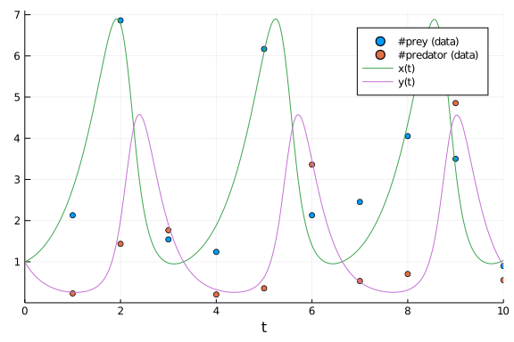

## Parameter Estimation of Lotka-Volterra Equation using DiffEqBayes.jl

````julia
using DiffEqBayes, CmdStan, DynamicHMC
````


````julia
using Distributions, BenchmarkTools
using OrdinaryDiffEq, RecursiveArrayTools, ParameterizedFunctions
using Plots
````


````julia
gr(fmt=:png)
````


````
Plots.GRBackend()
````


#### Initializing the problem

````julia
f = @ode_def LotkaVolterraTest begin
    dx = a*x - b*x*y
    dy = -c*y + d*x*y
end a b c d
````


````
(::Main.WeaveSandBox11.LotkaVolterraTest{Main.WeaveSandBox11.var"###Paramet
erizedDiffEqFunction#813",Main.WeaveSandBox11.var"###ParameterizedTGradFunc
tion#814",Main.WeaveSandBox11.var"###ParameterizedJacobianFunction#815",Not
hing,Nothing,ModelingToolkit.ODESystem}) (generic function with 1 method)
````


````julia
u0 = [1.0,1.0]
tspan = (0.0,10.0)
p = [1.5,1.0,3.0,1,0]
````


````
5-element Array{Float64,1}:
 1.5
 1.0
 3.0
 1.0
 0.0
````


````julia
prob = ODEProblem(f,u0,tspan,p)
sol = solve(prob,Tsit5())
````


````
retcode: Success
Interpolation: specialized 4th order "free" interpolation
t: 34-element Array{Float64,1}:
  0.0
  0.0776084743154256
  0.23264513699277584
  0.4291185174543143
  0.6790821776882875
  0.9444045910389707
  1.2674601253261835
  1.6192913723304114
  1.9869755337814992
  2.264090367186479
  ⋮
  7.584862904164952
  7.978068388305894
  8.483164907244102
  8.719247868929038
  8.949206527971544
  9.200184813643565
  9.438028630962807
  9.711807852444823
 10.0
u: 34-element Array{Array{Float64,1},1}:
 [1.0, 1.0]
 [1.0454942346944578, 0.8576684823217127]
 [1.1758715885138267, 0.639459570317544]
 [1.4196809607170826, 0.4569962601282084]
 [1.8767193485546056, 0.32473343696185236]
 [2.5882499852859384, 0.26336255804531]
 [3.860708771268753, 0.2794458027885767]
 [5.750812903389158, 0.5220073140479389]
 [6.814978737433837, 1.917783300239219]
 [4.3929977807914105, 4.194671536988031]
 ⋮
 [2.614252575185928, 0.26416950055716665]
 [4.2410731685818694, 0.30512345857554246]
 [6.791122470590543, 1.1345265418479897]
 [6.26537352594436, 2.741690196017545]
 [3.78076791065078, 4.431164786168439]
 [1.8164212283793362, 4.0640577258289365]
 [1.1465027088171469, 2.791172606389902]
 [0.9557986534742364, 1.6235632025270912]
 [1.03375813933372, 0.9063703701433561]
````


#### We take the solution data obtained and add noise to it to obtain data for using in the Bayesian Inference of the parameters

````julia
t = collect(range(1,stop=10,length=10))
sig = 0.49
data = convert(Array, VectorOfArray([(sol(t[i]) + sig*randn(2)) for i in 1:length(t)]))
````


````
2×10 Array{Float64,2}:
 2.0653     7.39552  0.887758   2.01946  …   3.91538   4.65516  1.37446
 0.0087957  1.94613  1.69975   -0.13011     -0.245133  4.45752  1.82766
````


#### Plots of the actual data and generated data

````julia
scatter(t, data[1,:], lab="#prey (data)")
scatter!(t, data[2,:], lab="#predator (data)")
plot!(sol)
````




````julia
priors = [Truncated(Normal(1.5,0.5),0.5,2.5),Truncated(Normal(1.2,0.5),0,2),Truncated(Normal(3.0,0.5),1,4),Truncated(Normal(1.0,0.5),0,2)]
````


````
4-element Array{Truncated{Normal{Float64},Continuous,Float64},1}:
 Truncated(Normal{Float64}(μ=1.5, σ=0.5), range=(0.5, 2.5))
 Truncated(Normal{Float64}(μ=1.2, σ=0.5), range=(0.0, 2.0))
 Truncated(Normal{Float64}(μ=3.0, σ=0.5), range=(1.0, 4.0))
 Truncated(Normal{Float64}(μ=1.0, σ=0.5), range=(0.0, 2.0))
````


### Stan.jl backend

The solution converges for tolerance values lower than 1e-3, lower tolerance leads to better accuracy in result but is accompanied by longer warmup and sampling time, truncated normal priors are used for preventing Stan from stepping into negative values.

````julia
@btime bayesian_result_stan = stan_inference(prob,t,data,priors,num_samples=10_000,printsummary=false)
````


````
File /Users/vaibhav/DiffEqBenchmarks.jl/tmp/parameter_estimation_model.stan
 will be updated.


File /Users/vaibhav/DiffEqBenchmarks.jl/tmp/parameter_estimation_model.stan
 will be updated.


File /Users/vaibhav/DiffEqBenchmarks.jl/tmp/parameter_estimation_model.stan
 will be updated.


File /Users/vaibhav/DiffEqBenchmarks.jl/tmp/parameter_estimation_model.stan
 will be updated.

  229.674 s (1361505 allocations: 56.94 MiB)
DiffEqBayes.StanModel{Stanmodel,Int64,Array{Float64,3},Array{String,1}}(  n
ame =                    "parameter_estimation_model"
  nchains =                 1
  num_samples =             10000
  num_warmup =                1000
  thin =                    1
  monitors =                String[]
  model_file =              "parameter_estimation_model.stan"
  data_file =               "parameter_estimation_model_1.data.R"
  output =                  Output()
    file =                    "parameter_estimation_model_samples_1.csv"
    diagnostics_file =        ""
    refresh =                 100
  pdir =                   "/Users/vaibhav/DiffEqBenchmarks.jl"
  tmpdir =                 "/Users/vaibhav/DiffEqBenchmarks.jl/tmp"
  output_format =           :array
  method =                  Sample()
    num_samples =             10000
    num_warmup =              1000
    save_warmup =             false
    thin =                    1
    algorithm =               HMC()
      engine =                  NUTS()
        max_depth =               10
      metric =                  CmdStan.diag_e
      stepsize =                1.0
      stepsize_jitter =         1.0
    adapt =                   Adapt()
      gamma =                   0.05
      delta =                   0.8
      kappa =                   0.75
      t0 =                      10.0
      init_buffer =             75
      term_buffer =             50
      window =                  25
, 0, [-8.52568 0.968447 … 3.30807 1.0637; -6.58667 0.944431 … 3.38828 1.022
49; … ; -5.8813 0.999428 … 2.76305 0.937836; -4.78428 0.99239 … 2.79557 0.8
68411], ["lp__", "accept_stat__", "stepsize__", "treedepth__", "n_leapfrog_
_", "divergent__", "energy__", "sigma1.1", "sigma1.2", "theta1", "theta2", 
"theta3", "theta4", "theta.1", "theta.2", "theta.3", "theta.4"])
````


### Turing.jl backend

````julia
@btime bayesian_result_turing = turing_inference(prob,Tsit5(),t,data,priors,num_samples=10_000)
````


````
41.026 s (255934573 allocations: 19.22 GiB)
Object of type Chains, with data of type 9000×17×1 Array{Float64,3}

Iterations        = 1:9000
Thinning interval = 1
Chains            = 1
Samples per chain = 9000
internals         = acceptance_rate, hamiltonian_energy, hamiltonian_energy
_error, is_accept, log_density, lp, max_hamiltonian_energy_error, n_steps, 
nom_step_size, numerical_error, step_size, tree_depth
parameters        = theta[1], theta[2], theta[3], theta[4], σ[1]

2-element Array{MCMCChains.ChainDataFrame,1}

Summary Statistics
  parameters    mean     std  naive_se    mcse        ess   r_hat
  ──────────  ──────  ──────  ────────  ──────  ─────────  ──────
    theta[1]  1.5155  0.0849    0.0009  0.0018  2142.1957  1.0008
    theta[2]  1.0794  0.1040    0.0011  0.0020  2534.7438  1.0002
    theta[3]  2.9581  0.2429    0.0026  0.0054  2151.1826  1.0010
    theta[4]  0.9549  0.0843    0.0009  0.0018  2146.1077  1.0008
        σ[1]  0.5151  0.1024    0.0011  0.0024  1960.0581  0.9999

Quantiles
  parameters    2.5%   25.0%   50.0%   75.0%   97.5%
  ──────────  ──────  ──────  ──────  ──────  ──────
    theta[1]  1.3603  1.4589  1.5098  1.5675  1.6999
    theta[2]  0.9025  1.0084  1.0695  1.1400  1.3075
    theta[3]  2.4974  2.7973  2.9534  3.1097  3.4673
    theta[4]  0.7957  0.8988  0.9527  1.0076  1.1336
        σ[1]  0.3542  0.4445  0.5012  0.5701  0.7563
````


### DynamicHMC.jl backend

````julia
@btime bayesian_result_dynamichmc = dynamichmc_inference(prob,Tsit5(),t,data,priors,num_samples=10_000)
````


````
40.471 s (190748921 allocations: 18.76 GiB)
(posterior = NamedTuple{(:parameters, :σ),Tuple{Array{Float64,1},Array{Floa
t64,1}}}[(parameters = [1.465630775843807, 1.110311741190626, 3.00120523063
12325, 0.9730604529733278], σ = [0.4544734605480289, 0.6745909222023634]), 
(parameters = [1.5232301517457223, 0.980646535742799, 2.9576784823488556, 0
.9673276813117795], σ = [0.359496981166905, 0.4445382927044592]), (paramete
rs = [1.507586341992819, 0.9934729781874589, 2.9370761936354293, 0.95381181
2544173], σ = [0.363985684041006, 0.44523594301950165]), (parameters = [1.4
975068794955848, 1.019308775482205, 2.9064996654599646, 0.962827866561914],
 σ = [0.35631054949484686, 0.44963525096555307]), (parameters = [1.50469211
57534805, 1.054531669747532, 3.0300934609418206, 0.9473532708020924], σ = [
0.4222817343052414, 0.5720140952017159]), (parameters = [1.4295141155712021
, 1.1166409959688726, 3.167287462267816, 1.0376383418715693], σ = [0.301979
57954594623, 0.5600944148234336]), (parameters = [1.3811307530673975, 0.952
9322484260171, 3.31547447194468, 1.1061557534569162], σ = [0.29756451048624
827, 0.8177382350041634]), (parameters = [1.3666738851990496, 0.93548916812
55176, 3.495993444287427, 1.0871471486615638], σ = [0.3122889009890516, 0.8
352882870657331]), (parameters = [1.4269072914289236, 0.9869216783211997, 3
.2215132524455017, 1.0299373240018783], σ = [0.30714834040350497, 0.6280305
054538521]), (parameters = [1.4156177264072696, 1.050992353405477, 3.246085
936926085, 1.0532589797307128], σ = [0.3310357263727346, 0.4632371102034147
])  …  (parameters = [1.3106129514208757, 0.9570860305999817, 3.61963965212
63745, 1.1893279246270572], σ = [0.36056090028966425, 0.587669248424538]), 
(parameters = [1.3977535365686748, 0.872613074096041, 3.361314236818876, 1.
0748293788183856], σ = [1.0300993563548055, 0.5437560909153833]), (paramete
rs = [1.354045149519009, 1.006975655497879, 3.502316490497921, 1.1915924153
704651], σ = [0.7736931775003741, 0.5494284684652101]), (parameters = [1.35
96958991133021, 0.9328987828135246, 3.390214254327624, 1.1161063064241399],
 σ = [0.5121389468526301, 0.4338656400524423]), (parameters = [1.3252698091
872472, 0.8842323853959065, 3.431014980063107, 1.1863577710062039], σ = [0.
5390381308329725, 0.523170943818369]), (parameters = [1.339105425619219, 0.
8714520389149186, 3.4221995109665846, 1.1579743446729616], σ = [0.551018170
0113963, 0.5526465394734937]), (parameters = [1.5726162323266728, 1.1801477
499772872, 2.801132385431343, 0.8966108169755335], σ = [0.27096544767530606
, 0.44474636834499887]), (parameters = [1.6336488893379324, 1.0719733004173
51, 2.6214952919570997, 0.833311931507569], σ = [0.6252249430504637, 0.4760
320003728358]), (parameters = [1.5689128046834173, 1.123497472427506, 2.803
304511963414, 0.8913552823034951], σ = [0.2568922837644632, 0.5421199877598
902]), (parameters = [1.5209687729158565, 0.986918458638253, 2.903725535350
967, 0.9309659102681898], σ = [0.41115199772077077, 0.47358012386353154])],
 chain = [[0.38228571351898116, 0.10464082381333112, 1.0990139515345234, -0
.027309068229411645, -0.7886157597031195, -0.3936488130084785], [0.42083317
986017604, -0.01954319449412447, 1.084404664110794, -0.03321797711245333, -
1.0230494991667105, -0.8107190799221317], [0.4105099229328331, -0.006548415
963617797, 1.0774145945546216, -0.04728888847655142, -1.0106407416764995, -
0.8091509282944533], [0.40380164498394994, 0.019124726477454935, 1.06694949
3058613, -0.03788063024122253, -1.031952598347128, -0.7993185783036871], [0
.4085883030224937, 0.05309675343737827, 1.1085934642408948, -0.054083213329
27276, -0.8620825708660421, -0.5585916459449055], [0.35733460721290566, 0.1
1032506822002972, 1.1528755314410677, 0.03694730579647865, -1.1973958812909
558, -0.5796499115649821], [0.322902549936162, -0.04821147079742753, 1.1986
007421876361, 0.1008907190955179, -1.2121242355326922, -0.20121299969964998
], [0.31237996688116665, -0.06668571203570241, 1.2516175825877056, 0.083556
97033098211, -1.1638265549050164, -0.17997835974678134], [0.355509368920258
36, -0.013164595968620388, 1.1698512033380604, 0.029497949906465246, -1.180
4244545985676, -0.4651665381302341], [0.34756599159731194, 0.04973481632646
047, 1.1774499434573185, 0.05188914757595264, -1.1055289747687709, -0.76951
62389130868]  …  [0.2704949296291216, -0.04386199543586595, 1.2863744772713
868, 0.17338837836026869, -1.0200944036823372, -0.5315909920268513], [0.334
8663311082705, -0.13626303548481444, 1.212332039409437, 0.07216193160444409
, 0.029655260069732327, -0.609254494958518], [0.3030965192214449, 0.0069514
38169003961, 1.2534246039942976, 0.17529057675655937, -0.2565798954824429, 
-0.5988766892895566], [0.30726107115178974, -0.06945856975020885, 1.2208931
212617609, 0.10984611607494749, -0.6691593101881326, -0.8350203779457236], 
[0.28161606828377855, -0.12303537148409655, 1.2328561299592053, 0.170887916
97866546, -0.6179689669149233, -0.6478470158966517], [0.2920017982020267, -
0.13759444833628542, 1.2302834762154202, 0.14667222404610764, -0.5959874939
457164, -0.5930366509411605], [0.45274062248987773, 0.16563964248438331, 1.
0300237587924068, -0.10913338289510133, -1.3057639655842839, -0.81025111807
94271], [0.4908160953420634, 0.0695011560113446, 0.9637448770941056, -0.182
34723931466493, -0.4696437851166588, -0.7422701993363712], [0.4503828983910
7365, 0.11644656290996933, 1.0307989041569094, -0.1150121854185143, -1.3590
984112673163, -0.6122679224125516], [0.4193474824390864, -0.013167858322938
155, 1.06599457987576, -0.07153261862874843, -0.888792308715865, -0.7474341
644865871]], tree_statistics = DynamicHMC.TreeStatisticsNUTS[DynamicHMC.Tre
eStatisticsNUTS(-26.657353431743406, 6, turning at positions -1:62, 0.99417
43571109255, 63, DynamicHMC.Directions(0x4ceb1f3e)), DynamicHMC.TreeStatist
icsNUTS(-26.14519910948132, 6, turning at positions -14:49, 0.7440894459889
473, 63, DynamicHMC.Directions(0xf5f9e731)), DynamicHMC.TreeStatisticsNUTS(
-24.03261942192681, 2, turning at positions -1:2, 0.9999999999999999, 3, Dy
namicHMC.Directions(0x54bd74ce)), DynamicHMC.TreeStatisticsNUTS(-17.4223545
1272565, 3, turning at positions -6:-9, 0.9002888521795784, 15, DynamicHMC.
Directions(0xba87fcf6)), DynamicHMC.TreeStatisticsNUTS(-18.57425436230774, 
5, turning at positions 18:49, 0.9738034668664788, 63, DynamicHMC.Direction
s(0xf01419f1)), DynamicHMC.TreeStatisticsNUTS(-18.424672629553278, 6, turni
ng at positions -56:7, 0.9989243629662449, 63, DynamicHMC.Directions(0x4dba
3987)), DynamicHMC.TreeStatisticsNUTS(-21.616317240697104, 6, turning at po
sitions -53:10, 0.9882759576963613, 63, DynamicHMC.Directions(0xa3aed94a)),
 DynamicHMC.TreeStatisticsNUTS(-19.658522503580965, 4, turning at positions
 0:15, 0.9773508969438667, 15, DynamicHMC.Directions(0x7ec365cf)), DynamicH
MC.TreeStatisticsNUTS(-18.88118042071389, 6, turning at positions -20:43, 0
.8721552273956429, 63, DynamicHMC.Directions(0xc91c66eb)), DynamicHMC.TreeS
tatisticsNUTS(-16.532742261536615, 6, turning at positions -38:25, 0.929550
8370833294, 63, DynamicHMC.Directions(0x534ef7d9))  …  DynamicHMC.TreeStati
sticsNUTS(-20.80685679290773, 6, turning at positions -43:20, 0.99177550189
76369, 63, DynamicHMC.Directions(0xce677054)), DynamicHMC.TreeStatisticsNUT
S(-28.474792162880618, 6, turning at positions -27:36, 0.908593479774359, 6
3, DynamicHMC.Directions(0x43445d24)), DynamicHMC.TreeStatisticsNUTS(-30.48
3022666901707, 5, turning at positions 51:54, 0.618632769590027, 63, Dynami
cHMC.Directions(0x8f132cf6)), DynamicHMC.TreeStatisticsNUTS(-24.84971556426
3484, 6, turning at positions -10:53, 0.8537440510209517, 63, DynamicHMC.Di
rections(0x4f556475)), DynamicHMC.TreeStatisticsNUTS(-24.971389308188456, 6
, turning at positions 101:108, 0.6197143257287082, 127, DynamicHMC.Directi
ons(0xc1aa206c)), DynamicHMC.TreeStatisticsNUTS(-21.527107216834338, 5, tur
ning at positions -8:23, 0.9675486928692766, 31, DynamicHMC.Directions(0x49
0b0377)), DynamicHMC.TreeStatisticsNUTS(-22.46111907636495, 6, turning at p
ositions -59:-122, 0.917713137930606, 127, DynamicHMC.Directions(0x787a3685
)), DynamicHMC.TreeStatisticsNUTS(-20.096243762832657, 6, turning at positi
ons -11:52, 0.8542444997092887, 63, DynamicHMC.Directions(0xa645ebf4)), Dyn
amicHMC.TreeStatisticsNUTS(-19.186953600214025, 7, turning at positions -59
:68, 0.9713405041633048, 127, DynamicHMC.Directions(0x58da4544)), DynamicHM
C.TreeStatisticsNUTS(-20.132684209181555, 6, turning at positions -17:46, 0
.9534033814755077, 63, DynamicHMC.Directions(0x1477eeae))], κ = Gaussian ki
netic energy (LinearAlgebra.Diagonal), √diag(M⁻¹): [0.059021627348001746, 0
.1053051859486219, 0.08463641347020379, 0.09064173878324551, 0.297644544743
7002, 0.29246205067061115], ϵ = 0.043953521359788285)
````


## Conclusion

Lotka-Volterra Equation is a "predator-prey" model, it models population of two species in which one is the predator (wolf) and the other is the prey (rabbit). 
It depicts a cyclic behaviour, which is also seen in its Uncertainity Quantification Plots. This behaviour makes it easy to estimate even at very high tolerance values (1e-3).


````julia
using DiffEqBenchmarks
DiffEqBenchmarks.bench_footer(WEAVE_ARGS[:folder],WEAVE_ARGS[:file])
````


## Appendix

These benchmarks are a part of the DiffEqBenchmarks.jl repository, found at: [https://github.com/JuliaDiffEq/DiffEqBenchmarks.jl](https://github.com/JuliaDiffEq/DiffEqBenchmarks.jl)

To locally run this tutorial, do the following commands:

```
using DiffEqBenchmarks
DiffEqBenchmarks.weave_file("ParameterEstimation","DiffEqBayesLotkaVolterra.jmd")
```

Computer Information:

```
Julia Version 1.4.0
Commit b8e9a9ecc6 (2020-03-21 16:36 UTC)
Platform Info:
  OS: macOS (x86_64-apple-darwin18.6.0)
  CPU: Intel(R) Core(TM) i7-6700HQ CPU @ 2.60GHz
  WORD_SIZE: 64
  LIBM: libopenlibm
  LLVM: libLLVM-8.0.1 (ORCJIT, skylake)

```

Package Information:

```
Status: `/Users/vaibhav/DiffEqBenchmarks.jl/Project.toml`
[28f2ccd6-bb30-5033-b560-165f7b14dc2f] ApproxFun 0.11.10
[a134a8b2-14d6-55f6-9291-3336d3ab0209] BlackBoxOptim 0.5.0
[a93c6f00-e57d-5684-b7b6-d8193f3e46c0] DataFrames 0.20.2
[2b5f629d-d688-5b77-993f-72d75c75574e] DiffEqBase 6.25.2
[ebbdde9d-f333-5424-9be2-dbf1e9acfb5e] DiffEqBayes 2.9.1
[eb300fae-53e8-50a0-950c-e21f52c2b7e0] DiffEqBiological 4.2.0
[f3b72e0c-5b89-59e1-b016-84e28bfd966d] DiffEqDevTools 2.18.0
[c894b116-72e5-5b58-be3c-e6d8d4ac2b12] DiffEqJump 6.5.0
[1130ab10-4a5a-5621-a13d-e4788d82bd4c] DiffEqParamEstim 1.13.0
[a077e3f3-b75c-5d7f-a0c6-6bc4c8ec64a9] DiffEqProblemLibrary 4.6.4
[ef61062a-5684-51dc-bb67-a0fcdec5c97d] DiffEqUncertainty 1.4.1
[0c46a032-eb83-5123-abaf-570d42b7fbaa] DifferentialEquations 6.12.0
[7073ff75-c697-5162-941a-fcdaad2a7d2a] IJulia 1.21.1
[7f56f5a3-f504-529b-bc02-0b1fe5e64312] LSODA 0.6.1
[76087f3c-5699-56af-9a33-bf431cd00edd] NLopt 0.5.1
[c030b06c-0b6d-57c2-b091-7029874bd033] ODE 2.6.0
[54ca160b-1b9f-5127-a996-1867f4bc2a2c] ODEInterface 0.4.6
[09606e27-ecf5-54fc-bb29-004bd9f985bf] ODEInterfaceDiffEq 3.6.0
[1dea7af3-3e70-54e6-95c3-0bf5283fa5ed] OrdinaryDiffEq 5.32.2
[2dcacdae-9679-587a-88bb-8b444fb7085b] ParallelDataTransfer 0.5.0
[65888b18-ceab-5e60-b2b9-181511a3b968] ParameterizedFunctions 5.0.3
[91a5bcdd-55d7-5caf-9e0b-520d859cae80] Plots 0.29.9
[b4db0fb7-de2a-5028-82bf-5021f5cfa881] ReactionNetworkImporters 0.1.5
[f2c3362d-daeb-58d1-803e-2bc74f2840b4] RecursiveFactorization 0.1.0
[9672c7b4-1e72-59bd-8a11-6ac3964bc41f] SteadyStateDiffEq 1.5.0
[c3572dad-4567-51f8-b174-8c6c989267f4] Sundials 3.9.0
[a759f4b9-e2f1-59dc-863e-4aeb61b1ea8f] TimerOutputs 0.5.3
[44d3d7a6-8a23-5bf8-98c5-b353f8df5ec9] Weave 0.9.4
[b77e0a4c-d291-57a0-90e8-8db25a27a240] InteractiveUtils 
[d6f4376e-aef5-505a-96c1-9c027394607a] Markdown 
[44cfe95a-1eb2-52ea-b672-e2afdf69b78f] Pkg 
[9a3f8284-a2c9-5f02-9a11-845980a1fd5c] Random 
```

