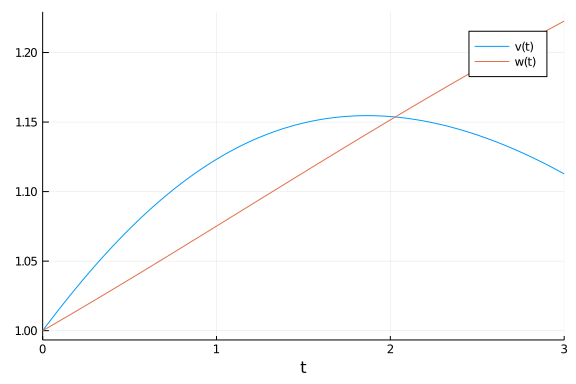
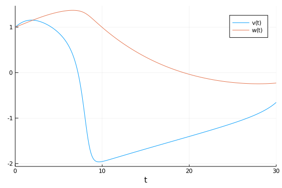

# Parameter estimation of FitzHugh-Nagumo model using optimisation methods

````julia
using ParameterizedFunctions, OrdinaryDiffEq, DiffEqParamEstim
using BlackBoxOptim, NLopt, Plots,QuadDIRECT
````


````
Error: ArgumentError: Package QuadDIRECT not found in current path:
- Run `import Pkg; Pkg.add("QuadDIRECT")` to install the QuadDIRECT package
.
````


````julia
gr(fmt=:png)
````


````
Plots.GRBackend()
````


````julia
loc_bounds = Tuple{Float64,Float64}[(0, 1), (0, 1), (0, 1), (0, 1)]
glo_bounds = Tuple{Float64,Float64}[(0, 5), (0, 5), (0, 5), (0, 5)]
loc_init = [0.5,0.5,0.5,0.5]
glo_init = [2.5,2.5,2.5,2.5]
````


````
4-element Array{Float64,1}:
 2.5
 2.5
 2.5
 2.5
````


````julia
fitz = @ode_def FitzhughNagumo begin
  dv = v - v^3/3 -w + l
  dw = τinv*(v +  a - b*w)
end a b τinv l
````


````
(::Main.##WeaveSandBox#345.FitzhughNagumo{Main.##WeaveSandBox#345.var"###Pa
rameterizedDiffEqFunction#365",Main.##WeaveSandBox#345.var"###Parameterized
TGradFunction#366",Main.##WeaveSandBox#345.var"###ParameterizedJacobianFunc
tion#367",Nothing,Nothing,ModelingToolkit.ODESystem}) (generic function wit
h 1 method)
````


````julia
p = [0.7,0.8,0.08,0.5]              # Parameters used to construct the dataset
r0 = [1.0; 1.0]                     # initial value
tspan = (0.0, 30.0)                 # sample of 3000 observations over the (0,30) timespan
prob = ODEProblem(fitz, r0, tspan,p)
tspan2 = (0.0, 3.0)                 # sample of 300 observations with a timestep of 0.01
prob_short = ODEProblem(fitz, r0, tspan2,p)
````


````
ODEProblem with uType Array{Float64,1} and tType Float64. In-place: true
timespan: (0.0, 3.0)
u0: [1.0, 1.0]
````


````julia
dt = 30.0/3000
tf = 30.0
tinterval = 0:dt:tf
t  = collect(tinterval)
````


````
3001-element Array{Float64,1}:
  0.0
  0.01
  0.02
  0.03
  0.04
  0.05
  0.06
  0.07
  0.08
  0.09
  ⋮
 29.92
 29.93
 29.94
 29.95
 29.96
 29.97
 29.98
 29.99
 30.0
````


````julia
h = 0.01
M = 300
tstart = 0.0
tstop = tstart + M * h
tinterval_short = 0:h:tstop
t_short = collect(tinterval_short)
````


````
301-element Array{Float64,1}:
 0.0
 0.01
 0.02
 0.03
 0.04
 0.05
 0.06
 0.07
 0.08
 0.09
 ⋮
 2.92
 2.93
 2.94
 2.95
 2.96
 2.97
 2.98
 2.99
 3.0
````


````julia
#Generate Data
data_sol_short = solve(prob_short,Vern9(),saveat=t_short,reltol=1e-9,abstol=1e-9)
data_short = convert(Array, data_sol_short) # This operation produces column major dataset obs as columns, equations as rows
data_sol = solve(prob,Vern9(),saveat=t,reltol=1e-9,abstol=1e-9)
data = convert(Array, data_sol)
````


````
2×3001 Array{Float64,2}:
 1.0  1.00166  1.00332  1.00497  1.00661  …  -0.65759   -0.655923  -0.65424
8
 1.0  1.00072  1.00144  1.00216  1.00289     -0.229157  -0.228976  -0.22879
3
````


#### Plot of the solution

##### Short Solution

````julia
plot(data_sol_short)
````





##### Longer Solution

````julia
plot(data_sol)
````





## Local Solution from the short data set

````julia
obj_short = build_loss_objective(prob_short,Tsit5(),L2Loss(t_short,data_short),tstops=t_short)
res1 = bboptimize(obj_short;SearchRange = glo_bounds, MaxSteps = 7e3)
````


````
Starting optimization with optimizer BlackBoxOptim.DiffEvoOpt{BlackBoxOptim
.FitPopulation{Float64},BlackBoxOptim.RadiusLimitedSelector,BlackBoxOptim.A
daptiveDiffEvoRandBin{3},BlackBoxOptim.RandomBound{BlackBoxOptim.Continuous
RectSearchSpace}}
0.00 secs, 0 evals, 0 steps
0.50 secs, 3522 evals, 3407 steps, improv/step: 0.186 (last = 0.1858), fitn
ess=0.002795515
1.00 secs, 6938 evals, 6824 steps, improv/step: 0.133 (last = 0.0799), fitn
ess=0.000023234

Optimization stopped after 7001 steps and 1.02 seconds
Termination reason: Max number of steps (7000) reached
Steps per second = 6834.82
Function evals per second = 6946.11
Improvements/step = 0.13100
Total function evaluations = 7115


Best candidate found: [0.901174, 0.829505, 0.0676869, 0.499952]

Fitness: 0.000023234
````


````julia
# Lower tolerance could lead to smaller fitness (more accuracy)
````


````julia
obj_short = build_loss_objective(prob_short,Tsit5(),L2Loss(t_short,data_short),tstops=t_short,reltol=1e-9)
res1 = bboptimize(obj_short;SearchRange = glo_bounds, MaxSteps = 7e3)
````


````
Starting optimization with optimizer BlackBoxOptim.DiffEvoOpt{BlackBoxOptim
.FitPopulation{Float64},BlackBoxOptim.RadiusLimitedSelector,BlackBoxOptim.A
daptiveDiffEvoRandBin{3},BlackBoxOptim.RandomBound{BlackBoxOptim.Continuous
RectSearchSpace}}
0.00 secs, 0 evals, 0 steps
0.50 secs, 3548 evals, 3428 steps, improv/step: 0.167 (last = 0.1669), fitn
ess=0.046213764
1.00 secs, 6979 evals, 6860 steps, improv/step: 0.154 (last = 0.1413), fitn
ess=0.000018513

Optimization stopped after 7001 steps and 1.02 seconds
Termination reason: Max number of steps (7000) reached
Steps per second = 6869.75
Function evals per second = 6986.52
Improvements/step = 0.15257
Total function evaluations = 7120


Best candidate found: [1.05207, 0.872175, 0.0620399, 0.500162]

Fitness: 0.000018513
````


````julia
# Change in tolerance makes it worse
````


````julia
obj_short = build_loss_objective(prob_short,Vern9(),L2Loss(t_short,data_short),tstops=t_short,reltol=1e-9,abstol=1e-9)
res1 = bboptimize(obj_short;SearchRange = glo_bounds, MaxSteps = 7e3)
````


````
Starting optimization with optimizer BlackBoxOptim.DiffEvoOpt{BlackBoxOptim
.FitPopulation{Float64},BlackBoxOptim.RadiusLimitedSelector,BlackBoxOptim.A
daptiveDiffEvoRandBin{3},BlackBoxOptim.RandomBound{BlackBoxOptim.Continuous
RectSearchSpace}}
0.00 secs, 0 evals, 0 steps
0.50 secs, 2348 evals, 2251 steps, improv/step: 0.214 (last = 0.2141), fitn
ess=0.019458378
1.00 secs, 4717 evals, 4621 steps, improv/step: 0.176 (last = 0.1392), fitn
ess=0.000671877
1.50 secs, 7044 evals, 6949 steps, improv/step: 0.155 (last = 0.1138), fitn
ess=0.000014348

Optimization stopped after 7001 steps and 1.51 seconds
Termination reason: Max number of steps (7000) reached
Steps per second = 4632.91
Function evals per second = 4695.77
Improvements/step = 0.15486
Total function evaluations = 7096


Best candidate found: [0.778064, 0.760284, 0.0708466, 0.499964]

Fitness: 0.000014348
````


````julia
# using the moe accurate Vern9() reduces the fitness marginally and leads to some increase in time taken
````


## Using NLopt

#### Global Optimisation

````julia
obj_short = build_loss_objective(prob_short,Vern9(),L2Loss(t_short,data_short),tstops=t_short,reltol=1e-9,abstol=1e-9)
````


````
(::DiffEqParamEstim.DiffEqObjective{DiffEqParamEstim.var"#43#48"{Nothing,Bo
ol,Int64,typeof(DiffEqParamEstim.STANDARD_PROB_GENERATOR),Base.Iterators.Pa
irs{Symbol,Any,Tuple{Symbol,Symbol,Symbol},NamedTuple{(:tstops, :reltol, :a
bstol),Tuple{Array{Float64,1},Float64,Float64}}},DiffEqBase.ODEProblem{Arra
y{Float64,1},Tuple{Float64,Float64},true,Array{Float64,1},Main.##WeaveSandB
ox#345.FitzhughNagumo{Main.##WeaveSandBox#345.var"###ParameterizedDiffEqFun
ction#365",Main.##WeaveSandBox#345.var"###ParameterizedTGradFunction#366",M
ain.##WeaveSandBox#345.var"###ParameterizedJacobianFunction#367",Nothing,No
thing,ModelingToolkit.ODESystem},Base.Iterators.Pairs{Union{},Union{},Tuple
{},NamedTuple{(),Tuple{}}},DiffEqBase.StandardODEProblem},OrdinaryDiffEq.Ve
rn9,DiffEqParamEstim.L2Loss{Array{Float64,1},Array{Float64,2},Nothing,Nothi
ng,Nothing},Nothing},DiffEqParamEstim.var"#47#53"{DiffEqParamEstim.var"#43#
48"{Nothing,Bool,Int64,typeof(DiffEqParamEstim.STANDARD_PROB_GENERATOR),Bas
e.Iterators.Pairs{Symbol,Any,Tuple{Symbol,Symbol,Symbol},NamedTuple{(:tstop
s, :reltol, :abstol),Tuple{Array{Float64,1},Float64,Float64}}},DiffEqBase.O
DEProblem{Array{Float64,1},Tuple{Float64,Float64},true,Array{Float64,1},Mai
n.##WeaveSandBox#345.FitzhughNagumo{Main.##WeaveSandBox#345.var"###Paramete
rizedDiffEqFunction#365",Main.##WeaveSandBox#345.var"###ParameterizedTGradF
unction#366",Main.##WeaveSandBox#345.var"###ParameterizedJacobianFunction#3
67",Nothing,Nothing,ModelingToolkit.ODESystem},Base.Iterators.Pairs{Union{}
,Union{},Tuple{},NamedTuple{(),Tuple{}}},DiffEqBase.StandardODEProblem},Ord
inaryDiffEq.Vern9,DiffEqParamEstim.L2Loss{Array{Float64,1},Array{Float64,2}
,Nothing,Nothing,Nothing},Nothing}}}) (generic function with 2 methods)
````


````julia
opt = Opt(:GN_ORIG_DIRECT_L, 4)
lower_bounds!(opt,[0.0,0.0,0.0,0.0])
upper_bounds!(opt,[5.0,5.0,5.0,5.0])
min_objective!(opt, obj_short.cost_function2)
xtol_rel!(opt,1e-12)
maxeval!(opt, 10000)
@time (minf,minx,ret) = NLopt.optimize(opt,glo_init)
````


````
2.004947 seconds (3.72 M allocations: 683.429 MiB, 2.52% gc time)
(0.11016600768053846, [0.19204389575055014, 1.1316872427993379, 1.111111111
1140621, 0.5095776833484579], :XTOL_REACHED)
````


````julia
opt = Opt(:GN_CRS2_LM, 4)
lower_bounds!(opt,[0.0,0.0,0.0,0.0])
upper_bounds!(opt,[5.0,5.0,5.0,5.0])
min_objective!(opt, obj_short.cost_function2)
xtol_rel!(opt,1e-12)
maxeval!(opt, 10000)
@time (minf,minx,ret) = NLopt.optimize(opt,glo_init)
````


````
2.084855 seconds (3.86 M allocations: 708.760 MiB, 2.88% gc time)
(1.1236710291950138e-15, [0.7000015476388062, 0.8000006441727094, 0.0799999
284204567, 0.5000000016509007], :MAXEVAL_REACHED)
````


````julia
opt = Opt(:GN_ISRES, 4)
lower_bounds!(opt,[0.0,0.0,0.0,0.0])
upper_bounds!(opt,[5.0,5.0,5.0,5.0])
min_objective!(opt, obj_short.cost_function2)
xtol_rel!(opt,1e-12)
maxeval!(opt, 10000)
@time (minf,minx,ret) = NLopt.optimize(opt,glo_init)
````


````
2.071883 seconds (3.86 M allocations: 708.619 MiB, 2.42% gc time)
(0.06577106511332469, [3.942881489682134, 4.01959896703008, 0.1112243156766
9717, 0.5021367117831007], :MAXEVAL_REACHED)
````


````julia
opt = Opt(:GN_ESCH, 4)
lower_bounds!(opt,[0.0,0.0,0.0,0.0])
upper_bounds!(opt,[5.0,5.0,5.0,5.0])
min_objective!(opt, obj_short.cost_function2)
xtol_rel!(opt,1e-12)
maxeval!(opt, 10000)
@time (minf,minx,ret) = NLopt.optimize(opt,glo_init)
````


````
2.081923 seconds (3.86 M allocations: 708.619 MiB, 2.88% gc time)
(0.02919403576905619, [2.8093964208706783, 2.9902183176526806, 0.1150023245
7338871, 0.5084332580722852], :MAXEVAL_REACHED)
````


Now local optimization algorithms are used to check the global ones, these use the local constraints, different intial values and time step


````julia
opt = Opt(:LN_BOBYQA, 4)
lower_bounds!(opt,[0.0,0.0,0.0,0.0])
upper_bounds!(opt,[1.0,1.0,1.0,1.0])
min_objective!(opt, obj_short.cost_function2)
xtol_rel!(opt,1e-12)
maxeval!(opt, 10000)
@time (minf,minx,ret) = NLopt.optimize(opt,loc_init)
````


````
0.235658 seconds (451.24 k allocations: 82.838 MiB)
(5.347017544723801e-25, [0.700000000027877, 0.8000000000071278, 0.079999999
998271, 0.5000000000000343], :SUCCESS)
````


````julia
opt = Opt(:LN_NELDERMEAD, 4)
lower_bounds!(opt,[0.0,0.0,0.0,0.0])
upper_bounds!(opt,[1.0,1.0,1.0,1.0])
min_objective!(opt, obj_short.cost_function2)
xtol_rel!(opt,1e-12)
maxeval!(opt, 10000)
@time (minf,minx,ret) = NLopt.optimize(opt,loc_init)
````


````
0.202606 seconds (357.44 k allocations: 65.618 MiB, 5.98% gc time)
(8.965505337548727e-5, [1.0, 1.0, 0.07355092574875884, 0.500404702213785], 
:XTOL_REACHED)
````


````julia
opt = Opt(:LD_SLSQP, 4)
lower_bounds!(opt,[0.0,0.0,0.0,0.0])
upper_bounds!(opt,[1.0,1.0,1.0,1.0])
min_objective!(opt, obj_short.cost_function2)
xtol_rel!(opt,1e-12)
maxeval!(opt, 10000)
@time (minf,minx,ret) = NLopt.optimize(opt,loc_init)
````


````
0.376475 seconds (763.18 k allocations: 127.139 MiB)
(3.046792228542053e-14, [0.6999883967325203, 0.799998925267369, 0.080000888
85110575, 0.5000000008669039], :XTOL_REACHED)
````


````julia
opt = Opt(:LN_COBYLA, 4)
lower_bounds!(opt,[0.0,0.0,0.0,0.0])
upper_bounds!(opt,[1.0,1.0,1.0,1.0])
min_objective!(opt, obj_short.cost_function2)
xtol_rel!(opt,1e-12)
maxeval!(opt, 10000)
@time (minf,minx,ret) = NLopt.optimize(opt,loc_init)
````


````
2.076648 seconds (3.86 M allocations: 708.619 MiB, 2.39% gc time)
(0.0007192410534949541, [0.18529723007611437, 0.8330107259428428, 0.1928450
2038537973, 0.5003517885479659], :MAXEVAL_REACHED)
````


````julia
opt = Opt(:LN_NEWUOA_BOUND, 4)
lower_bounds!(opt,[0.0,0.0,0.0,0.0])
upper_bounds!(opt,[1.0,1.0,1.0,1.0])
min_objective!(opt, obj_short.cost_function2)
xtol_rel!(opt,1e-12)
maxeval!(opt, 10000)
@time (minf,minx,ret) = NLopt.optimize(opt,loc_init)
````


````
0.082212 seconds (81.84 k allocations: 15.023 MiB)
(0.0003953791439122125, [0.3206565344523288, 0.4365415194546205, 0.07868204
657659038, 0.4991677260203611], :SUCCESS)
````


````julia
opt = Opt(:LN_PRAXIS, 4)
lower_bounds!(opt,[0.0,0.0,0.0,0.0])
upper_bounds!(opt,[1.0,1.0,1.0,1.0])
min_objective!(opt, obj_short.cost_function2)
xtol_rel!(opt,1e-12)
maxeval!(opt, 10000)
@time (minf,minx,ret) = NLopt.optimize(opt,loc_init)
````


````
0.191167 seconds (336.21 k allocations: 61.721 MiB, 6.34% gc time)
(6.438562900163918e-25, [0.7000000000362746, 0.8000000000055644, 0.07999999
999741265, 0.5000000000000314], :SUCCESS)
````


````julia
opt = Opt(:LN_SBPLX, 4)
lower_bounds!(opt,[0.0,0.0,0.0,0.0])
upper_bounds!(opt,[1.0,1.0,1.0,1.0])
min_objective!(opt, obj_short.cost_function2)
xtol_rel!(opt,1e-12)
maxeval!(opt, 10000)
@time (minf,minx,ret) = NLopt.optimize(opt,loc_init)
````


````
2.071751 seconds (3.86 M allocations: 708.619 MiB, 2.33% gc time)
(8.350548444517348e-15, [0.7000068766310836, 0.800001581229246, 0.079999561
72591924, 0.5000000032838425], :MAXEVAL_REACHED)
````


````julia
opt = Opt(:LD_MMA, 4)
lower_bounds!(opt,[0.0,0.0,0.0,0.0])
upper_bounds!(opt,[1.0,1.0,1.0,1.0])
min_objective!(opt, obj_short.cost_function2)
xtol_rel!(opt,1e-12)
maxeval!(opt, 10000)
@time (minf,minx,ret) = NLopt.optimize(opt,loc_init)
````


````
18.621866 seconds (34.72 M allocations: 6.224 GiB, 2.65% gc time)
(0.00010583308079105241, [0.22244491859627777, 0.703544637051332, 0.1324536
414749745, 0.49970791611000387], :MAXEVAL_REACHED)
````


### Now the longer problem is solved for a global solution

Vern9 solver with reltol=1e-9 and abstol=1e-9 is used and the dataset is increased to 3000 observations per variable with the same integration time step of 0.01.


````julia
obj = build_loss_objective(prob,Vern9(),L2Loss(t,data),tstops=t,reltol=1e-9,abstol=1e-9)
res1 = bboptimize(obj;SearchRange = glo_bounds, MaxSteps = 4e3)
````


````
Starting optimization with optimizer BlackBoxOptim.DiffEvoOpt{BlackBoxOptim
.FitPopulation{Float64},BlackBoxOptim.RadiusLimitedSelector,BlackBoxOptim.A
daptiveDiffEvoRandBin{3},BlackBoxOptim.RandomBound{BlackBoxOptim.Continuous
RectSearchSpace}}
0.00 secs, 0 evals, 0 steps
0.50 secs, 251 evals, 169 steps, improv/step: 0.379 (last = 0.3787), fitnes
s=1596.246439808
1.00 secs, 498 evals, 385 steps, improv/step: 0.332 (last = 0.2963), fitnes
s=1161.103752411
1.50 secs, 747 evals, 629 steps, improv/step: 0.267 (last = 0.1639), fitnes
s=933.568923655
2.01 secs, 996 evals, 875 steps, improv/step: 0.245 (last = 0.1870), fitnes
s=771.620313006
2.51 secs, 1245 evals, 1118 steps, improv/step: 0.223 (last = 0.1440), fitn
ess=771.620313006
3.01 secs, 1494 evals, 1365 steps, improv/step: 0.206 (last = 0.1296), fitn
ess=742.664136929
3.51 secs, 1743 evals, 1614 steps, improv/step: 0.191 (last = 0.1124), fitn
ess=537.314167357
4.01 secs, 1998 evals, 1869 steps, improv/step: 0.178 (last = 0.0902), fitn
ess=537.314167357
4.51 secs, 2248 evals, 2119 steps, improv/step: 0.169 (last = 0.1040), fitn
ess=395.520141057
5.01 secs, 2498 evals, 2369 steps, improv/step: 0.163 (last = 0.1160), fitn
ess=395.520141057
5.51 secs, 2748 evals, 2619 steps, improv/step: 0.160 (last = 0.1240), fitn
ess=243.257972572
6.01 secs, 2997 evals, 2868 steps, improv/step: 0.155 (last = 0.1044), fitn
ess=121.970942278
6.52 secs, 3246 evals, 3117 steps, improv/step: 0.154 (last = 0.1406), fitn
ess=121.970942278
7.02 secs, 3495 evals, 3367 steps, improv/step: 0.154 (last = 0.1560), fitn
ess=51.716145632
7.52 secs, 3744 evals, 3616 steps, improv/step: 0.155 (last = 0.1647), fitn
ess=51.716145632
8.02 secs, 3992 evals, 3864 steps, improv/step: 0.155 (last = 0.1532), fitn
ess=26.872761146

Optimization stopped after 4001 steps and 8.29 seconds
Termination reason: Max number of steps (4000) reached
Steps per second = 482.76
Function evals per second = 498.21
Improvements/step = 0.15550
Total function evaluations = 4129


Best candidate found: [0.821801, 0.976618, 0.0921181, 0.515296]

Fitness: 21.297307298

BlackBoxOptim.OptimizationResults("adaptive_de_rand_1_bin_radiuslimited", "
Max number of steps (4000) reached", 4001, 1.593922095601596e9, 8.287680864
334106, BlackBoxOptim.DictChain{Symbol,Any}[BlackBoxOptim.DictChain{Symbol,
Any}[Dict{Symbol,Any}(:RngSeed => 628955,:SearchRange => [(0.0, 5.0), (0.0,
 5.0), (0.0, 5.0), (0.0, 5.0)],:MaxSteps => 4000),Dict{Symbol,Any}()],Dict{
Symbol,Any}(:FitnessScheme => BlackBoxOptim.ScalarFitnessScheme{true}(),:Nu
mDimensions => :NotSpecified,:PopulationSize => 50,:MaxTime => 0.0,:SearchR
ange => (-1.0, 1.0),:Method => :adaptive_de_rand_1_bin_radiuslimited,:MaxNu
mStepsWithoutFuncEvals => 100,:RngSeed => 1234,:MaxFuncEvals => 0,:SaveTrac
e => false…)], 4129, BlackBoxOptim.ScalarFitnessScheme{true}(), BlackBoxOpt
im.TopListArchiveOutput{Float64,Array{Float64,1}}(21.297307297540808, [0.82
18006918605135, 0.9766176856685289, 0.09211811288799787, 0.5152962268515393
]), BlackBoxOptim.PopulationOptimizerOutput{BlackBoxOptim.FitPopulation{Flo
at64}}(BlackBoxOptim.FitPopulation{Float64}([0.9992228362094632 0.893961433
5561048 … 0.9706458133834326 1.0929685443172623; 1.1153494173559508 0.96931
65790957081 … 1.214858060909735 1.0229834147579115; 0.09926745113637009 0.0
919691697401622 … 0.09651695581622012 0.11549365435935866; 0.55490785336570
19 0.5114029367494586 … 0.4603511313868726 0.681726962289673], NaN, [87.198
15723677793, 60.231997003897995, 97.91616739402353, 91.94314959603037, 51.7
1614563213016, 212.8775682185888, 132.6673881584725, 81.03282568955684, 26.
071245283343952, 80.63586706492681  …  164.74610667801986, 148.175301609479
36, 63.39996181676515, 32.19899724892783, 23.126004260232982, 50.0865647052
2969, 29.407837194057702, 38.64291148852101, 109.23970883195297, 115.147724
76333499], 0, BlackBoxOptim.Candidate{Float64}[BlackBoxOptim.Candidate{Floa
t64}([1.4222242922581494, 1.2722652384593787, 0.12883537188781757, 0.689566
8638721213], 18, 234.9533017039748, BlackBoxOptim.AdaptiveDiffEvoRandBin{3}
(BlackBoxOptim.AdaptiveDiffEvoParameters(BlackBoxOptim.BimodalCauchy(Distri
butions.Cauchy{Float64}(μ=0.65, σ=0.1), Distributions.Cauchy{Float64}(μ=1.0
, σ=0.1), 0.5, false, true), BlackBoxOptim.BimodalCauchy(Distributions.Cauc
hy{Float64}(μ=0.1, σ=0.1), Distributions.Cauchy{Float64}(μ=0.95, σ=0.1), 0.
5, false, true), [0.962550045759526, 0.41247204085067035, 1.0, 0.4793959410
282293, 0.2533138974230888, 0.7388710549903292, 0.6476539513668756, 0.97061
36786948604, 1.0, 1.0  …  1.0, 1.0, 0.6489000327452081, 0.9266344228184169,
 0.26594370346156315, 1.0, 0.6787183678966592, 0.8395163466723493, 1.0, 1.0
], [1.0, 1.0, 1.0, 0.24530535772802886, 1.0, 0.9938311944941263, 1.0, 0.097
26040047151276, 0.932894590010073, 1.0  …  0.4393996912763368, 0.5701400823
846421, 0.7346449738018719, 1.0, 0.8005653242207991, 0.8923948345954419, 0.
857283960157823, 0.9829378005982093, 0.15471622251938497, 0.693557924488464
2])), 0), BlackBoxOptim.Candidate{Float64}([1.2647836062709459, 1.487715792
6468083, 0.12265158860233322, 0.5364504803872532], 18, 252.47262763686174, 
BlackBoxOptim.AdaptiveDiffEvoRandBin{3}(BlackBoxOptim.AdaptiveDiffEvoParame
ters(BlackBoxOptim.BimodalCauchy(Distributions.Cauchy{Float64}(μ=0.65, σ=0.
1), Distributions.Cauchy{Float64}(μ=1.0, σ=0.1), 0.5, false, true), BlackBo
xOptim.BimodalCauchy(Distributions.Cauchy{Float64}(μ=0.1, σ=0.1), Distribut
ions.Cauchy{Float64}(μ=0.95, σ=0.1), 0.5, false, true), [0.962550045759526,
 0.41247204085067035, 1.0, 0.4793959410282293, 0.2533138974230888, 0.738871
0549903292, 0.6476539513668756, 0.9706136786948604, 1.0, 1.0  …  1.0, 1.0, 
0.6489000327452081, 0.9266344228184169, 0.26594370346156315, 1.0, 0.6787183
678966592, 0.8395163466723493, 1.0, 1.0], [1.0, 1.0, 1.0, 0.245305357728028
86, 1.0, 0.9938311944941263, 1.0, 0.09726040047151276, 0.932894590010073, 1
.0  …  0.4393996912763368, 0.5701400823846421, 0.7346449738018719, 1.0, 0.8
005653242207991, 0.8923948345954419, 0.857283960157823, 0.9829378005982093,
 0.15471622251938497, 0.6935579244884642])), 0)])))
````


````julia
opt = Opt(:GN_ORIG_DIRECT_L, 4)
lower_bounds!(opt,[0.0,0.0,0.0,0.0])
upper_bounds!(opt,[5.0,5.0,5.0,5.0])
min_objective!(opt, obj.cost_function2)
xtol_rel!(opt,1e-12)
maxeval!(opt, 10000)
@time (minf,minx,ret) = NLopt.optimize(opt,glo_init)
````


````
16.343529 seconds (25.18 M allocations: 4.548 GiB, 1.95% gc time)
(81.060918547418, [1.111111111112095, 1.1111111111081604, 0.100594421579125
43, 0.576131687239848], :XTOL_REACHED)
````


````julia
opt = Opt(:GN_CRS2_LM, 4)
lower_bounds!(opt,[0.0,0.0,0.0,0.0])
upper_bounds!(opt,[5.0,5.0,5.0,5.0])
min_objective!(opt, obj.cost_function2)
xtol_rel!(opt,1e-12)
maxeval!(opt, 20000)
@time (minf,minx,ret) = NLopt.optimize(opt,glo_init)
````


````
15.048178 seconds (23.16 M allocations: 4.183 GiB, 1.98% gc time)
(8.046926324980539e-19, [0.6999999999971326, 0.8000000000054898, 0.08000000
000052364, 0.49999999999729616], :XTOL_REACHED)
````


````julia
opt = Opt(:GN_ISRES, 4)
lower_bounds!(opt,[0.0,0.0,0.0,0.0])
upper_bounds!(opt,[5.0,5.0,5.0,5.0])
min_objective!(opt, obj.cost_function2)
xtol_rel!(opt,1e-12)
maxeval!(opt, 50000)
@time (minf,minx,ret) = NLopt.optimize(opt,glo_init)
````


````
100.264988 seconds (154.60 M allocations: 27.925 GiB, 1.95% gc time)
(7.79837170605903e-15, [0.6999999991702313, 0.8000000020271333, 0.079999999
97867621, 0.49999999895326225], :MAXEVAL_REACHED)
````


````julia
opt = Opt(:GN_ESCH, 4)
lower_bounds!(opt,[0.0,0.0,0.0,0.0])
upper_bounds!(opt,[5.0,5.0,5.0,5.0])
min_objective!(opt, obj.cost_function2)
xtol_rel!(opt,1e-12)
maxeval!(opt, 20000)
@time (minf,minx,ret) = NLopt.optimize(opt,glo_init)
````


````
40.147194 seconds (61.84 M allocations: 11.170 GiB, 1.92% gc time)
(753.4316526451612, [2.520484291329672, 2.9531585204906783, 0.1023771261425
9997, 0.37744325647981536], :MAXEVAL_REACHED)
````


````julia
opt = Opt(:LN_BOBYQA, 4)
lower_bounds!(opt,[0.0,0.0,0.0,0.0])
upper_bounds!(opt,[1.0,1.0,1.0,1.0])
min_objective!(opt, obj.cost_function2)
xtol_rel!(opt,1e-12)
maxeval!(opt, 10000)
@time (minf,minx,ret) = NLopt.optimize(opt,loc_init)
````


````
1.026812 seconds (1.58 M allocations: 291.669 MiB, 2.08% gc time)
(7.706166061229668e-19, [0.6999999999964565, 0.8000000000026627, 0.08000000
000038654, 0.4999999999981912], :XTOL_REACHED)
````


````julia
opt = Opt(:LN_NELDERMEAD, 4)
lower_bounds!(opt,[0.0,0.0,0.0,0.0])
upper_bounds!(opt,[1.0,1.0,1.0,1.0])
min_objective!(opt, obj.cost_function2)
xtol_rel!(opt,1e-9)
maxeval!(opt, 10000)
@time (minf,minx,ret) = NLopt.optimize(opt,loc_init)
````


````
1.045878 seconds (1.61 M allocations: 297.388 MiB, 2.04% gc time)
(3160.4055222829093, [1.0, 1.0, 1.0, 0.865698720522405], :XTOL_REACHED)
````


````julia
opt = Opt(:LD_SLSQP, 4)
lower_bounds!(opt,[0.0,0.0,0.0,0.0])
upper_bounds!(opt,[1.0,1.0,1.0,1.0])
min_objective!(opt, obj.cost_function2)
xtol_rel!(opt,1e-12)
maxeval!(opt, 10000)
@time (minf,minx,ret) = NLopt.optimize(opt,loc_init)
````


````
0.388813 seconds (590.54 k allocations: 109.224 MiB, 2.76% gc time)
(3160.7697975362676, [0.999947943152157, 0.9999639245452518, 0.999924712179
197, 0.8655666816582644], :XTOL_REACHED)
````


As expected from other problems the longer sample proves to be extremely challenging for some of the global optimizers. A few give the accurate values, while others seem to struggle with accuracy a lot.


#### Using QuadDIRECT

````julia
obj_short = build_loss_objective(prob_short,Tsit5(),L2Loss(t_short,data_short),tstops=t_short)
lower = [0,0,0,0]
upper = [1,1,1,1]
splits = ([0,0.3,0.7],[0,0.3,0.7],[0,0.3,0.7],[0,0.3,0.7])
@time root, x0 = analyze(obj_short,splits,lower,upper)
````


````
Error: UndefVarError: analyze not defined
````


````julia
minimum(root)
````


````
Error: UndefVarError: root not defined
````


````julia
obj = build_loss_objective(prob,Vern9(),L2Loss(t,data),tstops=t,reltol=1e-9,abstol=1e-9)
lower = [0,0,0,0]
upper = [5,5,5,5]
splits = ([0,0.5,1],[0,0.5,1],[0,0.5,1],[0,0.5,1])
@time root, x0 = analyze(obj_short,splits,lower,upper)
````


````
Error: UndefVarError: analyze not defined
````


````julia
minimum(root)
````


````
Error: UndefVarError: root not defined
````


# Conclusion

It is observed that lower tolerance lead to higher accuracy but too low tolerance could affect the convergance time drastically. Also fitting a shorter timespan seems to be easier in comparision (quite intutively). NLOpt methods seem to give great accuracy in the shorter problem with a lot of the algorithms giving 0 fitness, BBO performs very well on it with marginal change with tol values. In case of global optimization of the longer problem there is some difference in the perfomance amongst the algorithms with :LN_BOBYQA giving accurate results for the local optimization and :GN_ISRES :GN_CRS2_LM in case of the global give the highest accuracy. BBO also fails to perform too well in the case of the longer problem. QuadDIRECT performs well in case of the shorter problem but fails to give good results in the longer version.

````julia
using DiffEqBenchmarks
DiffEqBenchmarks.bench_footer(WEAVE_ARGS[:folder],WEAVE_ARGS[:file])
````


## Appendix

These benchmarks are a part of the DiffEqBenchmarks.jl repository, found at: [https://github.com/JuliaDiffEq/DiffEqBenchmarks.jl](https://github.com/JuliaDiffEq/DiffEqBenchmarks.jl)

To locally run this tutorial, do the following commands:

```
using DiffEqBenchmarks
DiffEqBenchmarks.weave_file("ParameterEstimation","FitzHughNagumoParameterEstimation.jmd")
```

Computer Information:

```
Julia Version 1.4.2
Commit 44fa15b150* (2020-05-23 18:35 UTC)
Platform Info:
  OS: Linux (x86_64-pc-linux-gnu)
  CPU: Intel(R) Core(TM) i7-9700K CPU @ 3.60GHz
  WORD_SIZE: 64
  LIBM: libopenlibm
  LLVM: libLLVM-8.0.1 (ORCJIT, skylake)
Environment:
  JULIA_DEPOT_PATH = /builds/JuliaGPU/DiffEqBenchmarks.jl/.julia
  JULIA_CUDA_MEMORY_LIMIT = 2147483648
  JULIA_PROJECT = @.
  JULIA_NUM_THREADS = 8

```

Package Information:

```
Status: `/builds/JuliaGPU/DiffEqBenchmarks.jl/benchmarks/ParameterEstimation/Project.toml`
[6e4b80f9-dd63-53aa-95a3-0cdb28fa8baf] BenchmarkTools 0.5.0
[a134a8b2-14d6-55f6-9291-3336d3ab0209] BlackBoxOptim 0.5.0
[593b3428-ca2f-500c-ae53-031589ec8ddd] CmdStan 6.0.6
[ebbdde9d-f333-5424-9be2-dbf1e9acfb5e] DiffEqBayes 2.16.0
[1130ab10-4a5a-5621-a13d-e4788d82bd4c] DiffEqParamEstim 1.15.0
[ef61062a-5684-51dc-bb67-a0fcdec5c97d] DiffEqUncertainty 1.4.1
[31c24e10-a181-5473-b8eb-7969acd0382f] Distributions 0.23.4
[bbc10e6e-7c05-544b-b16e-64fede858acb] DynamicHMC 2.1.5
[76087f3c-5699-56af-9a33-bf431cd00edd] NLopt 0.6.0
[1dea7af3-3e70-54e6-95c3-0bf5283fa5ed] OrdinaryDiffEq 5.41.0
[65888b18-ceab-5e60-b2b9-181511a3b968] ParameterizedFunctions 5.3.0
[91a5bcdd-55d7-5caf-9e0b-520d859cae80] Plots 1.5.3
[731186ca-8d62-57ce-b412-fbd966d074cd] RecursiveArrayTools 2.5.0
```

