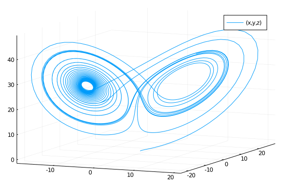
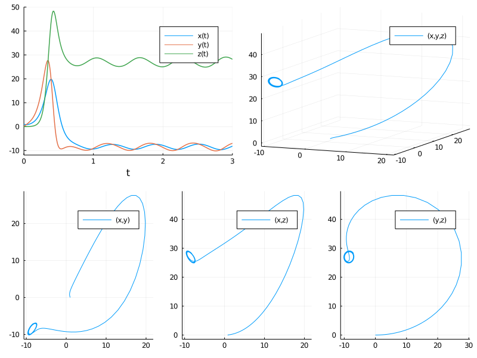
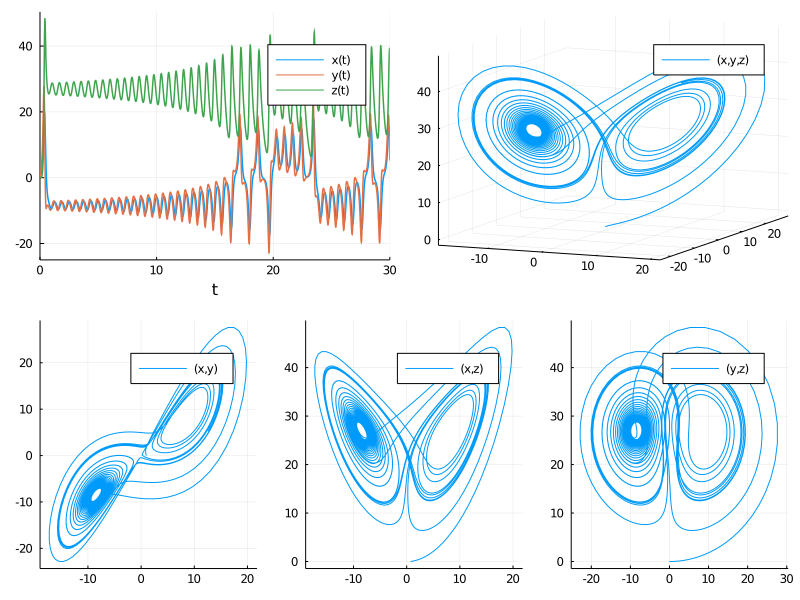

# Estimate the parameters of the Lorenz system from the dataset


Note: If data is generated with a fixed time step method and then is tested against with the same time step, there is a biased introduced since it's no longer about hitting the true solution, rather it's just about retreiving the same values that the ODE was first generated by! Thus this version uses adaptive timestepping for all portions so that way tests are against the true solution.

````julia
using ParameterizedFunctions, OrdinaryDiffEq, DiffEqParamEstim
using BlackBoxOptim, NLopt, Plots, QuadDIRECT
````


````
Error: ArgumentError: Package QuadDIRECT not found in current path:
- Run `import Pkg; Pkg.add("QuadDIRECT")` to install the QuadDIRECT package
.
````


````julia
gr(fmt=:png)
````


````
Plots.GRBackend()
````


````julia
Xiang2015Bounds = Tuple{Float64, Float64}[(9, 11), (20, 30), (2, 3)] # for local optimizations
xlow_bounds = [9.0,20.0,2.0]
xhigh_bounds = [11.0,30.0,3.0]
LooserBounds = Tuple{Float64, Float64}[(0, 22), (0, 60), (0, 6)] # for global optimization
GloIniPar = [0.0, 0.5, 0.1] # for global optimizations
LocIniPar = [9.0, 20.0, 2.0] # for local optimization
````


````
3-element Array{Float64,1}:
  9.0
 20.0
  2.0
````


````julia
g1 = @ode_def LorenzExample begin
  dx = σ*(y-x)
  dy = x*(ρ-z) - y
  dz = x*y - β*z
end σ ρ β
p = [10.0,28.0,2.66] # Parameters used to construct the dataset
r0 = [1.0; 0.0; 0.0]                #[-11.8,-5.1,37.5] PODES Initial values of the system in space # [0.1, 0.0, 0.0]
tspan = (0.0, 30.0)                 # PODES sample of 3000 observations over the (0,30) timespan
prob = ODEProblem(g1, r0, tspan,p)
tspan2 = (0.0, 3.0)                 # Xiang test sample of 300 observations with a timestep of 0.01
prob_short = ODEProblem(g1, r0, tspan2,p)
````


````
ODEProblem with uType Array{Float64,1} and tType Float64. In-place: true
timespan: (0.0, 3.0)
u0: [1.0, 0.0, 0.0]
````


````julia
dt = 30.0/3000
tf = 30.0
tinterval = 0:dt:tf
t  = collect(tinterval)
````


````
3001-element Array{Float64,1}:
  0.0
  0.01
  0.02
  0.03
  0.04
  0.05
  0.06
  0.07
  0.08
  0.09
  ⋮
 29.92
 29.93
 29.94
 29.95
 29.96
 29.97
 29.98
 29.99
 30.0
````


````julia
h = 0.01
M = 300
tstart = 0.0
tstop = tstart + M * h
tinterval_short = 0:h:tstop
t_short = collect(tinterval_short)
````


````
301-element Array{Float64,1}:
 0.0
 0.01
 0.02
 0.03
 0.04
 0.05
 0.06
 0.07
 0.08
 0.09
 ⋮
 2.92
 2.93
 2.94
 2.95
 2.96
 2.97
 2.98
 2.99
 3.0
````


````julia
# Generate Data
data_sol_short = solve(prob_short,Vern9(),saveat=t_short,reltol=1e-9,abstol=1e-9)
data_short = convert(Array, data_sol_short) # This operation produces column major dataset obs as columns, equations as rows
data_sol = solve(prob,Vern9(),saveat=t,reltol=1e-9,abstol=1e-9)
data = convert(Array, data_sol)
````


````
3×3001 Array{Float64,2}:
 1.0  0.917924    0.867919    0.84536     …  13.8987   13.2896  12.5913
 0.0  0.26634     0.51174     0.744654        8.31875   6.7199   5.22868
 0.0  0.00126393  0.00465567  0.00983655     39.19     39.1699  38.904
````


Plot the data

````julia
plot(data_sol_short,vars=(1,2,3)) # the short solution
plot(data_sol,vars=(1,2,3)) # the longer solution
interpolation_sol = solve(prob,Vern7(),saveat=t,reltol=1e-12,abstol=1e-12)
plot(interpolation_sol,vars=(1,2,3))
````




````julia
xyzt = plot(data_sol_short, plotdensity=10000,lw=1.5)
xy = plot(data_sol_short, plotdensity=10000, vars=(1,2))
xz = plot(data_sol_short, plotdensity=10000, vars=(1,3))
yz = plot(data_sol_short, plotdensity=10000, vars=(2,3))
xyz = plot(data_sol_short, plotdensity=10000, vars=(1,2,3))
plot(plot(xyzt,xyz),plot(xy, xz, yz, layout=(1,3),w=1), layout=(2,1), size=(800,600))
````




````julia
xyzt = plot(data_sol, plotdensity=10000,lw=1.5)
xy = plot(data_sol, plotdensity=10000, vars=(1,2))
xz = plot(data_sol, plotdensity=10000, vars=(1,3))
yz = plot(data_sol, plotdensity=10000, vars=(2,3))
xyz = plot(data_sol, plotdensity=10000, vars=(1,2,3))
plot(plot(xyzt,xyz),plot(xy, xz, yz, layout=(1,3),w=1), layout=(2,1), size=(800,600))
````





## Find a local solution for the three parameters from a short data set

````julia
obj_short = build_loss_objective(prob_short,Tsit5(),L2Loss(t_short,data_short),tstops=t_short)
res1 = bboptimize(obj_short;SearchRange = LooserBounds, MaxSteps = 7e3)
````


````
Starting optimization with optimizer BlackBoxOptim.DiffEvoOpt{BlackBoxOptim
.FitPopulation{Float64},BlackBoxOptim.RadiusLimitedSelector,BlackBoxOptim.A
daptiveDiffEvoRandBin{3},BlackBoxOptim.RandomBound{BlackBoxOptim.Continuous
RectSearchSpace}}
0.00 secs, 0 evals, 0 steps
0.50 secs, 3179 evals, 3084 steps, improv/step: 0.298 (last = 0.2977), fitn
ess=0.004104532
1.00 secs, 6417 evals, 6322 steps, improv/step: 0.287 (last = 0.2773), fitn
ess=0.000000001

Optimization stopped after 7001 steps and 1.12 seconds
Termination reason: Max number of steps (7000) reached
Steps per second = 6244.16
Function evals per second = 6328.00
Improvements/step = 0.28714
Total function evaluations = 7095


Best candidate found: [10.0, 28.0, 2.66]

Fitness: 0.000000000
````


````julia
# Tolernace is still too high to get close enough
````


````julia
obj_short = build_loss_objective(prob_short,Tsit5(),L2Loss(t_short,data_short),tstops=t_short,reltol=1e-9)
res1 = bboptimize(obj_short;SearchRange = LooserBounds, MaxSteps = 7e3)
````


````
Starting optimization with optimizer BlackBoxOptim.DiffEvoOpt{BlackBoxOptim
.FitPopulation{Float64},BlackBoxOptim.RadiusLimitedSelector,BlackBoxOptim.A
daptiveDiffEvoRandBin{3},BlackBoxOptim.RandomBound{BlackBoxOptim.Continuous
RectSearchSpace}}
0.00 secs, 0 evals, 0 steps
0.50 secs, 2129 evals, 2041 steps, improv/step: 0.295 (last = 0.2954), fitn
ess=0.158689291
1.00 secs, 4375 evals, 4287 steps, improv/step: 0.288 (last = 0.2818), fitn
ess=0.000008609
1.50 secs, 6531 evals, 6443 steps, improv/step: 0.291 (last = 0.2955), fitn
ess=0.000000002

Optimization stopped after 7001 steps and 1.63 seconds
Termination reason: Max number of steps (7000) reached
Steps per second = 4306.44
Function evals per second = 4360.57
Improvements/step = 0.29057
Total function evaluations = 7089


Best candidate found: [10.0, 28.0, 2.66]

Fitness: 0.000000000
````


````julia
# With the tolerance lower, it achieves the correct solution in 3.5 seconds.
````


````julia
obj_short = build_loss_objective(prob_short,Vern9(),L2Loss(t_short,data_short),tstops=t_short,reltol=1e-9,abstol=1e-9)
res1 = bboptimize(obj_short;SearchRange = LooserBounds, MaxSteps = 7e3)
````


````
Starting optimization with optimizer BlackBoxOptim.DiffEvoOpt{BlackBoxOptim
.FitPopulation{Float64},BlackBoxOptim.RadiusLimitedSelector,BlackBoxOptim.A
daptiveDiffEvoRandBin{3},BlackBoxOptim.RandomBound{BlackBoxOptim.Continuous
RectSearchSpace}}
0.00 secs, 0 evals, 0 steps
0.50 secs, 2289 evals, 2192 steps, improv/step: 0.293 (last = 0.2929), fitn
ess=0.490193493
1.00 secs, 4611 evals, 4514 steps, improv/step: 0.293 (last = 0.2929), fitn
ess=0.000004096
1.51 secs, 6969 evals, 6873 steps, improv/step: 0.287 (last = 0.2747), fitn
ess=0.000000000

Optimization stopped after 7001 steps and 1.53 seconds
Termination reason: Max number of steps (7000) reached
Steps per second = 4569.10
Function evals per second = 4631.75
Improvements/step = 0.28714
Total function evaluations = 7097


Best candidate found: [10.0, 28.0, 2.66]

Fitness: 0.000000000
````


````julia
# With the more accurate solver Vern9 in the solution of the ODE, the convergence is less efficient!

# Fastest BlackBoxOptim: 3.5 seconds
````


# Using NLopt

First, the global optimization algorithms

````julia
obj_short = build_loss_objective(prob_short,Vern9(),L2Loss(t_short,data_short),tstops=t_short,reltol=1e-9,abstol=1e-9)
````


````
(::DiffEqParamEstim.DiffEqObjective{DiffEqParamEstim.var"#43#48"{Nothing,Bo
ol,Int64,typeof(DiffEqParamEstim.STANDARD_PROB_GENERATOR),Base.Iterators.Pa
irs{Symbol,Any,Tuple{Symbol,Symbol,Symbol},NamedTuple{(:tstops, :reltol, :a
bstol),Tuple{Array{Float64,1},Float64,Float64}}},DiffEqBase.ODEProblem{Arra
y{Float64,1},Tuple{Float64,Float64},true,Array{Float64,1},Main.##WeaveSandB
ox#367.LorenzExample{Main.##WeaveSandBox#367.var"###ParameterizedDiffEqFunc
tion#387",Main.##WeaveSandBox#367.var"###ParameterizedTGradFunction#388",Ma
in.##WeaveSandBox#367.var"###ParameterizedJacobianFunction#389",Nothing,Not
hing,ModelingToolkit.ODESystem},Base.Iterators.Pairs{Union{},Union{},Tuple{
},NamedTuple{(),Tuple{}}},DiffEqBase.StandardODEProblem},OrdinaryDiffEq.Ver
n9,DiffEqParamEstim.L2Loss{Array{Float64,1},Array{Float64,2},Nothing,Nothin
g,Nothing},Nothing},DiffEqParamEstim.var"#47#53"{DiffEqParamEstim.var"#43#4
8"{Nothing,Bool,Int64,typeof(DiffEqParamEstim.STANDARD_PROB_GENERATOR),Base
.Iterators.Pairs{Symbol,Any,Tuple{Symbol,Symbol,Symbol},NamedTuple{(:tstops
, :reltol, :abstol),Tuple{Array{Float64,1},Float64,Float64}}},DiffEqBase.OD
EProblem{Array{Float64,1},Tuple{Float64,Float64},true,Array{Float64,1},Main
.##WeaveSandBox#367.LorenzExample{Main.##WeaveSandBox#367.var"###Parameteri
zedDiffEqFunction#387",Main.##WeaveSandBox#367.var"###ParameterizedTGradFun
ction#388",Main.##WeaveSandBox#367.var"###ParameterizedJacobianFunction#389
",Nothing,Nothing,ModelingToolkit.ODESystem},Base.Iterators.Pairs{Union{},U
nion{},Tuple{},NamedTuple{(),Tuple{}}},DiffEqBase.StandardODEProblem},Ordin
aryDiffEq.Vern9,DiffEqParamEstim.L2Loss{Array{Float64,1},Array{Float64,2},N
othing,Nothing,Nothing},Nothing}}}) (generic function with 2 methods)
````


````julia
opt = Opt(:GN_ORIG_DIRECT_L, 3)
lower_bounds!(opt,[0.0,0.0,0.0])
upper_bounds!(opt,[22.0,60.0,6.0])
min_objective!(opt, obj_short.cost_function2)
xtol_rel!(opt,1e-12)
maxeval!(opt, 10000)
@time (minf,minx,ret) = NLopt.optimize(opt,GloIniPar) # Accurate 3.2 seconds
````


````
0.820814 seconds (1.50 M allocations: 295.220 MiB, 2.23% gc time)
(7.403132789058194e-18, [10.000000000174282, 28.000000000007077, 2.66000000
00125332], :XTOL_REACHED)
````


````julia
opt = Opt(:GN_CRS2_LM, 3)
lower_bounds!(opt,[0.0,0.0,0.0])
upper_bounds!(opt,[22.0,60.0,6.0])
min_objective!(opt, obj_short.cost_function2)
xtol_rel!(opt,1e-12)
maxeval!(opt, 10000)
@time (minf,minx,ret) = NLopt.optimize(opt,GloIniPar) # Accurate 3.0 seconds
````


````
0.660805 seconds (1.21 M allocations: 236.666 MiB, 2.75% gc time)
(8.001657098023062e-18, [10.000000000102332, 28.00000000006687, 2.660000000
017698], :XTOL_REACHED)
````


````julia
opt = Opt(:GN_ISRES, 3)
lower_bounds!(opt,[0.0,0.0,0.0])
upper_bounds!(opt,[22.0,60.0,6.0])
min_objective!(opt, obj_short.cost_function2)
xtol_rel!(opt,1e-12)
maxeval!(opt, 10000)
@time (minf,minx,ret) = NLopt.optimize(opt,GloIniPar) # Accurate to single precision 8.2 seconds
````


````
2.153382 seconds (3.86 M allocations: 758.057 MiB, 4.06% gc time)
(0.00037151095260777773, [9.99912604930854, 27.99999060007924, 2.6598866147
984475], :MAXEVAL_REACHED)
````


````julia
opt = Opt(:GN_ESCH, 3)
lower_bounds!(opt,[0.0,0.0,0.0])
upper_bounds!(opt,[22.0,60.0,6.0])
min_objective!(opt, obj_short.cost_function2)
xtol_rel!(opt,1e-12)
maxeval!(opt, 10000)
@time (minf,minx,ret) = NLopt.optimize(opt,GloIniPar) # Approximatively accurate, good starting values for local optimization
````


````
2.119568 seconds (3.86 M allocations: 758.057 MiB, 3.27% gc time)
(6.885728046201032, [9.960879397274663, 28.093218221237457, 2.6510506305554
11], :MAXEVAL_REACHED)
````


Next, the local optimization algorithms that could be used after the global algorithms as a check on the solution and its precision. All the local optimizers are started from LocIniPar and with the narrow bounds of the Xiang2015Paper.

````julia
opt = Opt(:LN_BOBYQA, 3)
lower_bounds!(opt,[9.0,20.0,2.0])
upper_bounds!(opt,[11.0,30.0,3.0])
min_objective!(opt, obj_short.cost_function2)
xtol_rel!(opt,1e-12)
maxeval!(opt, 10000)
@time (minf,minx,ret) = NLopt.optimize(opt,LocIniPar) # 0.1 seconds
````


````
0.022600 seconds (43.63 k allocations: 8.566 MiB)
(2.7676783472649543e-18, [10.000000000052372, 28.000000000022467, 2.6600000
00008028], :SUCCESS)
````


````julia
opt = Opt(:LN_NELDERMEAD, 3)
lower_bounds!(opt,[9.0,20.0,2.0])
upper_bounds!(opt,[11.0,30.0,3.0])
min_objective!(opt, obj_short.cost_function2)
xtol_rel!(opt,1e-12)
maxeval!(opt, 10000)
@time (minf,minx,ret) = NLopt.optimize(opt,LocIniPar) # Accurate 0.29 sec
````


````
0.064815 seconds (121.60 k allocations: 23.879 MiB)
(2.9041679465906267e-18, [10.00000000005633, 28.00000000003226, 2.660000000
009111], :XTOL_REACHED)
````


````julia
opt = Opt(:LD_SLSQP, 3)
lower_bounds!(opt,[9.0,20.0,2.0])
upper_bounds!(opt,[11.0,30.0,3.0])
min_objective!(opt, obj_short.cost_function2)
xtol_rel!(opt,1e-12)
maxeval!(opt, 10000)
@time (minf,minx,ret) = NLopt.optimize(opt,LocIniPar) # Accurate 0.21 sec
````


````
0.068269 seconds (169.47 k allocations: 19.029 MiB)
(1.1112284907903994e-15, [9.999999999755289, 28.000000001197094, 2.66000000
00042696], :XTOL_REACHED)
````


````julia
opt = Opt(:LN_COBYLA, 3)
lower_bounds!(opt,[9.0,20.0,2.0])
upper_bounds!(opt,[11.0,30.0,3.0])
min_objective!(opt, obj_short.cost_function2)
xtol_rel!(opt,1e-12)
maxeval!(opt, 10000)
@time (minf,minx,ret) = NLopt.optimize(opt,LocIniPar) # Accurate 1.84 sec
````


````
0.416482 seconds (745.37 k allocations: 146.381 MiB, 4.60% gc time)
(2.9382755008911024e-18, [10.000000000027239, 28.000000000027903, 2.6600000
000065447], :XTOL_REACHED)
````


````julia
opt = Opt(:LN_NEWUOA_BOUND, 3)
lower_bounds!(opt,[9.0,20.0,2.0])
upper_bounds!(opt,[11.0,30.0,3.0])
min_objective!(opt, obj_short.cost_function2)
xtol_rel!(opt,1e-12)
maxeval!(opt, 10000)
@time (minf,minx,ret) = NLopt.optimize(opt,LocIniPar) # Accurate 0.18 sec ROUNDOFF LIMITED
````


````
0.107044 seconds (98.44 k allocations: 19.331 MiB)
(2.0977630616285726e-8, [10.000007614669004, 28.000000291860562, 2.66000050
93015358], :SUCCESS)
````


````julia
opt = Opt(:LN_PRAXIS, 3)
lower_bounds!(opt,[9.0,20.0,2.0])
upper_bounds!(opt,[11.0,30.0,3.0])
min_objective!(opt, obj_short.cost_function2)
xtol_rel!(opt,1e-12)
maxeval!(opt, 10000)
@time (minf,minx,ret) = NLopt.optimize(opt,LocIniPar) # Accurate 0.18 sec
````


````
0.047620 seconds (88.79 k allocations: 17.436 MiB)
(2.783271222753013e-18, [10.000000000052255, 28.000000000023764, 2.66000000
0008718], :XTOL_REACHED)
````


````julia
opt = Opt(:LN_SBPLX, 3)
lower_bounds!(opt,[9.0,20.0,2.0])
upper_bounds!(opt,[11.0,30.0,3.0])
min_objective!(opt, obj_short.cost_function2)
xtol_rel!(opt,1e-12)
maxeval!(opt, 10000)
@time (minf,minx,ret) = NLopt.optimize(opt,LocIniPar) # Accurate 0.65 sec
````


````
0.154615 seconds (288.74 k allocations: 56.703 MiB)
(2.784069880414099e-18, [10.000000000058924, 28.000000000020663, 2.66000000
0008665], :XTOL_REACHED)
````


````julia
opt = Opt(:LD_MMA, 3)
lower_bounds!(opt,[9.0,20.0,2.0])
upper_bounds!(opt,[11.0,30.0,3.0])
min_objective!(opt, obj_short.cost_function2)
xtol_rel!(opt,1e-12)
maxeval!(opt, 10000)
@time (minf,minx,ret) = NLopt.optimize(opt,LocIniPar) # Accurate 0.7 sec
````


````
0.187973 seconds (318.73 k allocations: 62.578 MiB, 9.82% gc time)
(2.513727923789831e-16, [9.999999999464693, 28.000000000538954, 2.659999999
922903], :XTOL_REACHED)
````


````julia
opt = Opt(:LD_LBFGS, 3)
lower_bounds!(opt,[9.0,20.0,2.0])
upper_bounds!(opt,[11.0,30.0,3.0])
min_objective!(opt, obj_short.cost_function2)
xtol_rel!(opt,1e-12)
maxeval!(opt, 10000)
@time (minf,minx,ret) = NLopt.optimize(opt,LocIniPar) # Accurate 0.12 sec
````


````
0.024722 seconds (48.63 k allocations: 9.546 MiB)
(1.1160505492326872e-15, [9.999999999753967, 28.00000000119966, 2.660000000
0043185], :SUCCESS)
````


````julia
opt = Opt(:LD_TNEWTON_PRECOND_RESTART, 3)
lower_bounds!(opt,[9.0,20.0,2.0])
upper_bounds!(opt,[11.0,30.0,3.0])
min_objective!(opt, obj_short.cost_function2)
xtol_rel!(opt,1e-12)
maxeval!(opt, 10000)
@time (minf,minx,ret) = NLopt.optimize(opt,LocIniPar) # Accurate 0.15 sec
````


````
0.032047 seconds (62.13 k allocations: 12.198 MiB)
(1.1162287428886917e-15, [9.999999999752498, 28.000000001199844, 2.66000000
00043726], :SUCCESS)
````


## Now let's solve the longer version for a global solution

Notice from the plotting above that this ODE problem is chaotic and tends to diverge over time. In the longer version of parameter estimation, the dataset is increased to 3000 observations per variable with the same integration time step of 0.01.
Vern9 solver with reltol=1e-9 and abstol=1e-9 has been established to be accurate on the time interval [0,50]

````julia
# BB with Vern9 converges very slowly. The final values are within the NarrowBounds.
obj = build_loss_objective(prob,Vern9(),L2Loss(t,data),tstops=t,reltol=1e-9,abstol=1e-9)

res1 = bboptimize(obj;SearchRange = LooserBounds, MaxSteps = 4e3) # Default adaptive_de_rand_1_bin_radiuslimited 33 sec [10.2183, 24.6711, 2.28969]
````


````
Starting optimization with optimizer BlackBoxOptim.DiffEvoOpt{BlackBoxOptim
.FitPopulation{Float64},BlackBoxOptim.RadiusLimitedSelector,BlackBoxOptim.A
daptiveDiffEvoRandBin{3},BlackBoxOptim.RandomBound{BlackBoxOptim.Continuous
RectSearchSpace}}
0.00 secs, 0 evals, 0 steps
0.50 secs, 242 evals, 163 steps, improv/step: 0.374 (last = 0.3742), fitnes
s=588817.867158357
1.00 secs, 494 evals, 396 steps, improv/step: 0.354 (last = 0.3391), fitnes
s=528505.267831968
1.50 secs, 738 evals, 637 steps, improv/step: 0.292 (last = 0.1909), fitnes
s=528505.267831968
2.01 secs, 983 evals, 882 steps, improv/step: 0.271 (last = 0.2163), fitnes
s=485851.460514456
2.51 secs, 1228 evals, 1127 steps, improv/step: 0.240 (last = 0.1306), fitn
ess=485851.460514456
3.01 secs, 1472 evals, 1371 steps, improv/step: 0.221 (last = 0.1311), fitn
ess=485851.460514456
3.51 secs, 1724 evals, 1623 steps, improv/step: 0.203 (last = 0.1071), fitn
ess=485851.460514456
4.01 secs, 1969 evals, 1868 steps, improv/step: 0.191 (last = 0.1061), fitn
ess=485851.460514456
4.51 secs, 2214 evals, 2113 steps, improv/step: 0.179 (last = 0.0898), fitn
ess=485851.460514456
5.01 secs, 2459 evals, 2358 steps, improv/step: 0.170 (last = 0.0939), fitn
ess=485851.460514456
5.51 secs, 2704 evals, 2603 steps, improv/step: 0.160 (last = 0.0653), fitn
ess=485851.460514456
6.02 secs, 2947 evals, 2847 steps, improv/step: 0.153 (last = 0.0820), fitn
ess=485851.460514456
6.52 secs, 3200 evals, 3100 steps, improv/step: 0.148 (last = 0.0909), fitn
ess=485851.460514456
7.02 secs, 3445 evals, 3345 steps, improv/step: 0.144 (last = 0.0939), fitn
ess=417122.502740755
7.52 secs, 3690 evals, 3590 steps, improv/step: 0.140 (last = 0.0776), fitn
ess=417122.502740755
8.02 secs, 3935 evals, 3835 steps, improv/step: 0.134 (last = 0.0490), fitn
ess=417122.502740755

Optimization stopped after 4001 steps and 8.35 seconds
Termination reason: Max number of steps (4000) reached
Steps per second = 479.00
Function evals per second = 490.97
Improvements/step = 0.13125
Total function evaluations = 4101


Best candidate found: [14.9443, 25.0117, 2.33591]

Fitness: 417122.502740755
````


````julia
#res1 = bboptimize(obj;SearchRange = LooserBounds, Method = :adaptive_de_rand_1_bin, MaxSteps = 4e3) # Method 32 sec [13.2222, 25.8589, 2.56176]
#res1 = bboptimize(obj;SearchRange = LooserBounds, Method = :dxnes, MaxSteps = 2e3) # Method dxnes 119 sec  [16.8648, 24.393, 2.29119]
#res1 = bboptimize(obj;SearchRange = LooserBounds, Method = :xnes, MaxSteps = 2e3) # Method xnes 304 sec  [19.1647, 24.9479, 2.39467]
#res1 = bboptimize(obj;SearchRange = LooserBounds, Method = :de_rand_1_bin_radiuslimited, MaxSteps = 2e3) # Method 44 sec  [13.805, 24.6054, 2.37274]
#res1 = bboptimize(obj;SearchRange = LooserBounds, Method = :generating_set_search, MaxSteps = 2e3) # Method 195 sec [19.1847, 24.9492, 2.39412]
````


````julia
# using Evolutionary
# N = 3
# @time result, fitness, cnt = cmaes(obj, N; μ = 3, λ = 12, iterations = 1000) # cmaes( rastrigin, N; μ = 15, λ = P, tol = 1e-8)
````


````julia
opt = Opt(:GN_ORIG_DIRECT_L, 3)
lower_bounds!(opt,[0.0,0.0,0.0])
upper_bounds!(opt,[22.0,60.0,6.0])
min_objective!(opt, obj.cost_function2)
xtol_rel!(opt,1e-12)
maxeval!(opt, 10000)
@time (minf,minx,ret) = NLopt.optimize(opt,GloIniPar) # Fail to converge
````


````
4.363889 seconds (6.61 M allocations: 1.290 GiB, 2.80% gc time)
(470298.7356885679, [7.04665993025209, 23.666102233396032, 1.80660129722654
62], :XTOL_REACHED)
````


````julia
opt = Opt(:GN_CRS2_LM, 3)
lower_bounds!(opt,[0.0,0.0,0.0])
upper_bounds!(opt,[22.0,60.0,6.0])
min_objective!(opt, obj.cost_function2)
xtol_rel!(opt,1e-12)
maxeval!(opt, 20000)
@time (minf,minx,ret) = NLopt.optimize(opt,GloIniPar) # Hit and miss. converge approximately accurate values for local opt.91 seconds
````


````
40.687493 seconds (61.84 M allocations: 12.071 GiB, 2.46% gc time)
(246867.20260007805, [10.240177048408343, 26.418575460175006, 2.54273461428
41936], :MAXEVAL_REACHED)
````


````julia
opt = Opt(:GN_ISRES, 3)
lower_bounds!(opt,[0.0,0.0,0.0])
upper_bounds!(opt,[22.0,60.0,6.0])
min_objective!(opt, obj.cost_function2)
xtol_rel!(opt,1e-12)
maxeval!(opt, 50000)
@time (minf,minx,ret) = NLopt.optimize(opt,GloIniPar) # Approximately accurate within local bounds
````


````
101.896675 seconds (154.60 M allocations: 30.178 GiB, 2.49% gc time)
(475659.23702669196, [12.191603227600492, 25.876230588191067, 2.57803736255
50146], :MAXEVAL_REACHED)
````


````julia
opt = Opt(:GN_ESCH, 3)
lower_bounds!(opt,[0.0,0.0,0.0])
upper_bounds!(opt,[22.0,60.0,6.0])
min_objective!(opt, obj.cost_function2)
xtol_rel!(opt,1e-12)
maxeval!(opt, 20000)
@time (minf,minx,ret) = NLopt.optimize(opt,GloIniPar) # Approximately accurate
````


````
40.722735 seconds (61.84 M allocations: 12.071 GiB, 2.51% gc time)
(493553.1053630682, [11.015229683662277, 23.012386624651874, 2.180731728372
8342], :MAXEVAL_REACHED)
````


This parameter estimation on the longer sample proves to be extremely challenging for the global optimizers. BlackBoxOptim is best in optimizing the objective function. All of the global algorithms produces final parameter estimates that could be used as starting values for further refinement with the local optimization algorithms.

````julia
opt = Opt(:LN_BOBYQA, 3)
lower_bounds!(opt,[9.0,20.0,2.0])
upper_bounds!(opt,[11.0,30.0,3.0])
min_objective!(opt, obj.cost_function2)
xtol_rel!(opt,1e-12)
maxeval!(opt, 10000)
@time (minf,minx,ret) = NLopt.optimize(opt,LocIniPar) # Claims SUCCESS but does not iterate to the true values.
````


````
0.231399 seconds (358.68 k allocations: 71.693 MiB)
(588113.2784337488, [9.862590803788724, 20.581133879885893, 2.0], :SUCCESS)
````


````julia
opt = Opt(:LN_NELDERMEAD, 3)
lower_bounds!(opt,[9.0,20.0,2.0])
upper_bounds!(opt,[11.0,30.0,3.0])
min_objective!(opt, obj.cost_function2)
xtol_rel!(opt,1e-9)
maxeval!(opt, 10000)
@time (minf,minx,ret) = NLopt.optimize(opt,LocIniPar) # Inaccurate final values
````


````
20.400889 seconds (30.92 M allocations: 6.036 GiB, 2.54% gc time)
(404754.5095017009, [9.678915633380864, 23.516765371996325, 2.1610738070962
92], :MAXEVAL_REACHED)
````


````julia
opt = Opt(:LD_SLSQP, 3)
lower_bounds!(opt,[9.0,20.0,2.0])
upper_bounds!(opt,[11.0,30.0,3.0])
min_objective!(opt, obj.cost_function2)
xtol_rel!(opt,1e-12)
maxeval!(opt, 10000)
@time (minf,minx,ret) = NLopt.optimize(opt,LocIniPar) # Inaccurate final values
````


````
0.112265 seconds (179.34 k allocations: 35.845 MiB)
(591460.7052976544, [9.237552014169724, 20.558585056149155, 2.0333441686041
98], :XTOL_REACHED)
````


No local optimizer can improve the global solution to the true values.

#### Using QuadDIRECT

````julia
obj_short = build_loss_objective(prob_short,Tsit5(),L2Loss(t_short,data_short),tstops=t_short)
lower = [0.0,0.0,0.0]
upper = [50.0,50.0,50.0]
splits = ([1.0,5.0,15.0],[0,10,20],[0,10,20])
@time root, x0 = analyze(obj_short,splits,lower,upper)
````


````
Error: UndefVarError: analyze not defined
````


````julia
minimum(root)
````


````
Error: UndefVarError: root not defined
````


````julia
obj = build_loss_objective(prob,Vern9(),L2Loss(t,data),tstops=t,reltol=1e-9,abstol=1e-9)
lower = [0.0,0.0,0.0]
upper = [50.0,50.0,50.0]
splits = ([0,5.0,15.0],[0,15,30],[0,2,5])
@time root, x0 = analyze(obj,splits,lower,upper)
````


````
Error: UndefVarError: analyze not defined
````


````julia
minimum(root)
````


````
Error: UndefVarError: root not defined
````


# Conclusion:


 1) As expected the Lorenz system is extremely sensitive to initial space values. Starting the integration from `r0 = [0.1,0.0,0.0]` produces convergence with the short sample of 300 observations. This can be achieved by all the global optimizers as well as most of the local   optimizers. Instead starting from `r0= [-11.8,-5.1,37.5]`, as in PODES, with the shorter sample shrinks the number of successful algorithms to 3: `BBO`, `:GN_CRS2_LM `and `:LD_SLSQP`. For the longer sample, all the algorithms fail.

 2) When trying to hit the real data, having a low enough tolerance on the numerical solution is key. If the numerical solution is too rough, then we can never actually hone in on the true parameters since even with the true parameters we will erroneously induce numerical error. Maybe this could be adaptive?

 3) Excessively low tolerance in the numerical solution is inefficient and delays the convergence of the estimation.

 4) The estimation method and the global versus local optimization make a huge difference in the timings. Here, BBO always find the correct solution for a global optimization setup. For local optimization, most methods in     NLopt, like :LN_BOBYQA, solve the problem in <0.05 seconds. This is an algorithm that can scale a local optimization but we are aiming to scale a global optimization.

 5) QuadDIRECT performs very well on the shorter problem but doesn't give very great results for the longer in the Lorenz case, more can be read about the algorithm [here](https://github.com/timholy/QuadDIRECT.jl).

 6) Fitting shorter timespans is easier... maybe this can lead to determining a minimal sample size for the optimizers and the estimator to succeed.

````julia
using DiffEqBenchmarks
DiffEqBenchmarks.bench_footer(WEAVE_ARGS[:folder],WEAVE_ARGS[:file])
````


## Appendix

These benchmarks are a part of the DiffEqBenchmarks.jl repository, found at: [https://github.com/JuliaDiffEq/DiffEqBenchmarks.jl](https://github.com/JuliaDiffEq/DiffEqBenchmarks.jl)

To locally run this tutorial, do the following commands:

```
using DiffEqBenchmarks
DiffEqBenchmarks.weave_file("ParameterEstimation","LorenzParameterEstimation.jmd")
```

Computer Information:

```
Julia Version 1.4.2
Commit 44fa15b150* (2020-05-23 18:35 UTC)
Platform Info:
  OS: Linux (x86_64-pc-linux-gnu)
  CPU: Intel(R) Core(TM) i7-9700K CPU @ 3.60GHz
  WORD_SIZE: 64
  LIBM: libopenlibm
  LLVM: libLLVM-8.0.1 (ORCJIT, skylake)
Environment:
  JULIA_DEPOT_PATH = /builds/JuliaGPU/DiffEqBenchmarks.jl/.julia
  JULIA_CUDA_MEMORY_LIMIT = 2147483648
  JULIA_PROJECT = @.
  JULIA_NUM_THREADS = 8

```

Package Information:

```
Status: `/builds/JuliaGPU/DiffEqBenchmarks.jl/benchmarks/ParameterEstimation/Project.toml`
[6e4b80f9-dd63-53aa-95a3-0cdb28fa8baf] BenchmarkTools 0.5.0
[a134a8b2-14d6-55f6-9291-3336d3ab0209] BlackBoxOptim 0.5.0
[593b3428-ca2f-500c-ae53-031589ec8ddd] CmdStan 6.0.6
[ebbdde9d-f333-5424-9be2-dbf1e9acfb5e] DiffEqBayes 2.16.0
[1130ab10-4a5a-5621-a13d-e4788d82bd4c] DiffEqParamEstim 1.15.0
[ef61062a-5684-51dc-bb67-a0fcdec5c97d] DiffEqUncertainty 1.4.1
[31c24e10-a181-5473-b8eb-7969acd0382f] Distributions 0.23.4
[bbc10e6e-7c05-544b-b16e-64fede858acb] DynamicHMC 2.1.5
[76087f3c-5699-56af-9a33-bf431cd00edd] NLopt 0.6.0
[1dea7af3-3e70-54e6-95c3-0bf5283fa5ed] OrdinaryDiffEq 5.41.0
[65888b18-ceab-5e60-b2b9-181511a3b968] ParameterizedFunctions 5.3.0
[91a5bcdd-55d7-5caf-9e0b-520d859cae80] Plots 1.5.3
[731186ca-8d62-57ce-b412-fbd966d074cd] RecursiveArrayTools 2.5.0
```

