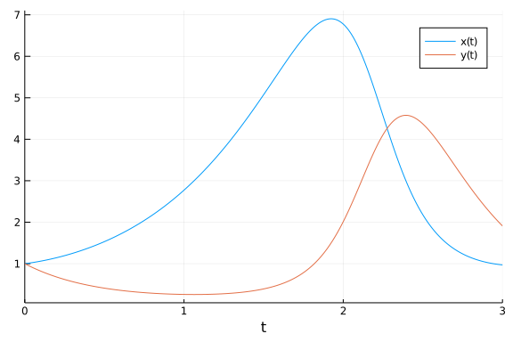
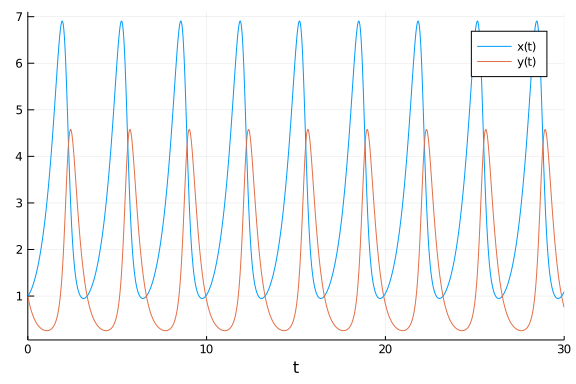

# Parameter estimation of Lotka Volterra model using optimisation methods

````julia
using ParameterizedFunctions, OrdinaryDiffEq, DiffEqParamEstim
using BlackBoxOptim, NLopt, Plots, RecursiveArrayTools, QuadDIRECT
````


````
Error: ArgumentError: Package QuadDIRECT not found in current path:
- Run `import Pkg; Pkg.add("QuadDIRECT")` to install the QuadDIRECT package
.
````


````julia
gr(fmt=:png)
````


````
Plots.GRBackend()
````


````julia
loc_bounds = Tuple{Float64, Float64}[(0, 5), (0, 5), (0, 5), (0, 5)]
glo_bounds = Tuple{Float64, Float64}[(0, 10), (0, 10), (0, 10), (0, 10)]
loc_init = [1,0.5,3.5,1.5]
glo_init = [5,5,5,5]
````


````
4-element Array{Int64,1}:
 5
 5
 5
 5
````


````julia
f = @ode_def LotkaVolterraTest begin
    dx = a*x - b*x*y
    dy = -c*y + d*x*y
end a b c d
````


````
(::Main.##WeaveSandBox#345.LotkaVolterraTest{Main.##WeaveSandBox#345.var"##
#ParameterizedDiffEqFunction#365",Main.##WeaveSandBox#345.var"###Parameteri
zedTGradFunction#366",Main.##WeaveSandBox#345.var"###ParameterizedJacobianF
unction#367",Nothing,Nothing,ModelingToolkit.ODESystem}) (generic function 
with 1 method)
````


````julia
u0 = [1.0,1.0]                          #initial values
tspan = (0.0,10.0)
p = [1.5,1.0,3.0,1,0]                   #parameters used, these need to be estimated from the data
tspan = (0.0, 30.0)                     # sample of 3000 observations over the (0,30) timespan
prob = ODEProblem(f, u0, tspan,p)
tspan2 = (0.0, 3.0)                     # sample of 3000 observations over the (0,30) timespan
prob_short = ODEProblem(f, u0, tspan2,p)
````


````
ODEProblem with uType Array{Float64,1} and tType Float64. In-place: true
timespan: (0.0, 3.0)
u0: [1.0, 1.0]
````


````julia
dt = 30.0/3000
tf = 30.0
tinterval = 0:dt:tf
t  = collect(tinterval)
````


````
3001-element Array{Float64,1}:
  0.0
  0.01
  0.02
  0.03
  0.04
  0.05
  0.06
  0.07
  0.08
  0.09
  ⋮
 29.92
 29.93
 29.94
 29.95
 29.96
 29.97
 29.98
 29.99
 30.0
````


````julia
h = 0.01
M = 300
tstart = 0.0
tstop = tstart + M * h
tinterval_short = 0:h:tstop
t_short = collect(tinterval_short)
````


````
301-element Array{Float64,1}:
 0.0
 0.01
 0.02
 0.03
 0.04
 0.05
 0.06
 0.07
 0.08
 0.09
 ⋮
 2.92
 2.93
 2.94
 2.95
 2.96
 2.97
 2.98
 2.99
 3.0
````


````julia
#Generate Data
data_sol_short = solve(prob_short,Tsit5(),saveat=t_short,reltol=1e-9,abstol=1e-9)
data_short = convert(Array, data_sol_short)
data_sol = solve(prob,Tsit5(),saveat=t,reltol=1e-9,abstol=1e-9)
data = convert(Array, data_sol)
````


````
2×3001 Array{Float64,2}:
 1.0  1.00511   1.01045   1.01601   1.02179   …  1.07814   1.08595   1.0939
8
 1.0  0.980224  0.960888  0.941986  0.923508     0.785597  0.770673  0.7560
92
````


#### Plot of the solution

##### Short Solution

````julia
p1 = plot(data_sol_short)
````





##### Longer Solution

````julia
p2 = plot(data_sol)
````





### Local Solution from the short data set

````julia
obj_short = build_loss_objective(prob_short,Tsit5(),L2Loss(t_short,data_short),tstops=t_short)
res1 = bboptimize(obj_short;SearchRange = glo_bounds, MaxSteps = 7e3)
````


````
Starting optimization with optimizer BlackBoxOptim.DiffEvoOpt{BlackBoxOptim
.FitPopulation{Float64},BlackBoxOptim.RadiusLimitedSelector,BlackBoxOptim.A
daptiveDiffEvoRandBin{3},BlackBoxOptim.RandomBound{BlackBoxOptim.Continuous
RectSearchSpace}}
0.00 secs, 0 evals, 0 steps
0.50 secs, 3693 evals, 3599 steps, improv/step: 0.172 (last = 0.1717), fitn
ess=22.720749271

Optimization stopped after 7001 steps and 0.94 seconds
Termination reason: Max number of steps (7000) reached
Steps per second = 7432.04
Function evals per second = 7531.82
Improvements/step = 0.16986
Total function evaluations = 7095


Best candidate found: [1.5011, 1.00046, 2.9953, 0.997999]

Fitness: 0.002958090
````


````julia
# Lower tolerance could lead to smaller fitness (more accuracy)
````


````julia
obj_short = build_loss_objective(prob_short,Tsit5(),L2Loss(t_short,data_short),tstops=t_short,reltol=1e-9)
res1 = bboptimize(obj_short;SearchRange = glo_bounds, MaxSteps = 7e3)
````


````
Starting optimization with optimizer BlackBoxOptim.DiffEvoOpt{BlackBoxOptim
.FitPopulation{Float64},BlackBoxOptim.RadiusLimitedSelector,BlackBoxOptim.A
daptiveDiffEvoRandBin{3},BlackBoxOptim.RandomBound{BlackBoxOptim.Continuous
RectSearchSpace}}
0.00 secs, 0 evals, 0 steps
0.50 secs, 3761 evals, 3624 steps, improv/step: 0.168 (last = 0.1683), fitn
ess=48.181880927

Optimization stopped after 7001 steps and 0.95 seconds
Termination reason: Max number of steps (7000) reached
Steps per second = 7352.43
Function evals per second = 7496.31
Improvements/step = 0.17600
Total function evaluations = 7138


Best candidate found: [1.49985, 0.999523, 3.00127, 1.00023]

Fitness: 0.001040450
````


````julia
# Change in tolerance makes it worse
````


````julia
obj_short = build_loss_objective(prob_short,Vern9(),L2Loss(t_short,data_short),tstops=t_short,reltol=1e-9,abstol=1e-9)
res1 = bboptimize(obj_short;SearchRange = glo_bounds, MaxSteps = 7e3)
````


````
Starting optimization with optimizer BlackBoxOptim.DiffEvoOpt{BlackBoxOptim
.FitPopulation{Float64},BlackBoxOptim.RadiusLimitedSelector,BlackBoxOptim.A
daptiveDiffEvoRandBin{3},BlackBoxOptim.RandomBound{BlackBoxOptim.Continuous
RectSearchSpace}}
0.00 secs, 0 evals, 0 steps
0.50 secs, 2892 evals, 2793 steps, improv/step: 0.175 (last = 0.1751), fitn
ess=38.097383846
1.00 secs, 5714 evals, 5616 steps, improv/step: 0.171 (last = 0.1676), fitn
ess=0.099112663

Optimization stopped after 7001 steps and 1.23 seconds
Termination reason: Max number of steps (7000) reached
Steps per second = 5688.15
Function evals per second = 5766.15
Improvements/step = 0.17229
Total function evaluations = 7097


Best candidate found: [1.5002, 0.999773, 2.9989, 0.999723]

Fitness: 0.000341705
````


````julia
# using the moe accurate Vern9() reduces the fitness marginally and leads to some increase in time taken
````


# Using NLopt

#### Global Optimisation first

````julia
obj_short = build_loss_objective(prob_short,Vern9(),L2Loss(t_short,data_short),tstops=t_short,reltol=1e-9,abstol=1e-9)
````


````
(::DiffEqParamEstim.DiffEqObjective{DiffEqParamEstim.var"#43#48"{Nothing,Bo
ol,Int64,typeof(DiffEqParamEstim.STANDARD_PROB_GENERATOR),Base.Iterators.Pa
irs{Symbol,Any,Tuple{Symbol,Symbol,Symbol},NamedTuple{(:tstops, :reltol, :a
bstol),Tuple{Array{Float64,1},Float64,Float64}}},DiffEqBase.ODEProblem{Arra
y{Float64,1},Tuple{Float64,Float64},true,Array{Float64,1},Main.##WeaveSandB
ox#345.LotkaVolterraTest{Main.##WeaveSandBox#345.var"###ParameterizedDiffEq
Function#365",Main.##WeaveSandBox#345.var"###ParameterizedTGradFunction#366
",Main.##WeaveSandBox#345.var"###ParameterizedJacobianFunction#367",Nothing
,Nothing,ModelingToolkit.ODESystem},Base.Iterators.Pairs{Union{},Union{},Tu
ple{},NamedTuple{(),Tuple{}}},DiffEqBase.StandardODEProblem},OrdinaryDiffEq
.Vern9,DiffEqParamEstim.L2Loss{Array{Float64,1},Array{Float64,2},Nothing,No
thing,Nothing},Nothing},DiffEqParamEstim.var"#47#53"{DiffEqParamEstim.var"#
43#48"{Nothing,Bool,Int64,typeof(DiffEqParamEstim.STANDARD_PROB_GENERATOR),
Base.Iterators.Pairs{Symbol,Any,Tuple{Symbol,Symbol,Symbol},NamedTuple{(:ts
tops, :reltol, :abstol),Tuple{Array{Float64,1},Float64,Float64}}},DiffEqBas
e.ODEProblem{Array{Float64,1},Tuple{Float64,Float64},true,Array{Float64,1},
Main.##WeaveSandBox#345.LotkaVolterraTest{Main.##WeaveSandBox#345.var"###Pa
rameterizedDiffEqFunction#365",Main.##WeaveSandBox#345.var"###Parameterized
TGradFunction#366",Main.##WeaveSandBox#345.var"###ParameterizedJacobianFunc
tion#367",Nothing,Nothing,ModelingToolkit.ODESystem},Base.Iterators.Pairs{U
nion{},Union{},Tuple{},NamedTuple{(),Tuple{}}},DiffEqBase.StandardODEProble
m},OrdinaryDiffEq.Vern9,DiffEqParamEstim.L2Loss{Array{Float64,1},Array{Floa
t64,2},Nothing,Nothing,Nothing},Nothing}}}) (generic function with 2 method
s)
````


````julia
opt = Opt(:GN_ORIG_DIRECT_L, 4)
lower_bounds!(opt,[0.0,0.0,0.0,0.0])
upper_bounds!(opt,[10.0,10.0,10.0,10.0])
min_objective!(opt, obj_short.cost_function2)
xtol_rel!(opt,1e-12)
maxeval!(opt, 10000)
@time (minf,minx,ret) = NLopt.optimize(opt,glo_init)
````


````
0.675519 seconds (1.53 M allocations: 277.062 MiB, 3.75% gc time)
(368.38768828453067, [1.7283950617224937, 2.22222222222419, 3.5802469135861
48, 1.1172077427280471], :XTOL_REACHED)
````


````julia
opt = Opt(:GN_CRS2_LM, 4)
lower_bounds!(opt,[0.0,0.0,0.0,0.0])
upper_bounds!(opt,[10.0,10.0,10.0,10.0])
min_objective!(opt, obj_short.cost_function2)
xtol_rel!(opt,1e-12)
maxeval!(opt, 10000)
@time (minf,minx,ret) = NLopt.optimize(opt,glo_init)
````


````
2.356762 seconds (2.69 M allocations: 488.609 MiB, 1.52% gc time)
(1.666546657824096e-16, [1.5000000000694145, 1.0000000000865725, 2.99999999
9527125, 0.9999999999300928], :XTOL_REACHED)
````


````julia
opt = Opt(:GN_ISRES, 4)
lower_bounds!(opt,[0.0,0.0,0.0,0.0])
upper_bounds!(opt,[10.0,10.0,10.0,10.0])
min_objective!(opt, obj_short.cost_function2)
xtol_rel!(opt,1e-12)
maxeval!(opt, 10000)
@time (minf,minx,ret) = NLopt.optimize(opt,glo_init)
````


````
1.717918 seconds (3.90 M allocations: 709.229 MiB, 3.37% gc time)
(10.718100060898667, [1.4148329107616118, 0.9926184489589229, 3.57029395208
55215, 1.159303716548558], :MAXEVAL_REACHED)
````


````julia
opt = Opt(:GN_ESCH, 4)
lower_bounds!(opt,[0.0,0.0,0.0,0.0])
upper_bounds!(opt,[10.0,10.0,10.0,10.0])
min_objective!(opt, obj_short.cost_function2)
xtol_rel!(opt,1e-12)
maxeval!(opt, 10000)
@time (minf,minx,ret) = NLopt.optimize(opt,glo_init)
````


````
1.710959 seconds (3.90 M allocations: 709.229 MiB, 3.39% gc time)
(639.7089071521643, [0.9096371651527904, 0.8386650786156924, 9.520725871918
78, 3.8473194949171106], :MAXEVAL_REACHED)
````


Now local optimization algorithms are used to check the global ones, these use the local constraints, different intial values and time step

````julia
opt = Opt(:LN_BOBYQA, 4)
lower_bounds!(opt,[0.0,0.0,0.0,0.0])
upper_bounds!(opt,[5.0,5.0,5.0,5.0])
min_objective!(opt, obj_short.cost_function2)
xtol_rel!(opt,1e-12)
maxeval!(opt, 10000)
@time (minf,minx,ret) = NLopt.optimize(opt,loc_init)
````


````
0.061378 seconds (137.29 k allocations: 24.965 MiB)
(1.6660922429170482e-16, [1.5000000000702367, 1.0000000000848144, 2.9999999
9950844, 0.9999999999254128], :XTOL_REACHED)
````


````julia
opt = Opt(:LN_NELDERMEAD, 4)
lower_bounds!(opt,[0.0,0.0,0.0,0.0])
upper_bounds!(opt,[5.0,5.0,5.0,5.0])
min_objective!(opt, obj_short.cost_function2)
xtol_rel!(opt,1e-12)
maxeval!(opt, 10000)
@time (minf,minx,ret) = NLopt.optimize(opt,loc_init)
````


````
0.093451 seconds (192.28 k allocations: 34.965 MiB, 12.45% gc time)
(1.6660983656762906e-16, [1.5000000000705307, 1.000000000085224, 2.99999999
9507768, 0.9999999999249004], :XTOL_REACHED)
````


````julia
opt = Opt(:LD_SLSQP, 4)
lower_bounds!(opt,[0.0,0.0,0.0,0.0])
upper_bounds!(opt,[5.0,5.0,5.0,5.0])
min_objective!(opt, obj_short.cost_function2)
xtol_rel!(opt,1e-12)
maxeval!(opt, 10000)
@time (minf,minx,ret) = NLopt.optimize(opt,loc_init)
````


````
0.074120 seconds (204.46 k allocations: 24.405 MiB)
(4.1924234228369356e-16, [1.499999999682718, 1.0000000001713023, 3.00000000
2088545, 1.0000000007284087], :XTOL_REACHED)
````


````julia
opt = Opt(:LN_COBYLA, 4)
lower_bounds!(opt,[0.0,0.0,0.0,0.0])
upper_bounds!(opt,[5.0,5.0,5.0,5.0])
min_objective!(opt, obj_short.cost_function2)
xtol_rel!(opt,1e-12)
maxeval!(opt, 10000)
@time (minf,minx,ret) = NLopt.optimize(opt,loc_init)
````


````
1.724521 seconds (3.90 M allocations: 709.229 MiB, 3.57% gc time)
(2.095834367163097e-10, [1.4999994892072248, 0.999999852720916, 3.000002650
119225, 1.0000008332818766], :MAXEVAL_REACHED)
````


````julia
opt = Opt(:LN_NEWUOA_BOUND, 4)
lower_bounds!(opt,[0.0,0.0,0.0,0.0])
upper_bounds!(opt,[5.0,5.0,5.0,5.0])
min_objective!(opt, obj_short.cost_function2)
xtol_rel!(opt,1e-12)
maxeval!(opt, 10000)
@time (minf,minx,ret) = NLopt.optimize(opt,loc_init)
````


````
0.153971 seconds (88.93 k allocations: 16.171 MiB)
(1.974260823257644e-9, [1.5000002678499593, 1.0000012766604875, 3.000001108
2750206, 1.0000001048380573], :SUCCESS)
````


````julia
opt = Opt(:LN_PRAXIS, 4)
lower_bounds!(opt,[0.0,0.0,0.0,0.0])
upper_bounds!(opt,[5.0,5.0,5.0,5.0])
min_objective!(opt, obj_short.cost_function2)
xtol_rel!(opt,1e-12)
maxeval!(opt, 10000)
@time (minf,minx,ret) = NLopt.optimize(opt,loc_init)
````


````
0.034806 seconds (83.47 k allocations: 15.178 MiB)
(1.6693096230543856e-16, [1.5000000000545937, 1.0000000000848859, 2.9999999
996082782, 0.999999999954339], :SUCCESS)
````


````julia
opt = Opt(:LN_SBPLX, 4)
lower_bounds!(opt,[0.0,0.0,0.0,0.0])
upper_bounds!(opt,[5.0,5.0,5.0,5.0])
min_objective!(opt, obj_short.cost_function2)
xtol_rel!(opt,1e-12)
maxeval!(opt, 10000)
@time (minf,minx,ret) = NLopt.optimize(opt,loc_init)
````


````
1.719508 seconds (3.90 M allocations: 709.229 MiB, 3.39% gc time)
(3.857624483455275e-12, [1.4999999301104459, 0.9999999814386067, 3.00000035
3466034, 1.0000001103210938], :MAXEVAL_REACHED)
````


````julia
opt = Opt(:LD_MMA, 4)
lower_bounds!(opt,[0.0,0.0,0.0,0.0])
upper_bounds!(opt,[5.0,5.0,5.0,5.0])
min_objective!(opt, obj_short.cost_function2)
xtol_rel!(opt,1e-12)
maxeval!(opt, 10000)
@time (minf,minx,ret) = NLopt.optimize(opt,loc_init)
````


````
3.400705 seconds (7.76 M allocations: 1.378 GiB, 3.42% gc time)
(6.678300918709951e-15, [1.4999999973062776, 0.9999999994973329, 3.00000001
43108423, 1.0000000046124624], :XTOL_REACHED)
````


````julia
opt = Opt(:LD_TNEWTON_PRECOND_RESTART, 4)
lower_bounds!(opt,[0.0,0.0,0.0,0.0])
upper_bounds!(opt,[5.0,5.0,5.0,5.0])
min_objective!(opt, obj_short.cost_function2)
xtol_rel!(opt,1e-12)
maxeval!(opt, 10000)
@time (minf,minx,ret) = NLopt.optimize(opt,loc_init)
````


````
0.058384 seconds (140.33 k allocations: 25.514 MiB)
(4.192393249865537e-16, [1.4999999996827114, 1.0000000001712928, 3.00000000
2088565, 1.0000000007284133], :SUCCESS)
````


## Now the longer problem is solved for a global solution

Vern9 solver with reltol=1e-9 and abstol=1e-9 is used and the dataset is increased to 3000 observations per variable with the same integration time step of 0.01.

````julia
obj = build_loss_objective(prob,Vern9(),L2Loss(t,data),tstops=t,reltol=1e-9,abstol=1e-9)
res1 = bboptimize(obj;SearchRange = glo_bounds, MaxSteps = 4e3)
````


````
Starting optimization with optimizer BlackBoxOptim.DiffEvoOpt{BlackBoxOptim
.FitPopulation{Float64},BlackBoxOptim.RadiusLimitedSelector,BlackBoxOptim.A
daptiveDiffEvoRandBin{3},BlackBoxOptim.RandomBound{BlackBoxOptim.Continuous
RectSearchSpace}}
0.00 secs, 0 evals, 0 steps
0.50 secs, 307 evals, 216 steps, improv/step: 0.394 (last = 0.3935), fitnes
s=24369.719037473
1.00 secs, 612 evals, 492 steps, improv/step: 0.360 (last = 0.3333), fitnes
s=23501.800155566
1.50 secs, 917 evals, 790 steps, improv/step: 0.296 (last = 0.1913), fitnes
s=23501.800155566
2.00 secs, 1216 evals, 1085 steps, improv/step: 0.263 (last = 0.1729), fitn
ess=22822.832934041
2.50 secs, 1524 evals, 1391 steps, improv/step: 0.226 (last = 0.0948), fitn
ess=11770.589548256
3.01 secs, 1832 evals, 1699 steps, improv/step: 0.194 (last = 0.0487), fitn
ess=11770.589548256
3.51 secs, 2138 evals, 2005 steps, improv/step: 0.172 (last = 0.0523), fitn
ess=11770.589548256
4.01 secs, 2443 evals, 2310 steps, improv/step: 0.159 (last = 0.0754), fitn
ess=11770.589548256
4.51 secs, 2743 evals, 2610 steps, improv/step: 0.146 (last = 0.0433), fitn
ess=11770.589548256
5.01 secs, 3050 evals, 2917 steps, improv/step: 0.136 (last = 0.0521), fitn
ess=11770.589548256
5.51 secs, 3357 evals, 3224 steps, improv/step: 0.130 (last = 0.0684), fitn
ess=4671.254790911
6.01 secs, 3663 evals, 3530 steps, improv/step: 0.125 (last = 0.0752), fitn
ess=3478.632292559
6.51 secs, 3968 evals, 3835 steps, improv/step: 0.120 (last = 0.0623), fitn
ess=3235.517582312

Optimization stopped after 4001 steps and 6.78 seconds
Termination reason: Max number of steps (4000) reached
Steps per second = 589.79
Function evals per second = 609.39
Improvements/step = 0.11825
Total function evaluations = 4134


Best candidate found: [1.4119, 1.45317, 3.31108, 1.10562]

Fitness: 3235.517582312

BlackBoxOptim.OptimizationResults("adaptive_de_rand_1_bin_radiuslimited", "
Max number of steps (4000) reached", 4001, 1.59392559859857e9, 6.7838108539
5813, BlackBoxOptim.DictChain{Symbol,Any}[BlackBoxOptim.DictChain{Symbol,An
y}[Dict{Symbol,Any}(:RngSeed => 45475,:SearchRange => [(0.0, 10.0), (0.0, 1
0.0), (0.0, 10.0), (0.0, 10.0)],:MaxSteps => 4000),Dict{Symbol,Any}()],Dict
{Symbol,Any}(:FitnessScheme => BlackBoxOptim.ScalarFitnessScheme{true}(),:N
umDimensions => :NotSpecified,:PopulationSize => 50,:MaxTime => 0.0,:Search
Range => (-1.0, 1.0),:Method => :adaptive_de_rand_1_bin_radiuslimited,:MaxN
umStepsWithoutFuncEvals => 100,:RngSeed => 1234,:MaxFuncEvals => 0,:SaveTra
ce => false…)], 4134, BlackBoxOptim.ScalarFitnessScheme{true}(), BlackBoxOp
tim.TopListArchiveOutput{Float64,Array{Float64,1}}(3235.5175823123213, [1.4
11898986231031, 1.453174926963783, 3.3110817161917865, 1.1056247787785298])
, BlackBoxOptim.PopulationOptimizerOutput{BlackBoxOptim.FitPopulation{Float
64}}(BlackBoxOptim.FitPopulation{Float64}([8.577338375683041 9.075717906548
11 … 8.654213511513039 9.600124182774803; 7.7746227591781105 8.696378652170
278 … 7.791979052054617 8.703433488191754; 1.8704509466062367 6.77865127566
4307 … 1.805417400693308 6.368455731227778; 0.8692301909868057 3.2234059735
888505 … 0.8877637668683716 3.062338511418711], NaN, [21645.74841407905, 23
481.258706702116, 9211.91167885423, 23045.615514578905, 13022.364062714527,
 9831.238051068563, 14109.347342752431, 21600.057650165963, 23710.498692650
035, 7651.4391923512785  …  23494.248967627023, 21927.369806978084, 21624.4
88575337033, 19333.50146622359, 23385.417116157456, 23394.603522329875, 232
96.577333577894, 22029.036846855517, 21367.977316571632, 23391.666343332614
], 0, BlackBoxOptim.Candidate{Float64}[BlackBoxOptim.Candidate{Float64}([4.
1736699649414115, 3.9830664892147087, 3.8847831772799992, 1.897075301744227
4], 13, 21935.888030702135, BlackBoxOptim.AdaptiveDiffEvoRandBin{3}(BlackBo
xOptim.AdaptiveDiffEvoParameters(BlackBoxOptim.BimodalCauchy(Distributions.
Cauchy{Float64}(μ=0.65, σ=0.1), Distributions.Cauchy{Float64}(μ=1.0, σ=0.1)
, 0.5, false, true), BlackBoxOptim.BimodalCauchy(Distributions.Cauchy{Float
64}(μ=0.1, σ=0.1), Distributions.Cauchy{Float64}(μ=0.95, σ=0.1), 0.5, false
, true), [1.0, 1.0, 0.7623994384255266, 0.9974555754583668, 0.4996111424863
757, 1.0, 1.0, 0.6078816472016128, 0.5777954181826608, 0.6216674339470657  
…  1.0, 0.6880453100558805, 1.0, 0.8806896380215007, 1.0, 0.624119854519134
1, 1.0, 0.6433459467147721, 0.05415879278514568, 0.956801928951645], [0.458
3797240399118, 0.6964602110242684, 0.08283728243768927, 0.08612839436674512
, 0.9913837050814771, 1.0, 0.09756362175312583, 0.93939833943733, 0.1469909
761382598, 0.2568101409252591  …  0.30459209198310344, 0.27118387228498764,
 0.19135092050957678, 0.8611561104922025, 0.3510368075954766, 0.41316382926
62324, 0.8793248182228227, 0.050398097630550476, 0.9189371880311, 0.9910024
972950822])), 0), BlackBoxOptim.Candidate{Float64}([6.693710251291357, 3.98
30664892147087, 3.8847831772799992, 1.8970753017442274], 13, 27470.22899082
9313, BlackBoxOptim.AdaptiveDiffEvoRandBin{3}(BlackBoxOptim.AdaptiveDiffEvo
Parameters(BlackBoxOptim.BimodalCauchy(Distributions.Cauchy{Float64}(μ=0.65
, σ=0.1), Distributions.Cauchy{Float64}(μ=1.0, σ=0.1), 0.5, false, true), B
lackBoxOptim.BimodalCauchy(Distributions.Cauchy{Float64}(μ=0.1, σ=0.1), Dis
tributions.Cauchy{Float64}(μ=0.95, σ=0.1), 0.5, false, true), [1.0, 1.0, 0.
7623994384255266, 0.9974555754583668, 0.4996111424863757, 1.0, 1.0, 0.60788
16472016128, 0.5777954181826608, 0.6216674339470657  …  1.0, 0.688045310055
8805, 1.0, 0.8806896380215007, 1.0, 0.6241198545191341, 1.0, 0.643345946714
7721, 0.05415879278514568, 0.956801928951645], [0.4583797240399118, 0.69646
02110242684, 0.08283728243768927, 0.08612839436674512, 0.9913837050814771, 
1.0, 0.09756362175312583, 0.93939833943733, 0.1469909761382598, 0.256810140
9252591  …  0.30459209198310344, 0.27118387228498764, 0.19135092050957678, 
0.8611561104922025, 0.3510368075954766, 0.4131638292662324, 0.8793248182228
227, 0.050398097630550476, 0.9189371880311, 0.9910024972950822])), 0)])))
````


````julia
opt = Opt(:GN_ORIG_DIRECT_L, 4)
lower_bounds!(opt,[0.0,0.0,0.0,0.0])
upper_bounds!(opt,[10.0,10.0,10.0,10.0])
min_objective!(opt, obj.cost_function2)
xtol_rel!(opt,1e-12)
maxeval!(opt, 10000)
@time (minf,minx,ret) = NLopt.optimize(opt,glo_init)
````


````
3.430740 seconds (6.48 M allocations: 1.169 GiB, 2.42% gc time)
(23525.885834891702, [8.271604938277504, 7.421124828514532, 7.4028349336932
31, 3.7037037037056706], :XTOL_REACHED)
````


````julia
opt = Opt(:GN_CRS2_LM, 4)
lower_bounds!(opt,[0.0,0.0,0.0,0.0])
upper_bounds!(opt,[10.0,10.0,10.0,10.0])
min_objective!(opt, obj.cost_function2)
xtol_rel!(opt,1e-12)
maxeval!(opt, 20000)
@time (minf,minx,ret) = NLopt.optimize(opt,glo_init)
````


````
29.305319 seconds (42.01 M allocations: 7.582 GiB, 1.91% gc time)
(1.2707157641848397e-14, [1.4999999994925821, 1.0000000002382785, 3.0000000
017559874, 1.0000000007493237], :XTOL_REACHED)
````


````julia
opt = Opt(:GN_ISRES, 4)
lower_bounds!(opt,[0.0,0.0,0.0,0.0])
upper_bounds!(opt,[10.0,10.0,10.0,10.0])
min_objective!(opt, obj.cost_function2)
xtol_rel!(opt,1e-12)
maxeval!(opt, 50000)
@time (minf,minx,ret) = NLopt.optimize(opt,glo_init)
````


````
82.030273 seconds (154.80 M allocations: 27.928 GiB, 2.48% gc time)
(21836.557628462564, [9.331948260396782, 8.399249963907991, 1.6602634511894
08, 0.8939810672152373], :MAXEVAL_REACHED)
````


````julia
opt = Opt(:GN_ESCH, 4)
lower_bounds!(opt,[0.0,0.0,0.0,0.0])
upper_bounds!(opt,[10.0,10.0,10.0,10.0])
min_objective!(opt, obj.cost_function2)
xtol_rel!(opt,1e-12)
maxeval!(opt, 20000)
@time (minf,minx,ret) = NLopt.optimize(opt,glo_init)
````


````
32.823698 seconds (61.92 M allocations: 11.171 GiB, 2.46% gc time)
(299.27110992113086, [1.5854269853438554, 1.0778301433281232, 2.72732798517
86922, 0.9567884977917628], :MAXEVAL_REACHED)
````


````julia
opt = Opt(:LN_BOBYQA, 4)
lower_bounds!(opt,[0.0,0.0,0.0,0.0])
upper_bounds!(opt,[5.0,5.0,5.0,5.0])
min_objective!(opt, obj.cost_function2)
xtol_rel!(opt,1e-12)
maxeval!(opt, 10000)
@time (minf,minx,ret) = NLopt.optimize(opt,loc_init)
````


````
0.969847 seconds (1.83 M allocations: 338.029 MiB, 2.16% gc time)
(1.2706863918599434e-14, [1.4999999994887927, 1.000000000235084, 3.00000000
176495, 1.0000000007536436], :SUCCESS)
````


````julia
opt = Opt(:LN_NELDERMEAD, 4)
lower_bounds!(opt,[0.0,0.0,0.0,0.0])
upper_bounds!(opt,[5.0,5.0,5.0,5.0])
min_objective!(opt, obj.cost_function2)
xtol_rel!(opt,1e-9)
maxeval!(opt, 10000)
@time (minf,minx,ret) = NLopt.optimize(opt,loc_init)
````


````
0.782512 seconds (1.47 M allocations: 271.110 MiB, 2.67% gc time)
(1.7650193766385424e-14, [1.499999999818285, 1.0000000007450542, 3.00000000
0845967, 1.000000000383562], :XTOL_REACHED)
````


````julia
opt = Opt(:LD_SLSQP, 4)
lower_bounds!(opt,[0.0,0.0,0.0,0.0])
upper_bounds!(opt,[5.0,5.0,5.0,5.0])
min_objective!(opt, obj.cost_function2)
xtol_rel!(opt,1e-12)
maxeval!(opt, 10000)
@time (minf,minx,ret) = NLopt.optimize(opt,loc_init)
````


````
4.701392 seconds (2.30 M allocations: 424.057 MiB, 0.67% gc time)
(21569.713608932932, [3.259711714502602, 2.7238409562806836, 0.858170492661
9689, 0.4044968406585042], :XTOL_REACHED)
````


#### Using QuadDIRECT

````julia
obj_short = build_loss_objective(prob_short,Tsit5(),L2Loss(t_short,data_short),tstops=t_short)
lower = [0.0,0.0,0.0,0.0]
upper = [5.0,5.0,5.0,5.0]
splits = ([0.0,1.0,3.0],[0.0,1.0,3.0],[0.0,1.0,3.0],[0.0,1.0,3.0])
root, x0 = analyze(obj_short,splits,lower,upper)
````


````
Error: UndefVarError: analyze not defined
````


````julia
minimum(root)
````


````
Error: UndefVarError: root not defined
````


````julia
obj = build_loss_objective(prob,Vern9(),L2Loss(t,data),tstops=t,reltol=1e-9,abstol=1e-9)
lower = [0.0,0.0,0.0,0.0]
upper = [10.0,10.0,10.0,10.0]
splits = ([0.0,3.0,6.0],[0.0,3.0,6.0],[0.0,3.0,6.0],[0.0,3.0,6.0])
root, x0 = analyze(obj,splits,lower,upper)
````


````
Error: UndefVarError: analyze not defined
````


````julia
minimum(root)
````


````
Error: UndefVarError: root not defined
````


#### Parameter estimation on the longer sample proves to be extremely challenging for some of the global optimizers. A few give the accurate values, BlacBoxOptim also performs quite well while others seem to struggle with accuracy a lot.

# Conclusion

In general we observe that lower tolerance lead to higher accuracy but too low tolerance could affect the convergance time drastically. Also fitting a shorter timespan seems to be easier in comparision (quite intutively). NLOpt methods seem to give great accuracy in the shorter problem with a lot of the algorithms giving 0 fitness, BBO performs very well on it with marginal change with `tol` values. In case of global optimization of the longer problem  there is some difference in the perfomance amongst the algorithms with `LD_SLSQP` `GN_ESCH` `GN_ISRES` `GN_ORIG_DIRECT_L` performing among the worse, BBO also gives a bit high fitness in comparison. QuadDIRECT gives accurate results in the case of the shorter problem but doesn't perform very well in the longer problem case.

````julia
using DiffEqBenchmarks
DiffEqBenchmarks.bench_footer(WEAVE_ARGS[:folder],WEAVE_ARGS[:file])
````


## Appendix

These benchmarks are a part of the DiffEqBenchmarks.jl repository, found at: [https://github.com/JuliaDiffEq/DiffEqBenchmarks.jl](https://github.com/JuliaDiffEq/DiffEqBenchmarks.jl)

To locally run this tutorial, do the following commands:

```
using DiffEqBenchmarks
DiffEqBenchmarks.weave_file("ParameterEstimation","LotkaVolterraParameterEstimation.jmd")
```

Computer Information:

```
Julia Version 1.4.2
Commit 44fa15b150* (2020-05-23 18:35 UTC)
Platform Info:
  OS: Linux (x86_64-pc-linux-gnu)
  CPU: Intel(R) Core(TM) i7-9700K CPU @ 3.60GHz
  WORD_SIZE: 64
  LIBM: libopenlibm
  LLVM: libLLVM-8.0.1 (ORCJIT, skylake)
Environment:
  JULIA_DEPOT_PATH = /builds/JuliaGPU/DiffEqBenchmarks.jl/.julia
  JULIA_CUDA_MEMORY_LIMIT = 2147483648
  JULIA_PROJECT = @.
  JULIA_NUM_THREADS = 8

```

Package Information:

```
Status: `/builds/JuliaGPU/DiffEqBenchmarks.jl/benchmarks/ParameterEstimation/Project.toml`
[6e4b80f9-dd63-53aa-95a3-0cdb28fa8baf] BenchmarkTools 0.5.0
[a134a8b2-14d6-55f6-9291-3336d3ab0209] BlackBoxOptim 0.5.0
[593b3428-ca2f-500c-ae53-031589ec8ddd] CmdStan 6.0.6
[ebbdde9d-f333-5424-9be2-dbf1e9acfb5e] DiffEqBayes 2.16.0
[1130ab10-4a5a-5621-a13d-e4788d82bd4c] DiffEqParamEstim 1.15.0
[ef61062a-5684-51dc-bb67-a0fcdec5c97d] DiffEqUncertainty 1.4.1
[31c24e10-a181-5473-b8eb-7969acd0382f] Distributions 0.23.4
[bbc10e6e-7c05-544b-b16e-64fede858acb] DynamicHMC 2.1.5
[76087f3c-5699-56af-9a33-bf431cd00edd] NLopt 0.6.0
[1dea7af3-3e70-54e6-95c3-0bf5283fa5ed] OrdinaryDiffEq 5.41.0
[65888b18-ceab-5e60-b2b9-181511a3b968] ParameterizedFunctions 5.3.0
[91a5bcdd-55d7-5caf-9e0b-520d859cae80] Plots 1.5.3
[731186ca-8d62-57ce-b412-fbd966d074cd] RecursiveArrayTools 2.5.0
```

