# Quorum Sensing

Here we test a model of quorum sensing of Pseudomonas putida IsoF in continuous cultures with constant
delay which was published by K. Buddrus-Schiemann et al. in "Analysis of N-Acylhomoserine Lactone Dynamics in Continuous
Cultures of Pseudomonas Putida IsoF By Use of ELISA and UHPLC/qTOF-MS-derived Measurements
and Mathematical Models", Analytical and Bioanalytical Chemistry, 2014.

````julia
using DelayDiffEq, DiffEqDevTools, DiffEqProblemLibrary, Plots
using DiffEqProblemLibrary.DDEProblemLibrary: importddeproblems; importddeproblems()
import DiffEqProblemLibrary.DDEProblemLibrary: prob_dde_qs
gr()

sol = solve(prob_dde_qs, MethodOfSteps(Vern9(); fpsolve = NLFunctional(; max_iter = 1000)); reltol=1e-14, abstol=1e-14)
plot(sol)
````


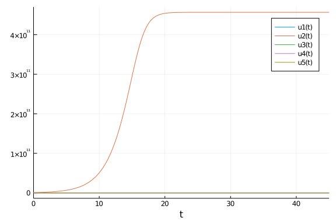


Particularly, we are interested in the third, low-level component of the system:

````julia
sol = solve(prob_dde_qs, MethodOfSteps(Vern9(); fpsolve = NLFunctional(; max_iter = 1000)); reltol=1e-14, abstol=1e-14, save_idxs=3)
test_sol = TestSolution(sol)
plot(sol)
````


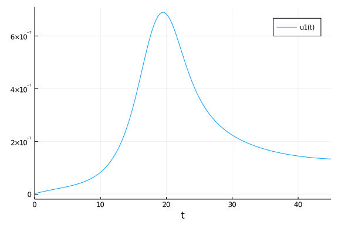


## Qualitative comparisons

First we compare the quality of the solution's third component for different algorithms, using the default tolerances.

### RK methods

````julia
sol = solve(prob_dde_qs, MethodOfSteps(BS3()); reltol=1e-3, abstol=1e-6, save_idxs=3)
p = plot(sol);
scatter!(p,sol.t, sol.u)
p
````


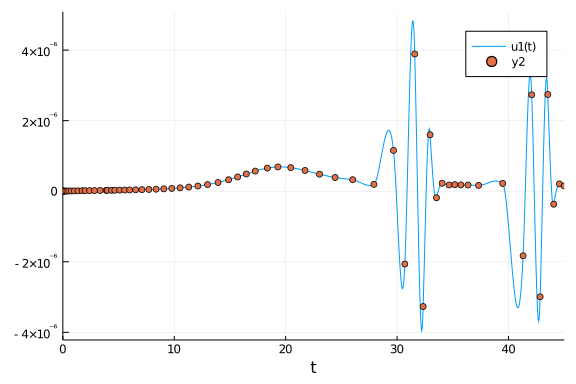

````julia
sol = solve(prob_dde_qs, MethodOfSteps(Tsit5()); reltol=1e-3, abstol=1e-6, save_idxs=3)
p = plot(sol);
scatter!(p,sol.t, sol.u)
p
````


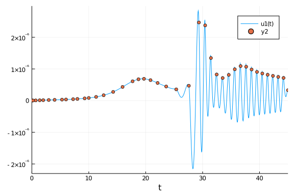

````julia
sol = solve(prob_dde_qs, MethodOfSteps(RK4()); reltol=1e-3, abstol=1e-6, save_idxs=3)
p = plot(sol);
scatter!(p,sol.t, sol.u)
p
````


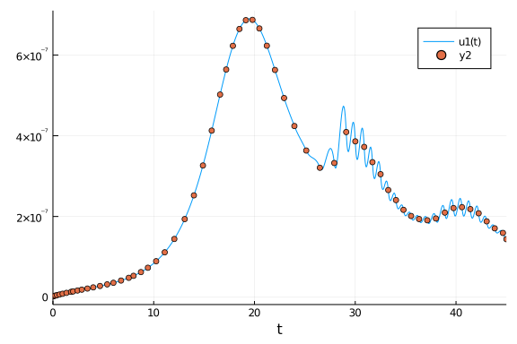

````julia
sol = solve(prob_dde_qs, MethodOfSteps(DP5()); reltol=1e-3, abstol=1e-6, save_idxs=3)
p = plot(sol);
scatter!(p,sol.t, sol.u)
p
````


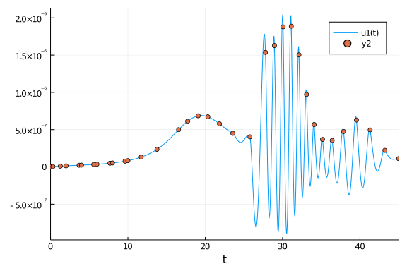

````julia
sol = solve(prob_dde_qs, MethodOfSteps(DP8()); reltol=1e-3, abstol=1e-6, save_idxs=3)
p = plot(sol);
scatter!(p,sol.t, sol.u)
p
````


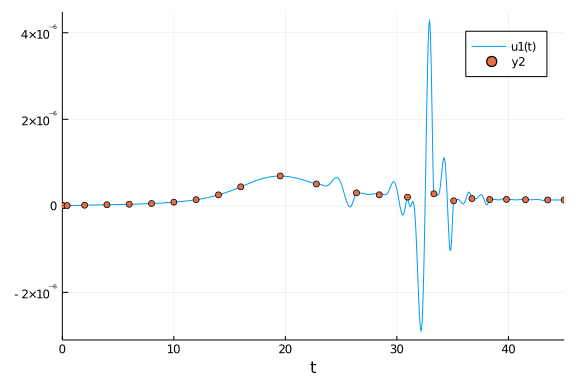

````julia
sol = solve(prob_dde_qs, MethodOfSteps(OwrenZen3()); reltol=1e-3, abstol=1e-6, save_idxs=3)
p = plot(sol);
scatter!(p,sol.t, sol.u)
p
````


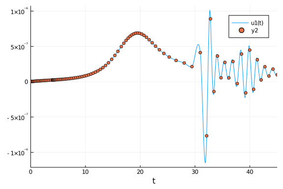

````julia
sol = solve(prob_dde_qs, MethodOfSteps(OwrenZen4()); reltol=1e-3, abstol=1e-6, save_idxs=3)
p = plot(sol);
scatter!(p,sol.t, sol.u)
p
````


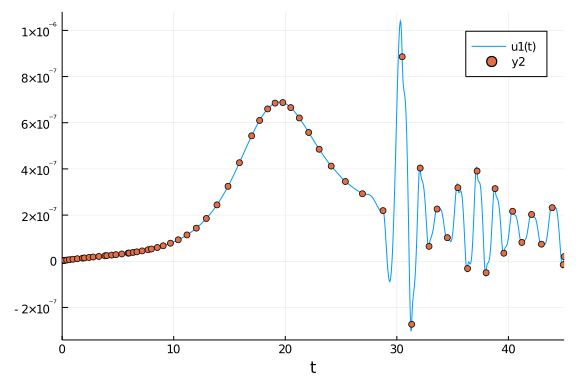

````julia
sol = solve(prob_dde_qs, MethodOfSteps(OwrenZen5()); reltol=1e-3, abstol=1e-6, save_idxs=3)
p = plot(sol);
scatter!(p,sol.t, sol.u)
p
````


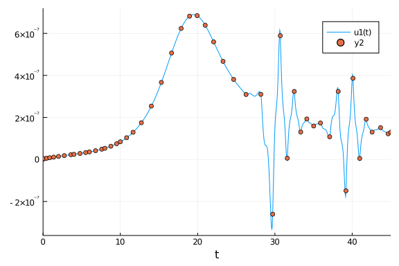


### Rosenbrock methods

````julia
sol = solve(prob_dde_qs, MethodOfSteps(Rosenbrock23()); reltol=1e-3, abstol=1e-6, save_idxs=3)
p = plot(sol);
scatter!(p,sol.t, sol.u)
p
````


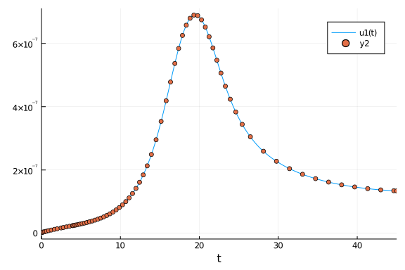

````julia
sol = solve(prob_dde_qs, MethodOfSteps(Rosenbrock32()); reltol=1e-3, abstol=1e-6, save_idxs=3)
p = plot(sol);
scatter!(p,sol.t, sol.u)
p
````


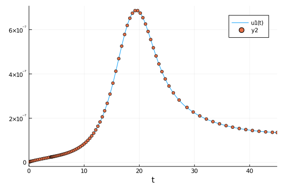

````julia
sol = solve(prob_dde_qs, MethodOfSteps(Rodas4()); reltol=1e-3, abstol=1e-6, save_idxs=3)
p = plot(sol);
scatter!(p,sol.t, sol.u)
p
````


````julia
sol = solve(prob_dde_qs, MethodOfSteps(Rodas5()); reltol=1e-4, abstol=1e-6, save_idxs=3)
p = plot(sol);
scatter!(p,sol.t, sol.u)
p
````


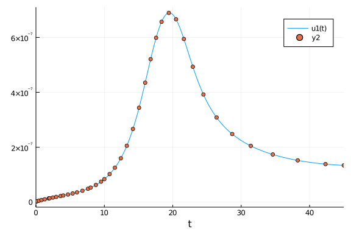


### Lazy interpolants

````julia
sol = solve(prob_dde_qs, MethodOfSteps(Vern7()); reltol=1e-3, abstol=1e-6, save_idxs=3)
p = plot(sol);
scatter!(p,sol.t, sol.u)
p
````


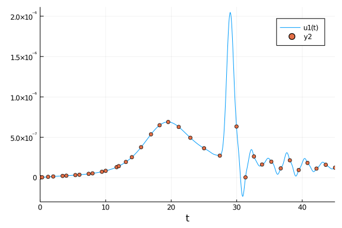

````julia
sol = solve(prob_dde_qs, MethodOfSteps(Vern9()); reltol=1e-3, abstol=1e-6, save_idxs=3)
p = plot(sol);
scatter!(p,sol.t, sol.u)
p
````


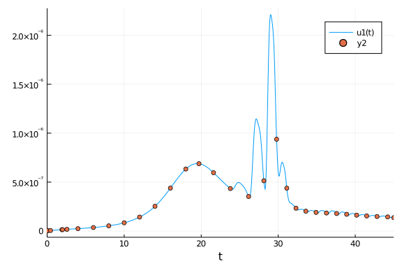


## Qualitative comparisons

Now we compare these methods quantitatively.

### High tolerances

#### RK methods

We start with RK methods at high tolerances.

````julia
abstols = 1.0 ./ 10.0 .^ (4:7)
reltols = 1.0 ./ 10.0 .^ (1:4)

setups = [Dict(:alg=>MethodOfSteps(BS3())),
          Dict(:alg=>MethodOfSteps(Tsit5())),
          Dict(:alg=>MethodOfSteps(RK4())),
          Dict(:alg=>MethodOfSteps(DP5())),
          Dict(:alg=>MethodOfSteps(OwrenZen3())),
          Dict(:alg=>MethodOfSteps(OwrenZen4())),
          Dict(:alg=>MethodOfSteps(OwrenZen5()))]
names = ["BS3", "Tsit5", "RK4", "DP5", "OwrenZen3", "OwrenZen4", "OwrenZen5"]
wp = WorkPrecisionSet(prob_dde_qs,abstols,reltols,setups;names=names,
                      save_idxs=3,appxsol=test_sol,maxiters=Int(1e5),error_estimate=:final)
plot(wp)
````


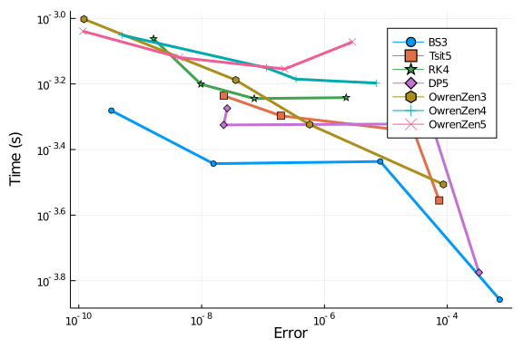


We also compare interpolation errors:

````julia
abstols = 1.0 ./ 10.0 .^ (4:7)
reltols = 1.0 ./ 10.0 .^ (1:4)

setups = [Dict(:alg=>MethodOfSteps(BS3())),
          Dict(:alg=>MethodOfSteps(Tsit5())),
          Dict(:alg=>MethodOfSteps(RK4())),
          Dict(:alg=>MethodOfSteps(DP5())),
          Dict(:alg=>MethodOfSteps(OwrenZen3())),
          Dict(:alg=>MethodOfSteps(OwrenZen4())),
          Dict(:alg=>MethodOfSteps(OwrenZen5()))]
names = ["BS3", "Tsit5", "RK4", "DP5", "OwrenZen3", "OwrenZen4", "OwrenZen5"]
wp = WorkPrecisionSet(prob_dde_qs,abstols,reltols,setups;names=names,
                      save_idxs=3,appxsol=test_sol,maxiters=Int(1e5),error_estimate=:L2)
plot(wp)
````


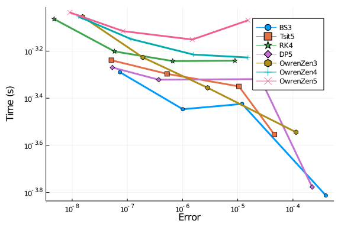


And the maximal interpolation error:

````julia
abstols = 1.0 ./ 10.0 .^ (4:7)
reltols = 1.0 ./ 10.0 .^ (1:4)

setups = [Dict(:alg=>MethodOfSteps(BS3())),
          Dict(:alg=>MethodOfSteps(Tsit5())),
          Dict(:alg=>MethodOfSteps(RK4())),
          Dict(:alg=>MethodOfSteps(DP5())),
          Dict(:alg=>MethodOfSteps(OwrenZen3())),
          Dict(:alg=>MethodOfSteps(OwrenZen4())),
          Dict(:alg=>MethodOfSteps(OwrenZen5()))]
names = ["BS3", "Tsit5", "RK4", "DP5", "OwrenZen3", "OwrenZen4", "OwrenZen5"]
wp = WorkPrecisionSet(prob_dde_qs,abstols,reltols,setups;names=names,
                      save_idxs=3,appxsol=test_sol,maxiters=Int(1e5),error_estimate=:L∞)
plot(wp)
````


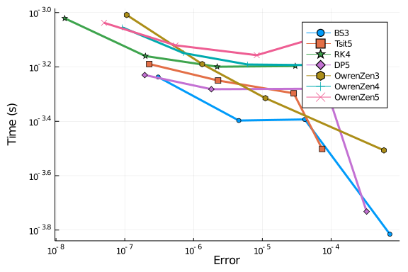


Since the correct solution is in the range of 1e-7, we see that most solutions, even at the lower end of tested tolerances, always lead to relative maximal interpolation errors of at least 1e-1 (and usually worse). `RK4` performs slightly better with relative maximal errors of at least 1e-2. This matches our qualitative analysis above.

#### Rosenbrock methods

We repeat these tests with Rosenbrock methods, and include `RK4` as reference.

````julia
abstols = 1.0 ./ 10.0 .^ (4:7)
reltols = 1.0 ./ 10.0 .^ (1:4)

setups = [Dict(:alg=>MethodOfSteps(Rosenbrock23())),
          Dict(:alg=>MethodOfSteps(Rosenbrock32())),
          Dict(:alg=>MethodOfSteps(Rodas4())),
          Dict(:alg=>MethodOfSteps(RK4()))]
names = ["Rosenbrock23", "Rosenbrock32", "Rodas4", "RK4"]
wp = WorkPrecisionSet(prob_dde_qs,abstols,reltols,setups;names=names,
                      save_idxs=3,appxsol=test_sol,maxiters=Int(1e5),error_estimate=:final)
plot(wp)
````


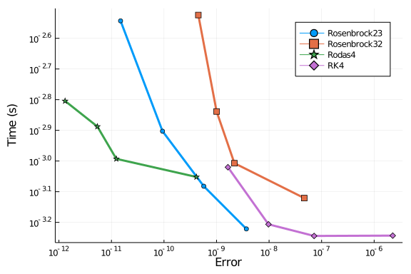

````julia
abstols = 1.0 ./ 10.0 .^ (4:7)
reltols = 1.0 ./ 10.0 .^ (1:4)

setups = [Dict(:alg=>MethodOfSteps(Rosenbrock23())),
          Dict(:alg=>MethodOfSteps(Rosenbrock32())),
          Dict(:alg=>MethodOfSteps(Rodas4())),
          Dict(:alg=>MethodOfSteps(RK4()))]
names = ["Rosenbrock23", "Rosenbrock32", "Rodas4", "RK4"]
wp = WorkPrecisionSet(prob_dde_qs,abstols,reltols,setups;names=names,
                      save_idxs=3,appxsol=test_sol,maxiters=Int(1e5),error_estimate=:L2)
plot(wp)
````


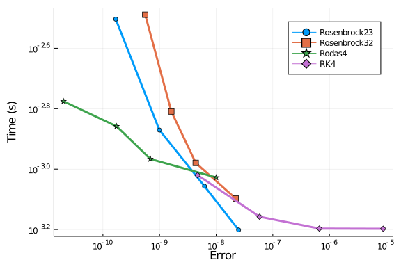

````julia
abstols = 1.0 ./ 10.0 .^ (4:7)
reltols = 1.0 ./ 10.0 .^ (1:4)

setups = [Dict(:alg=>MethodOfSteps(Rosenbrock23())),
          Dict(:alg=>MethodOfSteps(Rosenbrock32())),
          Dict(:alg=>MethodOfSteps(Rodas4())),
          Dict(:alg=>MethodOfSteps(RK4()))]
names = ["Rosenbrock23", "Rosenbrock32", "Rodas4", "RK4"]
wp = WorkPrecisionSet(prob_dde_qs,abstols,reltols,setups;names=names,
                      save_idxs=3,appxsol=test_sol,maxiters=Int(1e5),error_estimate=:L∞)
plot(wp)
````


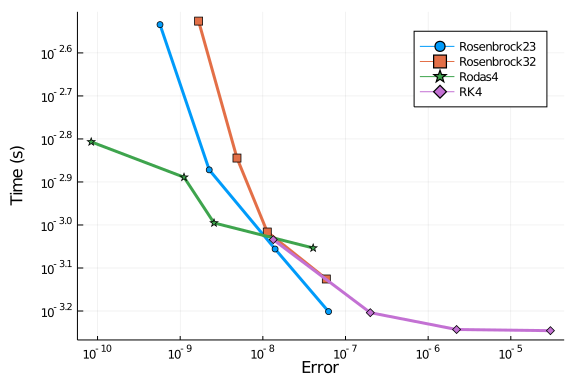


Out of the tested Rosenbrock methods `Rodas4` and `Rosenbrock23` perform best at high tolerances.

#### Lazy interpolants

Finally we test the Verner methods with lazy interpolants, and include `Rosenbrock23` as reference.

````julia
abstols = 1.0 ./ 10.0 .^ (4:7)
reltols = 1.0 ./ 10.0 .^ (1:4)

setups = [Dict(:alg=>MethodOfSteps(Vern6())),
          Dict(:alg=>MethodOfSteps(Vern7())),
          Dict(:alg=>MethodOfSteps(Vern8())),
          Dict(:alg=>MethodOfSteps(Vern9())),
          Dict(:alg=>MethodOfSteps(Rosenbrock23()))]
names = ["Vern6", "Vern7", "Vern8", "Vern9", "Rosenbrock23"]
wp = WorkPrecisionSet(prob_dde_qs,abstols,reltols,setups;names=names,
                      save_idxs=3,appxsol=test_sol,maxiters=Int(1e5),error_estimate=:final)
plot(wp)
````


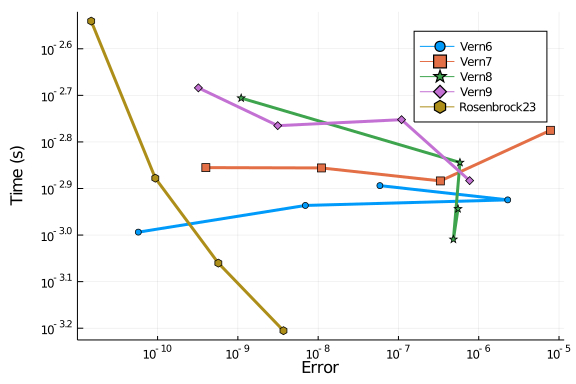

````julia
abstols = 1.0 ./ 10.0 .^ (4:7)
reltols = 1.0 ./ 10.0 .^ (1:4)

setups = [Dict(:alg=>MethodOfSteps(Vern6())),
          Dict(:alg=>MethodOfSteps(Vern7())),
          Dict(:alg=>MethodOfSteps(Vern8())),
          Dict(:alg=>MethodOfSteps(Vern9())),
          Dict(:alg=>MethodOfSteps(Rosenbrock23()))]
names = ["Vern6", "Vern7", "Vern8", "Vern9", "Rosenbrock23"]
wp = WorkPrecisionSet(prob_dde_qs,abstols,reltols,setups;names=names,
                      save_idxs=3,appxsol=test_sol,maxiters=Int(1e5),error_estimate=:L2)
plot(wp)
````


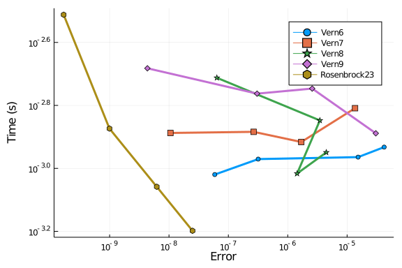

````julia
abstols = 1.0 ./ 10.0 .^ (4:7)
reltols = 1.0 ./ 10.0 .^ (1:4)

setups = [Dict(:alg=>MethodOfSteps(Vern6())),
          Dict(:alg=>MethodOfSteps(Vern7())),
          Dict(:alg=>MethodOfSteps(Vern8())),
          Dict(:alg=>MethodOfSteps(Vern9())),
          Dict(:alg=>MethodOfSteps(Rosenbrock23()))]
names = ["Vern6", "Vern7", "Vern8", "Vern9", "Rosenbrock23"]
wp = WorkPrecisionSet(prob_dde_qs,abstols,reltols,setups;names=names,
                      save_idxs=3,appxsol=test_sol,maxiters=Int(1e5),error_estimate=:L∞)
plot(wp)
````


All in all, at high tolerances `Rodas5` and `Rosenbrock23` are the best methods for solving this stiff DDE.

### Low tolerances

#### Rosenbrock methods

We repeat our tests of Rosenbrock methods `Rosenbrock23` and `Rodas5` at low tolerances:

````julia
abstols = 1.0 ./ 10.0 .^ (8:11)
reltols = 1.0 ./ 10.0 .^ (5:8)

setups = [Dict(:alg=>MethodOfSteps(Rosenbrock23())),
          Dict(:alg=>MethodOfSteps(Rodas4())),
          Dict(:alg=>MethodOfSteps(Rodas5()))]
names = ["Rosenbrock23", "Rodas4", "Rodas5"]
wp = WorkPrecisionSet(prob_dde_qs,abstols,reltols,setups;names=names,
                      save_idxs=3,appxsol=test_sol,maxiters=Int(1e5),error_estimate=:final)
plot(wp)
````


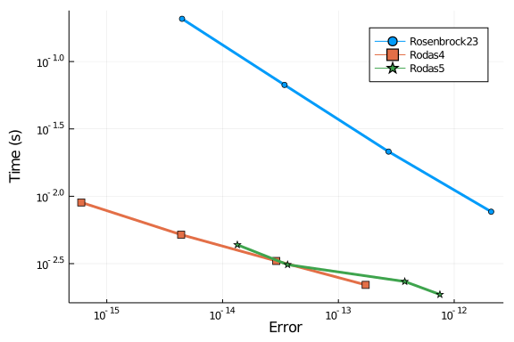

````julia
abstols = 1.0 ./ 10.0 .^ (8:11)
reltols = 1.0 ./ 10.0 .^ (5:8)

setups = [Dict(:alg=>MethodOfSteps(Rosenbrock23())),
          Dict(:alg=>MethodOfSteps(Rodas4())),
          Dict(:alg=>MethodOfSteps(Rodas5()))]
names = ["Rosenbrock23", "Rodas4", "Rodas5"]
wp = WorkPrecisionSet(prob_dde_qs,abstols,reltols,setups;names=names,
                      save_idxs=3,appxsol=test_sol,maxiters=Int(1e5),error_estimate=:L2)
plot(wp)
````


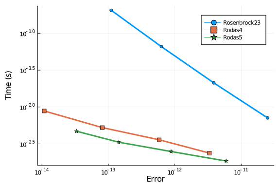

````julia
abstols = 1.0 ./ 10.0 .^ (8:11)
reltols = 1.0 ./ 10.0 .^ (5:8)

setups = [Dict(:alg=>MethodOfSteps(Rosenbrock23())),
          Dict(:alg=>MethodOfSteps(Rodas4())),
          Dict(:alg=>MethodOfSteps(Rodas5()))]
names = ["Rosenbrock23", "Rodas4", "Rodas5"]
wp = WorkPrecisionSet(prob_dde_qs,abstols,reltols,setups;names=names,
                      save_idxs=3,appxsol=test_sol,maxiters=Int(1e5),error_estimate=:L∞)
plot(wp)
````


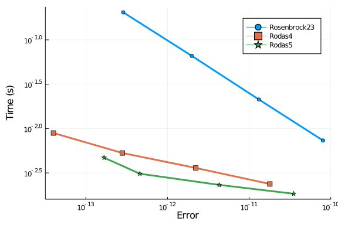


Thus at low tolerances `Rodas5` outperforms `Rosenbrock23`.

````julia
using SciMLBenchmarks
SciMLBenchmarks.bench_footer(WEAVE_ARGS[:folder],WEAVE_ARGS[:file])
````


## Appendix

These benchmarks are a part of the SciMLBenchmarks.jl repository, found at: [https://github.com/SciML/SciMLBenchmarks.jl](https://github.com/SciML/SciMLBenchmarks.jl). For more information on high-performance scientific machine learning, check out the SciML Open Source Software Organization [https://sciml.ai](https://sciml.ai).

To locally run this benchmark, do the following commands:

```
using SciMLBenchmarks
SciMLBenchmarks.weave_file("StiffDDE","QuorumSensing.jmd")
```

Computer Information:

```
Julia Version 1.4.2
Commit 44fa15b150* (2020-05-23 18:35 UTC)
Platform Info:
  OS: Linux (x86_64-pc-linux-gnu)
  CPU: Intel(R) Core(TM) i7-9700K CPU @ 3.60GHz
  WORD_SIZE: 64
  LIBM: libopenlibm
  LLVM: libLLVM-8.0.1 (ORCJIT, skylake)
Environment:
  JULIA_LOAD_PATH = /builds/JuliaGPU/DiffEqBenchmarks.jl:
  JULIA_DEPOT_PATH = /builds/JuliaGPU/DiffEqBenchmarks.jl/.julia
  JULIA_CUDA_MEMORY_LIMIT = 2147483648
  JULIA_NUM_THREADS = 8

```

Package Information:

```
Status: `/builds/JuliaGPU/DiffEqBenchmarks.jl/benchmarks/StiffDDE/Project.toml`
[bcd4f6db-9728-5f36-b5f7-82caef46ccdb] DelayDiffEq 5.24.1
[f3b72e0c-5b89-59e1-b016-84e28bfd966d] DiffEqDevTools 2.24.0
[a077e3f3-b75c-5d7f-a0c6-6bc4c8ec64a9] DiffEqProblemLibrary 4.8.1
[91a5bcdd-55d7-5caf-9e0b-520d859cae80] Plots 1.5.6
```

