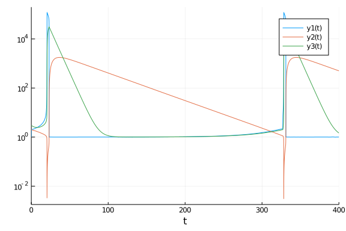
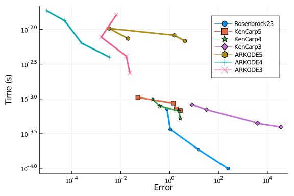

````julia
using OrdinaryDiffEq, DiffEqDevTools, ParameterizedFunctions, Plots, ODE, ODEInterfaceDiffEq, LSODA, Sundials
gr() #gr(fmt=:png)
using LinearAlgebra
LinearAlgebra.BLAS.set_num_threads(1)

f = @ode_def Orego begin
  dy1 = p1*(y2+y1*(1-p2*y1-y2))
  dy2 = (y3-(1+y1)*y2)/p1
  dy3 = p3*(y1-y3)
end p1 p2 p3

p = [77.27,8.375e-6,0.161]
prob = ODEProblem(f,[1.0,2.0,3.0],(0.0,30.0),p)
sol = solve(prob,Rodas5(),abstol=1/10^14,reltol=1/10^14)
test_sol = TestSolution(sol)
abstols = 1.0 ./ 10.0 .^ (4:11)
reltols = 1.0 ./ 10.0 .^ (1:8);
````


````
8-element Array{Float64,1}:
 0.1
 0.01
 0.001
 0.0001
 1.0e-5
 1.0e-6
 1.0e-7
 1.0e-8
````


````julia
plot_prob = ODEProblem(f,[1.0,2.0,3.0],(0.0,400.0),p)
sol = solve(plot_prob,CVODE_BDF())
plot(sol,yscale=:log10)
````





## Omissions and Tweaking

The following were omitted from the tests due to convergence failures. ODE.jl's
adaptivity is not able to stabilize its algorithms, while
GeometricIntegratorsDiffEq has not upgraded to Julia 1.0.
GeometricIntegrators.jl's methods used to be either fail to converge at
comparable dts (or on some computers errors due to type conversions).

````julia
#sol = solve(prob,ode23s()); println("Total ODE.jl steps: $(length(sol))")
#using GeometricIntegratorsDiffEq
#try
#    sol = solve(prob,GIRadIIA3(),dt=1/10)
#catch e
#    println(e)
#end
````


````julia
sol = solve(prob,ARKODE(),abstol=1e-5,reltol=1e-1);
````


````
retcode: Success
Interpolation: 3rd order Hermite
t: 1930-element Array{Float64,1}:
  0.0
  5.183745847886789e-6
  0.0004320071909426141
  0.0023109979680440524
  0.01172529348640182
  0.03039006589776688
  0.06668496632528746
  0.12759079204932686
  0.26632185088112337
  0.51231673012751
  ⋮
 29.808579867696697
 29.808770862246444
 29.80896185679619
 29.80931325487822
 29.8100730022706
 29.812316239134045
 29.82171980057384
 29.858982267243565
 30.0
u: 1930-element Array{Array{Float64,1},1}:
 [1.0, 2.0, 3.0]
 [1.0004004644777509, 1.9999999328869438, 2.9999983310016547]
 [1.0328299095240978, 1.9999942241977697, 2.999862046559172]
 [1.1635338564727067, 1.9999650456770812, 2.999287321207947]
 [1.5957944310613115, 1.9997441208118898, 2.996874022955883]
 [1.9044048336910644, 1.9991217982074077, 2.993242331514217]
 [1.9951753373661554, 1.9977392445862128, 2.98727561608559]
 [2.005992271849128, 1.9953671373445998, 2.9776528405288514]
 [2.0233787248092843, 1.9899404940525027, 2.9561851466788283]
 [2.0665541228197037, 1.9802530376594631, 2.919552729541242]
 ⋮
 [1.0058299085283162, 1493.9822433197353, 10706.332146410909]
 [1.0018548721158063, 1494.0013178438428, 10706.002961223314]
 [1.0009467570217756, 1494.0203919740013, 10705.67378615377]
 [1.0007082175074604, 1494.0554830569513, 10705.068185427324]
 [1.0006732745196127, 1494.1313420246336, 10703.758951132691]
 [1.000672439948171, 1494.3552400912442, 10699.894228739744]
 [1.000716640413521, 1495.2924504460427, 10683.708643933058]
 [1.0014549539221824, 1498.9846729734238, 10619.812189173996]
 [1.0213468161174624, 1512.6492889415617, 10381.440450314922]
````


````julia
sol = solve(prob,ARKODE(nonlinear_convergence_coefficient = 1e-3),abstol=1e-5,reltol=1e-1);
````


````
retcode: Success
Interpolation: 3rd order Hermite
t: 966-element Array{Float64,1}:
  0.0
  5.183745847886789e-6
  0.0004320071909426141
  0.00231179492039222
  0.011733045048911449
  0.030431728952339393
  0.06680177821019778
  0.1278592779290419
  0.26215879380126067
  0.6253925575624508
  ⋮
 29.9326622824661
 29.9371571568516
 29.9416520312371
 29.952327515895142
 29.970773295331334
 29.989219074767526
 29.995655723403576
 29.999957999836607
 30.0
u: 966-element Array{Array{Float64,1},1}:
 [1.0, 2.0, 3.0]
 [1.0004004644777509, 1.9999999328869438, 2.9999983310016547]
 [1.0328299094798339, 1.9999942241977549, 2.999862046559264]
 [1.163585340809781, 1.999965031974828, 2.9992870857164333]
 [1.5960648001111457, 1.999743910147634, 2.996872215729689]
 [1.904566124765326, 1.9991202315781742, 2.9932353381172465]
 [1.994666979742211, 1.9977345233065884, 2.9872581505733793]
 [2.0037217240367613, 1.995355892052236, 2.9776155061311824]
 [2.0093883213214347, 1.9900992537274331, 2.9568485970954366]
 [2.0243050391094433, 1.9757509104466027, 2.9034545541861343]
 ⋮
 [1.0066893333217801, 1506.3352561898676, 10471.643975866316]
 [1.0001331239197928, 1506.768847379791, 10464.069376525365]
 [1.0005452725086463, 1507.20194885841, 10456.500256738176]
 [1.0013598496967617, 1508.2286148600915, 10438.54526964623]
 [1.0006834812919962, 1509.9960473073152, 10407.59413931919]
 [1.0032587865119176, 1511.7552607777307, 10376.734790386517]
 [1.004681720285469, 1512.3672080521342, 10365.987982064122]
 [1.0045943134032533, 1512.7756796171493, 10358.810988433634]
 [1.0006951228665244, 1512.7796643970328, 10358.740948889907]
````


````julia
sol = solve(prob,ARKODE(order=3),abstol=1e-5,reltol=1e-1);
````


````
retcode: Success
Interpolation: 3rd order Hermite
t: 744-element Array{Float64,1}:
  0.0
  5.183745847886789e-6
  0.003958075606914673
  0.006428094752558676
  0.05155644484453704
  0.0966847949365154
  0.3897999640992597
  1.5207638991950212
  2.4140805368916882
  3.9395674660926625
  ⋮
 27.673726999348492
 27.673808147268964
 27.674398019950388
 27.686195473578856
 27.694728836052153
 27.710260537836067
 27.73477526884034
 27.826698083515797
 27.82680113519819
u: 744-element Array{Array{Float64,1},1}:
 [1.0, 2.0, 3.0]
 [1.0004004644777513, 1.9999999328869436, 2.9999983310016556]
 [1.263636246849815, 1.9999346117255552, 2.9988138194080722]
 [1.3916015932789505, 1.9998815354039672, 2.998150128929288]
 [2.032190876392149, 1.998340893766659, 2.9896011124035144]
 [2.0031386352122817, 1.9965724312198634, 2.9825156571851776]
 [2.123362002888999, 1.9851146474592911, 2.937405998028519]
 [3.699579391688081, 1.9402014435728259, 2.7847187089193226]
 [1.8670945376282213, 1.9026916198012769, 2.694923466245343]
 [3.0168859100197403, 1.838730279850212, 2.574041014405747]
 ⋮
 [1.0024756511740616, 1216.791771498746, 15094.686964503499]
 [1.0008292217434878, 1216.8050665756796, 15094.489769574413]
 [0.9988964699640288, 1216.901704493032, 15093.056416516856]
 [0.17990550700600294, 1218.831726114324, 15064.417924365767]
 [1.6015211257104593, 1220.2250015448903, 15043.736934443463]
 [0.9980000892456817, 1222.7537444113484, 15006.168001489366]
 [2.969656190843314, 1226.7281165864904, 14947.061248565135]
 [-0.18678945929749657, 1241.440699241177, 14727.494658623224]
 [-0.18678945929749657, 1241.440699241177, 14727.494658623224]
````


````julia
sol = solve(prob,ARKODE(order=3,nonlinear_convergence_coefficient = 1e-5),abstol=1e-5,reltol=1e-1);
````


````
retcode: Success
Interpolation: 3rd order Hermite
t: 557-element Array{Float64,1}:
  0.0
  5.183745847886789e-6
  0.003958075606914673
  0.006428094752558676
  0.05154899233155602
  0.09666988991055336
  0.39207891250860266
  0.8116271102789367
  1.2311753080492709
  1.572393211136682
  ⋮
 27.589851557635857
 28.388502014264976
 28.421545291505176
 28.454588568745375
 28.84427994025674
 29.929918504258755
 29.947438878194067
 29.96495925212938
 30.0
u: 557-element Array{Array{Float64,1},1}:
 [1.0, 2.0, 3.0]
 [1.0004004644777513, 1.9999999328869436, 2.9999983310016556]
 [1.263636246849815, 1.9999346117255552, 2.9988138194080722]
 [1.3916014115221427, 1.999881535343079, 2.9981501293079442]
 [2.032168813690308, 1.9983411765323165, 2.989602344041113]
 [2.0013214674623776, 1.996572404080637, 2.9825217916213997]
 [2.0148293174717664, 1.9849886796450498, 2.9372910578504428]
 [2.032156891017393, 1.968324642043813, 2.877599872310043]
 [2.050407126231416, 1.9514357756352894, 2.822974308555516]
 [2.0659604789232273, 1.937551173324628, 2.7820928122965003]
 ⋮
 [1.0014953167911176, 1203.675153392683, 15269.203618089066]
 [0.7296332844377998, 1325.5895913539334, 13426.866329329423]
 [1.0009642118818634, 1330.1800484392506, 13355.630811853356]
 [1.0006837690880095, 1334.7361668252104, 13284.77325893027]
 [1.0017481784434172, 1385.9466795313426, 12476.946873529914]
 [0.5518181397439346, 1506.0844987378862, 10476.013886850875]
 [1.0012919309127124, 1507.7729863243826, 10446.507810991357]
 [1.0006598198721883, 1509.4539536530974, 10417.084848560795]
 [1.0006262100629295, 1512.7936427550885, 10358.487326292687]
````


````julia
sol = solve(prob,ARKODE(order=5),abstol=1e-5,reltol=1e-1);
````


````
retcode: Success
Interpolation: 3rd order Hermite
t: 1465-element Array{Float64,1}:
  0.0
  5.183745847886789e-6
  0.000145437641697779
  0.0012783235287209195
  0.015054180711686124
  0.04800622512432173
  0.14278793701980033
  0.3630951888821249
  0.836802279994221
  1.310509371106317
  ⋮
 29.962214632262096
 29.966307381089358
 29.974023276042658
 29.981739170995958
 29.995394394513934
 29.99667389153318
 29.99795338855243
 29.999890378338804
 30.0
u: 1465-element Array{Array{Float64,1},1}:
 [1.0, 2.0, 3.0]
 [1.0004004644777507, 1.9999999328869436, 2.999998331001655]
 [1.0111749619432615, 1.999998096686059, 2.9999533007051213]
 [1.0940536251342847, 1.9999818717603388, 2.999598259397714]
 [1.68757184560494, 1.999645489161713, 2.996148809969014]
 [1.9765590057511544, 1.9984604424321653, 2.9902823745124505]
 [2.009436891837091, 1.99477460847005, 2.9752685963424277]
 [2.0419785951212006, 1.986140358127868, 2.941550619458821]
 [2.1828440516762755, 1.967367158020297, 2.873871730631273]
 [2.154708724857902, 1.9482528927936862, 2.8129762753984746]
 ⋮
 [0.9869866163783683, 1509.4317510832223, 10434.159492812341]
 [0.990045427333376, 1509.824260675563, 10427.28700923905]
 [0.9846512486286602, 1510.5631388768215, 10414.342901915212]
 [0.974871715667408, 1511.3005771755381, 10401.414864548058]
 [0.9264252405512035, 1512.6021337306324, 10378.574763808278]
 [0.9674275645408228, 1512.723867171257, 10376.437213829762]
 [0.991111502302261, 1512.8455582871645, 10374.300104162998]
 [0.9959749759073957, 1513.029702403085, 10371.065639538501]
 [1.0006210257526509, 1513.0401218554614, 10370.88261896349]
````


The stabilized explicit methods are not stable enough to handle this problem
well. While they don't diverge, they are really slow.

````julia
setups = [
          #Dict(:alg=>ROCK2())    #Unstable
          #Dict(:alg=>ROCK4())    #needs more iterations
          #Dict(:alg=>ESERK5()),
          ]
````


````
0-element Array{Any,1}
````


The EPIRK and exponential methods also fail:

````julia
sol = solve(prob,EXPRB53s3(),dt=2.0^(-8));
sol = solve(prob,EPIRK4s3B(),dt=2.0^(-8));
sol = solve(prob,EPIRK5P2(),dt=2.0^(-8));
````


````
retcode: Success
Interpolation: 3rd order Hermite
t: 7681-element Array{Float64,1}:
  0.0
  0.00390625
  0.0078125
  0.01171875
  0.015625
  0.01953125
  0.0234375
  0.02734375
  0.03125
  0.03515625
  ⋮
 29.96875
 29.97265625
 29.9765625
 29.98046875
 29.984375
 29.98828125
 29.9921875
 29.99609375
 30.0
u: 7681-element Array{Array{Float64,1},1}:
 [1.0, 2.0, 3.0]
 [1.2605393068560364, 1.9999355870948634, 2.998828606866439]
 [1.4532055099949341, 1.9998483896306996, 2.9977993427709984]
 [1.595691286542443, 1.9997443405680526, 2.996875287728083]
 [1.7010782375214253, 1.9996278264253007, 2.996029146080254]
 [1.77903788508418, 1.9995020902171459, 2.9952407379173818]
 [1.8367202817979578, 1.9993695294995395, 2.994495144037256]
 [1.8794112720724745, 1.9992319167763304, 2.9937813343770183]
 [1.9110185255432488, 1.9990905624659836, 2.993091154003089]
 [1.934430893848541, 1.9989464353850734, 2.9924185734882114]
 ⋮
 [1.0006627722947494, 1509.8019899931053, 10410.785258209286]
 [1.000662608305309, 1510.1754033511656, 10404.240537839498]
 [1.0006624445587076, 1510.548448220444, 10397.69993219113]
 [1.0006622810545363, 1510.9211248461318, 10391.16343867722]
 [1.0006621177923898, 1511.2934334732647, 10384.631054712436]
 [1.0006619547718625, 1511.6653743467234, 10378.10277771307]
 [1.0006617919925491, 1512.0369477112329, 10371.578605097035]
 [1.0006616294540467, 1512.408153811363, 10365.058534283873]
 [1.0006614671559517, 1512.7789928915286, 10358.542562694745]
````


PDIRK44 also fails

````julia
sol = solve(prob,PDIRK44(),dt=2.0^(-8));
````


````
retcode: Success
Interpolation: 3rd order Hermite
t: 7681-element Array{Float64,1}:
  0.0
  0.00390625
  0.0078125
  0.01171875
  0.015625
  0.01953125
  0.0234375
  0.02734375
  0.03125
  0.03515625
  ⋮
 29.96875
 29.97265625
 29.9765625
 29.98046875
 29.984375
 29.98828125
 29.9921875
 29.99609375
 30.0
u: 7681-element Array{Array{Float64,1},1}:
 [1.0, 2.0, 3.0]
 [1.2605739827290163, 1.9999355987164753, 2.9988285345820884]
 [1.4532567737371689, 1.9998484068117375, 2.997799235907568]
 [1.595748126763693, 1.9997443596176894, 2.9968751692438547]
 [1.7011342586747988, 1.9996278451996685, 2.9960290293120524]
 [1.7790896485527647, 1.999502107563507, 2.995240630036731]
 [1.836766198270938, 1.9993695448851194, 2.994495048358637]
 [1.8794508705932642, 1.9992319300433348, 2.9937812518816114]
 [1.9110519781136415, 1.9990905736722426, 2.9930910843301057]
 [1.9344587119980796, 1.9989464447023115, 2.9924185155678384]
 ⋮
 [1.0006629414361328, 1509.7071242497977, 10412.363856273112]
 [1.0006627774746022, 1510.0806269730588, 10405.818143425333]
 [1.000662613755676, 1510.4537611483483, 10399.276545922952]
 [1.0006624502789467, 1510.8265270208954, 10392.739061178618]
 [1.0006622870440096, 1511.198924835773, 10386.205686606603]
 [1.0006621240504558, 1511.570954837899, 10379.676419622809]
 [1.0006619612978813, 1511.9426172720364, 10373.151257644759]
 [1.0006617987858848, 1512.3139123827918, 10366.630198091603]
 [1.0006616365140613, 1512.6848404146176, 10360.113238384109]
````


## High Tolerances

This is the speed when you just want the answer.

````julia
abstols = 1.0 ./ 10.0 .^ (5:8)
reltols = 1.0 ./ 10.0 .^ (1:4);
setups = [Dict(:alg=>Rosenbrock23()),
          Dict(:alg=>Rodas3()),
          Dict(:alg=>TRBDF2()),
          Dict(:alg=>CVODE_BDF()),
          Dict(:alg=>rodas()),
          Dict(:alg=>radau()),
          Dict(:alg=>RadauIIA5()),
          Dict(:alg=>ROS34PW1a()),
          Dict(:alg=>lsoda()),
          ]
wp = WorkPrecisionSet(prob,abstols,reltols,setups;
                      save_everystep=false,appxsol=test_sol,maxiters=Int(1e5),numruns=10)
````


````
Error: Cannot find method(s) for rodas! I've tried to loadODESolvers(), but
 it didn't work. Please check ODEInterface.help_solversupport() and call lo
adODESolvers and check also this output. For further information see also O
DEInterface.help_install.
````


````julia
plot(wp)
````


````
Error: UndefVarError: wp not defined
````


````julia
wp = WorkPrecisionSet(prob,abstols,reltols,setups;dense = false,verbose=false,
                      appxsol=test_sol,maxiters=Int(1e5),error_estimate=:l2,numruns=10)
````


````
Error: Cannot find method(s) for rodas! I've tried to loadODESolvers(), but
 it didn't work. Please check ODEInterface.help_solversupport() and call lo
adODESolvers and check also this output. For further information see also O
DEInterface.help_install.
````


````julia
plot(wp)
````


````
Error: UndefVarError: wp not defined
````


````julia
wp = WorkPrecisionSet(prob,abstols,reltols,setups;
                      appxsol=test_sol,maxiters=Int(1e5),error_estimate=:L2,numruns=10)
````


````
Error: Cannot find method(s) for rodas! I've tried to loadODESolvers(), but
 it didn't work. Please check ODEInterface.help_solversupport() and call lo
adODESolvers and check also this output. For further information see also O
DEInterface.help_install.
````


````julia
plot(wp)
````


````
Error: UndefVarError: wp not defined
````


````julia
setups = [Dict(:alg=>Rosenbrock23()),
          Dict(:alg=>Kvaerno3()),
          Dict(:alg=>CVODE_BDF()),
          Dict(:alg=>KenCarp4()),
          Dict(:alg=>TRBDF2()),
          Dict(:alg=>KenCarp3()),
    # Dict(:alg=>SDIRK2()), # Removed because it's bad
          Dict(:alg=>radau())]
wp = WorkPrecisionSet(prob,abstols,reltols,setups;
                      save_everystep=false,appxsol=test_sol,maxiters=Int(1e5),numruns=10)
````


````
Error: Cannot find method(s) for radau! I've tried to loadODESolvers(), but
 it didn't work. Please check ODEInterface.help_solversupport() and call lo
adODESolvers and check also this output. For further information see also O
DEInterface.help_install.
````


````julia
plot(wp)
````


````
Error: UndefVarError: wp not defined
````


````julia
wp = WorkPrecisionSet(prob,abstols,reltols,setups;dense = false,verbose = false,
                      appxsol=test_sol,maxiters=Int(1e5),error_estimate=:l2,numruns=10)
````


````
Error: Cannot find method(s) for radau! I've tried to loadODESolvers(), but
 it didn't work. Please check ODEInterface.help_solversupport() and call lo
adODESolvers and check also this output. For further information see also O
DEInterface.help_install.
````


````julia
plot(wp)
````


````
Error: UndefVarError: wp not defined
````


````julia
wp = WorkPrecisionSet(prob,abstols,reltols,setups;
                      appxsol=test_sol,maxiters=Int(1e5),error_estimate=:L2,numruns=10)
````


````
Error: Cannot find method(s) for radau! I've tried to loadODESolvers(), but
 it didn't work. Please check ODEInterface.help_solversupport() and call lo
adODESolvers and check also this output. For further information see also O
DEInterface.help_install.
````


````julia
plot(wp)
````


````
Error: UndefVarError: wp not defined
````


````julia
setups = [Dict(:alg=>Rosenbrock23()),
          Dict(:alg=>KenCarp5()),
          Dict(:alg=>KenCarp4()),
          Dict(:alg=>KenCarp3()),
          Dict(:alg=>ARKODE(order=5)),
          Dict(:alg=>ARKODE(nonlinear_convergence_coefficient = 1e-6)),
          Dict(:alg=>ARKODE(nonlinear_convergence_coefficient = 1e-5,order=3))
          ]
names = ["Rosenbrock23" "KenCarp5" "KenCarp4" "KenCarp3" "ARKODE5" "ARKODE4" "ARKODE3"]
wp = WorkPrecisionSet(prob,abstols,reltols,setups;
                      names=names,
                      save_everystep=false,appxsol=test_sol,maxiters=Int(1e5),numruns=10)
plot(wp)
````




````julia
setups = [Dict(:alg=>Rosenbrock23()),
          Dict(:alg=>TRBDF2()),
          Dict(:alg=>ImplicitEulerExtrapolation()),
          #Dict(:alg=>ImplicitDeuflhardExtrapolation()), # Diverges
          #Dict(:alg=>ImplicitHairerWannerExtrapolation()), # Diverges
          Dict(:alg=>ABDF2()),
          Dict(:alg=>QNDF()),
          Dict(:alg=>Exprb43()),
          Dict(:alg=>Exprb32()),
]
wp = WorkPrecisionSet(prob,abstols,reltols,setups;
                      save_everystep=false,appxsol=test_sol,maxiters=Int(1e5),numruns=10)
plot(wp)
````


### Low Tolerances

This is the speed at lower tolerances, measuring what's good when accuracy is needed.

````julia
abstols = 1.0 ./ 10.0 .^ (7:13)
reltols = 1.0 ./ 10.0 .^ (4:10)

setups = [Dict(:alg=>GRK4A()),
          Dict(:alg=>Rodas4P()),
          Dict(:alg=>CVODE_BDF()),
          Dict(:alg=>ddebdf()),
          Dict(:alg=>Rodas4()),
          Dict(:alg=>rodas()),
          Dict(:alg=>radau()),
          Dict(:alg=>RadauIIA5()),
          Dict(:alg=>lsoda()),
]
wp = WorkPrecisionSet(prob,abstols,reltols,setups;
                      save_everystep=false,appxsol=test_sol,maxiters=Int(1e5),numruns=10)
````


````
Error: Cannot find method(s) for ddebdf! I've tried to loadODESolvers(), bu
t it didn't work. Please check ODEInterface.help_solversupport() and call l
oadODESolvers and check also this output. For further information see also 
ODEInterface.help_install.
````


````julia
plot(wp)
````


````julia
wp = WorkPrecisionSet(prob,abstols,reltols,setups;verbose=false,
                      dense=false,appxsol=test_sol,maxiters=Int(1e5),error_estimate=:l2,numruns=10)
````


````
Error: Cannot find method(s) for ddebdf! I've tried to loadODESolvers(), bu
t it didn't work. Please check ODEInterface.help_solversupport() and call l
oadODESolvers and check also this output. For further information see also 
ODEInterface.help_install.
````


````julia
plot(wp)
````


````julia
wp = WorkPrecisionSet(prob,abstols,reltols,setups;
                      appxsol=test_sol,maxiters=Int(1e5),error_estimate=:L2,numruns=10)
````


````
Error: Cannot find method(s) for ddebdf! I've tried to loadODESolvers(), bu
t it didn't work. Please check ODEInterface.help_solversupport() and call l
oadODESolvers and check also this output. For further information see also 
ODEInterface.help_install.
````


````julia
plot(wp)
````


````julia
setups = [
          Dict(:alg=>Rodas5()),
          Dict(:alg=>Kvaerno5()),
          Dict(:alg=>CVODE_BDF()),
          Dict(:alg=>KenCarp4()),
          Dict(:alg=>KenCarp5()),
          Dict(:alg=>Rodas4()),
          Dict(:alg=>radau())]
wp = WorkPrecisionSet(prob,abstols,reltols,setups;
                      save_everystep=false,appxsol=test_sol,maxiters=Int(1e5),numruns=10)
````


````
Error: Cannot find method(s) for radau! I've tried to loadODESolvers(), but
 it didn't work. Please check ODEInterface.help_solversupport() and call lo
adODESolvers and check also this output. For further information see also O
DEInterface.help_install.
````


````julia
plot(wp)
````


````julia
wp = WorkPrecisionSet(prob,abstols,reltols,setups;verbose=false,
                      dense=false,appxsol=test_sol,maxiters=Int(1e5),error_estimate=:l2,numruns=10)
````


````
Error: Cannot find method(s) for radau! I've tried to loadODESolvers(), but
 it didn't work. Please check ODEInterface.help_solversupport() and call lo
adODESolvers and check also this output. For further information see also O
DEInterface.help_install.
````


````julia
plot(wp)
````


````julia
wp = WorkPrecisionSet(prob,abstols,reltols,setups;
                      appxsol=test_sol,maxiters=Int(1e5),error_estimate=:L2,numruns=10)
````


````
Error: Cannot find method(s) for radau! I've tried to loadODESolvers(), but
 it didn't work. Please check ODEInterface.help_solversupport() and call lo
adODESolvers and check also this output. For further information see also O
DEInterface.help_install.
````


````julia
plot(wp)
````


The following algorithms were removed since they failed.

````julia
#setups = [Dict(:alg=>Hairer4()),
          #Dict(:alg=>Hairer42()),
          #Dict(:alg=>Rodas3()),
          #Dict(:alg=>Kvaerno4()),
          #Dict(:alg=>Cash4())
#]
#wp = WorkPrecisionSet(prob,abstols,reltols,setups;
#                      save_everystep=false,appxsol=test_sol,maxiters=Int(1e5),numruns=10)
#plot(wp)
````


### Conclusion

At high tolerances, `Rosenbrock23` hits the the error estimates and is fast. At lower tolerances and normal user tolerances, `Rodas4` and `Rodas5` are extremely fast. When you get down to `reltol=1e-9` `radau` begins to become as efficient as `Rodas4`, and it continues to do well below that.

````julia
using DiffEqBenchmarks
DiffEqBenchmarks.bench_footer(WEAVE_ARGS[:folder],WEAVE_ARGS[:file])
````


## Appendix

These benchmarks are a part of the DiffEqBenchmarks.jl repository, found at: [https://github.com/JuliaDiffEq/DiffEqBenchmarks.jl](https://github.com/JuliaDiffEq/DiffEqBenchmarks.jl)

To locally run this tutorial, do the following commands:

```
using DiffEqBenchmarks
DiffEqBenchmarks.weave_file("StiffODE","Orego.jmd")
```

Computer Information:

```
Julia Version 1.4.2
Commit 44fa15b150* (2020-05-23 18:35 UTC)
Platform Info:
  OS: Linux (x86_64-pc-linux-gnu)
  CPU: Intel(R) Core(TM) i7-9700K CPU @ 3.60GHz
  WORD_SIZE: 64
  LIBM: libopenlibm
  LLVM: libLLVM-8.0.1 (ORCJIT, skylake)
Environment:
  JULIA_DEPOT_PATH = /builds/JuliaGPU/DiffEqBenchmarks.jl/.julia
  JULIA_CUDA_MEMORY_LIMIT = 2147483648
  JULIA_PROJECT = @.
  JULIA_NUM_THREADS = 4

```

Package Information:

```
Status: `/builds/JuliaGPU/DiffEqBenchmarks.jl/benchmarks/StiffODE/Project.toml`
[eb300fae-53e8-50a0-950c-e21f52c2b7e0] DiffEqBiological 4.3.0
[f3b72e0c-5b89-59e1-b016-84e28bfd966d] DiffEqDevTools 2.22.0
[5a33fad7-5ce4-5983-9f5d-5f26ceab5c96] GeometricIntegratorsDiffEq 0.1.0
[7f56f5a3-f504-529b-bc02-0b1fe5e64312] LSODA 0.6.1
[c030b06c-0b6d-57c2-b091-7029874bd033] ODE 2.5.0
[09606e27-ecf5-54fc-bb29-004bd9f985bf] ODEInterfaceDiffEq 3.7.0
[1dea7af3-3e70-54e6-95c3-0bf5283fa5ed] OrdinaryDiffEq 5.41.0
[65888b18-ceab-5e60-b2b9-181511a3b968] ParameterizedFunctions 5.3.0
[91a5bcdd-55d7-5caf-9e0b-520d859cae80] Plots 1.5.3
[b4db0fb7-de2a-5028-82bf-5021f5cfa881] ReactionNetworkImporters 0.1.5
[c3572dad-4567-51f8-b174-8c6c989267f4] Sundials 4.2.5
[a759f4b9-e2f1-59dc-863e-4aeb61b1ea8f] TimerOutputs 0.5.6
[37e2e46d-f89d-539d-b4ee-838fcccc9c8e] LinearAlgebra 
```

