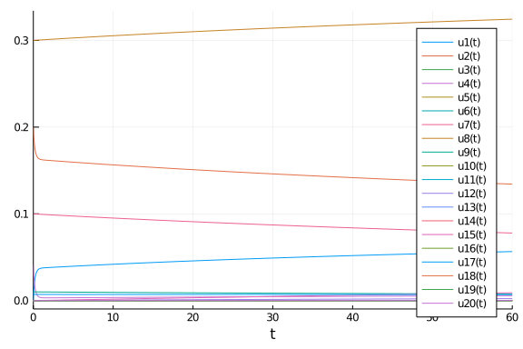
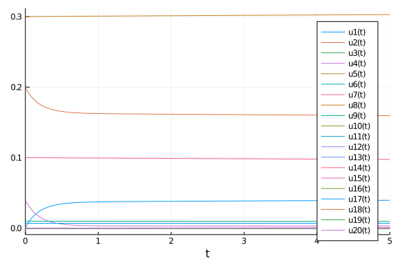
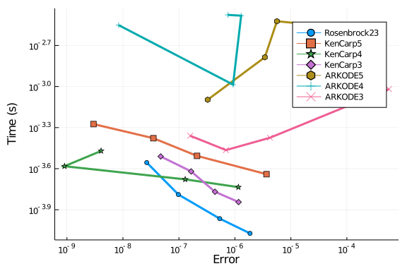
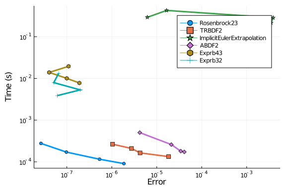

````julia
using OrdinaryDiffEq, DiffEqDevTools, Sundials, ParameterizedFunctions, Plots, ODE, ODEInterfaceDiffEq, LSODA
gr() # gr(fmt=:png)
using LinearAlgebra
LinearAlgebra.BLAS.set_num_threads(1)

const k1=.35e0
const k2=.266e2
const k3=.123e5
const k4=.86e-3
const k5=.82e-3
const k6=.15e5
const k7=.13e-3
const k8=.24e5
const k9=.165e5
const k10=.9e4
const k11=.22e-1
const k12=.12e5
const k13=.188e1
const k14=.163e5
const k15=.48e7
const k16=.35e-3
const k17=.175e-1
const k18=.1e9
const k19=.444e12
const k20=.124e4
const k21=.21e1
const k22=.578e1
const k23=.474e-1
const k24=.178e4
const k25=.312e1

function f(dy,y,p,t)
 r1  = k1 *y[1]
 r2  = k2 *y[2]*y[4]
 r3  = k3 *y[5]*y[2]
 r4  = k4 *y[7]
 r5  = k5 *y[7]
 r6  = k6 *y[7]*y[6]
 r7  = k7 *y[9]
 r8  = k8 *y[9]*y[6]
 r9  = k9 *y[11]*y[2]
 r10 = k10*y[11]*y[1]
 r11 = k11*y[13]
 r12 = k12*y[10]*y[2]
 r13 = k13*y[14]
 r14 = k14*y[1]*y[6]
 r15 = k15*y[3]
 r16 = k16*y[4]
 r17 = k17*y[4]
 r18 = k18*y[16]
 r19 = k19*y[16]
 r20 = k20*y[17]*y[6]
 r21 = k21*y[19]
 r22 = k22*y[19]
 r23 = k23*y[1]*y[4]
 r24 = k24*y[19]*y[1]
 r25 = k25*y[20]

 dy[1]  = -r1-r10-r14-r23-r24+
          r2+r3+r9+r11+r12+r22+r25
 dy[2]  = -r2-r3-r9-r12+r1+r21
 dy[3]  = -r15+r1+r17+r19+r22
 dy[4]  = -r2-r16-r17-r23+r15
 dy[5]  = -r3+r4+r4+r6+r7+r13+r20
 dy[6]  = -r6-r8-r14-r20+r3+r18+r18
 dy[7]  = -r4-r5-r6+r13
 dy[8]  = r4+r5+r6+r7
 dy[9]  = -r7-r8
 dy[10] = -r12+r7+r9
 dy[11] = -r9-r10+r8+r11
 dy[12] = r9
 dy[13] = -r11+r10
 dy[14] = -r13+r12
 dy[15] = r14
 dy[16] = -r18-r19+r16
 dy[17] = -r20
 dy[18] = r20
 dy[19] = -r21-r22-r24+r23+r25
 dy[20] = -r25+r24
end

function fjac(J,y,p,t)
      J .= 0.0
      J[1,1]   = -k1-k10*y[11]-k14*y[6]-k23*y[4]-k24*y[19]
      J[1,11]  = -k10*y[1]+k9*y[2]
      J[1,6]   = -k14*y[1]
      J[1,4]   = -k23*y[1]+k2*y[2]
      J[1,19]  = -k24*y[1]+k22
      J[1,2]   = k2*y[4]+k9*y[11]+k3*y[5]+k12*y[10]
      J[1,13]  = k11
      J[1,20]  = k25
      J[1,5]   = k3*y[2]
      J[1,10]  = k12*y[2]

      J[2,4]   = -k2*y[2]
      J[2,5]   = -k3*y[2]
      J[2,11]  = -k9*y[2]
      J[2,10]  = -k12*y[2]
      J[2,19]  = k21
      J[2,1]   = k1
      J[2,2]   = -k2*y[4]-k3*y[5]-k9*y[11]-k12*y[10]

      J[3,1]   = k1
      J[3,4]   = k17
      J[3,16]  = k19
      J[3,19]  = k22
      J[3,3]   = -k15

      J[4,4]   = -k2*y[2]-k16-k17-k23*y[1]
      J[4,2]   = -k2*y[4]
      J[4,1]   = -k23*y[4]
      J[4,3]   = k15

      J[5,5]   = -k3*y[2]
      J[5,2]   = -k3*y[5]
      J[5,7]   = 2k4+k6*y[6]
      J[5,6]   = k6*y[7]+k20*y[17]
      J[5,9]   = k7
      J[5,14]  = k13
      J[5,17]  = k20*y[6]

      J[6,6]   = -k6*y[7]-k8*y[9]-k14*y[1]-k20*y[17]
      J[6,7]   = -k6*y[6]
      J[6,9]   = -k8*y[6]
      J[6,1]   = -k14*y[6]
      J[6,17]  = -k20*y[6]
      J[6,2]   = k3*y[5]
      J[6,5]   = k3*y[2]
      J[6,16]  = 2k18

      J[7,7]   = -k4-k5-k6*y[6]
      J[7,6]   = -k6*y[7]
      J[7,14]  = k13

      J[8,7]   = k4+k5+k6*y[6]
      J[8,6]   = k6*y[7]
      J[8,9]   = k7

      J[9,9]   = -k7-k8*y[6]
      J[9,6]   = -k8*y[9]

      J[10,10] = -k12*y[2]
      J[10,2]  = -k12*y[10]+k9*y[11]
      J[10,9]  = k7
      J[10,11] = k9*y[2]

      J[11,11] = -k9*y[2]-k10*y[1]
      J[11,2]  = -k9*y[11]
      J[11,1]  = -k10*y[11]
      J[11,9]  = k8*y[6]
      J[11,6]  = k8*y[9]
      J[11,13] = k11

      J[12,11] = k9*y[2]
      J[12,2]  = k9*y[11]

      J[13,13] = -k11
      J[13,11] = k10*y[1]
      J[13,1]  = k10*y[11]

      J[14,14] = -k13
      J[14,10] = k12*y[2]
      J[14,2]  = k12*y[10]

      J[15,1]  = k14*y[6]
      J[15,6]  = k14*y[1]

      J[16,16] = -k18-k19
      J[16,4]  = k16

      J[17,17] = -k20*y[6]
      J[17,6]  = -k20*y[17]

      J[18,17] = k20*y[6]
      J[18,6]  = k20*y[17]

      J[19,19] = -k21-k22-k24*y[1]
      J[19,1]  = -k24*y[19]+k23*y[4]
      J[19,4]  = k23*y[1]
      J[19,20] = k25

      J[20,20] = -k25
      J[20,1]  = k24*y[19]
      J[20,19] = k24*y[1]

      return
end

u0 = zeros(20)
u0[2]  = 0.2
u0[4]  = 0.04
u0[7]  = 0.1
u0[8]  = 0.3
u0[9]  = 0.01
u0[17] = 0.007
prob = ODEProblem(ODEFunction(f, jac=fjac),u0,(0.0,60.0))

sol = solve(prob,Rodas5(),abstol=1/10^14,reltol=1/10^14)
test_sol = TestSolution(sol)
abstols = 1.0 ./ 10.0 .^ (4:11)
reltols = 1.0 ./ 10.0 .^ (1:8);
````


````
8-element Array{Float64,1}:
 0.1
 0.01
 0.001
 0.0001
 1.0e-5
 1.0e-6
 1.0e-7
 1.0e-8
````


````julia
plot(sol)
````




````julia
plot(sol,tspan=(0.0,5.0))
````





## Omissions

The following were omitted from the tests due to convergence failures. ODE.jl's
adaptivity is not able to stabilize its algorithms, while
GeometricIntegratorsDiffEq has not upgraded to Julia 1.0.
GeometricIntegrators.jl's methods used to be either fail to converge at
comparable dts (or on some computers errors due to type conversions).

````julia
#sol = solve(prob,ode23s()); println("Total ODE.jl steps: $(length(sol))")
#using GeometricIntegratorsDiffEq
#try
#    sol = solve(prob,GIRadIIA3(),dt=1/10)
#catch e
#    println(e)
#end
````


The stabilized explicit methods fail.

````julia
setups = [
#Dict(:alg=>ROCK2()),
#Dict(:alg=>ROCK4())
#Dict(:alg=>ESERK5())
]
````


````
0-element Array{Any,1}
````


The EPIRK and exponential methods also fail:

````julia
sol = solve(prob,EXPRB53s3(),dt=2.0^(-8));
````


````
Error: InexactError: trunc(Int64, Inf)
````


````julia
sol = solve(prob,EPIRK4s3B(),dt=2.0^(-8));
````


````
Error: InexactError: trunc(Int64, Inf)
````


````julia
sol = solve(prob,EPIRK5P2(),dt=2.0^(-8));
````


````
retcode: Success
Interpolation: 3rd order Hermite
t: 15361-element Array{Float64,1}:
  0.0
  0.00390625
  0.0078125
  0.01171875
  0.015625
  0.01953125
  0.0234375
  0.02734375
  0.03125
  0.03515625
  ⋮
 59.96875
 59.97265625
 59.9765625
 59.98046875
 59.984375
 59.98828125
 59.9921875
 59.99609375
 60.0
u: 15361-element Array{Array{Float64,1},1}:
 [0.0, 0.2, 0.0, 0.04, 0.0, 0.0, 0.1, 0.3, 0.01, 0.0, 0.0, 0.0, 0.0, 0.0, 0
.0, 0.0, 0.007, 0.0, 0.0, 0.0]
 [0.0008219805131540299, 0.19917801095752233, 2.0563502567328148e-10, 0.039
17956419724961, 2.3582619681121442e-7, 2.9410765063389164e-7, 0.09999845709
055911, 0.3000015481991981, 0.009999853021669721, 2.529378921047842e-8, 2.0
043506612553868e-8, 1.216654286569352e-7, 1.9129510494780006e-10, 1.0123808
201200793e-7, 5.350876495558082e-9, 3.087407735661497e-17, 0.00699999486790
5456, 5.132094544073881e-9, 2.978581368352407e-9, 4.285419171616549e-12]
 [0.0016247338242586589, 0.19837521677879572, 2.612072012079205e-10, 0.0383
8030124412858, 3.4971496424010073e-7, 4.6379695201199464e-7, 0.099995526354
58558, 0.30000448587467143, 0.009999483726072282, 4.4657968858173745e-8, 3.
314357123409278e-8, 4.715760800673718e-7, 1.3982133045801176e-9, 4.35000980
3873253e-7, 3.637387900607056e-8, 3.02479855802291e-17, 0.00699998169495262
8, 1.8305047372094373e-8, 1.1493115150672013e-8, 6.586916883204175e-11]
 [0.002407958732495669, 0.1975919095090435, 3.154375436634084e-10, 0.037601
54313554651, 4.063896496720431e-7, 5.450652668055192e-7, 0.0999918876051537
5, 0.3000081345333246, 0.009999000674914008, 5.423073753127883e-8, 3.953344
234000373e-8, 9.405378956905758e-7, 4.019941772178222e-9, 8.946362921399464
e-7, 1.022230169770184e-7, 2.963424332875256e-17, 0.00699996440700378, 3.55
929962200743e-8, 2.4876007075065313e-8, 3.197475864984921e-10]
 [0.003171744493887124, 0.1968280004910967, 3.683293249789368e-10, 0.036842
64477850668, 4.3074308952271334e-7, 5.770142622377038e-7, 0.099987935557457
69, 0.30001210009903406, 0.009998466922328109, 5.826989959035465e-8, 4.2154
008016303866e-8, 1.4625566429623716e-6, 8.055731505071132e-9, 1.40925283037
3719e-6, 2.0259372371519383e-7, 2.903611344736133e-17, 0.006999945284289526
, 5.471571047264492e-8, 4.243113301483705e-8, 9.6721405195278e-10]
 [0.003916411612522152, 0.19608317317188564, 4.199027567232139e-10, 0.03610
2984774372494, 4.377436299333023e-7, 5.828832755232177e-7, 0.09998388521210
591, 0.30001616781761936, 0.009997916829455644, 5.933835798375604e-8, 4.276
4607301600245e-8, 2.0016541543959203e-6, 1.3363286615438824e-8, 1.940063063
1287573e-6, 3.338844922954957e-7, 2.845321984913385e-17, 0.0069999255695067
56, 7.443049324392098e-8, 6.345530181035366e-8, 2.2562558299901686e-9]
 [0.004642405059285701, 0.19535698700687829, 4.701872267485031e-10, 0.03538
196494207218, 4.3599615353021897e-7, 5.758783078537109e-7, 0.09997984694079
727, 0.30002022735435296, 0.009997368049509693, 5.8909962388343646e-8, 4.23
7152084922936e-8, 2.5393376067316203e-6, 1.977593916416651e-8, 2.4670633411
69356e-6, 4.919744863822924e-7, 2.788494570784191e-17, 0.006999905901180717
, 9.409881928300559e-8, 8.725661950672292e-8, 4.463395577854287e-9]
 [0.005350228551009552, 0.1946489421275031, 5.192165244761254e-10, 0.034679
01012916707, 4.3022917680639446e-7, 5.631689167361495e-7, 0.099975872878565
67, 0.3000242265067192, 0.00999682893422216, 5.779485557447839e-8, 4.152477
10322123e-8, 3.066852273486213e-6, 2.7146658586645518e-8, 2.98075628242511e
-6, 6.732501359597954e-7, 2.733092948771845e-17, 0.006999886581464048, 1.13
41853595155117e-7, 1.1316977012076304e-7, 7.877461431787497e-9]
 [0.006040406864840676, 0.1939585168088369, 5.670261038607765e-10, 0.033993
56729906623, 4.2291899338282446e-7, 5.484585573765662e-7, 0.099971984234016
64, 0.3000281439517046, 0.009996302894574066, 5.641740775276457e-8, 4.05106
59700017454e-8, 3.5806181839668297e-6, 3.535812741357323e-8, 3.477251964668
5567e-6, 8.748287134377105e-7, 2.6790726790238164e-17, 0.006999867733817418
, 1.322661825816341e-7, 1.405683346708844e-7, 1.278557353504999e-8]
 [0.006713465378819361, 0.19328518802723454, 6.136515989812096e-10, 0.03332
510439182137, 4.152909854262616e-7, 5.335478076046044e-7, 0.099968186650105
64, 0.30003197391503733, 0.009995790853860426, 5.498765243303229e-8, 3.9469
76537302462e-8, 4.079662077209273e-6, 4.431972526378151e-8, 3.9554984252451
48e-6, 1.0944769689609055e-6, 2.626389554944705e-17, 0.006999849391717465, 
1.5060828253459265e-7, 1.6887427672026182e-7, 1.9461487666521883e-8]
 ⋮
 [0.05645615762180959, 0.13425911018530057, 4.139263206042651e-9, 0.0055220
71971694571, 2.019291181857006e-7, 1.4648570525794127e-7, 0.077851102681152
86, 0.3244980725337324, 0.007494867173132321, 1.622623797998335e-8, 1.13610
27910410881e-8, 0.002229719538659024, 0.00020867938143077154, 1.39731891057
7692e-5, 0.008960672303449158, 4.35199576422048e-18, 0.006899258857141521, 
0.00010074114286132725, 1.771572137484069e-6, 5.680446793668939e-5]
 [0.05645695733790882, 0.13425777297681096, 4.139322101688764e-9, 0.0055222
055013241, 2.0192519368294373e-7, 1.4648176480042903e-7, 0.0778500262067678
8, 0.32449925542785857, 0.00749476044201705, 1.6225824618290568e-8, 1.13607
2916903839e-8, 0.0022298178486141874, 0.00020868399692947708, 1.39726916533
98533e-5, 0.00896119886778085, 4.3521189419952434e-18, 0.006899253961908033
, 0.00010074603809481543, 1.7716439320601548e-6, 5.680758831940337e-5]
 [0.05645775701737812, 0.13425643581237565, 4.13938099465281e-9, 0.00552233
9028201606, 2.0192126940275442e-7, 1.4647782459158808e-7, 0.077848949763120
04, 0.3245004382875292, 0.007494653715201449, 1.6225411282890605e-8, 1.1360
430446717153e-8, 0.0022299161549948873, 0.00020868861175755564, 1.397219423
5725986e-5, 0.008961725425351556, 4.352218049504522e-18, 0.0068992490668102
11, 0.00010075093319263824, 1.7717157258683965e-6, 5.681070870612205e-5]
 [0.05645855666032726, 0.13425509869181257, 4.139439884942851e-9, 0.0055224
72552345142, 2.0191734534458256e-7, 1.4647388463086325e-7, 0.07784787335006
313, 0.3245016211129051, 0.0074945469926708886, 1.622499797372489e-8, 1.136
013174340484e-8, 0.002230014457814556, 0.00020869322591569024, 1.3971696852
688489e-5, 0.00896225197623204, 4.352315023604478e-18, 0.006899244171847388
4, 0.00010075582815546076, 1.771787518918421e-6, 5.681382909726082e-5]
 [0.05645935626680642, 0.13425376161503932, 4.1394987725625565e-9, 0.005522
606073762818, 2.019134215081701e-7, 1.4646994491799305e-7, 0.07784679696753
115, 0.3245028039040587, 0.007494440274418693, 1.6224584690765686e-8, 1.135
9833059081385e-8, 0.0022301127570793005, 0.00020869783940421975, 1.39711995
04252327e-5, 0.00896277852045384, 4.352432581938682e-18, 0.0068992392770192
66, 0.00010076072298358334, 1.7718593112145065e-6, 5.681694949300268e-5]
 [0.05646015583668705, 0.13425242458227232, 4.139557657502499e-9, 0.0055227
39592432894, 2.0190949789413612e-7, 1.4646600545359652e-7, 0.07784572061569
87, 0.3245039866607984, 0.007494333560462043, 1.6224171434077603e-8, 1.1359
53439379348e-8, 0.0022302110527732564, 0.0002087024522224518, 1.39707021904
94956e-5, 0.008963305057930799, 4.352530106843543e-18, 0.006899234382326637
, 0.0001007656176762122, 1.771931102744884e-6, 5.68200698928331e-5]
 [0.05646095537003125, 0.13425108759340923, 4.139616539767228e-9, 0.0055228
73108365466, 2.0190557450216435e-7, 1.4646206623735343e-7, 0.07784464429448
373, 0.3245051693832143, 0.007494226850792671, 1.6223758203626733e-8, 1.135
9235747516611e-8, 0.0022303093449039953, 0.00020870706437079407, 1.39702049
11375249e-5, 0.008963831588702292, 4.352630670676236e-18, 0.006899229487769
129, 0.0001007705122337206, 1.7720028935149011e-6, 5.68231902969815e-5]
 [0.056461754866829625, 0.13424975064846725, 4.13967541935605e-9, 0.0055230
06621558691, 2.0190165133228926e-7, 1.4645812726929574e-7, 0.07784356800390
047, 0.3245063520712909, 0.007494120145411854, 1.6223344999416103e-8, 1.135
8937120252957e-8, 0.002230407633470301, 0.00020871167584924182, 1.396970766
6896544e-5, 0.008964358112760628, 4.352735480630454e-18, 0.0068992245933468
055, 0.00010077540665604419, 1.772074683523487e-6, 5.682631070539837e-5]
 [0.05646255432713235, 0.13424841374736396, 4.139734296272654e-9, 0.0055231
40132020677, 2.018977283842528e-7, 1.4645418854916202e-7, 0.077842491743882
91, 0.32450753472510085, 0.007494013444312918, 1.6222931821417966e-8, 1.135
8638511982452e-8, 0.0022305059184782802, 0.0002087162866581338, 1.396921045
7025133e-5, 0.008964884630137337, 4.352848183498503e-18, 0.0068992196990593
67, 0.00010078030094348328, 1.772146472774919e-6, 5.6829431118266636e-5]
````


## High Tolerances

This is the speed when you just want the answer.

````julia
abstols = 1.0 ./ 10.0 .^ (5:8)
reltols = 1.0 ./ 10.0 .^ (1:4);
setups = [Dict(:alg=>Rosenbrock23()),
          Dict(:alg=>Rodas3()),
          Dict(:alg=>TRBDF2()),
          Dict(:alg=>CVODE_BDF()),
          Dict(:alg=>rodas()),
          Dict(:alg=>radau()),
          Dict(:alg=>lsoda()),
          Dict(:alg=>RadauIIA5()),
          ]
wp = WorkPrecisionSet(prob,abstols,reltols,setups;verbose=false,
                      save_everystep=false,appxsol=test_sol,maxiters=Int(1e5),numruns=10)
````


````
Error: Cannot find method(s) for rodas! I've tried to loadODESolvers(), but
 it didn't work. Please check ODEInterface.help_solversupport() and call lo
adODESolvers and check also this output. For further information see also O
DEInterface.help_install.
````


````julia
plot(wp)
````


````
Error: UndefVarError: wp not defined
````


````julia
wp = WorkPrecisionSet(prob,abstols,reltols,setups;dense = false,verbose = false,
                      appxsol=test_sol,maxiters=Int(1e5),error_estimate=:l2,numruns=10)
````


````
Error: Cannot find method(s) for rodas! I've tried to loadODESolvers(), but
 it didn't work. Please check ODEInterface.help_solversupport() and call lo
adODESolvers and check also this output. For further information see also O
DEInterface.help_install.
````


````julia
plot(wp)
````


````
Error: UndefVarError: wp not defined
````


````julia
wp = WorkPrecisionSet(prob,abstols,reltols,setups;verbose=false,
                      appxsol=test_sol,maxiters=Int(1e5),error_estimate=:L2,numruns=10)
````


````
Error: Cannot find method(s) for rodas! I've tried to loadODESolvers(), but
 it didn't work. Please check ODEInterface.help_solversupport() and call lo
adODESolvers and check also this output. For further information see also O
DEInterface.help_install.
````


````julia
plot(wp)
````


````
Error: UndefVarError: wp not defined
````


````julia
setups = [Dict(:alg=>Rosenbrock23()),
          Dict(:alg=>Kvaerno3()),
          Dict(:alg=>CVODE_BDF()),
          Dict(:alg=>KenCarp4()),
          Dict(:alg=>TRBDF2()),
          Dict(:alg=>KenCarp3()),
          Dict(:alg=>Rodas4()),
          Dict(:alg=>radau())]
wp = WorkPrecisionSet(prob,abstols,reltols,setups;
                      save_everystep=false,appxsol=test_sol,maxiters=Int(1e5),numruns=10)
````


````
Error: Cannot find method(s) for radau! I've tried to loadODESolvers(), but
 it didn't work. Please check ODEInterface.help_solversupport() and call lo
adODESolvers and check also this output. For further information see also O
DEInterface.help_install.
````


````julia
plot(wp)
````


````
Error: UndefVarError: wp not defined
````


````julia
wp = WorkPrecisionSet(prob,abstols,reltols,setups;dense = false,verbose = false,
                      appxsol=test_sol,maxiters=Int(1e5),error_estimate=:l2,numruns=10)
````


````
Error: Cannot find method(s) for radau! I've tried to loadODESolvers(), but
 it didn't work. Please check ODEInterface.help_solversupport() and call lo
adODESolvers and check also this output. For further information see also O
DEInterface.help_install.
````


````julia
plot(wp)
````


````
Error: UndefVarError: wp not defined
````


````julia
wp = WorkPrecisionSet(prob,abstols,reltols,setups;
                      appxsol=test_sol,maxiters=Int(1e5),error_estimate=:L2,numruns=10)
````


````
Error: Cannot find method(s) for radau! I've tried to loadODESolvers(), but
 it didn't work. Please check ODEInterface.help_solversupport() and call lo
adODESolvers and check also this output. For further information see also O
DEInterface.help_install.
````


````julia
plot(wp)
````


````
Error: UndefVarError: wp not defined
````


````julia
setups = [Dict(:alg=>Rosenbrock23()),
          Dict(:alg=>KenCarp5()),
          Dict(:alg=>KenCarp4()),
          Dict(:alg=>KenCarp3()),
          Dict(:alg=>ARKODE(order=5)),
          Dict(:alg=>ARKODE()),
          Dict(:alg=>ARKODE(order=3))]
names = ["Rosenbrock23" "KenCarp5" "KenCarp4" "KenCarp3" "ARKODE5" "ARKODE4" "ARKODE3"]
wp = WorkPrecisionSet(prob,abstols,reltols,setups;
                      names=names,save_everystep=false,appxsol=test_sol,maxiters=Int(1e5),numruns=10)
plot(wp)
````




````julia
setups = [Dict(:alg=>Rosenbrock23()),
          Dict(:alg=>TRBDF2()),
          Dict(:alg=>ImplicitEulerExtrapolation()),
          #Dict(:alg=>ImplicitDeuflhardExtrapolation()), # Diverges
          #Dict(:alg=>ImplicitHairerWannerExtrapolation()), # Diverges
          Dict(:alg=>ABDF2()),
          #Dict(:alg=>QNDF()),
          Dict(:alg=>Exprb43()),
          Dict(:alg=>Exprb32()),
]
wp = WorkPrecisionSet(prob,abstols,reltols,setups;
                      save_everystep=false,appxsol=test_sol,maxiters=Int(1e5))
plot(wp)
````


### Low Tolerances

This is the speed at lower tolerances, measuring what's good when accuracy is needed.

````julia
abstols = 1.0 ./ 10.0 .^ (7:13)
reltols = 1.0 ./ 10.0 .^ (4:10)

setups = [Dict(:alg=>GRK4A()),
          Dict(:alg=>Rodas4P()),
          Dict(:alg=>CVODE_BDF()),
          Dict(:alg=>ddebdf()),
          Dict(:alg=>Rodas4()),
          Dict(:alg=>rodas()),
          Dict(:alg=>radau()),
          Dict(:alg=>lsoda())
          ]
wp = WorkPrecisionSet(prob,abstols,reltols,setups;verbose=false,
                      save_everystep=false,appxsol=test_sol,maxiters=Int(1e5),numruns=10)
````


````
Error: Cannot find method(s) for ddebdf! I've tried to loadODESolvers(), bu
t it didn't work. Please check ODEInterface.help_solversupport() and call l
oadODESolvers and check also this output. For further information see also 
ODEInterface.help_install.
````


````julia
plot(wp)
````


````julia
wp = WorkPrecisionSet(prob,abstols,reltols,setups;verbose=false,
                      dense=false,appxsol=test_sol,maxiters=Int(1e5),error_estimate=:l2,numruns=10)
````


````
Error: Cannot find method(s) for ddebdf! I've tried to loadODESolvers(), bu
t it didn't work. Please check ODEInterface.help_solversupport() and call l
oadODESolvers and check also this output. For further information see also 
ODEInterface.help_install.
````


````julia
plot(wp)
````




````julia
wp = WorkPrecisionSet(prob,abstols,reltols,setups;verbose=false,
                      appxsol=test_sol,maxiters=Int(1e5),error_estimate=:L2,numruns=10)
````


````
Error: Cannot find method(s) for ddebdf! I've tried to loadODESolvers(), bu
t it didn't work. Please check ODEInterface.help_solversupport() and call l
oadODESolvers and check also this output. For further information see also 
ODEInterface.help_install.
````


````julia
plot(wp)
````


````julia
setups = [
          Dict(:alg=>Rodas5()),
          Dict(:alg=>Kvaerno4()),
          Dict(:alg=>Kvaerno5()),
          Dict(:alg=>CVODE_BDF()),
          Dict(:alg=>KenCarp4()),
          Dict(:alg=>KenCarp5()),
          Dict(:alg=>Rodas4()),
          Dict(:alg=>radau())]
wp = WorkPrecisionSet(prob,abstols,reltols,setups;
                      save_everystep=false,appxsol=test_sol,maxiters=Int(1e5),numruns=10)
````


````
Error: Cannot find method(s) for radau! I've tried to loadODESolvers(), but
 it didn't work. Please check ODEInterface.help_solversupport() and call lo
adODESolvers and check also this output. For further information see also O
DEInterface.help_install.
````


````julia
plot(wp)
````


````julia
wp = WorkPrecisionSet(prob,abstols,reltols,setups;verbose=false,
                      dense=false,appxsol=test_sol,maxiters=Int(1e5),error_estimate=:l2,numruns=10)
````


````
Error: Cannot find method(s) for radau! I've tried to loadODESolvers(), but
 it didn't work. Please check ODEInterface.help_solversupport() and call lo
adODESolvers and check also this output. For further information see also O
DEInterface.help_install.
````


````julia
plot(wp)
````


````julia
wp = WorkPrecisionSet(prob,abstols,reltols,setups;
                      appxsol=test_sol,maxiters=Int(1e5),error_estimate=:L2,numruns=10)
````


````
Error: Cannot find method(s) for radau! I've tried to loadODESolvers(), but
 it didn't work. Please check ODEInterface.help_solversupport() and call lo
adODESolvers and check also this output. For further information see also O
DEInterface.help_install.
````


````julia
plot(wp)
````


The following algorithms were removed since they failed.

````julia
#setups = [#Dict(:alg=>Hairer4()),
          #Dict(:alg=>Hairer42()),
          #Dict(:alg=>Rodas3()),
          #Dict(:alg=>Cash4())
#]
#wp = WorkPrecisionSet(prob,abstols,reltols,setups;
#                      save_everystep=false,appxsol=test_sol,maxiters=Int(1e5),numruns=10)
#plot(wp)
````


### Conclusion

Sundials `CVODE_BDF` the best here. `lsoda` does well at high tolerances but then grows fast when tolerances get too low. `KenCarp4` or `Rodas5` is a decent substitute when necessary.

````julia
using DiffEqBenchmarks
DiffEqBenchmarks.bench_footer(WEAVE_ARGS[:folder],WEAVE_ARGS[:file])
````


## Appendix

These benchmarks are a part of the DiffEqBenchmarks.jl repository, found at: [https://github.com/JuliaDiffEq/DiffEqBenchmarks.jl](https://github.com/JuliaDiffEq/DiffEqBenchmarks.jl)

To locally run this tutorial, do the following commands:

```
using DiffEqBenchmarks
DiffEqBenchmarks.weave_file("StiffODE","Pollution.jmd")
```

Computer Information:

```
Julia Version 1.4.2
Commit 44fa15b150* (2020-05-23 18:35 UTC)
Platform Info:
  OS: Linux (x86_64-pc-linux-gnu)
  CPU: Intel(R) Core(TM) i7-9700K CPU @ 3.60GHz
  WORD_SIZE: 64
  LIBM: libopenlibm
  LLVM: libLLVM-8.0.1 (ORCJIT, skylake)
Environment:
  JULIA_DEPOT_PATH = /builds/JuliaGPU/DiffEqBenchmarks.jl/.julia
  JULIA_CUDA_MEMORY_LIMIT = 2147483648
  JULIA_PROJECT = @.
  JULIA_NUM_THREADS = 4

```

Package Information:

```
Status: `/builds/JuliaGPU/DiffEqBenchmarks.jl/benchmarks/StiffODE/Project.toml`
[eb300fae-53e8-50a0-950c-e21f52c2b7e0] DiffEqBiological 4.3.0
[f3b72e0c-5b89-59e1-b016-84e28bfd966d] DiffEqDevTools 2.22.0
[5a33fad7-5ce4-5983-9f5d-5f26ceab5c96] GeometricIntegratorsDiffEq 0.1.0
[7f56f5a3-f504-529b-bc02-0b1fe5e64312] LSODA 0.6.1
[c030b06c-0b6d-57c2-b091-7029874bd033] ODE 2.5.0
[09606e27-ecf5-54fc-bb29-004bd9f985bf] ODEInterfaceDiffEq 3.7.0
[1dea7af3-3e70-54e6-95c3-0bf5283fa5ed] OrdinaryDiffEq 5.41.0
[65888b18-ceab-5e60-b2b9-181511a3b968] ParameterizedFunctions 5.3.0
[91a5bcdd-55d7-5caf-9e0b-520d859cae80] Plots 1.5.3
[b4db0fb7-de2a-5028-82bf-5021f5cfa881] ReactionNetworkImporters 0.1.5
[c3572dad-4567-51f8-b174-8c6c989267f4] Sundials 4.2.5
[a759f4b9-e2f1-59dc-863e-4aeb61b1ea8f] TimerOutputs 0.5.6
[37e2e46d-f89d-539d-b4ee-838fcccc9c8e] LinearAlgebra 
```

