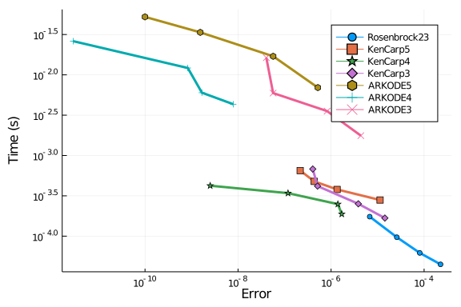
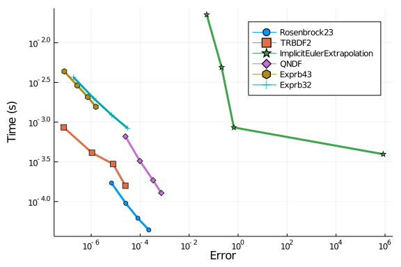
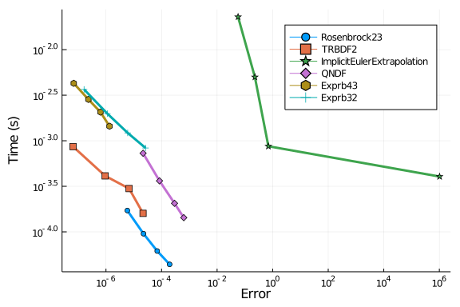
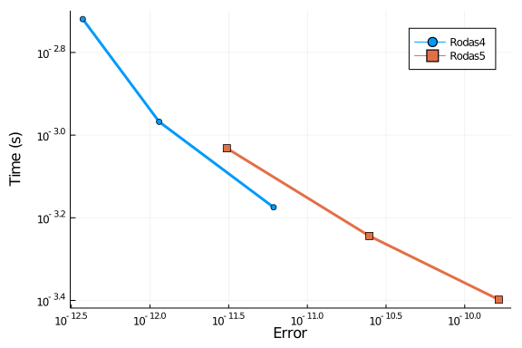

````julia
using OrdinaryDiffEq, DiffEqDevTools, Sundials, ParameterizedFunctions, Plots, ODE, ODEInterfaceDiffEq, LSODA
gr()
using LinearAlgebra
LinearAlgebra.BLAS.set_num_threads(1)

rober = @ode_def begin
  dy₁ = -k₁*y₁+k₃*y₂*y₃
  dy₂ =  k₁*y₁-k₂*y₂^2-k₃*y₂*y₃
  dy₃ =  k₂*y₂^2
end k₁ k₂ k₃
prob = ODEProblem(rober,[1.0,0.0,0.0],(0.0,1e5),(0.04,3e7,1e4))
sol = solve(prob,CVODE_BDF(),abstol=1/10^14,reltol=1/10^14)
test_sol = TestSolution(sol)
abstols = 1.0 ./ 10.0 .^ (4:11)
reltols = 1.0 ./ 10.0 .^ (1:8);
````


````
8-element Array{Float64,1}:
 0.1
 0.01
 0.001
 0.0001
 1.0e-5
 1.0e-6
 1.0e-7
 1.0e-8
````


````julia
plot(sol,labels=["y1","y2","y3"])
````


## Omissions And Tweaking

The following were omitted from the tests due to convergence failures. ODE.jl's
adaptivity is not able to stabilize its algorithms, while
GeometricIntegratorsDiffEq has not upgraded to Julia 1.0.
GeometricIntegrators.jl's methods used to be either fail to converge at
comparable dts (or on some computers errors due to type conversions).

````julia
#sol = solve(prob,ode23s()); println("Total ODE.jl steps: $(length(sol))")
#using GeometricIntegratorsDiffEq
#try
#    sol = solve(prob,GIRadIIA3(),dt=1/10)
#catch e
#    println(e)
#end
````


`ARKODE` needs a lower `nonlinear_convergence_coefficient` in order to not diverge.

````julia
#sol = solve(prob,ARKODE(nonlinear_convergence_coefficient = 1e-6),abstol=1e-5,reltol=1e-1); # Noisy, output omitted
````


````julia
sol = solve(prob,ARKODE(nonlinear_convergence_coefficient = 1e-7),abstol=1e-5,reltol=1e-1);
````


````
retcode: Success
Interpolation: 3rd order Hermite
t: 385-element Array{Float64,1}:
      0.0
      6.823937919616057e-6
      4.194111931497748e-5
      7.705830071033889e-5
      0.00011812564799716356
      0.00015919299528398823
      0.00019473885760988623
      0.0002302847199357842
      0.00035022443063666944
      0.00038020935831189074
      ⋮
  62450.26310057348
  70536.63677961758
  78623.01045866167
  78957.02592024508
  79291.0413818285
  81054.01621605121
  83798.217146969
  93021.2875410419
 100000.0
u: 385-element Array{Array{Float64,1},1}:
 [1.0, 0.0, 0.0]
 [0.9999997270425205, 2.72952395412688e-7, 5.084119036489719e-12]
 [0.9999983223566348, 1.6764639202776004e-6, 1.1794449124939497e-9]
 [0.9999969176727255, 3.07502694912627e-6, 7.300325444722892e-9]
 [0.9999952749852724, 4.6988176517206366e-6, 2.619707607178777e-8]
 [0.9999936323005916, 6.303925964595367e-6, 6.377344407902863e-8]
 [0.9999922104763843, 7.673474247665867e-6, 1.160493681292835e-7]
 [0.9999907886544295, 9.02079987816384e-6, 1.905456924629883e-7]
 [0.9999859911271564, 1.3359747132384226e-5, 6.491257113639376e-7]
 [0.9999847917506273, 1.4385869142677054e-5, 8.223802300319677e-7]
 ⋮
 [0.026919791481076052, 1.1080274672128835e-7, 0.9730800977161898]
 [0.024252831120375448, 9.62216107464543e-8, 0.975747072658026]
 [0.022076376153276338, 5.623379155293192e-8, 0.9779235676129406]
 [0.02199498954140826, 9.00387535223304e-8, 0.9780049204198467]
 [0.02191424491866828, 9.23793668985613e-8, 0.9780856627019733]
 [0.021497918504541656, 9.204611150591026e-8, 0.9785019894493556]
 [0.020881079924596074, 8.519003071552104e-8, 0.9791188348853826]
 [0.019048726877150486, 8.042715971555324e-8, 0.9809511926956965]
 [0.017866016778411445, 7.285304497393234e-8, 0.9821339103685527]
````


Note that `1e-7` matches the value from the Sundials manual which was required for their example to converge on this problem. The default is `1e-1`.

````julia
#sol = solve(prob,ARKODE(order=3),abstol=1e-4,reltol=1e-1); # Fails to diverge but doesn't finish
````


````julia
#sol = solve(prob,ARKODE(order=5),abstol=1e-4,reltol=1e-1); # Noisy, output omitted
````


````julia
#sol = solve(prob,ARKODE(order=5,nonlinear_convergence_coefficient = 1e-9),abstol=1e-5,reltol=1e-1); # Noisy, output omitted
````


Additionally, the ROCK methods do not perform well on this benchmark.

````julia
setups = [
          #Dict(:alg=>ROCK2())    #Unstable
          #Dict(:alg=>ROCK4())    #needs more iterations
          ]
````


````
0-element Array{Any,1}
````


Some of the bad Rosenbrocks fail:

````julia
setups = [
  #Dict(:alg=>Hairer4()),
  #Dict(:alg=>Hairer42()),
  #Dict(:alg=>Cash4()),
]
````


````
0-element Array{Any,1}
````


The EPIRK and exponential methods also fail:

````julia
sol = solve(prob,EXPRB53s3(),dt=2.0^(-8));
````


````
Error: InexactError: trunc(Int64, Inf)
````


````julia
sol = solve(prob,EPIRK4s3B(),dt=2.0^(-8));
````


````
Error: InexactError: trunc(Int64, Inf)
````


````julia
sol = solve(prob,EPIRK5P2(),dt=2.0^(-8));
````


````
Error: InexactError: trunc(Int64, Inf)
````


PDIRK44 also fails

````julia
sol = solve(prob,PDIRK44(),dt=2.0^(-8));
````


````
retcode: ConvergenceFailure
Interpolation: 3rd order Hermite
t: 1-element Array{Float64,1}:
 0.0
u: 1-element Array{Array{Float64,1},1}:
 [1.0, 0.0, 0.0]
````


In fact, all non-adaptive methods fail on this problem.

## High Tolerances

This is the speed when you just want the answer. `ode23s` from ODE.jl was removed since it fails. Note that at high tolerances Sundials' `CVODE_BDF` fails as well so it's excluded from this test.

````julia
abstols = 1.0 ./ 10.0 .^ (5:8)
reltols = 1.0 ./ 10.0 .^ (1:4);
setups = [Dict(:alg=>Rosenbrock23()),
          Dict(:alg=>Rodas3()),
          Dict(:alg=>TRBDF2()),
          Dict(:alg=>rodas()),
          Dict(:alg=>lsoda()),
          Dict(:alg=>radau()),
          Dict(:alg=>RadauIIA5()),
          Dict(:alg=>ROS34PW1a()),
          ]
gr()
wp = WorkPrecisionSet(prob,abstols,reltols,setups;
                      save_everystep=false,appxsol=test_sol,maxiters=Int(1e5),numruns=10)
````


````
Error: Cannot find method(s) for rodas! I've tried to loadODESolvers(), but
 it didn't work. Please check ODEInterface.help_solversupport() and call lo
adODESolvers and check also this output. For further information see also O
DEInterface.help_install.
````


````julia
plot(wp)
````


````
Error: UndefVarError: wp not defined
````


````julia
setups = [Dict(:alg=>Rosenbrock23()),
          Dict(:alg=>Kvaerno3()),
          Dict(:alg=>KenCarp4()),
          Dict(:alg=>TRBDF2()),
          Dict(:alg=>KenCarp3()),
          # Dict(:alg=>SDIRK2()), # Removed because it's bad
          Dict(:alg=>radau())]
names = ["Rosenbrock23" "Kvaerno3" "KenCarp4" "TRBDF2" "KenCarp3" "radau"]
wp = WorkPrecisionSet(prob,abstols,reltols,setups;names=names,
                      save_everystep=false,appxsol=test_sol,maxiters=Int(1e5),numruns=10)
````


````
Error: Cannot find method(s) for radau! I've tried to loadODESolvers(), but
 it didn't work. Please check ODEInterface.help_solversupport() and call lo
adODESolvers and check also this output. For further information see also O
DEInterface.help_install.
````


````julia
plot(wp)
````


````
Error: UndefVarError: wp not defined
````


````julia
setups = [Dict(:alg=>Rosenbrock23()),
          Dict(:alg=>KenCarp5()),
          Dict(:alg=>KenCarp4()),
          Dict(:alg=>KenCarp3()),
          Dict(:alg=>ARKODE(nonlinear_convergence_coefficient = 1e-9,order=5)),
          Dict(:alg=>ARKODE(nonlinear_convergence_coefficient = 1e-8)),
          Dict(:alg=>ARKODE(nonlinear_convergence_coefficient = 1e-7,order=3))
]
names = ["Rosenbrock23" "KenCarp5" "KenCarp4" "KenCarp3" "ARKODE5" "ARKODE4" "ARKODE3"]
wp = WorkPrecisionSet(prob,abstols,reltols,setups;
                      names=names,
                      save_everystep=false,appxsol=test_sol,maxiters=Int(1e5),numruns=10)
plot(wp)
````




````julia
setups = [Dict(:alg=>Rosenbrock23()),
          Dict(:alg=>TRBDF2()),
          Dict(:alg=>ImplicitEulerExtrapolation()),
          #Dict(:alg=>ImplicitDeuflhardExtrapolation()), # Diverges
          #Dict(:alg=>ImplicitHairerWannerExtrapolation()), # Diverges
          #Dict(:alg=>ABDF2()), # Maxiters
          Dict(:alg=>QNDF()),
          Dict(:alg=>Exprb43()),
          Dict(:alg=>Exprb32()),
]
wp = WorkPrecisionSet(prob,abstols,reltols,setups;
                      save_everystep=false,appxsol=test_sol,maxiters=Int(1e5),numruns=10)
plot(wp)
````


### Timeseries Errors

````julia
abstols = 1.0 ./ 10.0 .^ (5:8)
reltols = 1.0 ./ 10.0 .^ (1:4);
setups = [Dict(:alg=>Rosenbrock23()),
          Dict(:alg=>Rodas3()),
          Dict(:alg=>TRBDF2()),
          Dict(:alg=>rodas()),
          Dict(:alg=>lsoda()),
          Dict(:alg=>radau()),
          Dict(:alg=>RadauIIA5()),
          Dict(:alg=>ROS34PW1a()),
          ]
gr()
wp = WorkPrecisionSet(prob,abstols,reltols,setups;error_estimate=:l2,
                      save_everystep=false,appxsol=test_sol,maxiters=Int(1e5),numruns=10)
````


````
Error: Cannot find method(s) for rodas! I've tried to loadODESolvers(), but
 it didn't work. Please check ODEInterface.help_solversupport() and call lo
adODESolvers and check also this output. For further information see also O
DEInterface.help_install.
````


````julia
plot(wp)
````


````julia
setups = [Dict(:alg=>Rosenbrock23()),
          Dict(:alg=>Kvaerno3()),
          Dict(:alg=>KenCarp4()),
          Dict(:alg=>TRBDF2()),
          Dict(:alg=>KenCarp3()),
    # Dict(:alg=>SDIRK2()), # Removed because it's bad
          Dict(:alg=>radau())]
names = ["Rosenbrock23" "Kvaerno3" "KenCarp4" "TRBDF2" "KenCarp3" "radau"]
wp = WorkPrecisionSet(prob,abstols,reltols,setups;names=names,
                      appxsol=test_sol,maxiters=Int(1e5),error_estimate=:l2,numruns=10)
````


````
Error: Cannot find method(s) for radau! I've tried to loadODESolvers(), but
 it didn't work. Please check ODEInterface.help_solversupport() and call lo
adODESolvers and check also this output. For further information see also O
DEInterface.help_install.
````


````julia
plot(wp)
````




````julia
setups = [Dict(:alg=>Rosenbrock23()),
          Dict(:alg=>TRBDF2()),
          Dict(:alg=>ImplicitEulerExtrapolation()),
          #Dict(:alg=>ImplicitDeuflhardExtrapolation()), # Diverges
          #Dict(:alg=>ImplicitHairerWannerExtrapolation()), # Diverges
          #Dict(:alg=>ABDF2()), # Maxiters
          Dict(:alg=>QNDF()),
          Dict(:alg=>Exprb43()),
          Dict(:alg=>Exprb32()),
]
wp = WorkPrecisionSet(prob,abstols,reltols,setups;verbose=false,error_estimate=:l2,
                      save_everystep=false,appxsol=test_sol,maxiters=Int(1e5),numruns=10)
plot(wp)
````


### Low Tolerances

This is the speed at lower tolerances, measuring what's good when accuracy is needed.

````julia
abstols = 1.0 ./ 10.0 .^ (7:12)
reltols = 1.0 ./ 10.0 .^ (4:9)

setups = [Dict(:alg=>Rodas5()),
          Dict(:alg=>Rodas4P()),
          Dict(:alg=>CVODE_BDF()),
          Dict(:alg=>ddebdf()),
          Dict(:alg=>Rodas4()),
          Dict(:alg=>rodas()),
          Dict(:alg=>lsoda()),
          Dict(:alg=>radau()),
          Dict(:alg=>RadauIIA5()),
]
wp = WorkPrecisionSet(prob,abstols,reltols,setups;
                      save_everystep=false,appxsol=test_sol,maxiters=Int(1e5),numruns=10)
````


````
Error: Cannot find method(s) for ddebdf! I've tried to loadODESolvers(), bu
t it didn't work. Please check ODEInterface.help_solversupport() and call l
oadODESolvers and check also this output. For further information see also 
ODEInterface.help_install.
````


````julia
plot(wp)
````




````julia
setups = [Dict(:alg=>Rodas4P()),
          Dict(:alg=>Kvaerno4()),
          Dict(:alg=>Kvaerno5()),
          Dict(:alg=>CVODE_BDF()),
          Dict(:alg=>KenCarp4()),
          Dict(:alg=>KenCarp5()),
          Dict(:alg=>Rodas4()),
          Dict(:alg=>Rodas5()),
          Dict(:alg=>radau())]
wp = WorkPrecisionSet(prob,abstols,reltols,setups;
                      save_everystep=false,appxsol=test_sol,maxiters=Int(1e5),numruns=10)
````


````
Error: Cannot find method(s) for radau! I've tried to loadODESolvers(), but
 it didn't work. Please check ODEInterface.help_solversupport() and call lo
adODESolvers and check also this output. For further information see also O
DEInterface.help_install.
````


````julia
plot(wp)
````


````julia
abstols = 1.0 ./ 10.0 .^ (10:12)
reltols = 1.0 ./ 10.0 .^ (7:9)

setups = [Dict(:alg=>Rodas4())
          Dict(:alg=>Rodas5())]
names = ["Rodas4" "Rodas5"]
wp = WorkPrecisionSet(prob,abstols,reltols,setups;names=names,
                      save_everystep=false,appxsol=test_sol,maxiters=Int(1e5),numruns=10)
plot(wp)
````





### Conclusion

At high tolerances, `Rosenbrock23` and `lsoda` hit the the error estimates and are fast. At lower tolerances and normal user tolerances, `Rodas4` and `Rodas5` are extremely fast. `lsoda` does quite well across both ends. When you get down to `reltol=1e-9` `radau` begins to become as efficient as `Rodas4`, and it continues to do well below that.

````julia
using DiffEqBenchmarks
DiffEqBenchmarks.bench_footer(WEAVE_ARGS[:folder],WEAVE_ARGS[:file])
````


## Appendix

These benchmarks are a part of the DiffEqBenchmarks.jl repository, found at: [https://github.com/JuliaDiffEq/DiffEqBenchmarks.jl](https://github.com/JuliaDiffEq/DiffEqBenchmarks.jl)

To locally run this tutorial, do the following commands:

```
using DiffEqBenchmarks
DiffEqBenchmarks.weave_file("StiffODE","ROBER.jmd")
```

Computer Information:

```
Julia Version 1.4.2
Commit 44fa15b150* (2020-05-23 18:35 UTC)
Platform Info:
  OS: Linux (x86_64-pc-linux-gnu)
  CPU: Intel(R) Core(TM) i7-9700K CPU @ 3.60GHz
  WORD_SIZE: 64
  LIBM: libopenlibm
  LLVM: libLLVM-8.0.1 (ORCJIT, skylake)
Environment:
  JULIA_DEPOT_PATH = /builds/JuliaGPU/DiffEqBenchmarks.jl/.julia
  JULIA_CUDA_MEMORY_LIMIT = 2147483648
  JULIA_PROJECT = @.
  JULIA_NUM_THREADS = 4

```

Package Information:

```
Status: `/builds/JuliaGPU/DiffEqBenchmarks.jl/benchmarks/StiffODE/Project.toml`
[eb300fae-53e8-50a0-950c-e21f52c2b7e0] DiffEqBiological 4.3.0
[f3b72e0c-5b89-59e1-b016-84e28bfd966d] DiffEqDevTools 2.22.0
[5a33fad7-5ce4-5983-9f5d-5f26ceab5c96] GeometricIntegratorsDiffEq 0.1.0
[7f56f5a3-f504-529b-bc02-0b1fe5e64312] LSODA 0.6.1
[c030b06c-0b6d-57c2-b091-7029874bd033] ODE 2.5.0
[09606e27-ecf5-54fc-bb29-004bd9f985bf] ODEInterfaceDiffEq 3.7.0
[1dea7af3-3e70-54e6-95c3-0bf5283fa5ed] OrdinaryDiffEq 5.41.0
[65888b18-ceab-5e60-b2b9-181511a3b968] ParameterizedFunctions 5.3.0
[91a5bcdd-55d7-5caf-9e0b-520d859cae80] Plots 1.5.3
[b4db0fb7-de2a-5028-82bf-5021f5cfa881] ReactionNetworkImporters 0.1.5
[c3572dad-4567-51f8-b174-8c6c989267f4] Sundials 4.2.5
[a759f4b9-e2f1-59dc-863e-4aeb61b1ea8f] TimerOutputs 0.5.6
[37e2e46d-f89d-539d-b4ee-838fcccc9c8e] LinearAlgebra 
```

