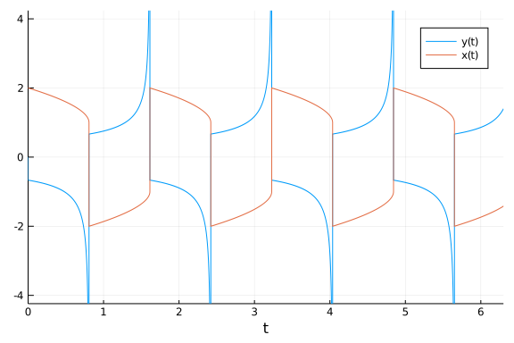
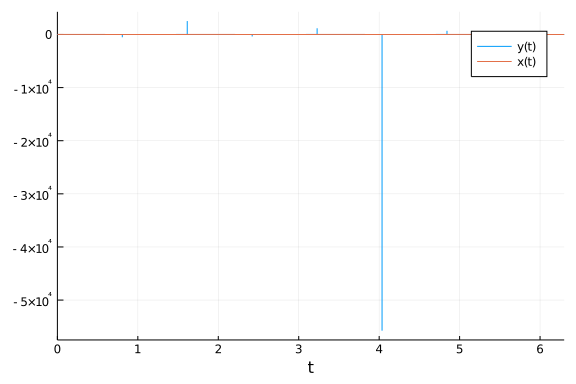
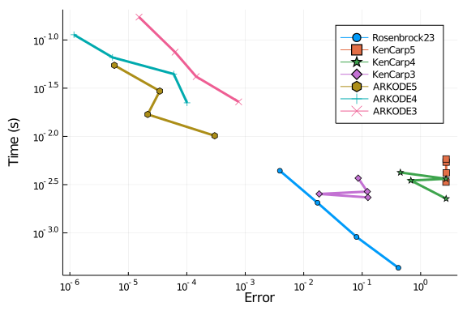
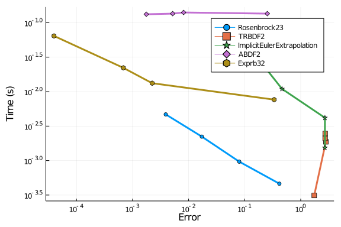
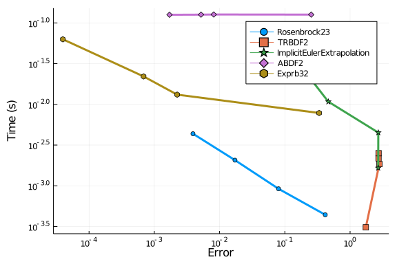
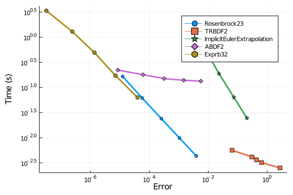

````julia
using OrdinaryDiffEq, DiffEqDevTools, Sundials, ParameterizedFunctions, Plots, ODE, ODEInterfaceDiffEq, ODEInterface, LSODA
````


````
Error: ArgumentError: Package ODEInterface not found in current path:
- Run `import Pkg; Pkg.add("ODEInterface")` to install the ODEInterface pac
kage.
````


````julia
gr()
using LinearAlgebra
LinearAlgebra.BLAS.set_num_threads(1)

van = @ode_def begin
  dy = μ*((1-x^2)*y - x)
  dx = 1*y
end μ

prob = ODEProblem(van,[0;2.],(0.0,6.3),1e6)
abstols = 1.0 ./ 10.0 .^ (5:9)
reltols = 1.0 ./ 10.0 .^ (2:6)

sol = solve(prob,CVODE_BDF(),abstol=1/10^14,reltol=1/10^14)
test_sol = TestSolution(sol)
````


````
retcode: Success
Interpolation: 3rd order Hermite
t: nothing
u: nothing
````


### Plot Test

````julia
plot(sol,ylim=[-4;4])
````




````julia
plot(sol)
````





## Omissions And Tweaking

The following were omitted from the tests due to convergence failures. ODE.jl's
adaptivity is not able to stabilize its algorithms, while
GeometricIntegratorsDiffEq has not upgraded to Julia 1.0.
GeometricIntegrators.jl's methods used to be either fail to converge at
comparable dts (or on some computers errors due to type conversions).

````julia
#sol = solve(prob,ode23s()); println("Total ODE.jl steps: $(length(sol))")
#using GeometricIntegratorsDiffEq
#try
#    sol = solve(prob,GIRadIIA3(),dt=1/1000)
#catch e
#    println(e)
#end
````


`ARKODE` needs a lower `nonlinear_convergence_coefficient` in order to not diverge.

````julia
sol = solve(prob,ARKODE(),abstol=1e-4,reltol=1e-2);
````


````
retcode: Success
Interpolation: 3rd order Hermite
t: 67-element Array{Float64,1}:
 0.0
 5.749667114830345e-12
 4.791703937695112e-10
 6.937321127653181e-9
 3.441348932456689e-8
 1.242075614319914e-7
 2.7833002915369977e-7
 5.271605941797656e-7
 7.759911592058314e-7
 1.1947346368487868e-6
 ⋮
 0.0019907624998313864
 0.002078339702740356
 0.002339121422761175
 0.0029039110661651796
 0.0038578803826986837
 0.004811849699232188
 0.006545323108711468
 0.008114583820483115
 0.008115757710091452
u: 67-element Array{Array{Float64,1},1}:
 [0.0, 2.0]
 [-1.1499235054215125e-5, 2.0]
 [-0.0009576523046803073, 1.9999999999997706]
 [-0.01373125939606262, 1.999999999952206]
 [-0.0653932867684174, 1.9999999988554367]
 [-0.20738269006768967, 1.9999999863225233]
 [-0.3774085043828771, 1.9999999402494826]
 [-0.5295224816821857, 1.9999998250670898]
 [-0.6016433974890778, 1.9999996832203253]
 [-0.6480986302315671, 1.999999419542989]
 ⋮
 [-0.6674068309061841, 1.9986723129231863]
 [-0.6674331992515048, 1.998613862027106]
 [-0.6674990719448132, 1.9984397938438712]
 [-0.667628994834417, 1.9980627178538726]
 [-0.6680671424810317, 1.997425540358304]
 [-0.6686940561037535, 1.9967880235133677]
 [-0.6703810243516862, 1.9956287106603585]
 [-0.5871133352574344, 1.994578210009938]
 [-0.5871133352574344, 1.994578210009938]
````


````julia
sol = solve(prob,ARKODE(nonlinear_convergence_coefficient = 1e-6),abstol=1e-4,reltol=1e-1);
````


````
retcode: Success
Interpolation: 3rd order Hermite
t: 4205-element Array{Float64,1}:
 0.0
 5.749667114830345e-12
 4.791703937695112e-10
 6.950174703123355e-9
 3.7680390665050866e-8
 1.6391466409237974e-7
 4.069899042614494e-7
 8.711024624587683e-7
 1.5770981486067485e-6
 2.7874280262519495e-6
 ⋮
 6.277376975965755
 6.28032019042069
 6.283183377375016
 6.286046564329342
 6.288830917074367
 6.291615269819391
 6.293711452364543
 6.295807634909695
 6.3
u: 4205-element Array{Array{Float64,1},1}:
 [0.0, 2.0]
 [-1.1499235054215125e-5, 2.0]
 [-0.0009576523046803073, 1.9999999999997706]
 [-0.013756436574222222, 1.999999999952029]
 [-0.07125740456649217, 1.999999998632208]
 [-0.2589579904135334, 1.9999999770428876]
 [-0.47000019019459244, 1.9999998853401242]
 [-0.6175523056172345, 1.9999996251157426]
 [-0.6604871146338989, 1.9999991687633294]
 [-0.6663384335769652, 1.9999983638263577]
 ⋮
 [1.31463273621472, -1.4502216551864824]
 [1.3246922387276845, -1.446337796343032]
 [1.3345752830424376, -1.4425309909553559]
 [1.3448465813800377, -1.4386953334012647]
 [1.3549410211470798, -1.4349369320413436]
 [1.3654276856618028, -1.4311498787918024]
 [1.3733682763660415, -1.4282794815915139]
 [1.3815556337247796, -1.4253921223642028]
 [1.398416750766739, -1.4195651966043268]
````


````julia
sol = solve(prob,ARKODE(order=3),abstol=1e-4,reltol=1e-1);
````


````
retcode: Success
Interpolation: 3rd order Hermite
t: 262-element Array{Float64,1}:
 0.0
 5.749667114830345e-12
 4.3901876795072515e-9
 8.774625691899672e-9
 9.646338593974809e-8
 1.841521461875965e-7
 7.700816631708706e-7
 1.3560111801541447e-6
 3.949082228420566e-6
 1.1789802601654659e-5
 ⋮
 0.11298197509967592
 0.11298380839542997
 0.11298801005740239
 0.1130053748623104
 0.1131068224569597
 0.11433905890366199
 0.12119409782603513
 0.12662926080921935
 0.12663568109568174
u: 262-element Array{Array{Float64,1},1}:
 [0.0, 2.0]
 [-1.1499235054215125e-5, 2.0]
 [-0.008722807633947647, 1.9999999999808107]
 [-0.017320283728176792, 1.9999999999236775]
 [-0.16757381900079926, 1.9999999915490156]
 [-0.28305989381061913, 1.9999999715852004]
 [-0.6105196086599589, 1.9999996901187271]
 [-0.65844900423416, 1.9999993154753626]
 [-0.6677400989652668, 1.9999975898561386]
 [-0.6666234193152477, 1.9999923623151088]
 ⋮
 [-0.6818868924599188, 1.9221363875991244]
 [-0.7175603752686264, 1.9221350930981596]
 [-0.712803222902284, 1.9221320941669187]
 [-0.7133631481534175, 1.9221197074757677]
 [-0.7133326089415061, 1.922047338705792]
 [-0.7071666434643885, 1.9211679276051756]
 [-0.7375313167127185, 1.9162628557567793]
 [0.24636917387811208, 1.9123576832843268]
 [0.24636917387811208, 1.9123576832843268]
````


````julia
sol = solve(prob,ARKODE(nonlinear_convergence_coefficient = 1e-6,order=3),abstol=1e-4,reltol=1e-1);
````


````
retcode: Success
Interpolation: 3rd order Hermite
t: 5849-element Array{Float64,1}:
 0.0
 5.749667114830345e-12
 4.3901876795072515e-9
 8.774625691899672e-9
 9.646338593974809e-8
 1.841521461875965e-7
 7.700815831447913e-7
 1.3560110201019861e-6
 3.949079826682415e-6
 1.1785229199359805e-5
 ⋮
 6.282153578661474
 6.283343340084043
 6.286562194011398
 6.289781047938753
 6.292335785954065
 6.294890523969377
 6.296167892977032
 6.297445261984688
 6.3
u: 5849-element Array{Array{Float64,1},1}:
 [0.0, 2.0]
 [-1.1499235054215125e-5, 2.0]
 [-0.008722807633947647, 1.9999999999808107]
 [-0.01732028372817669, 1.9999999999236775]
 [-0.16757381900079918, 1.9999999915490156]
 [-0.28305989360558576, 1.9999999715852004]
 [-0.6105195898251164, 1.9999996901187744]
 [-0.6584488623090199, 1.999999315475422]
 [-0.6677348327309324, 1.9999975898559847]
 [-0.6665784454943076, 1.9999923653490723]
 ⋮
 [1.3318769391697618, -1.4435658592987184]
 [1.3360266395151414, -1.4419787997768507]
 [1.347573057047653, -1.4376598665968587]
 [1.3596736863373744, -1.4333033095612036]
 [1.369063223433025, -1.4298181052243777]
 [1.3790273626823555, -1.4263079600463464]
 [1.3840116143289856, -1.4245433523377944]
 [1.3890441690934623, -1.4227722880905949]
 [1.3994026774014128, -1.4192104815018525]
````


````julia
sol = solve(prob,ARKODE(order=5,nonlinear_convergence_coefficient = 1e-3),abstol=1e-4,reltol=1e-1);
````


````
retcode: Success
Interpolation: 3rd order Hermite
t: 175-element Array{Float64,1}:
 0.0
 5.749667114830345e-12
 1.6131539822097798e-10
 1.4178810016692538e-9
 1.9467016298640084e-8
 2.2299839492837688e-7
 6.9410258452898e-7
 2.2343380286801016e-6
 4.996464072410812e-6
 1.3177719769063345e-5
 ⋮
 0.21781440165467003
 0.2199025533902211
 0.22199070512577218
 0.22641165376385933
 0.2295696852409037
 0.2327277167179481
 0.23588574819499247
 0.2386710571263909
 0.23867462686395108
u: 175-element Array{Array{Float64,1},1}:
 [0.0, 2.0]
 [-1.1499235054215124e-5, 2.0]
 [-0.00032255274106088755, 1.9999999999999738]
 [-0.0028297393861135135, 1.999999999997992]
 [-0.037818950965746286, 1.9999999996283053]
 [-0.32518303725581216, 1.9999999597287481]
 [-0.5835225092949149, 1.9999997317724212]
 [-0.6654167656320736, 1.9999987322462425]
 [-0.6666680892850902, 1.9999968912426307]
 [-0.6666946561472832, 1.999991437054497]
 ⋮
 [-0.8724519534359474, 1.8446221534793241]
 [-0.7681927666028643, 1.8430177005846022]
 [-0.5135909560385096, 1.8414105680077564]
 [-0.7892024587340847, 1.8379992706417554]
 [-0.7635853085669171, 1.835555634927881]
 [-0.47912592902732515, 1.8331058448058228]
 [-0.7822581531401638, 1.830649920805241]
 [0.034396436491437865, 1.8284785522385856]
 [0.034396436491437865, 1.8284785522385856]
````


````julia
sol = solve(prob,ARKODE(order=5,nonlinear_convergence_coefficient = 1e-4),abstol=1e-4,reltol=1e-1);
````


````
retcode: Success
Interpolation: 3rd order Hermite
t: 1618-element Array{Float64,1}:
 0.0
 5.749667114830345e-12
 1.6131539822097798e-10
 1.4178810016692538e-9
 1.9467016298640084e-8
 2.2299839492837688e-7
 6.9410258452898e-7
 2.2343380286801016e-6
 4.996413060669436e-6
 1.3190337112605003e-5
 ⋮
 6.2178735057716334
 6.223969302456617
 6.230065099141601
 6.242805651978197
 6.255546204814793
 6.268286757651389
 6.2810273104879855
 6.2937678633245815
 6.3
u: 1618-element Array{Array{Float64,1},1}:
 [0.0, 2.0]
 [-1.1499235054215124e-5, 2.0]
 [-0.00032255274106088755, 1.9999999999999738]
 [-0.0028297393861135135, 1.999999999997992]
 [-0.037818950965746286, 1.9999999996283053]
 [-0.32518303725581216, 1.9999999597287481]
 [-0.5835225092949149, 1.9999997317724212]
 [-0.6654163435076001, 1.999998732246102]
 [-0.666668908436716, 1.999996891276912]
 [-0.6666946904177468, 1.9999914286428866]
 ⋮
 [1.1773599643774835, -1.5229500929729562]
 [1.1694104058742847, -1.5158725416037377]
 [1.1880494417611729, -1.5087098220173893]
 [1.2167569401714096, -1.4934498951780604]
 [1.2923315120460783, -1.4777690051239414]
 [1.2227371473134858, -1.4616291764474012]
 [1.3507951884062508, -1.444976089177088]
 [1.4624653585712566, -1.4277643260539639]
 [1.3983693066218381, -1.4191207815330689]
````


Additionally, the ROCK methods do not perform well on this benchmark.

````julia
setups = [
          #Dict(:alg=>ROCK2())    #Unstable
          #Dict(:alg=>ROCK4())    #needs more iterations
          #Dict(:alg=>ESERK5()),
          ]
````


````
0-element Array{Any,1}
````


Some of the bad Rosenbrocks fail:

````julia
setups = [
  #Dict(:alg=>Hairer4()),
  #Dict(:alg=>Hairer42()),
  #Dict(:alg=>Cash4()),
]
````


````
0-element Array{Any,1}
````


The EPIRK and exponential methods also fail:

````julia
sol = solve(prob,EXPRB53s3(),dt=2.0^(-8));
````


````
Error: InexactError: trunc(Int64, Inf)
````


````julia
sol = solve(prob,EPIRK4s3B(),dt=2.0^(-8));
````


````
Error: InexactError: trunc(Int64, Inf)
````


````julia
sol = solve(prob,EPIRK5P2(),dt=2.0^(-8));
````


````
Error: InexactError: trunc(Int64, Inf)
````


## Low Order and High Tolerance

This tests the case where accuracy is not needed as much and quick robust solutions are necessary. Note that `ARKODE`'s convergence coefficient must be lowered to `1e-7` in order to converge.

#### Final timepoint error

This measures the efficiency to get the value at the endpoint correct.

````julia
abstols = 1.0 ./ 10.0 .^ (4:7)
reltols = 1.0 ./ 10.0 .^ (1:4)

setups = [Dict(:alg=>Rosenbrock23()),
          Dict(:alg=>CVODE_BDF()),
          Dict(:alg=>TRBDF2()),
          Dict(:alg=>ddebdf()),
          Dict(:alg=>rodas()),
          Dict(:alg=>lsoda()),
          Dict(:alg=>radau())]
````


````
Error: UndefVarError: lsoda not defined
````


````julia
wp = WorkPrecisionSet(prob,abstols,reltols,setups;
                      save_everystep=false,appxsol=test_sol,maxiters=Int(1e5),seconds=5)
plot(wp)
````


````
Error: ArgumentError: At least one finite value must be provided to formatt
er.
````


````julia
setups = [Dict(:alg=>Rosenbrock23()),
          Dict(:alg=>Rodas3()),
          Dict(:alg=>TRBDF2()),
          Dict(:alg=>rodas()),
          Dict(:alg=>lsoda()),
          Dict(:alg=>radau()),
          Dict(:alg=>RadauIIA5()),
          Dict(:alg=>ROS34PW1a()),
          ]
````


````
Error: UndefVarError: lsoda not defined
````


````julia
gr()
wp = WorkPrecisionSet(prob,abstols,reltols,setups;
                      save_everystep=false,appxsol=test_sol,maxiters=Int(1e5),numruns=10)
plot(wp)
````


````
Error: ArgumentError: At least one finite value must be provided to formatt
er.
````


````julia
setups = [Dict(:alg=>Rosenbrock23()),
          Dict(:alg=>Kvaerno3()),
          Dict(:alg=>KenCarp4()),
          Dict(:alg=>TRBDF2()),
          Dict(:alg=>KenCarp3()),
          Dict(:alg=>ARKODE(nonlinear_convergence_coefficient = 1e-6)),
          Dict(:alg=>SDIRK2()),
          Dict(:alg=>radau())]
names = ["Rosenbrock23" "Kvaerno3" "KenCarp4" "TRBDF2" "KenCarp3" "ARKODE" "SDIRK2" "radau"]
wp = WorkPrecisionSet(prob,abstols,reltols,setups;
                      names=names,save_everystep=false,appxsol=test_sol,maxiters=Int(1e5),seconds=5)
````


````
Error: Cannot find method(s) for radau! I've tried to loadODESolvers(), but
 it didn't work. Please check ODEInterface.help_solversupport() and call lo
adODESolvers and check also this output. For further information see also O
DEInterface.help_install.
````


````julia
plot(wp)
````


````
Error: ArgumentError: At least one finite value must be provided to formatt
er.
````


````julia
setups = [Dict(:alg=>Rosenbrock23()),
          Dict(:alg=>KenCarp5()),
          Dict(:alg=>KenCarp4()),
          Dict(:alg=>KenCarp3()),
          Dict(:alg=>ARKODE(order=5,nonlinear_convergence_coefficient = 1e-4)),
          Dict(:alg=>ARKODE(nonlinear_convergence_coefficient = 1e-6)),
          Dict(:alg=>ARKODE(nonlinear_convergence_coefficient = 1e-6,order=3))]
names = ["Rosenbrock23" "KenCarp5" "KenCarp4" "KenCarp3" "ARKODE5" "ARKODE4" "ARKODE3"]
wp = WorkPrecisionSet(prob,abstols,reltols,setups;
                      names=names,save_everystep=false,appxsol=test_sol,maxiters=Int(1e5),seconds=5)
plot(wp)
````




````julia
setups = [Dict(:alg=>Rosenbrock23()),
          Dict(:alg=>TRBDF2()),
          Dict(:alg=>ImplicitEulerExtrapolation()),
          #Dict(:alg=>ImplicitDeuflhardExtrapolation()), # Diverges
          #Dict(:alg=>ImplicitHairerWannerExtrapolation()), # Diverges
          Dict(:alg=>ABDF2()),
          #Dict(:alg=>QNDF()), # ???
          #Dict(:alg=>Exprb43()), # Diverges
          Dict(:alg=>Exprb32()),
]
wp = WorkPrecisionSet(prob,abstols,reltols,setups;
                      save_everystep=false,appxsol=test_sol,maxiters=Int(1e5),numruns=10)
plot(wp)
````


Notice that `KenCarp4` is the same overarching algorithm as `ARKODE` here (with major differences to stage predictors and adaptivity though). In this case, `KenCarp4` is more robust and more efficient than `ARKODE`. `CVODE_BDF` does quite well here, which is unusual for it on small equations. You can see that the low-order Rosenbrock methods `Rosenbrock23` and `Rodas3` dominate this test.

#### Timeseries error

Now we measure the average error of the timeseries.

````julia
abstols = 1.0 ./ 10.0 .^ (4:7)
reltols = 1.0 ./ 10.0 .^ (1:4)

setups = [Dict(:alg=>Rosenbrock23()),
          Dict(:alg=>CVODE_BDF()),
          Dict(:alg=>TRBDF2()),
          Dict(:alg=>ddebdf()),
          Dict(:alg=>rodas()),
          Dict(:alg=>lsoda()),
          Dict(:alg=>radau())]
````


````
Error: UndefVarError: lsoda not defined
````


````julia
wp = WorkPrecisionSet(prob,abstols,reltols,setups;
                      error_estimator=:l2,appxsol=test_sol,maxiters=Int(1e5),seconds=5)
plot(wp)
````




````julia
setups = [Dict(:alg=>Rosenbrock23()),
          Dict(:alg=>Rodas3()),
          Dict(:alg=>TRBDF2()),
          Dict(:alg=>rodas()),
          Dict(:alg=>lsoda()),
          Dict(:alg=>radau()),
          Dict(:alg=>RadauIIA5()),
          Dict(:alg=>ROS34PW1a()),
          ]
````


````
Error: UndefVarError: lsoda not defined
````


````julia
gr()
wp = WorkPrecisionSet(prob,abstols,reltols,setups;error_estimator=:l2,
                      save_everystep=false,appxsol=test_sol,maxiters=Int(1e5),numruns=10)
plot(wp)
````


````julia
setups = [Dict(:alg=>Rosenbrock23(),:dense=>false),
          Dict(:alg=>Kvaerno3(),:dense=>false),
          Dict(:alg=>KenCarp4(),:dense=>false),
          Dict(:alg=>TRBDF2(),:dense=>false),
          Dict(:alg=>KenCarp3(),:dense=>false),
          Dict(:alg=>SDIRK2(),:dense=>false),
          Dict(:alg=>radau())]
names = ["Rosenbrock23" "Kvaerno3" "KenCarp4" "TRBDF2" "KenCarp3" "SDIRK2" "radau"]
wp = WorkPrecisionSet(prob,abstols,reltols,setups;
                      names=names,appxsol=test_sol,maxiters=Int(1e5),error_estimator=:l2,seconds=5)
````


````
Error: Cannot find method(s) for radau! I've tried to loadODESolvers(), but
 it didn't work. Please check ODEInterface.help_solversupport() and call lo
adODESolvers and check also this output. For further information see also O
DEInterface.help_install.
````


````julia
plot(wp)
````




````julia
setups = [Dict(:alg=>Rosenbrock23()),
          Dict(:alg=>TRBDF2()),
          Dict(:alg=>ImplicitEulerExtrapolation()),
          #Dict(:alg=>ImplicitDeuflhardExtrapolation()), # Diverges
          #Dict(:alg=>ImplicitHairerWannerExtrapolation()), # Diverges
          Dict(:alg=>ABDF2()),
          #Dict(:alg=>QNDF()), # ???
          #Dict(:alg=>Exprb43()), # Diverges
          Dict(:alg=>Exprb32()),
]
wp = WorkPrecisionSet(prob,abstols,reltols,setups;error_estimator=:l2,
                      save_everystep=false,appxsol=test_sol,maxiters=Int(1e5),numruns=10)
plot(wp)
````


### Higher accuracy tests

Now we transition to higher accracy tests. In this domain higher order methods are stable and much more efficient.

````julia
abstols = 1.0 ./ 10.0 .^ (7:11)
reltols = 1.0 ./ 10.0 .^ (4:8)
setups = [Dict(:alg=>Rodas3()),
          Dict(:alg=>GRK4A()),
          Dict(:alg=>Rodas4P()),
          Dict(:alg=>CVODE_BDF()),
          Dict(:alg=>Rodas4()),
          Dict(:alg=>rodas()),
          Dict(:alg=>radau()),
          Dict(:alg=>lsoda()),
          Dict(:alg=>RadauIIA5()),
          Dict(:alg=>Rodas5())]
````


````
Error: UndefVarError: lsoda not defined
````


````julia
wp = WorkPrecisionSet(prob,abstols,reltols,setups;
                      save_everystep=false,appxsol=test_sol,maxiters=Int(1e6),seconds=5)
plot(wp)
````




````julia
abstols = 1.0 ./ 10.0 .^ (7:11)
reltols = 1.0 ./ 10.0 .^ (4:8)
setups = [Dict(:alg=>Rodas3()),
          Dict(:alg=>Kvaerno4()),
          Dict(:alg=>Kvaerno5()),
          Dict(:alg=>CVODE_BDF()),
          Dict(:alg=>KenCarp4()),
          Dict(:alg=>KenCarp5()),
          Dict(:alg=>ARKODE()),
          Dict(:alg=>Rodas4()),
          Dict(:alg=>radau()),
          Dict(:alg=>Rodas5())]
names = ["Rodas3" "Kvaerno4" "Kvaerno5" "CVODE_BDF" "KenCarp4" "KenCarp5" "ARKODE" "Rodas4" "radau" "Rodas5"]
wp = WorkPrecisionSet(prob,abstols,reltols,setups;
                      names=names,save_everystep=false,appxsol=test_sol,maxiters=Int(1e6),seconds=5)
````


````
Error: Cannot find method(s) for radau! I've tried to loadODESolvers(), but
 it didn't work. Please check ODEInterface.help_solversupport() and call lo
adODESolvers and check also this output. For further information see also O
DEInterface.help_install.
````


````julia
plot(wp)
````


````julia
setups = [Dict(:alg=>Rodas3()),
          Dict(:alg=>CVODE_BDF()),
          Dict(:alg=>Rodas4()),
          Dict(:alg=>radau()),
          Dict(:alg=>Rodas5())]
wp = WorkPrecisionSet(prob,abstols,reltols,setups;
                      save_everystep=false,appxsol=test_sol,maxiters=Int(1e6),seconds=5)
````


````
Error: Cannot find method(s) for radau! I've tried to loadODESolvers(), but
 it didn't work. Please check ODEInterface.help_solversupport() and call lo
adODESolvers and check also this output. For further information see also O
DEInterface.help_install.
````


````julia
plot(wp)
````


#### Timeseries Errors

````julia
abstols = 1.0 ./ 10.0 .^ (7:11)
reltols = 1.0 ./ 10.0 .^ (4:8)
setups = [Dict(:alg=>Rodas3()),
          Dict(:alg=>GRK4A()),
          Dict(:alg=>Rodas4P()),
          Dict(:alg=>CVODE_BDF()),
          Dict(:alg=>Rodas4()),
          Dict(:alg=>rodas()),
          Dict(:alg=>radau()),
          Dict(:alg=>lsoda()),
          Dict(:alg=>RadauIIA5()),
          Dict(:alg=>Rodas5())]
````


````
Error: UndefVarError: lsoda not defined
````


````julia
wp = WorkPrecisionSet(prob,abstols,reltols,setups;error_estimate=:l2,
                      save_everystep=false,appxsol=test_sol,maxiters=Int(1e6),seconds=5)
````


````
Error: Cannot find method(s) for radau! I've tried to loadODESolvers(), but
 it didn't work. Please check ODEInterface.help_solversupport() and call lo
adODESolvers and check also this output. For further information see also O
DEInterface.help_install.
````


````julia
plot(wp)
````


````julia
setups = [Dict(:alg=>Rodas3()),
          Dict(:alg=>Kvaerno4()),
          Dict(:alg=>Kvaerno5()),
          Dict(:alg=>CVODE_BDF()),
          Dict(:alg=>KenCarp4()),
          Dict(:alg=>KenCarp5()),
          Dict(:alg=>Rodas4()),
          Dict(:alg=>radau()),
          Dict(:alg=>Rodas5())]
names = ["Rodas3" "Kvaerno4" "Kvaerno5" "CVODE_BDF" "KenCarp4" "KenCarp5" "Rodas4" "radau" "Rodas5"]
wp = WorkPrecisionSet(prob,abstols,reltols,setups;
                      names=names,appxsol=test_sol,maxiters=Int(1e6),error_estimate=:l2,seconds=5)
````


````
Error: Cannot find method(s) for radau! I've tried to loadODESolvers(), but
 it didn't work. Please check ODEInterface.help_solversupport() and call lo
adODESolvers and check also this output. For further information see also O
DEInterface.help_install.
````


````julia
plot(wp)
````


````julia
setups = [Dict(:alg=>CVODE_BDF()),
          Dict(:alg=>Rodas4()),
          Dict(:alg=>radau()),
          Dict(:alg=>Rodas5())]
wp = WorkPrecisionSet(prob,abstols,reltols,setups;
                      appxsol=test_sol,maxiters=Int(1e6),error_estimate=:l2,seconds=5)
````


````
Error: Cannot find method(s) for radau! I've tried to loadODESolvers(), but
 it didn't work. Please check ODEInterface.help_solversupport() and call lo
adODESolvers and check also this output. For further information see also O
DEInterface.help_install.
````


````julia
plot(wp)
````


The timeseries test is a little odd here because of the high peaks in the VanDerPol oscillator. At a certain accuracy, the steps try to resolve those peaks and so the error becomes higher.

While the higher order order Julia-based Rodas methods (`Rodas4` and `Rodas4P`) Rosenbrock methods are not viable at higher tolerances, they dominate for a large portion of this benchmark. When the tolerance gets low enough, `radau` adaptive high order (up to order 13) takes the lead.

### Conclusion

`Rosenbrock23` and `Rodas3` do well when tolerances are higher. In most standard tolerances, `Rodas4` and `Rodas4P` do extremely well. Only when the tolerances get very low does `radau` do well. The Julia Rosenbrock methods vastly outperform their Fortran counterparts. `CVODE_BDF` is a top performer in the final timepoint errors with low accuracy, but take that with a grain of salt because the problem is periodic which means it's getting the spikes wrong but the low parts correct. `ARKODE` does poorly in these tests. `lsoda` does quite well in both low and high accuracy domains, but is never the top.

````julia
using DiffEqBenchmarks
DiffEqBenchmarks.bench_footer(WEAVE_ARGS[:folder],WEAVE_ARGS[:file])
````


## Appendix

These benchmarks are a part of the DiffEqBenchmarks.jl repository, found at: [https://github.com/JuliaDiffEq/DiffEqBenchmarks.jl](https://github.com/JuliaDiffEq/DiffEqBenchmarks.jl)

To locally run this tutorial, do the following commands:

```
using DiffEqBenchmarks
DiffEqBenchmarks.weave_file("StiffODE","VanDerPol.jmd")
```

Computer Information:

```
Julia Version 1.4.2
Commit 44fa15b150* (2020-05-23 18:35 UTC)
Platform Info:
  OS: Linux (x86_64-pc-linux-gnu)
  CPU: Intel(R) Core(TM) i7-9700K CPU @ 3.60GHz
  WORD_SIZE: 64
  LIBM: libopenlibm
  LLVM: libLLVM-8.0.1 (ORCJIT, skylake)
Environment:
  JULIA_DEPOT_PATH = /builds/JuliaGPU/DiffEqBenchmarks.jl/.julia
  JULIA_CUDA_MEMORY_LIMIT = 2147483648
  JULIA_PROJECT = @.
  JULIA_NUM_THREADS = 4

```

Package Information:

```
Status: `/builds/JuliaGPU/DiffEqBenchmarks.jl/benchmarks/StiffODE/Project.toml`
[eb300fae-53e8-50a0-950c-e21f52c2b7e0] DiffEqBiological 4.3.0
[f3b72e0c-5b89-59e1-b016-84e28bfd966d] DiffEqDevTools 2.22.0
[5a33fad7-5ce4-5983-9f5d-5f26ceab5c96] GeometricIntegratorsDiffEq 0.1.0
[7f56f5a3-f504-529b-bc02-0b1fe5e64312] LSODA 0.6.1
[c030b06c-0b6d-57c2-b091-7029874bd033] ODE 2.5.0
[09606e27-ecf5-54fc-bb29-004bd9f985bf] ODEInterfaceDiffEq 3.7.0
[1dea7af3-3e70-54e6-95c3-0bf5283fa5ed] OrdinaryDiffEq 5.41.0
[65888b18-ceab-5e60-b2b9-181511a3b968] ParameterizedFunctions 5.3.0
[91a5bcdd-55d7-5caf-9e0b-520d859cae80] Plots 1.5.3
[b4db0fb7-de2a-5028-82bf-5021f5cfa881] ReactionNetworkImporters 0.1.5
[c3572dad-4567-51f8-b174-8c6c989267f4] Sundials 4.2.5
[a759f4b9-e2f1-59dc-863e-4aeb61b1ea8f] TimerOutputs 0.5.6
[37e2e46d-f89d-539d-b4ee-838fcccc9c8e] LinearAlgebra 
```

