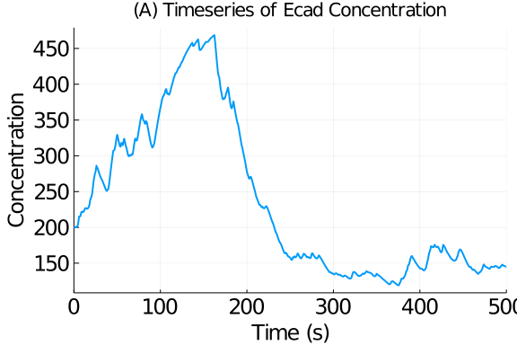

````julia
using StochasticDiffEq, DiffEqProblemLibrary, Random
using DiffEqProblemLibrary.SDEProblemLibrary: importsdeproblems; importsdeproblems()
prob = DiffEqProblemLibrary.SDEProblemLibrary.oval2ModelExample(largeFluctuations=true,useBigs=false)
````


````
SDEProblem with uType Array{Float64,1} and tType Float64. In-place: true
timespan: (0.0, 500.0)
u0: [0.128483, 1.256853, 0.0030203, 0.0027977, 0.0101511, 0.0422942, 0.2391
346, 0.0008014, 0.0001464, 2.67e-5, 4.8e-6, 9.0e-7, 0.0619917, 1.2444292, 0
.0486676, 199.9383546, 137.4267984, 1.5180203, 1.5180203]
````


````julia
Random.seed!(250)
prob = remake(prob,tspan = (0.0,500.0))
sol = solve(prob,SRIW1(),dt=(1/2)^(18),progress=true,qmax=1.125,
          saveat=0.1,abstol=1e-5,reltol=1e-3,maxiters=1e7);
Random.seed!(250)
prob = remake(prob,tspan = (0.0,500.0))
@time sol = solve(prob,SRIW1(),dt=(1/2)^(18),progress=true,qmax=1.125,
    saveat=0.1,abstol=1e-5,reltol=1e-3,maxiters=1e7);
````


````
10.436597 seconds (29.69 M allocations: 6.262 GiB, 7.22% gc time)
retcode: Success
Interpolation: 1st order linear
t: 5001-element Array{Float64,1}:
   0.0
   0.1
   0.2
   0.3
   0.4
   0.5
   0.6
   0.7
   0.8
   0.9
   ⋮
 499.2
 499.3
 499.4
 499.5
 499.6
 499.7
 499.8
 499.9
 500.0
u: 5001-element Array{Array{Float64,1},1}:
 [0.128483, 1.256853, 0.0030203, 0.0027977, 0.0101511, 0.0422942, 0.2391346
, 0.0008014, 0.0001464, 2.67e-5, 4.8e-6, 9.0e-7, 0.0619917, 1.2444292, 0.04
86676, 199.9383546, 137.4267984, 1.5180203, 1.5180203]
 [0.16538473906604145, 1.2951562442316962, 0.00301808201514137, 0.002844041
5909350794, 0.010250138954616345, 0.04231333838565926, 0.23912803495483112,
 0.0008090730090055913, 0.00014766251534141465, 2.6950097419689487e-5, 4.91
8782759303362e-6, 8.977634926302817e-7, 0.06199180763098698, 1.244429368959
1208, 0.04866339426002936, 199.9380411104366, 137.42519192045845, 0.4879791
3911558066, 1.0356803606858305]
 [0.0943736463470772, 1.3125930248790731, 0.0030153062101671516, 0.00271288
05058537066, 0.01088287349150828, 0.04256540172320172, 0.23910617355783248,
 0.0008584284985376572, 0.00015620738312250318, 2.8425799691446648e-5, 5.17
2939961922917e-6, 9.41403491119057e-7, 0.06199317692710315, 1.2444316507985
484, 0.048637886372070796, 199.93722920260143, 137.42502639317263, 0.611404
5901782317, 0.6861803225785735]
 [0.09233470710553754, 1.22523163766467, 0.0030217176889590232, 0.002834026
271787252, 0.011596986159906257, 0.04325041459839034, 0.23908597265100198, 
0.0009141647032563828, 0.00016588356991160432, 3.0101988392279502e-5, 5.462
606128225182e-6, 9.913282603581899e-7, 0.06199704659520748, 1.2444381420464
683, 0.04861082662084924, 199.93689461574763, 137.42390990301038, 0.2565340
416766358, 0.5392593536711902]
 [0.07784491625337946, 1.1812893197245222, 0.0030270329211250706, 0.0026650
698679739604, 0.012317229060902638, 0.04430978609033017, 0.2390673866072794
, 0.0009703043488678318, 0.00017557558517063734, 3.1771083502817296e-5, 5.7
4925671923717e-6, 1.040406770137855e-6, 0.06200324049134386, 1.244448584061
8487, 0.04858533206561413, 199.93704597737755, 137.4216949795732, 0.1892500
0065145614, 0.3894974425495562]
 [0.08516511682426291, 1.1303559842807298, 0.0030358297716076487, 0.0027231
226294343854, 0.012978706711147075, 0.04566848816838288, 0.2390466209390187
4, 0.0010217922335460853, 0.00018441356046739713, 3.328386834657374e-5, 6.0
07384603163905e-6, 1.0842958437729131e-6, 0.06201149597349449, 1.2444625676
89143, 0.04856361965219266, 199.93753421151413, 137.41863399350368, 0.20589
938586040918, 0.20815253520611063]
 [0.05500948041149644, 1.056673072291934, 0.0030513365484369703, 0.00256487
12861105543, 0.01355127998080795, 0.04723239805327447, 0.23902501037823834,
 0.0010663042253662137, 0.0001920140354851351, 3.457751300474351e-5, 6.2267
79512203289e-6, 1.1213526151047076e-6, 0.06202140819431093, 1.2444794388025
868, 0.0485466720196359, 199.93858362915077, 137.41404876572665, 0.41509865
588421596, 0.1985892500636141]
 [0.041567955918903936, 0.9833039654198598, 0.0030730412290263173, 0.001608
4597280041025, 0.014026006204860794, 0.0489069325097075, 0.2390040844170502
3, 0.0011031651076749533, 0.0001982766445000134, 3.5637726123951505e-5, 6.4
055410857455785e-6, 1.1513545784631276e-6, 0.062032515922482136, 1.24449844
04942026, 0.04853459749155998, 199.9406256558158, 137.40670344605317, 0.237
24354987913276, 0.28058161444486185]
 [0.05710586097080456, 0.9140680112999975, 0.0031022946273128434, 0.0027142
76799610366, 0.014405638680846438, 0.05061123041264294, 0.23898352073290557
, 0.001132608946771604, 0.00020325559516976162, 3.647633152524132e-5, 6.546
149759240226e-6, 1.1748079402472328e-6, 0.06204439036215757, 1.244518861758
1144, 0.04852694963974725, 199.94415096654814, 137.396065768088, 0.10595021
002379577, 0.18438481273530555]
 [0.016781831566451574, 0.8194878046991256, 0.0031536690418585587, 0.001856
3320743682902, 0.014698358825913466, 0.05228216289468339, 0.238962111175205
8, 0.001155239734073272, 0.00020707210410630904, 3.7116078974020955e-5, 6.6
52888736867102e-6, 1.1925086430104305e-6, 0.0620566108374929, 1.24453999818
0463, 0.04850094026451485, 199.9497252627368, 137.3812863964241, 0.38113376
12035713, 0.30732754909258625]
 ⋮
 [0.03848182386586657, 0.34498669572568136, 0.0072083082968847625, 0.005515
54716691307, 0.05229711933642431, 0.5077356043020413, 0.014229877028283456,
 8.036100734277439e-5, 1.2474348137285699e-7, 1.9349976099195162e-10, 3.000
0927891151875e-13, 4.649553444051268e-16, 0.4076307132001535, 1.88487410729
50557, 0.012244556140359011, 145.38725882325284, 185.44137532628815, 0.2084
1693611755024, 0.5526547963167995]
 [0.04405386914077248, 0.33756543860970195, 0.007291135265541822, 0.0057923
58967487093, 0.05212567766490814, 0.5064521635492273, 0.014257788760489953,
 8.046844171253688e-5, 1.2520478257060032e-7, 1.9478732905181287e-10, 3.029
9161952893396e-13, 4.711920365389362e-16, 0.4074496784434528, 1.88453883354
98265, 0.012295117269066666, 145.40970209220237, 185.33335714863279, 0.5544
247673485951, 0.7110899624270076]
 [0.041735679264952315, 0.34832329240492954, 0.007350266680783537, 0.005782
9382152160035, 0.05196250992504085, 0.5051140064350376, 0.01428640775613115
2, 8.042650109407825e-5, 1.252661613752782e-7, 1.9460498845502142e-10, 3.01
817564371092e-13, 4.680705606277185e-16, 0.4072682248767832, 1.884202860527
9195, 0.012321553740890407, 145.43045768057655, 185.23744974077093, 0.16148
236068768157, 0.34234058742374607]
 [0.03907671560630676, 0.3524467126723215, 0.007405806956668082, 0.00567756
1982554793, 0.05180844947882111, 0.5037492033729799, 0.01431576544899337, 8
.039052365177873e-5, 1.2569523313866338e-7, 1.964063928946364e-10, 3.067042
834424545e-13, 4.787863069197596e-16, 0.4070863276007686, 1.883866139959136
5, 0.012346099455987527, 145.4465659312021, 185.1694506141255, 0.0784063612
8400043, 0.2060541489328493]
 [0.03441192524530212, 0.36216301564931297, 0.007448716519701477, 0.0055333
83398459894, 0.05165902565961763, 0.5023692430123279, 0.014345876818936709,
 8.037658807930088e-5, 1.2603868815372432e-7, 1.9763625825831036e-10, 3.098
9731730590203e-13, 4.85911814813311e-16, 0.4069039438940624, 1.883528593927
836, 0.012373326473740743, 145.4593136192814, 185.11664885206835, 0.0236436
88633898083, 0.10467078149534559]
 [0.02110404448903693, 0.3418649442866331, 0.0075300256783208085, 0.0046462
0880126278, 0.05150869383069164, 0.5009812725744092, 0.0143767487098897, 7.
947605711270654e-5, 1.239918646290749e-7, 1.9437768671152711e-10, 3.0517261
77561501e-13, 4.78919412730332e-16, 0.4067209976518333, 1.8831900887127457,
 0.012266326562042197, 145.4756071295257, 185.0725584055385, 0.204445050021
7093, 0.08685651599212824]
 [0.01730987433954647, 0.31349063286437745, 0.00765851253397654, 0.00437187
5937231886, 0.051348888526180234, 0.4995773255165823, 0.014408403093078052,
 8.03043955657416e-5, 1.2526721383554674e-7, 1.952168821396205e-10, 3.05622
0184046995e-13, 4.800232680551871e-16, 0.406537466476847, 1.882850579442944
6, 0.012427095299679693, 145.50867110490447, 185.01768556405648, 0.22067280
992000127, 0.0976242509009993]
 [0.010807405715373312, 0.2828200860339834, 0.007839229116117861, 0.0034286
95841455156, 0.05117876281552593, 0.49814486852522943, 0.014440833803047335
, 7.476703393488717e-5, 1.1891741592326347e-7, 1.8758458149445707e-10, 2.95
6980439455506e-13, 4.64939785103344e-16, 0.40635317053177383, 1.88250975878
21376, 0.011598166671846653, 145.56599425439765, 184.9546895222255, 0.08307
189634751624, 0.09397480592575723]
 [0.020843918029335714, 0.2560962282634513, 0.008053161903094679, 0.0049406
95200857559, 0.05099940885913007, 0.49667387616910624, 0.014474118532830751
, 8.02283932985498e-5, 1.2707323860345643e-7, 2.010306243406374e-10, 3.1784
117074783293e-13, 5.022202837220338e-16, 0.40616832093948657, 1.88216797068
07346, 0.012484698106487094, 145.6546465725656, 184.8848404145896, 0.053024
963240190216, 0.07647624300403807]
````


````julia
println(maximum(sol[:,2]))
````


````
199.9380411104366
````


````julia
using Plots; gr()
lw = 2
lw2 = 3
p1 = plot(sol,vars=(0,16),
          title="(A) Timeseries of Ecad Concentration",xguide="Time (s)",
          yguide="Concentration",guidefont=font(16),tickfont=font(16),
          linewidth=lw,leg=false)
````




````julia
p2 = plot(sol,vars=(0,17),
          title="(B) Timeseries of Vim Concentration",xguide="Time (s)",
          yguide="Concentration",guidefont=font(16),
          tickfont=font(16),linewidth=lw,leg=false)
````


````julia
prob = remake(prob,tspan = (0.0,1.0))
## Little Run
sol = solve(prob,EM(),dt=(1/2)^(20),
          progressbar=true,saveat=0.1)
println("EM")
````


````
EM
````


````julia
@time sol = solve(prob,EM(),dt=(1/2)^(20),
          progressbar=true,saveat=0.1)
````


````
0.679414 seconds (3.15 M allocations: 736.010 MiB, 12.59% gc time)
````


````julia

sol = solve(prob,SRI(),dt=(1/2)^(18),adaptive=false,
            progressbar=true,save_everystep=false)
println("SRI")
````


````
SRI
````


````julia
@time sol = solve(prob,SRI(),dt=(1/2)^(18),adaptive=false,
          progressbar=true,save_everystep=false)
````


````
0.718856 seconds (786.69 k allocations: 184.032 MiB, 2.01% gc time)
````


````julia

sol = solve(prob,SRIW1(),dt=(1/2)^(18),adaptive=false,
          adaptivealg=:RSwM3,progressbar=false,qmax=4,saveat=0.1)
println("SRIW1")
````


````
SRIW1
````


````julia
@time sol = solve(prob,SRIW1(),dt=(1/2)^(18),adaptive=false,
          adaptivealg=:RSwM3,progressbar=false,qmax=4,saveat=0.1)
````


````
0.286563 seconds (786.53 k allocations: 184.016 MiB, 5.03% gc time)
````


````julia

sol = solve(prob,SRI(),dt=(1/2)^(18),
          adaptivealg=:RSwM3,progressbar=false,qmax=1.125,
          saveat=0.1,abstol=1e-6,reltol=1e-4)
println("SRI Adaptive")
````


````
SRI Adaptive
````


````julia
@time sol = solve(prob,SRI(),dt=(1/2)^(18),
          adaptivealg=:RSwM3,progressbar=false,qmax=1.125,
          saveat=0.1,abstol=1e-6,reltol=1e-4)
````


````
0.838172 seconds (1.16 M allocations: 207.423 MiB, 3.60% gc time)
````


````julia
@show length(sol.t)
````


````
length(sol.t) = 11
````


````julia

sol = solve(prob,SRIW1(),dt=(1/2)^(18),
          adaptivealg=:RSwM3,progressbar=false,qmax=1.125,
          saveat=0.1,abstol=1e-6,reltol=1e-4)
println("SRIW1 Adaptive")
````


````
SRIW1 Adaptive
````


````julia
@time sol = solve(prob,SRIW1(),dt=(1/2)^(18),
          adaptivealg=:RSwM3,progressbar=false,qmax=1.125,
          saveat=0.1,abstol=1e-6,reltol=1e-4)
````


````
0.023162 seconds (81.52 k allocations: 14.611 MiB)
````


````julia
@show length(sol.t)
````


````
length(sol.t) = 11
11
````


````julia
using DiffEqBenchmarks
DiffEqBenchmarks.bench_footer(WEAVE_ARGS[:folder],WEAVE_ARGS[:file])
````


## Appendix

These benchmarks are a part of the DiffEqBenchmarks.jl repository, found at: [https://github.com/JuliaDiffEq/DiffEqBenchmarks.jl](https://github.com/JuliaDiffEq/DiffEqBenchmarks.jl)

To locally run this tutorial, do the following commands:

```
using DiffEqBenchmarks
DiffEqBenchmarks.weave_file("StiffSDE","Oval2LongRun.jmd")
```

Computer Information:

```
Julia Version 1.4.2
Commit 44fa15b150* (2020-05-23 18:35 UTC)
Platform Info:
  OS: Linux (x86_64-pc-linux-gnu)
  CPU: Intel(R) Core(TM) i7-9700K CPU @ 3.60GHz
  WORD_SIZE: 64
  LIBM: libopenlibm
  LLVM: libLLVM-8.0.1 (ORCJIT, skylake)
Environment:
  JULIA_DEPOT_PATH = /builds/JuliaGPU/DiffEqBenchmarks.jl/.julia
  JULIA_CUDA_MEMORY_LIMIT = 2147483648
  JULIA_PROJECT = @.
  JULIA_NUM_THREADS = 8

```

Package Information:

```
Status: `/builds/JuliaGPU/DiffEqBenchmarks.jl/benchmarks/StiffSDE/Project.toml`
[f3b72e0c-5b89-59e1-b016-84e28bfd966d] DiffEqDevTools 2.22.0
[77a26b50-5914-5dd7-bc55-306e6241c503] DiffEqNoiseProcess 5.0.2
[a077e3f3-b75c-5d7f-a0c6-6bc4c8ec64a9] DiffEqProblemLibrary 4.8.0
[91a5bcdd-55d7-5caf-9e0b-520d859cae80] Plots 1.5.3
[789caeaf-c7a9-5a7d-9973-96adeb23e2a0] StochasticDiffEq 6.24.0
[37e2e46d-f89d-539d-b4ee-838fcccc9c8e] LinearAlgebra 
[9a3f8284-a2c9-5f02-9a11-845980a1fd5c] Random 
[10745b16-79ce-11e8-11f9-7d13ad32a3b2] Statistics 
```

