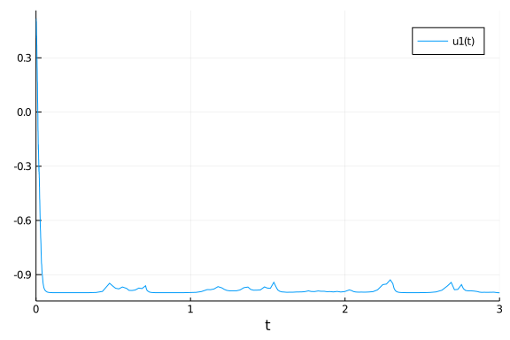
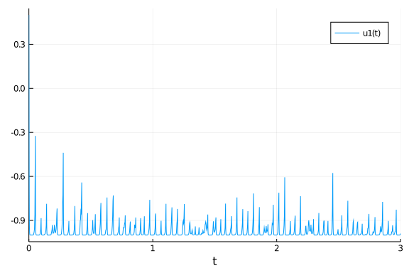
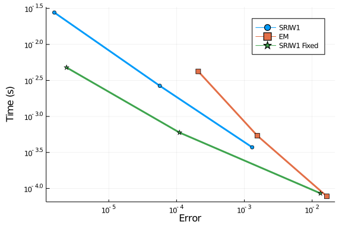
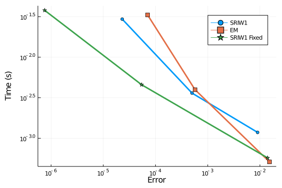

# Quadratic Stiffness

In this notebook we will explore the quadratic stiffness problem. References:

The composite Euler method for stiff stochastic
differential equations

Kevin Burrage, Tianhai Tian

And

S-ROCK: CHEBYSHEV METHODS FOR STIFF STOCHASTIC
DIFFERENTIAL EQUATIONS

ASSYR ABDULLE AND STEPHANE CIRILLI

This is a scalar SDE with two arguments. The first controls the deterministic stiffness and the later controls the diffusion stiffness.

````julia
using DiffEqProblemLibrary, StochasticDiffEq, DiffEqDevTools
using DiffEqProblemLibrary.SDEProblemLibrary: importsdeproblems; importsdeproblems()
import DiffEqProblemLibrary.SDEProblemLibrary: prob_sde_stiffquadito
using Plots; gr()
const N = 10
````


````
10
````


````julia
prob = remake(prob_sde_stiffquadito,p=(50.0,1.0))
sol = solve(prob,SRIW1())
plot(sol)
````




````julia
prob = remake(prob_sde_stiffquadito,p=(500.0,1.0))
sol = solve(prob,SRIW1())
plot(sol)
````





## Top dts

Let's first determine the maximum dts which are allowed. Anything higher is mostly unstable.

### Deterministic Stiffness Mild

````julia
prob = remake(prob_sde_stiffquadito,p=(50.0,1.0))
@time sol = solve(prob,SRIW1())
````


````
0.000165 seconds (2.08 k allocations: 93.578 KiB)
````


````julia
@time sol = solve(prob,SRIW1(),adaptive=false,dt=0.01)
````


````
0.000148 seconds (2.20 k allocations: 98.656 KiB)
````


````julia
@time sol = solve(prob,ImplicitRKMil(),dt=0.005)
````


````
0.000060 seconds (377 allocations: 16.812 KiB)
````


````julia
@time sol = solve(prob,EM(),dt=0.01);
````


````
0.000139 seconds (1.59 k allocations: 80.781 KiB)
retcode: Success
Interpolation: 1st order linear
t: 302-element Array{Float64,1}:
 0.0
 0.01
 0.02
 0.03
 0.04
 0.05
 0.060000000000000005
 0.07
 0.08
 0.09
 ⋮
 2.9299999999999815
 2.9399999999999813
 2.949999999999981
 2.959999999999981
 2.9699999999999807
 2.9799999999999804
 2.9899999999999802
 2.99999999999998
 3.0
u: 302-element Array{Float64,1}:
  0.5
  0.1990029211123852
 -0.07466078087109371
 -0.6002654155227148
 -0.8540743925715729
 -0.9620748221038411
 -1.0006849724929916
 -0.9998995995255848
 -1.0000061367343545
 -0.9999994064330947
  ⋮
 -1.0
 -1.0
 -1.0
 -1.0
 -1.0
 -1.0
 -1.0
 -1.0
 -1.0
````


### Deterministic Stiffness High

````julia
prob = remake(prob_sde_stiffquadito,p=(500.0,1.0))
@time sol = solve(prob,SRIW1())
````


````
0.000940 seconds (14.40 k allocations: 548.844 KiB)
````


````julia
@time sol = solve(prob,SRIW1(),adaptive=false,dt=0.002)
````


````
0.000597 seconds (10.60 k allocations: 438.906 KiB)
````


````julia
@time sol = solve(prob,ImplicitRKMil(),dt=0.001)
````


````
0.000065 seconds (451 allocations: 18.719 KiB)
````


````julia
@time sol = solve(prob,EM(),dt=0.002);
````


````
0.000536 seconds (7.59 k allocations: 359.406 KiB)
retcode: Success
Interpolation: 1st order linear
t: 1502-element Array{Float64,1}:
 0.0
 0.002
 0.004
 0.006
 0.008
 0.01
 0.012
 0.014
 0.016
 0.018000000000000002
 ⋮
 2.9859999999998927
 2.9879999999998925
 2.9899999999998923
 2.991999999999892
 2.993999999999892
 2.9959999999998916
 2.9979999999998914
 2.999999999999891
 3.0
u: 1502-element Array{Float64,1}:
  0.5
 -0.23220706093389717
 -1.1384420877339305
 -0.8492576915171682
 -1.133172366777916
 -0.86818454032407
 -1.108335100899943
 -0.876411881818392
 -1.092904208491973
 -0.9023600723135534
  ⋮
 -0.9999976245765745
 -1.0000025863371373
 -0.9999977317936903
 -1.0000024080032976
 -0.999997301184875
 -1.000002755148832
 -0.9999974155586951
 -1.0000024771682556
 -1.0000024771699214
````


### Mixed Stiffness

````julia
prob = remake(prob_sde_stiffquadito,p=(5000.0,70.0))
@time sol = solve(prob,SRIW1(),dt=0.0001)
````


````
0.001515 seconds (16.31 k allocations: 1.022 MiB)
````


````julia
@time sol = solve(prob,SRIW1(),adaptive=false,dt=0.00001)
````


````
0.117636 seconds (2.10 M allocations: 70.361 MiB)
````


````julia
@time sol = solve(prob,ImplicitRKMil(),dt=0.00001)
````


````
0.281424 seconds (1.00 M allocations: 61.394 MiB, 6.11% gc time)
````


````julia
@time sol = solve(prob,EM(),dt=0.00001);
````


````
0.104087 seconds (1.50 M allocations: 56.205 MiB)
retcode: Success
Interpolation: 1st order linear
t: 300001-element Array{Float64,1}:
 0.0
 1.0e-5
 2.0e-5
 3.0000000000000004e-5
 4.0e-5
 5.0e-5
 6.0e-5
 7.000000000000001e-5
 8.0e-5
 9.0e-5
 ⋮
 2.9999200000111856
 2.9999300000111857
 2.9999400000111858
 2.999950000011186
 2.999960000011186
 2.999970000011186
 2.999980000011186
 2.999990000011186
 3.0
u: 300001-element Array{Float64,1}:
  0.5
  0.5302268461606926
  0.5271985349363482
  0.5171336740685825
  0.38459491163615883
  0.3664925831930108
  0.16483558009815447
 -0.00781191807905611
  0.2356420268211326
 -0.1968849304791764
  ⋮
 -1.0
 -1.0
 -1.0
 -1.0
 -1.0
 -1.0
 -1.0
 -1.0
 -1.0
````


Notice that in this problem, the stiffness in the noise term still prevents the semi-implicit integrator to do well. In that case, the advantage of implicitness does not take effect, and thus explicit methods do well. When we don't care about the error, Euler-Maruyama is fastest. When there's mixed stiffness, the adaptive algorithm is unstable.

## Work-Precision Diagrams

````julia
prob = remake(prob_sde_stiffquadito,p=(50.0,1.0))

reltols = 1.0 ./ 10.0 .^ (3:5)
abstols = reltols#[0.0 for i in eachindex(reltols)]
setups = [Dict(:alg=>SRIW1()),
          Dict(:alg=>EM(),:dts=>1.0./8.0.^((1:length(reltols)) .+ 1)),
          Dict(:alg=>SRIW1(),:dts=>1.0./8.0.^((1:length(reltols)) .+ 1),:adaptive=>false)
          #Dict(:alg=>RKMil(),:dts=>1.0./8.0.^((1:length(reltols)) .+ 1),:adaptive=>false),
          ]
names = ["SRIW1","EM","SRIW1 Fixed"] #"RKMil",
wp = WorkPrecisionSet(prob,abstols,reltols,setups;numruns=N,names=names,error_estimate=:l2)
plot(wp)
````




````julia
prob = remake(prob_sde_stiffquadito,p=(500.0,1.0))

reltols = 1.0 ./ 10.0 .^ (3:5)
abstols = reltols#[0.0 for i in eachindex(reltols)]
setups = [Dict(:alg=>SRIW1()),
          Dict(:alg=>EM(),:dts=>1.0./8.0.^((1:length(reltols)) .+ 2)),
          Dict(:alg=>SRIW1(),:dts=>1.0./8.0.^((1:length(reltols)) .+ 2),:adaptive=>false)
          #Dict(:alg=>RKMil(),:dts=>1.0./8.0.^((1:length(reltols)) .+ 2),:adaptive=>false),
          ]
names = ["SRIW1","EM","SRIW1 Fixed"] #"RKMil",
wp = WorkPrecisionSet(prob,abstols,reltols,setups;numruns=N,names=names,error_estimate=:l2,print_names=true)
plot(wp)
````





## Conclusion

Noise stiffness is tough. Right now the best solution is to run an explicit integrator with a low enough dt. Adaptivity does have a cost in this case, likely due to memory management.

````julia
using DiffEqBenchmarks
DiffEqBenchmarks.bench_footer(WEAVE_ARGS[:folder],WEAVE_ARGS[:file])
````


## Appendix

These benchmarks are a part of the DiffEqBenchmarks.jl repository, found at: [https://github.com/JuliaDiffEq/DiffEqBenchmarks.jl](https://github.com/JuliaDiffEq/DiffEqBenchmarks.jl)

To locally run this tutorial, do the following commands:

```
using DiffEqBenchmarks
DiffEqBenchmarks.weave_file("StiffSDE","QuadraticStiffness.jmd")
```

Computer Information:

```
Julia Version 1.4.2
Commit 44fa15b150* (2020-05-23 18:35 UTC)
Platform Info:
  OS: Linux (x86_64-pc-linux-gnu)
  CPU: Intel(R) Core(TM) i7-9700K CPU @ 3.60GHz
  WORD_SIZE: 64
  LIBM: libopenlibm
  LLVM: libLLVM-8.0.1 (ORCJIT, skylake)
Environment:
  JULIA_DEPOT_PATH = /builds/JuliaGPU/DiffEqBenchmarks.jl/.julia
  JULIA_CUDA_MEMORY_LIMIT = 2147483648
  JULIA_PROJECT = @.
  JULIA_NUM_THREADS = 8

```

Package Information:

```
Status: `/builds/JuliaGPU/DiffEqBenchmarks.jl/benchmarks/StiffSDE/Project.toml`
[f3b72e0c-5b89-59e1-b016-84e28bfd966d] DiffEqDevTools 2.22.0
[77a26b50-5914-5dd7-bc55-306e6241c503] DiffEqNoiseProcess 5.0.2
[a077e3f3-b75c-5d7f-a0c6-6bc4c8ec64a9] DiffEqProblemLibrary 4.8.0
[91a5bcdd-55d7-5caf-9e0b-520d859cae80] Plots 1.5.3
[789caeaf-c7a9-5a7d-9973-96adeb23e2a0] StochasticDiffEq 6.24.0
[37e2e46d-f89d-539d-b4ee-838fcccc9c8e] LinearAlgebra 
[9a3f8284-a2c9-5f02-9a11-845980a1fd5c] Random 
[10745b16-79ce-11e8-11f9-7d13ad32a3b2] Statistics 
```

